## Abstract

Passive management over the last years has attracted greater attention than active management. Bloomberg reports that, only in the first half of 2017, flows out of active into passive funds reached nearly $500 billion compared to almost $300 billion in 2016. This migration, encouraged by the spread of ETFs, concerns not only retail investors but also institutions and financial advisers. This paper aims to demonstrate how the allocation of a portfolio designed for passive management can represent the foundation of an actively managed portfolio through a non-discretionary quantitative strategy that can outperform the market.

ETFs can be seen as one of the most successful financial innovations in the last decades: they have allowed investors to diversify their investments in more affordable ways. Once the asset classes and ETFs have been selected, the investor has to choose between active or passive portfolio management. Some academics argue that investors should adopt passive management to exploit lower operating costs. Passive investing is based on the Efficient Market Hypothesis (EMH):

- Information is available to all market participants
- Market participants act on this information
- Market participants are rational

Therefore, all news or data are reflected in a security’s current price; so there is virtually no benefit to security analysis, or managers actively building portfolios. On the other hand, active management is based on the assumption that markets are not fully efficient: as the studies of Behavioral Finance have shown, the market particpants are not always rational, so there are opportunities for skilled managers to capitalize on inefficiencies through dynamic exposure to selected assets. The spread of ETFs, the decreasing volatility of most asset classes and the underperformance of Hedge Funds compared to benchmarks has caused a progressive migration of investment flows from active funds to passive funds.

### Chart 1: Net flows into U.S-based passively managed funds and out of active funds in the first half of each year.

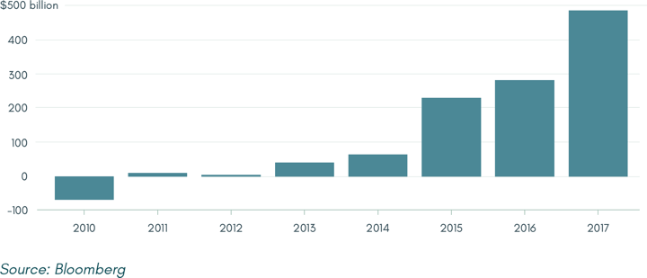

According to the writer’s opinion, the success of passive funds is closely linked to the low levels of volatility and range of this cycle, distorted by Central Banks’ Quantitative Easing operations. A loop has been created, where low volatility has encouraged passive management, whose inflows have led to a further decrease of market volatility.

### Chart 2: Volatility Index (VIX). Daily data, from 1990 to 2017.

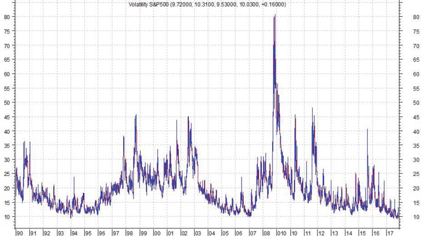

### Chart 3: Volatility Index (VIX) distribution histogram, Daily Data, from 1990 to 2017.

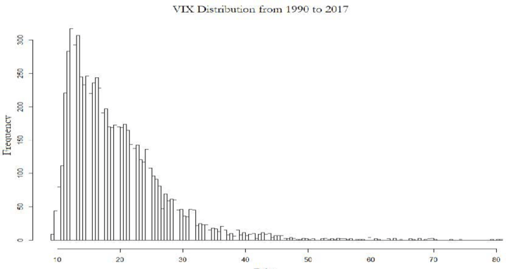

What might seem like a “new normal” is actually a “temporary normal”, which has already occurred in the past, in different forms, exacerbated by the presence of leveraged ETFs on VIX.

### Chart 4: VIX: number of days with close<10, rolling 6m windows, from 1990 to 2017.

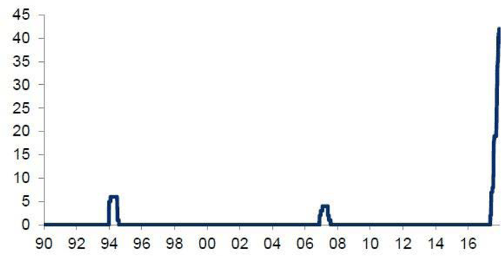

The loop is supposed to continue until an exogenous event occurs that leads to a systemic return to the mean in the markets. An active asset allocation, due to a dynamic exposure to its constituent assets, is able to adapt to possible sudden changes of scenario. The purpose of this paper is to demonstrate how an allocation originally designed for a passive fund can be a fundamental starting point for an active quantitative portfolio. The paper uses the 7Twelve Portfolio as starting passive base: it consists of 12 mutual funds (in this case, 12 ETFs) from 7 different asset classes. The dynamic selection of assets and their weightings is managed by a revised version of the Flexible Asset Allocation, supported with new contribution factors and new proprietary indicators in order to improve overall efficiency.

## I. Background and Methodology

This paper originates from considerations about the studies of different authors, providing a link between different concepts and methods through personal implementations. It is worth mentioning the most influential authors, with reference to their contribution:

- Graig L. Israelsen, for the conception of the 7Twelve Portfolio and selection of its components;
- Wouter J. Keller and Hugo S. van Putten, for their contribution in the definition of a new quantitative strategy (Flexible Asset Allocation - FAA) based on new momentum factors beyond the traditional ones;
- Robert Engle and Tim Bollerslev, for the development of methods of analysis of economic and historical series with dynamic volatility over time;
- Sébastien Maillard, Thierry Roncalli, Jérôme Teiletche, for their contribution in defining the Risk Parity methodology, using volatility as a component in determining the allocation;
- Welles Wilder, for technical studies on breakout, range and trend concept models.

In particular, the paper focuses on the construction and backtesting of an allocation model based on the following pillars:

- Absolute Momentum, to determine the assets’ momentum (M);
- Volatility Model, to calculate the volatility through a generalized autoregressive model (V);
- Average Correlation Momentum, to determine a portfolio’s diversification component (C);
- ATR Trend/Breakout System, primary trend identification algorithm (T);
- Ranking Model, to select assets based on the weighting of the contribution’s factors to the strategy described above.

The paper consists of three parts. The first part covers the illustration of proprietary models and algorithms that determine the mentioned components. The second part explains how these components define the Ranking Model and, consequently, the asset allocation. The third part shows the results of a model backtesting, illustrated through monthly performances from July 2004 to November 2017.

## II. The 7Twelve Portfolio

The 7Twelve is a multi-asset balanced portfolio developed by Craig L. Israelsen in 2008. Unlike a traditional two-asset 60/40 balanced fund, the 7Twelve balanced strategy uses multiple asset classes to improve performance and reduce risk. The Portfolio consists of 12 different mutual funds or ETFs from 7 core asset classes: US Equities, non-US Equities, Real Estate, Resources/Commodities, US Bonds, non-US Bonds and Cash. Diversification is already in the products, as each ETF represents a low cost indexed passive fund.

### Table 1: 7Twelve Portfolio: Asset Allocation

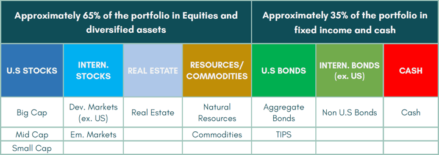

In its core version, each ETF has a weight of 8.3% and the allocation does not change according to market conditions.

### Table 2: 7Twelve Portfolio: list of selected ETFs

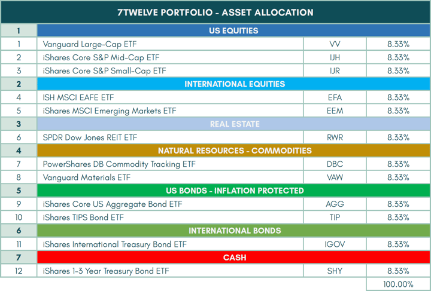

### Figure 6: SPDR S&P500 ETF and 7Twelve Portfolio - performances comparison. Monthly data, from July 2004 to November 2017

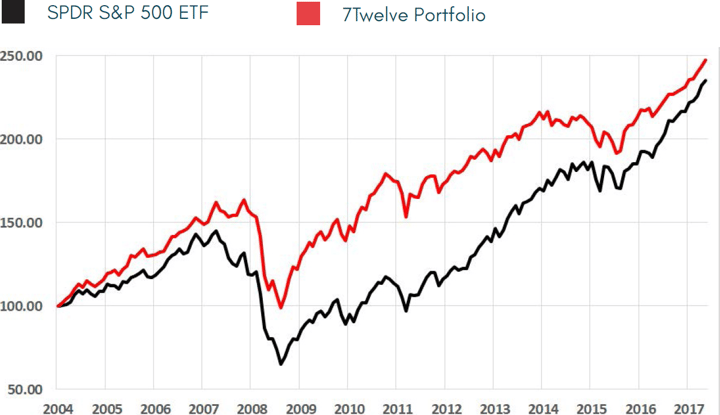

Rather than using the Core 7Twelve portfolio, it’s possible to adjust it based on the investor’s age as well. Age can be thought of both as chronological age and allocation age. The allocation age is then determined based on ability to take risks based on life situation.

### Table 3: Portoflio Allocations for the 7Twelve Core Model and Age Based Models. Source: 7twelveportfolio.com

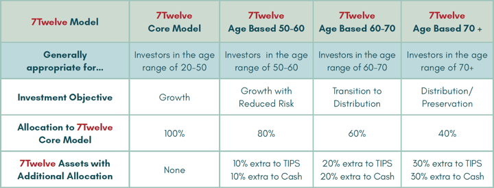

In this paper, the Core 7Twelve Portfolio is the foundation of the portfolio but the signals, weightings and allocation are managed by the Ranking Model, whose main components are described below.

## III. Volatility Model

In many studies volatility is mentioned without resorting to a univocal definition. This report deals with Realized Volatility using the Volatility Model, a modified version of the Generalized AutoRegressive Conditional Heteroskedasticity Model (GARCH), introduced in 1986 by the econometrist Tim Bollerslev, in order to overcome the limitations of the AutoRegressive Conditional Heteroskedasticity (ARCH) model. The GARCH Model assumes that variance is defined as the combination of a given number of square yields with a number of conditional yet delayed variances. The Volatility Model optimizes the GARCH model using the RiskMetrics database of J. P. Morgan, through daily variance estimations (λ=0.94). The Volatility Model uses OHLC Daily data for calculation.

### Chart 6: S&P500 Volatility (VIX) and Volatility Model on S&P500 comparison. Daily data, from July 2004 to November 2017

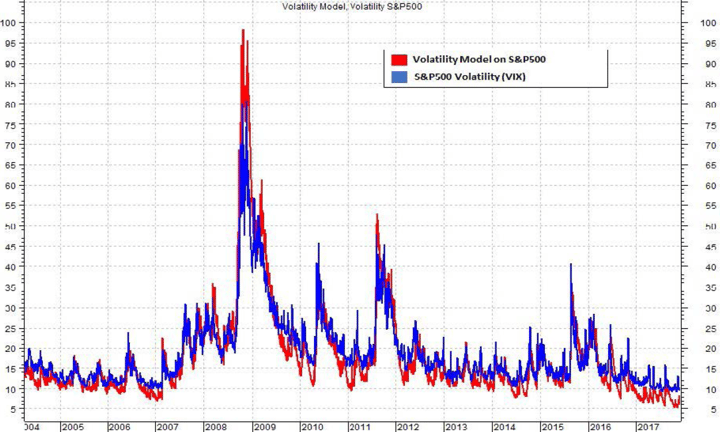

### Chart 7: S&P500, Volatility Model and Smoothed Volatility Model. Daily data, from July 2004 to November 2017

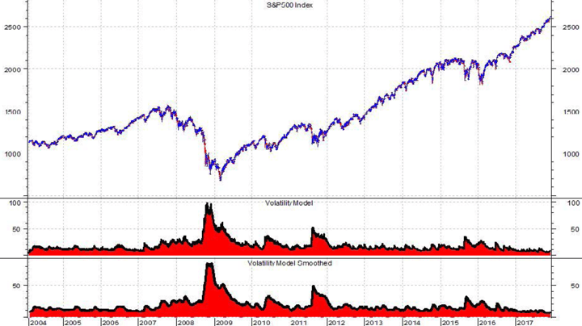

## IV. ATR Trend/Breakout System

Having defined the instrument for measuring asset volatility, it’s necessary to define a model that determines the profitability and directionality phases. Trend Following strategies are the basis of many asset allocation models; this paper analyzes a proprietary algorithm for trend definition, called ATR Trend/Breakout System. This indicator uses a breakout technique based on price and volatility. The model varies in the session following the one in which the signal occurred: if a given day’s high is higher than the Upper Band, the following day the model will go Long (=2); on the opposite, if a given day’s low is lower than the Lower Band, the following day the model will go Neutral/Short (=-2).

### Chart 8: ATR Trend/Breakout System on Vanguard Materials ETF (VAW). Daily data, from July 2004 to November 2017

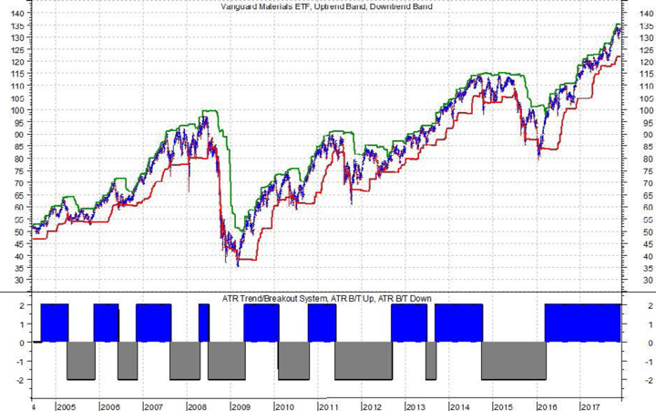

Similar models use volatility as a variable of deviation bands, adding it to the Upper Band and subtracting it from the Lower Band, allowing a greater spread between entry and exit prices during vulnerability phases. In the ATR Trend/Breakout System, the Lower Band, consisting of market session highs, is summed up and not subtracted from volatility, defined by a 42-periods Average True Range. This means that the greater market volatility is, the more responsive the model is to signals. This different approach is due to the fact that the ATR Trend/Breakout System doesn’t determine the entrance or exit of assets in the portfolio, but represents a contribution factor to the Ranking Model through its coexistence with Absolute Momentum (M), Volatility Model (V) and Average Correlation Momentum (C). Volatility measures the deviations of an historical series but is blind compared to the trend; a model that considers the volatility of an asset but not its trend can overweight assets with a price and volatility downtrend.

## V. Ranking Model

The Ranking Model consists of the following components:

- (M) Absolute Momentum: 4 months momentum (ROC – Rate of Change) on daily returns.
- (V) Volatility Model: volatility measure calculated with a generalized auto-regressive model. A 10-day smoothed variant will be used. The algorithm is calculated on daily OHLC data.
- (C) Average Relative Correlations: 4 months average correlation across the ETFs on daily returns. As shown by Varandi, the diversification of a portfolio has improved through the selection of assets with low average correlations.
- (T) ATR Trend/Breakout System: trend identification algorithm, able to capture periods of great and low directionality of assets, avoiding Black Swan and significant drawdowns.

Although the algorithm's application is daily, classification is done on a monthly basis, taking the last value of the month. Each asset, with the exception of Cash (iShares 1-3 Year Treasury Bond ETF - $SHY), is ranked from 1 to 11 depending on the monthly values of Absolute Momentum, Volatility Model and Average Relative Correlations. ETFs are ranked from 1 to 11 according to the monthly Absolute Momentum values in ascending order. This means that the greater the momentum of an asset is, the greater the profitability and the rank.

### Chart 9: Absolute Momentum. Monthly data, from January 2008 to February 2009

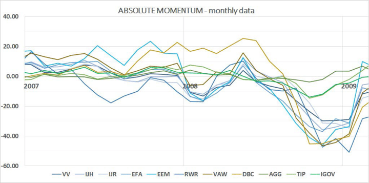

### Chart 10: Ranked Absolute Momentum: ranked variant of the Absolute Momentum, from 1 to 11. Monthly data, from January 2008 to February 2009

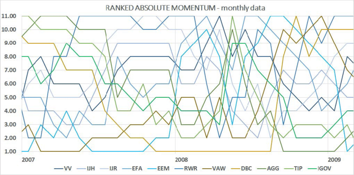

ETFs are ranked from 1 to 11 based on the monthly Volatility Model values in descending order. The lower the volatility of an asset, the lower the risk, and the higher its ranking.

### Chart 11: Volatility Model. Monthly data, from January 2008 to February 2009

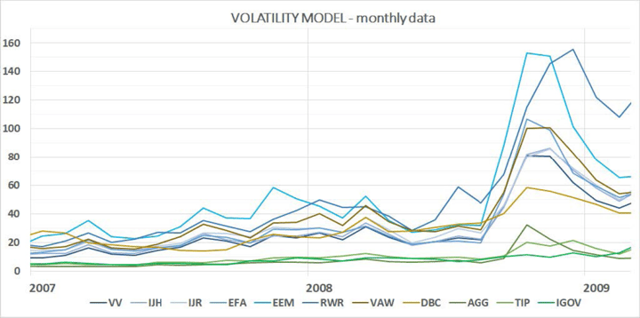

### Chart 12: Ranked Volatility Model: ranked variant of the Volatility Model, from 1 to 11. Monthly data, from January 2008 to February 2009

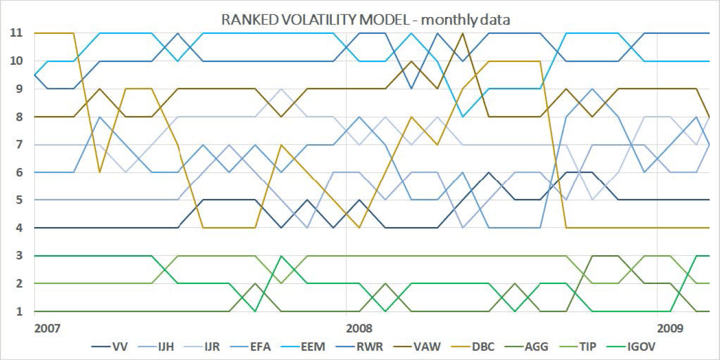

ETFs are ranked from 1 to 11 based on the monthly Volatility Model values in descending order. The lower the volatility of an asset, the lower the risk, and the higher its ranking.

### Chart 13: Average Relative Correlation. Monthly data, from January 2008 to February 2009

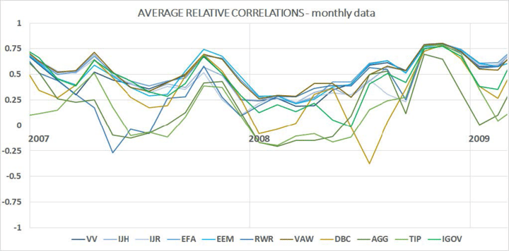

### Chart 14: Ranked Volatility Model: ranked variant of the Relative Average Correlation, from 1 to 11. Monthly data, from January 2008 to February 2009

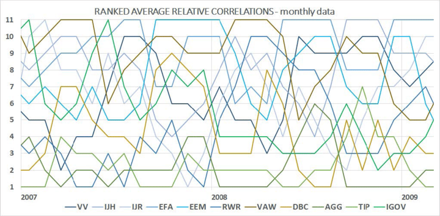

Once the ranks of the assets have been determined based on the Absolute Momentum (A), Volatility Model (V)and Average Relative Correlations (C) the Total Rank is calculated.

**Rank(M)** = is the ranking from 1 to 11 of the asset based on the Absolute Momentum (Ranked Absolute Momentum)

**Rank(V)** = is the ranking from 1 to 11 of the asset based on the Volatility Model (Ranked Volatility Model)

**Rank(C)** = is the ranking from 1 to 11 of the asset based on the Average Relative Correlation (Ranked Average Correlation)

**T** = ATR Trend/Breakout System

**wM** = % weight assigned to Rank(A) for Total Rank evaluation

**wV** = % weight assigned to Rank(V) for Total Rank evaluation

**wC** = % weight assigned to Rank(C) for Total Rank evaluation

**x** = value assigned to the Absolute Momentum to avoid equal ranks

Only the 5 ETFs with the lowest Total Rank will be taken in consideration for the upcoming allocation. For each of the ETFs, if it has a positive Absolute Momentum, then it will be included in the final asset allocation, otherwise its weighting will be replaced with Cash. In an extreme case where all 5 of these ETFs have a negative Absolute Momentum, Cash will assume a 100% weighting.

## VI. Application And Empirical Tests

The model works by applying the algorithms discussed in the previous paragraphs. The database is end-of-day and it is downloaded from Yahoo! Finance. Where necessary, interpolations have been made with consistent historical series in order to achieve temporal homogeneity. Data interpolation was performed on RStudio; Absolute Momentum, Volatility Model, Average Relative Correlation and ATR Trend/Breakout System indicators were programmed on Metastock; classification and Ranking Model were programmed on Excel. The test was performed on a USD Portfolio, consisting mainly of ETFs, to ensure maximum plausibility. Daily and monthly returns are used. Simulation results are from July 2004 through November 2017. No transaction costs are included, all results are gross of any transaction fees, management fees, or any other fees that might be associated with executing the models in real-time.

The current allocation of the Portfolio is determined by the Ranking Model of the previous month. The Ranking Model in the last session of the current month determines the allocation of the following month. To assess the effectiveness of the proposed strategy, the performance of the Ranked Asset Allocation Model was compared to the Salient Risk Parity Index, managed by a Risk Parity portfolio with 10% Volatility Targeting, Core 7Twelve Portfolio and SPDR S&P 500 ETF.

### Chart 15: Ranked Asset Allocation Model (RAAM), Salient Risk Parity Index, SPDR S&P500 ETF and 7Twelve Portfolio, performance comparison. Monthly data, from July 2004 to November 2017

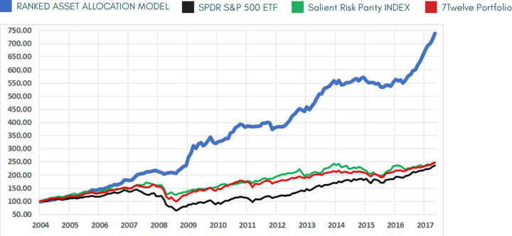

### Table 4: Ranked Asset Allocation Model (RAAM), historical returns. Monthly data, from July 2004 to November 2017

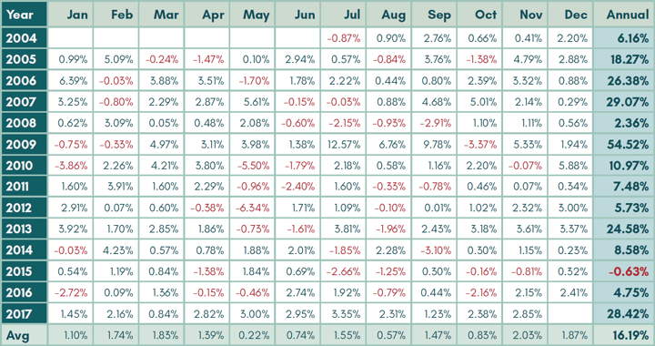

### Table 5: Ranked Asset Allocation Model (RAAM) and Salient Risk Parity Index – summary statistics

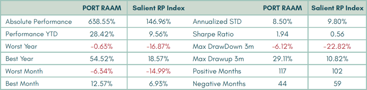

### Table 6: RAAM: Asset Allocation updated to 11/28/2017

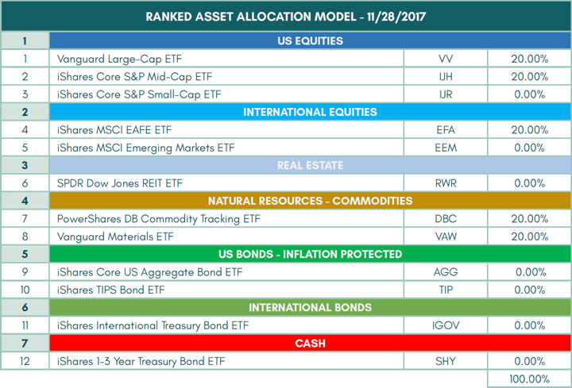

### Chart 16: Ranked Asset Allocation Model: allocation across time. Monthly data, from July 2004 to November 2017

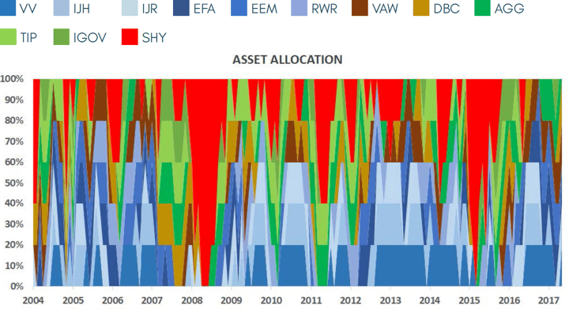

### Chart 17: Ranked Asset Allocation Model: asset classes - weightings across time. Monthly data, from July 2004 to November 2017

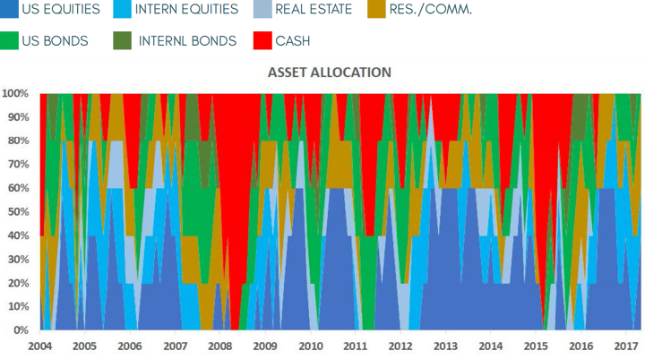

## VII. Conclusion

In this paper I’ve focused on the creation of indicators, useful to measure components such as Momentum (M), Volatility (V), Correlation (C) and Trend (T). These indicators have been applied to an automatic asset allocation model (“Ranked Asset Allocation Model – RAAM”), able to rank assets and calculate their weightings within the portfolio according to market conditions. The non-discretionary quantitative model was applied to a strategy originally designed for a passive portfolio (“The 7Twelve”). We have shown how the combination of two seemingly irreconcilable strategies, passive and active, has led to the creation of a model capable of outperforming the benchmarks and the market in a constant way. The signals and results have been confirmed by all evaluation methods and seem solid to avoid any chance.

---

***Shared content and posted charts are intended to be used for informational and educational purposes only. CMT Association does not offer, and this information shall not be understood or construed as, financial advice or investment recommendations. The information provided is not a substitute for advice from an investment professional. CMT Association does not accept liability for any financial loss or damage our audience may incur.***
