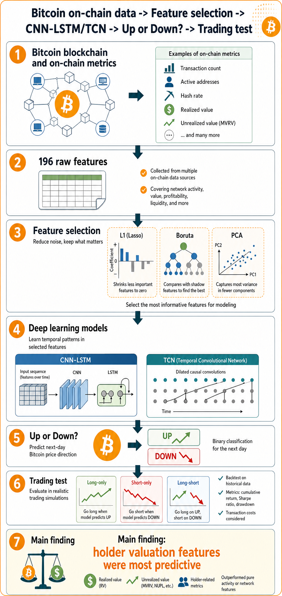
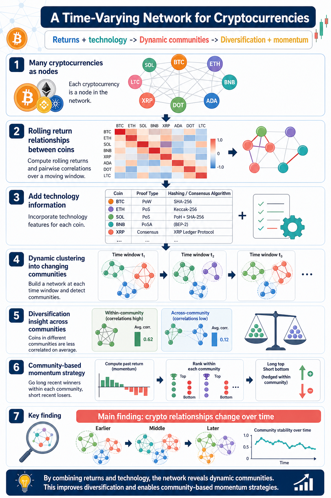
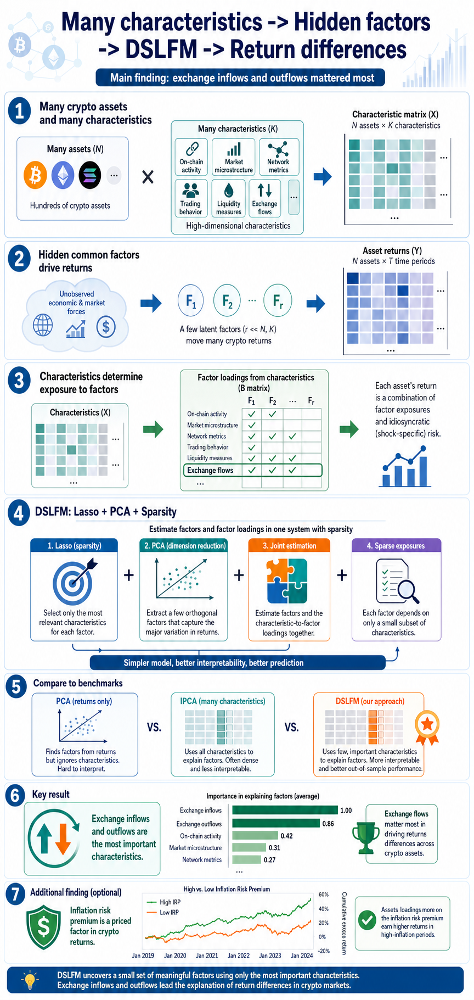
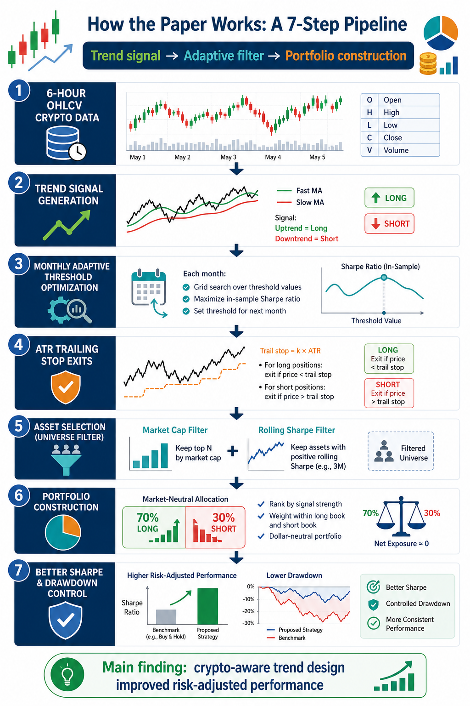

# Research Paper Review

Generated for the resource bundle in `/home/omegashenr01n/Desktop/resources-20260508-163423`.

## Scope
This note reviews the linked research papers with a focus on:
- goals
- methodology
- results
- how we can integrate or extend the work
- how we can retest it
- explicit data/code/resources mentioned in the source

Where a source did not expose an explicit dataset or code link, that is stated directly instead of inferred.

---

## 1) Bitcoin price direction prediction using on-chain data and feature selection
Source: https://www.sciencedirect.com/science/article/pii/S266682702500057X  
Local copy: `webpages/S266682702500057X.html`

### Goals
- Ask a simple question: can we use Bitcoin blockchain data to predict whether Bitcoin will go up or down the next day?
- Find out which kinds of on-chain features are actually useful, instead of assuming all blockchain metrics matter equally.
- Reduce the number of input variables so the model is not overloaded with noise.
- Check whether a good prediction model also leads to a good trading strategy.

### Methodology
- The paper treats the task as a `yes/no` prediction problem:
  will Bitcoin go up tomorrow or down tomorrow?
- It begins with `196` on-chain features. These are measurements built from Bitcoin blockchain activity, such as transaction behavior, holder profit or loss state, and value-based chain metrics.
- Because `196` features is a lot, the authors first try to reduce the feature set using:
  - `L1` selection
  - `Boruta`
  - `PCA`
- These methods do different things:
  - `L1` tries to keep only variables with useful predictive power
  - `Boruta` tries to identify the truly important features by comparing them against randomized versions
  - `PCA` compresses many variables into a smaller set of summary components
- After that, they train prediction models, mainly:
  - `CNN-LSTM`
  - `TCN`
  - a simpler benchmark model
- The idea is:
  - first choose the best inputs
  - then see which model uses those inputs most effectively
- Finally, they do not stop at prediction accuracy. They turn the model outputs into trading strategies such as:
  - `long-only`
  - `short-only`
  - `long-short`

### Factors / inputs used in modeling
- `Complete-list status`: the paper uses `196` on-chain features, and the full raw list is available in `Appendix A` of the paper. It is too long to duplicate cleanly here, so this report records the exact groups and the exact selected modeling features.
- The raw feature universe is grouped into five categories:
  - `Mining`
  - `Realized Value`
  - `Unrealized Value`
  - `Stationarity`
  - `Activity`
- The paper’s `Boruta`-selected modeling features are:
  - `cdd`
  - `cdd_supply_adjusted`
  - `rcap_hodl_waves_1d_1w`
  - `rcap_hodl_waves_1w_1m`
  - `rcap_hodl_waves_24h`
  - `loss_sum`
  - `net_realized_profit_loss`
  - `price_usd_ohlc_o`
  - `profit_relative`
  - `profit_sum`
  - `realized_loss`
  - `realized_profits_to_value_ratio`
  - `realized_profit`
  - `realized_profit_loss_ratio`
  - `sopr_adjusted`
  - `sopr`
  - `price_ohlc_usd_c`
  - `mvrv`
  - `mvrv_z_score`
  - `net_unrealized_profit_loss`
  - `unrealized_loss`
  - `unrealized_profit`
  - `utxo_loss_count`
  - `utxo_profit_relative`
  - `svl_1m_3m`
- The paper reports that `L1` selected `120` features and `PCA` used reduced components such as `20`, `30`, and `40` components, but the report does not reproduce the full `120`-feature `L1` list.

### Results
- The best reported combination was `Boruta + CNN-LSTM`.
- Reported test accuracy: `82.03%`.
- Reported `F1` score: `0.8201`, which means the model was not only accurate overall but also reasonably balanced in its predictions.
- The paper says the most useful features mainly came from `realized value` and `unrealized value` groups.
- In simple terms, those feature groups try to capture questions like:
  - at what value coins last moved
  - whether holders are sitting on gains or losses
  - whether the market may be under profit-taking pressure or stress
- The paper reports very strong backtest performance for the best trading variant:
  - `1682.7%` annualized return
  - `6.47` Sharpe ratio
- Those numbers are unusually high, so they should be read carefully as backtest results, not guaranteed live performance.

### Plain-language takeaway
- This paper is saying that Bitcoin’s blockchain contains useful information about market conditions.
- More specifically, the useful signal did not come from every on-chain metric.
- It mostly came from features related to holder positioning and valuation state.
- So the paper’s core lesson is:
  on-chain data may help, but careful feature selection matters a lot.

### How we can integrate or extend it
- Start with a simpler version before using deep learning:
  build an on-chain feature table and test whether a few well-grouped variables predict future returns.
- Group features by meaning, for example:
  - holder profit/loss
  - exchange flow
  - activity
  - supply behavior
- Run a feature-selection stage first so the final model is easier to interpret.
- Extend the prediction horizon beyond `1 day` to `3 days` or `1 week`, since those horizons may be more practical.
- Add realistic trading constraints such as:
  - fees
  - slippage
  - liquidity limits
  - turnover penalties

### How to retest it
- Re-run the study with strict `walk-forward` testing, so the model is always trained on the past and tested on the future.
- Compare against simpler baselines:
  - price-only signals
  - technical indicators only
  - on-chain model without feature selection
- Check whether the best features stay useful in more recent market periods.
- Apply more realistic assumptions to the backtest, especially around costs and position sizing.

### Explicit data/code/resources
- Explicit source type: Bitcoin on-chain data.
- No explicit public code repository or named public dataset link was visible in the extracted source.

---

## 2) A Time-Varying Network for Cryptocurrencies
Source: https://arxiv.org/pdf/2108.11921
Local copy: `papers/2108.11921.pdf`

### Goals
- Understand how cryptocurrencies are connected to each other.
- Check whether those connections stay fixed or change over time.
- Group cryptocurrencies into hidden `communities` based on how they move and on what kind of technology they use.
- See whether those communities help with:
  - diversification
  - trading
  - understanding how information spreads across the market

### Methodology
- The sample contains `182` cryptocurrencies from `2016-01-01` to `2018-12-31`.
- The paper builds a `network`.
- In that network:
  - each cryptocurrency is a `node`
  - a link from one coin to another means the past return of one helps predict the future return of the other
- This is important because the paper is not only asking who moves with whom.
- It is asking who may help predict whom.
- To estimate these links, the authors use rolling regressions and `adaptive Lasso`.
- They also add technology information such as:
  - hashing algorithm
  - proof type
  - other contract or protocol attributes
- Then they use a method called `dynamic covariate-assisted spectral clustering`.
- That sounds technical, but the main idea is simple:
  - `dynamic` means the groups can change over time
  - `covariate-assisted` means technology information helps the grouping
  - `clustering` means the method sorts coins into related groups
- After identifying these communities, the authors test whether the community structure is useful for:
  - diversification
  - momentum-style trading

### Factors / inputs used in modeling
- `Complete-list status`: partial. The paper clearly tells us the main modeled inputs, but it does not provide one compact final list of every expanded dummy variable inside the technology matrix in the extracted text.
- Return-based network input:
  - lagged standardized cryptocurrency returns
  - rolling return cross-predictability links estimated with `adaptive Lasso`
- Technology / contract covariates named in the paper:
  - `algorithm` or hashing algorithm
  - `proof type` / consensus mechanism
  - `age`
  - `total coins`
  - broader `contract attributes`
- Community-trading signal:
  - the average return of the other cryptocurrencies in the same estimated community
- Diversification analysis input:
  - within-community return correlations
  - cross-community return correlations
- Behavioral-control tests mentioned:
  - `market frictions`
  - `investor attention`
  - `macro uncertainty`
- Practical interpretation:
  the paper is driven by three input layers:
  - return network links
  - technology similarity
  - community-relative return information

### Results
- The paper finds that the crypto market is not just one big undifferentiated group.
- Instead, it appears to split into different communities.
- These communities help explain how risk and information move across the market.
- A practical result is that diversification improves when you hold assets from different communities instead of filling a portfolio with coins from the same group.
- The paper also reports a `community-based momentum` strategy.
- The idea is:
  - if related coins in a community have recently done well, another coin in that same community may also do well next
- Reported average daily return for that strategy: `1.08%`.
- The paper also says the effect did not reverse after one week and was not explained away by several behavioral-control tests.

### Plain-language takeaway
- This paper says crypto assets are linked in a structured way.
- Those links change over time.
- If you can identify the right groups, you may:
  - diversify better
  - build better relative-value or momentum signals
  - understand how shocks spread across the market

### How we can integrate or extend it
- Use community labels as dynamic buckets in portfolio construction.
- Add features such as:
  - cluster membership
  - within-cluster momentum
  - cross-cluster relative strength
- Extend the technology side with richer crypto-native variables like:
  - on-chain activity
  - developer activity
  - tokenomics
  - bridge or ecosystem exposure
- A simpler first implementation would be to build rolling correlation clusters before trying the full original network approach.

### How to retest it
- Rebuild the sample and rerun the rolling network estimation.
- Compare three versions:
  - return-only grouping
  - technology-only grouping
  - return-plus-technology grouping
- Check whether the clustering changes a lot when you change:
  - lookback windows
  - network definitions
  - transaction-cost assumptions
- Re-test the whole idea on later crypto periods, because the market structure after `2018` may be very different.

### Explicit data/code/resources
- Explicit data source: CryptoCompare API for daily prices, trading volumes, and contract attributes.
- No explicit public code link was surfaced in the extracted source.

---

## 3) Dynamic Latent-Factor Model with High-Dimensional Asset Characteristics
Source: https://arxiv.org/pdf/2405.15721
Local copy: `papers/2405.15721.pdf`

### Goals
- Explain why some crypto assets earn higher returns than others.
- Use a factor-model framework, but allow the model to work with many asset characteristics at once.
- Keep only the characteristics that really matter instead of treating every variable as equally important.
- Test whether inflation-related risk appears to be rewarded in crypto returns.

### Methodology
- The paper starts from a common asset-pricing idea:
  returns are driven by a few broad common forces called `factors`.
- But in this paper, the factors are `latent`, which means they are not directly observed.
- Instead, the model tries to estimate them from the return data.
- The paper then says:
  each coin’s exposure to those hidden factors depends on that coin’s characteristics.
- Examples of characteristics include market and on-chain style variables, with the paper paying special attention to exchange-flow variables.
- The challenge is that there are many characteristics.
- When the number of characteristics is large, ordinary estimation can become unstable or noisy.
- To handle this, the paper proposes a method called:
  `Double Selection Lasso Factor Model` or `DSLFM`
- Very roughly, the method works in stages:
  - use `Lasso` to shrink away weak variables
  - use `PCA` to recover hidden common factors
  - apply extra sparsity control so only the stronger characteristic relationships remain
- The paper compares this method against benchmark models such as:
  - a simple `three-factor` model
  - `PCA`-based latent-factor models
  - `IPCA`
- It also extends the framework to ask whether inflation risk carries a premium in crypto.

### Factors / inputs used in modeling
- `Complete-list status`: partial. The paper states it uses `63` asset characteristics, but the full 63-variable panel is not cleanly listed in the extracted main text we relied on. What we do know exactly is:
- Core model structure:
  - latent common factors estimated from returns
  - time-varying asset characteristics mapped into factor loadings
- Benchmark observable factor models named explicitly:
  - `size`
  - `illiquidity`
  - `30 day momentum`
  - `90 day volatility`
  - the paper also references a classic crypto three-factor benchmark of:
    - `crypto market`
    - `size`
    - `momentum`
- Dynamic-model characteristic set:
  - full panel of `63` characteristics
  - most important named characteristics:
    - `exchange inflows`
    - `exchange outflows`
- Observable nontradable factor studied:
  - `10-year expected inflation`
- Practical interpretation:
  this paper’s model is not built around a short hand-built factor list. It is built around:
  - a broad `63`-characteristic panel
  - latent factors
  - a sparse variable-selection step that keeps only the most useful characteristics

### Results
- The paper reports that `DSLFM` works well enough to produce economically meaningful out-of-sample portfolios.
- However, `IPCA` still achieved the stronger best Sharpe ratio in the reported comparison.
- Reported best out-of-sample Sharpe:
  - `DSLFM`: `3.3`
  - `IPCA`: `4.07`
- One of the most useful findings is about feature importance.
- The paper reports that `exchange inflows` and `exchange outflows` were the two most important characteristics.
- That means exchange-flow information may be especially helpful in explaining differences in crypto returns.
- The paper also reports a positive inflation risk premium:
  - `1.4` basis points
  - standard error `0.0097`
  - interpreted as roughly `7.3%` annual excess return

### Hidden Risk Factors
- The hidden factors here are not named things like `value`, `quality`, or `momentum`.
- They are statistical factors estimated from the data.
- Their job is to capture the common forces that seem to move many crypto assets at the same time.
- A useful beginner way to think about this is:
  - we can see many asset returns
  - the model assumes there are a few deeper shared forces behind them
  - those deeper forces are the latent factors
- The paper does not claim to give each latent factor a clean economic label.

### Plain-language takeaway
- This paper is less about direct trading signals and more about return structure.
- Its main message is:
  crypto returns may be driven by a few hidden common forces, and a small subset of characteristics helps explain which assets are most exposed to those forces.
- Among those characteristics, exchange-flow variables appear especially important.

### How we can integrate or extend it
- Use this paper as a template for a cross-sectional crypto return model rather than as a direct signal paper.
- Focus first on a practical subset of characteristics, especially:
  - exchange inflows
  - exchange outflows
  - size
  - momentum
  - volatility
- Compare a sparse model against simpler baselines before trying the full original method.
- A student-friendly stepping stone would be:
  use `PCA` factors plus a smaller set of hand-picked characteristics before moving to a full `DSLFM`.

### How to retest it
- Rebuild the weekly panel and compare the same benchmark models on a newer sample.
- Check whether exchange inflow and outflow variables still dominate in later crypto periods.
- Re-test the inflation result using different inflation proxies or different numbers of factors.
- See whether the conclusions change when the variable-selection step is made more or less aggressive.

### Explicit data/code/resources
- Explicit code link: `https://github.com/adambaybutt/crypto_asset_pricing`
- Explicit data providers mentioned: `Coin Metrics`, `CoinMarketCap`, and `Glassnode`
- Explicit author page: `http://www.adambaybutt.org/research.html`
- Reproducibility note: the paper clearly states replication code is available, but full replication likely depends on access to the same underlying data sources, some of which appear to have been purchased or accessed via academic discounts.

---

## 4) Crypto Pricing with Hidden Factors
Source: https://arxiv.org/pdf/2601.07664
Local copy: `papers/2601.07664.pdf`

### Goals
- Find out which factors help explain why some cryptocurrencies earn higher returns than others.
- Test whether crypto returns depend only on crypto-specific factors or also on traditional stock-market factors.
- Correct for the possibility that simple regressions miss important hidden common risks.
- Study whether variables like sentiment, altcoin rotation, or hacking shocks help explain expected returns.

### Methodology
- The paper uses weekly data from `2023-01-01` to `2024-12-31`.
- The universe contains `253` non-stablecoin cryptocurrencies that were in the top `100` by market capitalization at some point during the sample.
- This matters because the author is trying to avoid focusing only on today’s winners.
- The paper then builds several observed factors.
- On the crypto side, these include:
  - crypto market
  - crypto `SMB` or size
  - crypto momentum
  - a `TVL`-based factor
- On the traditional-finance side, the paper includes:
  - stock-market factors
  - some industry factors
  - profitability-style factors from the Kenneth French data library
- It also includes non-tradable state variables such as:
  - `Fear & Greed`
  - `Altcoin Season`
  - `Hacks / market cap`
  - `CVX` implied volatility
- Instead of relying only on a standard `Fama-MacBeth` regression, the paper uses the `Giglio-Xiu (2021)` three-pass framework.
- The reason is that this framework allows the model to include both:
  - observed factors
  - hidden latent factors
- The paper uses `7` latent factors selected by `Bai-Ng` criteria.
- Then it compares the latent-factor results with the simpler Fama-MacBeth results.

### Factors / inputs used in modeling
- `Complete-list status`: mostly known for the observed factors, plus `7` latent factors.
- Crypto factors constructed directly in the paper:
  - `RC`: crypto market excess return
  - `SMBC`: crypto small-minus-big factor
  - `MomC`: crypto momentum factor
  - `TVL`: top-minus-bottom long-short portfolio on `TVL / market cap`, orthogonalized to crypto market returns
- Stock / traditional-market factors explicitly named:
  - `RS`: stock market excess return
  - `SMBS`: stock `SMB`
  - `HMLS`: stock `HML`
  - `MomS`: stock momentum
  - `RMW`: stock profitability
  - `CMA`: stock investment
  - industry factors mentioned in the paper:
    - `Softw`
    - `Chips`
    - `Fin`
    - `Banks`
    - `Insur`
- Non-tradeable state variables:
  - `Fear & Greed`
  - `Altseason`
  - `Hacks / market cap`
  - `CVX`
- Transformations used:
  - `Fear & Greed` and `Altseason` converted to percent changes
  - `Hacks` scaled by market cap
  - `CVX` kept in levels
  - non-tradeable factors then converted to AR(1) residual shocks
- Hidden component:
  - `7` latent factors estimated with the `Giglio-Xiu` framework
- This is the clearest paper among the five in terms of named observed factors.

### Results
- The main finding is that the latent-factor approach gives meaningfully different answers from the simple Fama-MacBeth approach.
- That means hidden common risks matter.
- If you ignore them, you may mis-measure which factors are actually priced.
- The paper reports a positive premium for the `crypto market` factor.
- Reported premium:
  - latent-factor estimate: `0.471%` per week, about `24.5%` annualized
  - Fama-MacBeth estimate: `0.164%` per week, about `8.5%` annualized
- The paper also reports a significantly `negative` premium for crypto `SMB`.
- In plain English, smaller-cap cryptos underperformed larger-cap cryptos in this sample.
- Another notable result is that some traditional-market factors appear relevant for crypto pricing, especially:
  - `Software`
  - the broad stock market
  - the stock profitability factor `RMW`
- For the state variables:
  - `Fear & Greed` appears relevant
  - `Hacks` are not significant
  - `Altseason` becomes insignificant after latent-factor controls
  - `TVL` does not appear robust as an independent premium once hidden factors are included

### Hidden Risk Factors
- The hidden factors are statistical common forces extracted from the crypto return data.
- They are not directly named.
- So the paper is not saying:
  factor 1 is regulation, factor 2 is sentiment, factor 3 is liquidity.
- Instead, it is saying:
  there are common influences in the data that ordinary observed-factor models miss.
- These hidden factors are added so the measured premia on the observed factors become more believable.

### Plain-language takeaway
- This paper says that crypto pricing becomes easier to understand when you allow for hidden common risk.
- It also suggests crypto may now be more connected to traditional equity-market forces than some earlier papers implied.
- A beginner-friendly summary is:
  simple factor regressions may be too naive, because they ignore shared hidden forces across many assets.

### How we can integrate or extend it
- Use this paper as a framework for mixing:
  - crypto-native factors
  - traditional-market factors
  - hidden-factor controls
- Re-test whether crypto’s links to software and profitability factors remain strong in newer data.
- Treat variables like `Fear & Greed` as regime or state indicators rather than automatically turning them into standalone trade signals.
- A practical student version would be:
  estimate simple observed factors first, then add PCA-based latent controls and compare the difference.

### How to retest it
- Rebuild the `2023-2024` weekly panel and estimate:
  - simple Fama-MacBeth
  - latent-factor-adjusted results
- Check whether the traditional-market links remain visible in `2025+` data.
- Test whether results are sensitive to how factors are built, especially:
  - `TVL`
  - crypto `SMB`
  - momentum
- See whether the main conclusions change when the number of latent factors changes.

### Explicit data/code/resources
- Explicit crypto price source: `CoinMarketCap API`
- Explicit hacked-value source: `DeFiLlama`
- Explicit implied-volatility source: `thecvx.com`
- Explicit stock-factor source: `Kenneth French data library`
- Explicit sentiment/state-variable sources: `CoinMarketCap` Fear & Greed index and Altcoin Season Index
- Reproducibility note: the extracted paper text did not expose an explicit public code repository, and the paper is marked as a `preliminary draft`.

---

## 5) Systematic Trend-Following with Adaptive Portfolio Construction: Enhancing Risk-Adjusted Alpha in Cryptocurrency Markets
Source: https://arxiv.org/html/2602.11708v1  
Local copy: `webpages/2602.11708v1.html`

### Goals
- Build a trend-following system that is more suitable for crypto than a standard off-the-shelf trend rule.
- Adapt to the fact that crypto markets change quickly, volatility shifts often, and the tradable universe is not stable.
- Improve not just returns, but risk-adjusted performance.

### Methodology
- The paper proposes a framework called `AdaptiveTrend`.
- It has three main parts:
  - signal generation
  - asset selection
  - capital allocation
- It uses `6-hour` OHLCV data.
- Instead of using one fixed trading rule forever, it re-optimizes signal thresholds monthly.
- This is meant to help the system adapt when the market regime changes.
- For exits, it uses `ATR`-based trailing stops.
- In simple terms, that means stop levels widen or tighten depending on market volatility.
- The system also does not trade everything equally.
- It first filters the universe by market cap, then ranks assets using rolling Sharpe ratio.
- Capital is allocated asymmetrically:
  - `70%` to long positions
  - `30%` to short positions
- Within each side, positions are equal-weighted.
- The paper tests the framework on `150+` crypto pairs over `2022-2024`.
- It also includes robustness checks for parameters, costs, and market regimes.

### Factors / inputs used in modeling
- `Complete-list status`: mostly known for the trading inputs and decision variables. This is a trading-system paper rather than a classic factor-model paper.
- Market data inputs:
  - `6-hour OHLCV` data
  - tradable universe of `150+` crypto pairs
- Signal inputs:
  - `MOM` trend signal on each asset
  - long entry when `MOM > theta_entry`
  - short entry when `MOM < -theta_entry^(s)`
- Risk-management inputs:
  - `ATR`
  - `alpha` ATR multiplier for trailing stops
  - `k` ATR lookback window
- Portfolio-construction inputs:
  - `market capitalization` ranking
  - rolling `Sharpe ratio` filter
  - top-`K_L = 15` market-cap assets as long-candidate set
  - bottom-`K_S` market-cap assets as short-candidate set
  - Sharpe thresholds:
    - `gamma_L = 1.3`
    - `gamma_S = 1.7`
- Re-optimized strategy parameters named explicitly:
  - `theta_entry`
  - `alpha`
  - `L`
  - `k`
- Allocation parameter:
  - `lambda = 0.70` long allocation and `0.30` short allocation in the final system
- Practical interpretation:
  the “factors” here are really trading-system inputs:
  - momentum
  - volatility via ATR
  - market-cap filtering
  - recent Sharpe-based asset selection
  - asymmetric capital allocation

### Results
- The paper reports the following headline performance numbers:
  - annualized Sharpe: `2.41`
  - max drawdown: `-12.7%`
  - Calmar ratio: `3.18`
- According to the paper, this was better than both:
  - benchmark trend-following strategies
  - equal-weighted buy-and-hold portfolios
- The point is not just that trend worked.
- The point is that a more crypto-aware version of trend-following worked better than a basic version.

### Plain-language takeaway
- This paper is more practical than the others.
- It says:
  if you want to trade crypto trends, the details matter.
- You should think about:
  - which assets to include
  - how often to rebalance
  - how to set stops
  - how to size the long and short books
- So the contribution is not one magic indicator.
- It is a better trading system design.

### How we can integrate or extend it
- Use the paper as a practical template for building a crypto systematic strategy.
- Keep the broad structure:
  - signal
  - universe filter
  - allocation
- Improve the allocation step using:
  - volatility targeting
  - correlation-aware sizing
  - liquidity filters
- Add crypto-specific overlays such as:
  - perp basis
  - funding rates
  - on-chain stress signals
  - exchange-flow filters

### How to retest it
- Reproduce the strategy on a clearly defined dataset and preserve delisted assets if possible.
- Re-test under stricter cost assumptions, especially for smaller and less liquid names.
- Check whether monthly threshold re-optimization is genuinely adaptive or just overfitting.
- Break the performance down by:
  - bull vs bear periods
  - large-cap vs small-cap
  - different rebalance frequencies

### Explicit data/code/resources
- Explicit source type: 6-hour OHLCV data across 150+ crypto pairs from 2022-2024.
- No explicit code repository or clearly named market-data provider was visible in the extracted source.

---

## 6) Meta-Learning Reinforcement Learning for Crypto-Return Prediction
Source: https://arxiv.org/pdf/2509.09751  
Local copy: `papers/2509.09751.pdf`

### Goals
- Improve crypto return prediction when data is multimodal and labels are limited.
- Build a self-improving agent that updates both policy and evaluation criteria.
- Fuse on-chain, market, news, and sentiment inputs without extra human supervision.

### Methodology
- Proposes `Meta-RL-Crypto`, a closed-loop system with actor, judge, and meta-judge roles.
- The actor consumes structured multimodal inputs and produces next-day forecasts or actions.
- The judge scores outputs using a multi-objective reward vector: return, Sharpe contribution, drawdown control, liquidity/slippage awareness, and sentiment alignment.
- The meta-judge updates the judge to reduce reward drift or inconsistent scoring.
- Uses CoinMarketCap and Dune Analytics for market/on-chain data, and GNews for off-chain text.
- Adds credibility filtering and SimHash-based deduplication in the news pipeline.

### Results
- The paper reports outperforming classic time-series baselines like Informer and PatchTST, standard indicators like MACD, and several LLM baselines.
- Reported gains were described as especially strong in bear-market conditions.
- The main empirical takeaway is competitive trading performance without extra human-labeled supervision.

### How we can integrate or extend it
- Use the actor/judge/meta-judge loop as a template for self-evaluating financial agents.
- Replace single-asset outputs with portfolio-level objectives.
- Add order-book, perp funding, options-implied, or wallet-flow features.
- Reuse the judge/meta-judge pattern for post-trade critique and automated research iteration.

### How to retest it
- Re-run on fully timestamped data with strict leakage controls.
- Compare against non-LLM multimodal baselines and simpler RL setups.
- Evaluate in paper trading with realistic fees, slippage, and turnover limits.
- Test stability under different reward weights, sentiment sources, and market regimes.

### Explicit data/code/resources
- Explicit data sources: CoinMarketCap, Dune Analytics, and GNews.
- Explicit processing note: SimHash-based deduplication.
- No explicit released code repository was visible in the extracted source.

---

## 7) To Trade Or Not To Trade: Cascading Waterfall Round Robin Rebalancing Mechanism for Cryptocurrencies
Source: https://arxiv.org/pdf/2407.12150  
Local copy: `papers/2407.12150.pdf`

### Goals
- Design a crypto/DeFi portfolio rebalancing mechanism that decides whether to trade, how much to trade, and how many trades to split into.
- Handle blockchain-specific frictions such as gas fees and slippage.
- Provide a framework that can generalize across frequencies and asset classes.

### Methodology
- Defines minimum, ideal, and maximum asset weights rather than only point targets.
- Computes asset capacity using risk/return properties, cross-asset relationships, and net inflow/outflow.
- Allocates deposits or redemptions via a round-robin cascading waterfall process.
- Adds minimum and maximum trade-size rules to balance gas costs and slippage.
- Uses threshold or boundary-crossing logic so trades happen when ranges are breached.
- Illustrates the mechanism with numerical examples and network-specific discussion.

### Results
- The mechanism is designed to output ideal trade sizes and trade counts while accounting for execution frictions.
- It is intended to benefit from volatility while filtering noise through thresholded execution.
- The extracted source contained numerical examples, but not a strong large-sample empirical benchmark section.

### How we can integrate or extend it
- Implement it as an execution-aware overlay on top of a target-allocation engine.
- Feed real-time gas, liquidity depth, and slippage estimates into the trade-band logic.
- Extend it to cross-chain treasury management, LP/vault rebalancing, or token baskets.
- Compare it with periodic, tolerance-band, and optimization-based rebalancers.

### How to retest it
- Backtest on historical portfolio states plus realized gas/slippage.
- Benchmark turnover, tracking error, and net returns against simpler rebalancing rules.
- Stress test under liquidity droughts, volatility spikes, and chain fee shocks.
- Check whether threshold logic improves post-cost outcomes rather than merely reducing trade count.

### Explicit data/code/resources
- The source explicitly discusses numerical examples.
- No explicit public dataset or code repository was visible in the extracted source.

---

## 8) Beyond Trading Data: The Hidden Influence of Public Awareness and Interest on Cryptocurrency Volatility
Source: https://arxiv.org/pdf/2202.08967  
Local copy: `papers/2202.08967.pdf`

### Goals
- Test whether Bitcoin volatility forecasting improves when non-price signals are added.
- Measure the impact of public sentiment, public interest, and blockchain activity on volatility.
- Produce a forecasting model useful both for prediction and fluctuation-distribution estimation.

### Methodology
- Proposes `CoMForE`, a multimodal AdaBoost-LSTM ensemble for next-day BTC-USD volatility forecasting.
- Combines historical trading data with tweet sentiment, search-interest signals, hash rate, and network difficulty.
- Trains multiple LSTM weak learners on sampled subsets and combines them with AdaBoost-style weighting.
- Evaluates using comparative experiments with reimplemented baselines on the same dataset and period.
- Goes beyond point prediction by estimating volatility or fluctuation distribution.

### Results
- The paper reports a 19.29% improvement over prior forecasting methods.
- Multimodal inputs outperformed trading-data-only setups.
- The source argues that external independent factors materially influence crypto volatility.
- The model is presented as more useful for decisions because it predicts both direction of fluctuation and distribution characteristics.

### How we can integrate or extend it
- Build a multimodal crypto risk model that fuses market, social, search, and on-chain inputs.
- Add modality-level ablations or explainability to determine which channel matters by regime.
- Extend from BTC volatility forecasting into options/risk-management workflows.
- Replace AdaBoost-LSTM with transformers or state-space models while keeping the multimodal stack.

### How to retest it
- Rebuild the multimodal data pipeline and compare trading-only versus multimodal variants.
- Re-run with strict out-of-sample splits and identical baseline implementations.
- Test robustness across market regimes and other coins.
- Check both forecast accuracy and calibration of the predicted fluctuation distribution.

### Explicit data/code/resources
- Explicit data types: historical trading data, tweet sentiment, search volumes, and blockchain data including hash rate and network difficulty.
- The source says an open-source implementation exists on GitHub, but the extracted material did not expose the exact repository URL.

---

## 9) The Surprising Irrelevance of Total-Value-Locked on Cryptocurrency Returns
Source: https://arxiv.org/pdf/2506.03287  
Local copy: `papers/2506.03287.pdf`

### Goals
- Test the claim that higher TVL implies higher crypto returns.
- Check whether TVL-sorted portfolios contain alpha after controlling for standard crypto risk factors.
- See whether the conclusion changes when TVL is cleaned up to reduce overstatement.

### Methodology
- Uses weekly returns from 2023-01-02 to 2024-12-31 on cryptocurrencies that were in the top 100 by market cap at any point.
- Excludes Bitcoin and stablecoins.
- Forms value-weighted portfolios sorted by TVL/market cap and by changes in TVL/market cap.
- Runs tests using both total TVL and a cleaner `simple TVL` measure.
- Evaluates both the full sample and a Level 1 subset.
- Tests returns against a one-factor crypto market model and a three-factor crypto model with market, SMB, and momentum.

### Results
- Alpha coefficients are insignificant across TVL-formed portfolios, so the paper finds no distinct TVL alpha.
- A single-factor aggregate crypto market model is reported as sufficient to explain the cross-section of TVL-sorted returns.
- For total-TVL portfolios, factor models explain roughly 73% to 93% of return variation.
- Change-in-TVL portfolios are also explained by factor models, though with lower fit.
- The conclusion is robust across total TVL, simple TVL, and the Level 1 subset.

### How we can integrate or extend it
- Treat TVL mainly as a risk-exposure or ecosystem descriptor, not as a standalone return signal.
- Combine TVL with orthogonal fundamentals such as fees, active users, retention, or protocol revenue quality.
- Use TVL for clustering or protocol classification while relying on broader factor and regime models for prediction.
- Test whether verifiable TVL or utilization measures work better than raw TVL.

### How to retest it
- Re-run the portfolio tests on post-2024 data and later DeFi cycles.
- Test equal-weighted, different breakpoints, and different rebalance frequencies.
- Compare raw TVL, simple TVL, verifiable TVL, and utilization metrics.
- Add transaction costs, turnover analysis, and rolling stability checks.

### Explicit data/code/resources
- Explicit data/resources mentioned: CoinMarketCap API and DeFiLlama.
- The source explicitly defines the exclusions used to construct `simple TVL`.
- No explicit code repository was identified in the extracted source.

---

## Repository snapshot: awesome-quant-ai
Source: https://github.com/leoncuhk/awesome-quant-ai  
Local copy: `awesome-quant-ai/`

### What it is
- A curated awesome-list for AI/ML applications in quantitative finance.
- Not a single strategy repo. More of a map of the field plus notebooks, notes, and references.

### What is inside
- `README.md`: main curated list.
- `book/myquant/`: 8-chapter strategy guide with Python-oriented material.
- `book/`: book notes including systematic trading material.
- `think/`: original essays on HMMs, Markov switching, fuzzy systems, and AI-agent trading.
- `paper/`: academic PDFs.
- `tools/`: notebooks such as `pybroker.ipynb`.
- `assets/`: diagrams and reference images.

### How we can use it
- Use it as a literature and tooling index for follow-up experiments.
- Mine the `think/` and `book/myquant/` sections for implementation ideas and baseline workflows.
- Use the tools/notebooks as a quick starting point for prototyping.
- Treat it as a reference layer that helps connect methods across factor investing, RL, trend following, volatility forecasting, and agentic trading.

### Limits
- It is curated reference material, not a controlled benchmark suite.
- Individual linked resources still need their own reproducibility checks.

---

## Cross-paper takeaways

### What looks most directly usable
1. On-chain feature selection plus sequence models for BTC directional prediction.
2. Adaptive crypto trend-following with explicit universe selection and risk controls.
3. Multimodal pipelines combining market, on-chain, sentiment, and search data.
4. Dynamic network/community structure for portfolio construction and diversification.
5. Factor work showing that TVL alone is weak and latent/common factors matter more.

### Immediate experiments worth running
1. Build a benchmark panel with price, volume, on-chain, TVL, sentiment, and search data.
2. Test three families side by side:
   - trend-following / cross-sectional momentum
   - multimodal volatility or direction forecasting
   - latent-factor / characteristic-sparse cross-sectional models
3. Use TVL as context or risk classification, not as a standalone alpha.
4. Add strict walk-forward validation, delisting-aware universes, and realistic fee/slippage assumptions from day one.

### Data/code surfaced directly from the sources
- CoinMarketCap
- Dune Analytics
- GNews
- CryptoCompare
- DeFiLlama
- Kenneth French data library
- thecvx.com
- `https://github.com/adambaybutt/crypto_asset_pricing`
- local repo: `awesome-quant-ai/`

### Gaps to keep in mind
- Several papers did not expose code links in the retrieved source.
- Some papers reported strong results but need replication under tighter cost and leakage controls.
- One paper (`Crypto Pricing with Hidden Factors`) is explicitly marked as a preliminary draft.
