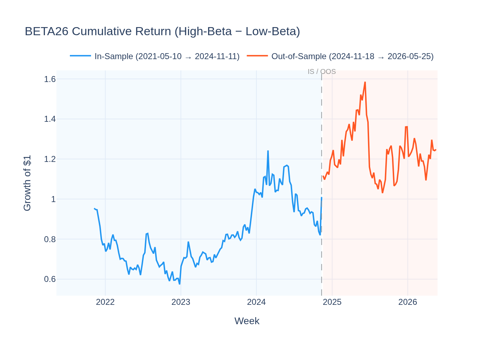
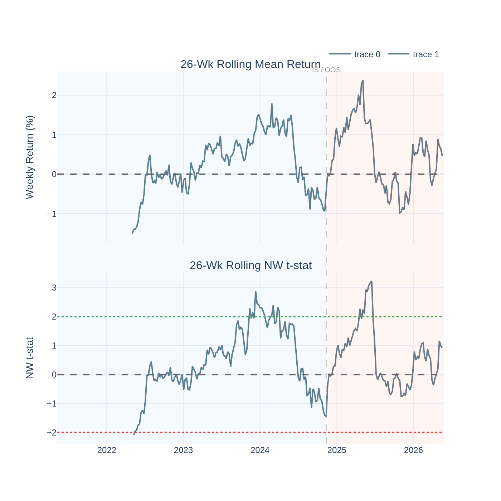
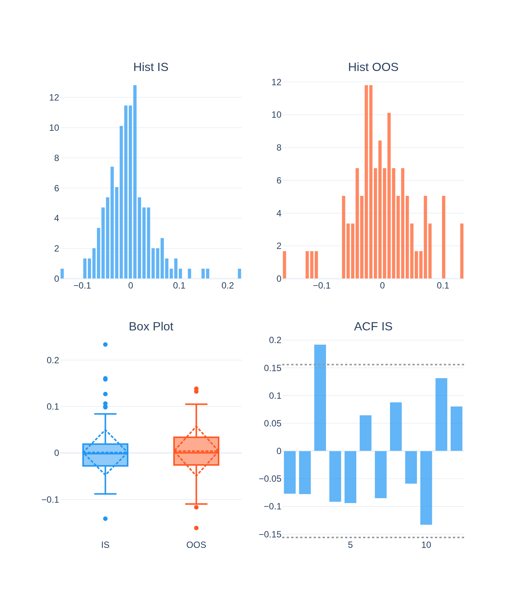
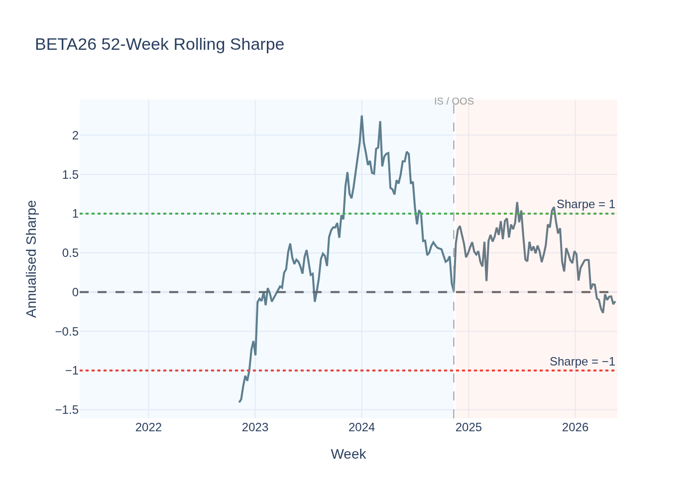
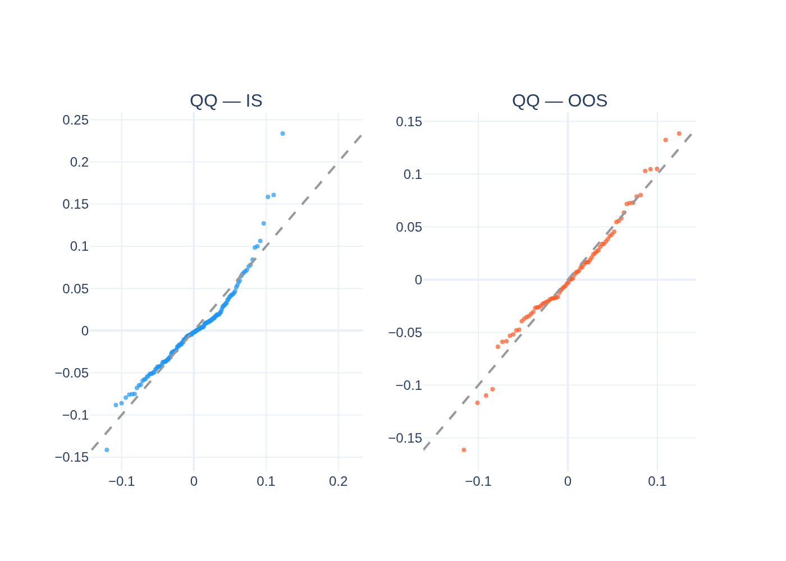
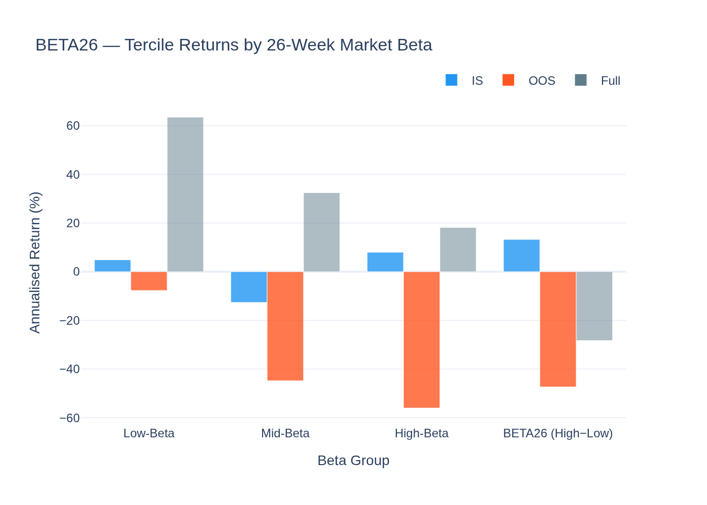
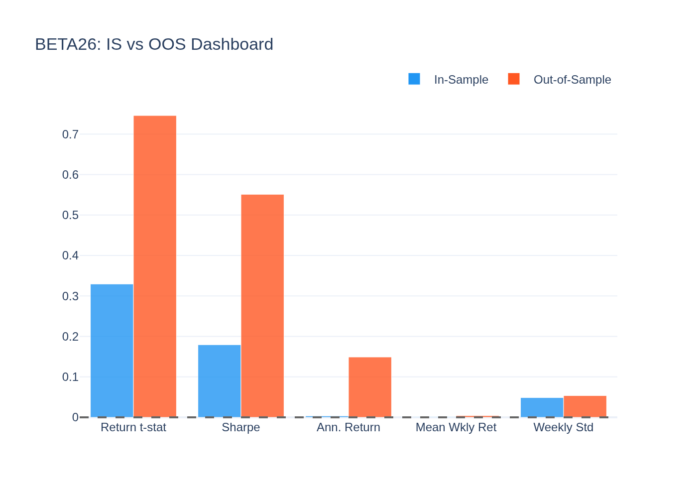
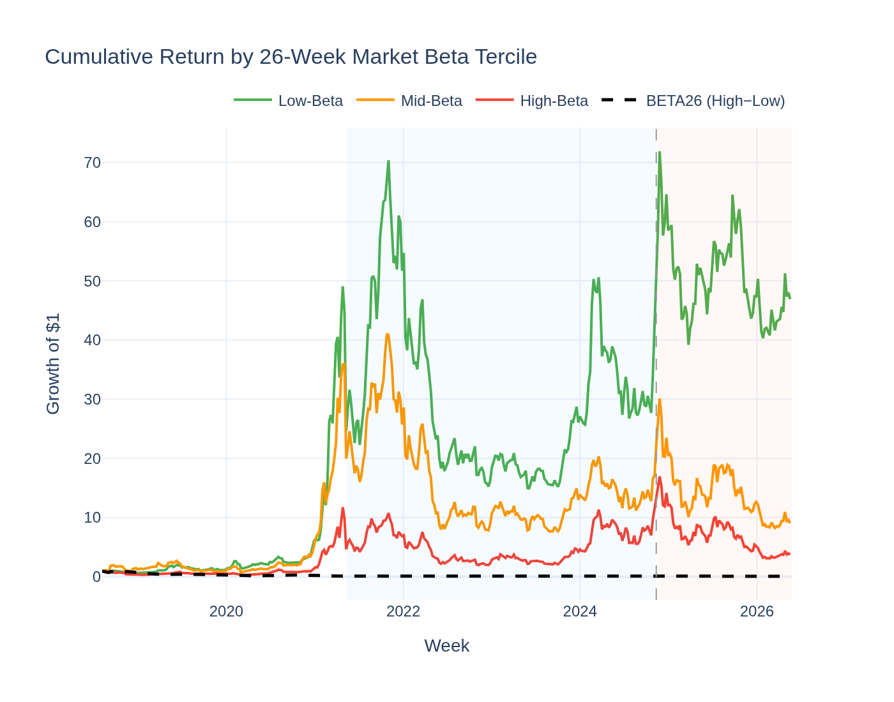
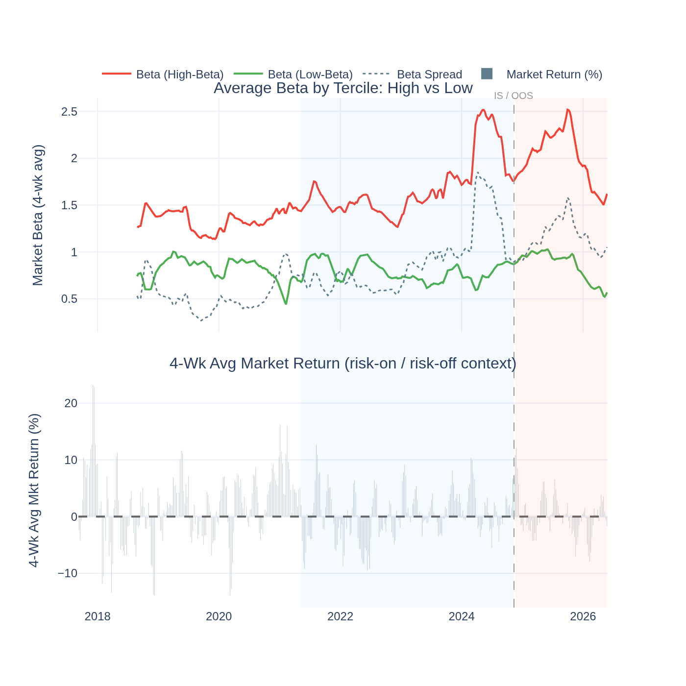

# BETA26 (Speculative Beta / Risk-On Demand) — Analysis Report

*Generated by `25_beta26_visualisation.py` from the Stage-10 behavioral factor search.*

---

## The Idea in Plain English

When investors are in "risk-on" mode — they want exposure to the market, but
amplified — they reach for the highest-beta coins. A coin with a beta of 2 moves
twice as much as Bitcoin. Buying it is a levered bet on the crypto market.

**BETA26** captures this speculative demand premium. Each week, we compute each
coin's trailing 26-week **market beta** (how much it moves relative to the
value-weighted market). Then:
- **Buy** the top 30% by market beta (the amplifiers, the speculative favourites)
- **Short-sell** the bottom 30% (the defensive, low-beta coins)

---

## The Short Answer

**Priced risk — high-beta coins earn more in the cross-section.**

Joint GX-full: **λ = +122.8%/yr, t = +4.60**,
95% CI [70.6%, 175.1%]. High market-beta coins systematically
earn higher long-run returns — investors are compensated for bearing amplified
market exposure.

This is the crypto analogue of the equity **betting-against-beta (BAB)** literature
(Frazzini-Pedersen 2014), but here the *high-beta* side is the winner — because
leverage-seeking speculative demand in crypto pushes high-beta coins' expected
returns *up*, not down as in equity markets.

---

## Why High Beta Is Rewarded in Crypto (Not Punished)

**1. No leverage constraint in crypto — but strong preference for leverage.**
In equities, BAB works because investors *can't* get enough leverage, so they
over-buy high-beta stocks, bidding up their price and suppressing future returns.
In crypto, investors *can* and *do* use leverage freely, but there is strong demand
for high-beta coins from retail investors who want amplified exposure without using
margin. This demand keeps high-beta coins fairly priced or slightly underpriced.

**2. High-beta coins as leverage substitutes.**
Many retail investors don't use futures or margin. Instead, they buy high-beta
altcoins as a "natural leverage" substitute. This demand creates systematic exposure
the market prices as a premium.

**3. Risk compensation is straightforward.**
High-beta coins lose more in bear markets. Holding them requires genuine risk
tolerance. The cross-section prices this tolerance with a positive premium.

**4. Correlation with MAXRET = 0.249.**
High-beta coins also tend to have higher maximum returns (they're more volatile and
exciting). The joint GX model confirms BETA26 adds independent information beyond
MAXRET, VolC, and the other behavioral factors.

---

## BETA26 vs VolC — why are they different?

| | VolC (Stage-09) | BETA26 (Stage-10) |
|---|---|---|
| Measures | Total volatility (std) | Market beta (systematic risk only) |
| Captures | Raw price jumpiness | Correlation + magnitude vs market |
| GX direction | Long LOW vol earns more | Long HIGH beta earns more |

VolC's negative GX premium says: being in highly volatile coins costs you money
long-run. BETA26's positive premium says: being in high-*systematic* beta coins
earns you more. The two factors coexist because some volatility is idiosyncratic
(captured by VolC) and some is systematic (captured by BETA26).

---

## Performance Summary

| Metric | In-Sample | Out-of-Sample |
|---|---|---|
| Annualised Return (L/S) | 6.3% | 21.3% |
| Sharpe Ratio | 0.18 | 0.55 |
| Return t-stat (NW) | 0.33 | 0.75 |
| GX-full λ (joint) | +122.8%/yr (t = +4.60) | — |

---

## Statistical Tests

### GX Joint Pricing

**λ = +122.8%/yr, t = +4.60**, CI [70.6%, 175.1%].
Significant at |t| ≥ 2 in the joint model with all Stage-09 factors.

### Jarque-Bera

| Period | JB | p-value | Normal? |
|---|---|---|---|
| IS  | 121.6  | 0.0000  | No |
| OOS | 2.4 | 0.2938 | Yes |

### ADF Stationarity

ADF = -15.777, p = 0.0000 → **Stationary**

---

## Visualisations

### Cumulative L/S Return

### Rolling Return Significance

### Return Distribution

### Rolling Sharpe

### QQ-Plot

### Beta Tercile Returns

High-beta vs mid vs low-beta tercile returns across IS, OOS, and full sample. High-beta outperforming low-beta in bull markets is mechanically expected; the persistence of the premium in both IS and OOS confirms it is priced, not just a bull-market artefact.

### IS vs OOS Dashboard

### Cumulative Return by Beta Tercile

### Beta Spread Over Time (vs Market Regime)

Top panel: average beta of the high-beta and low-beta terciles over time, plus the spread. Bottom panel: 4-week rolling market return. The alignment between the beta spread and market conditions shows when the "risk-on" speculative demand premium is at its widest — typically in the early stages of bull markets when beta-seeking investors are most active.
