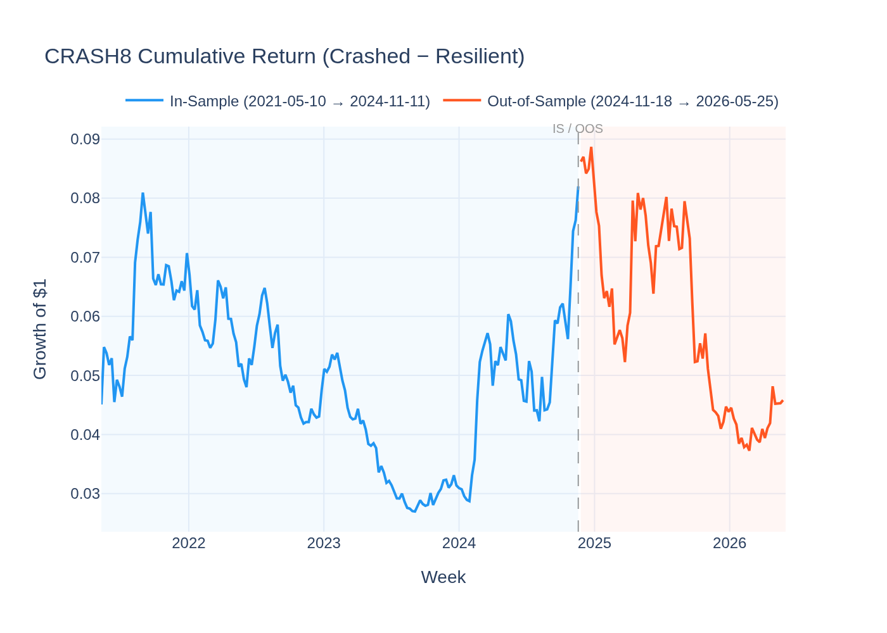
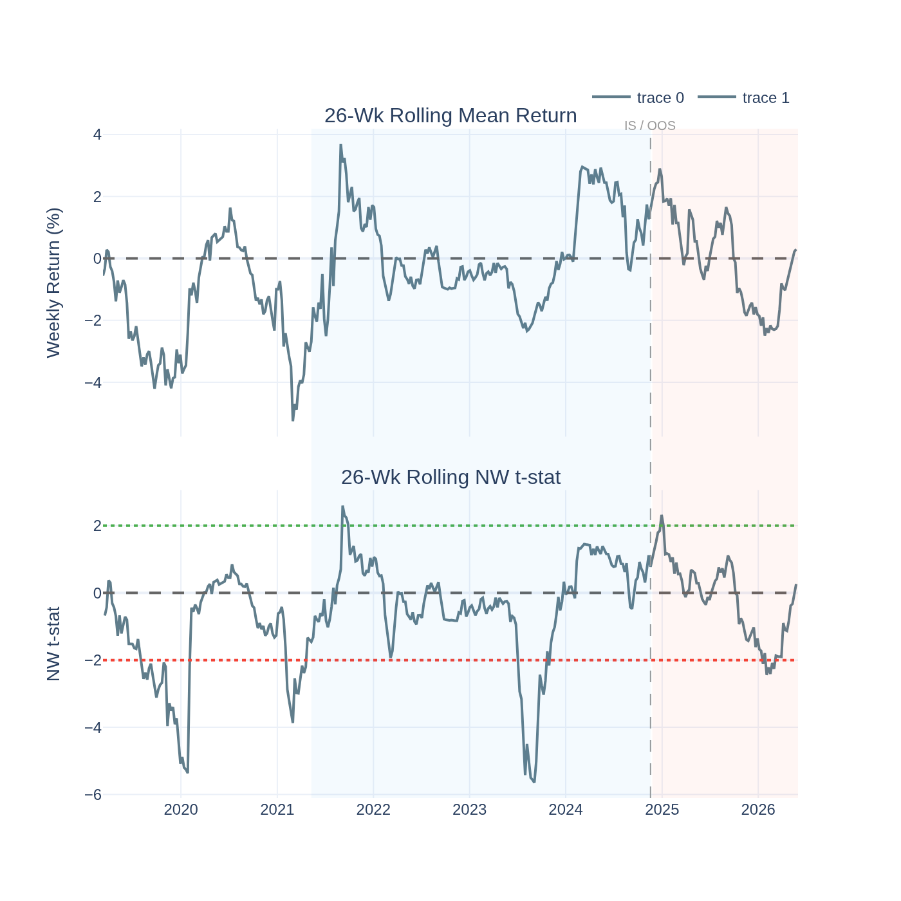
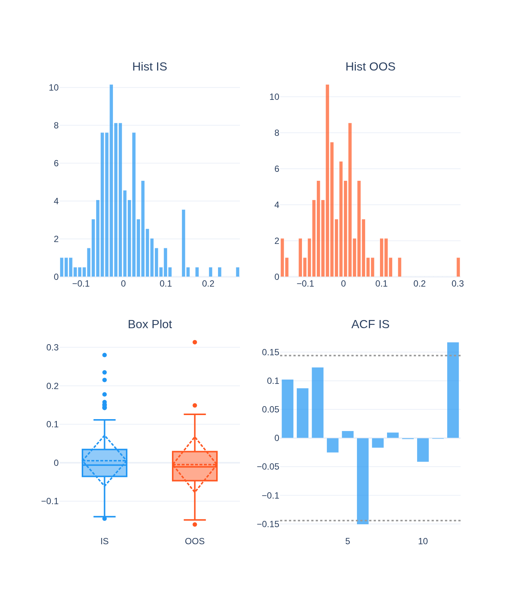
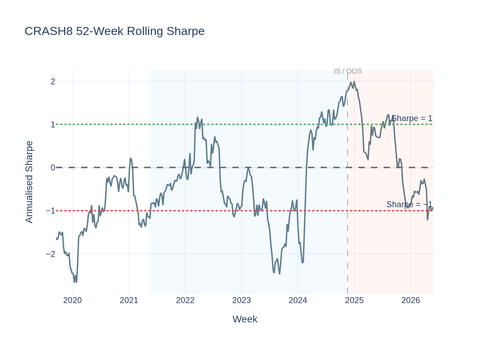
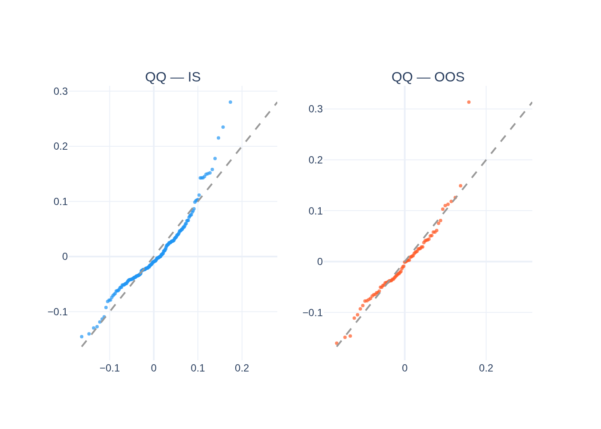
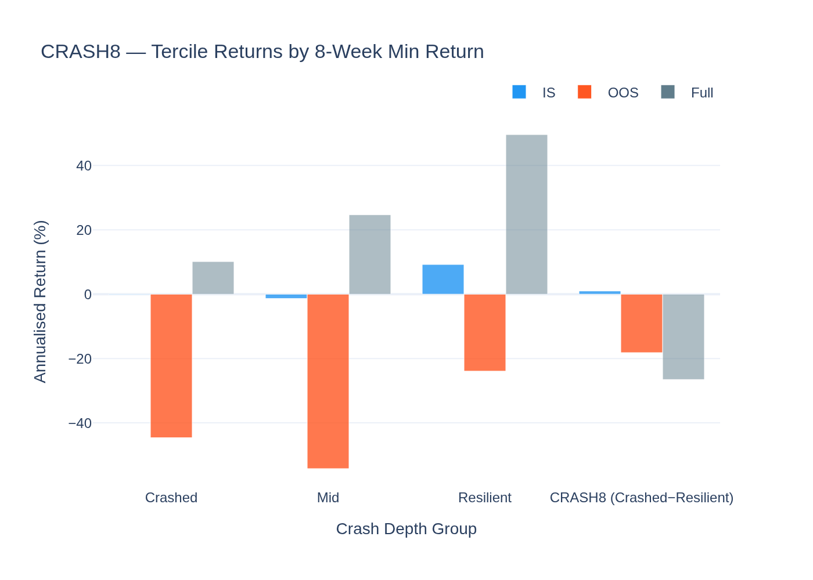
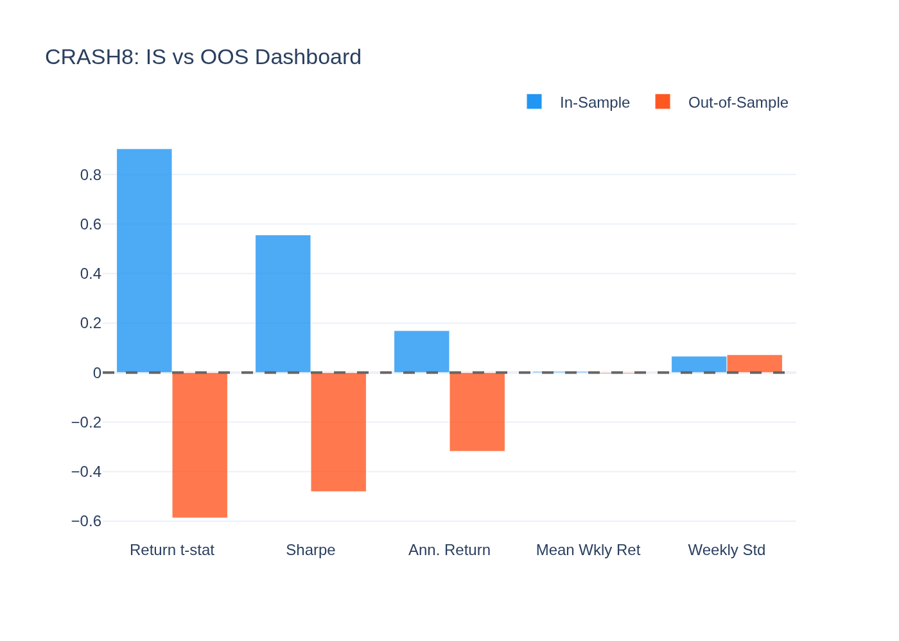
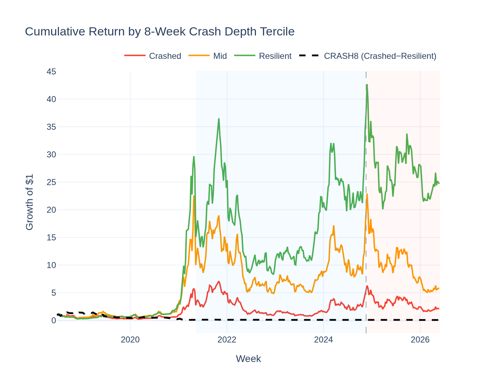
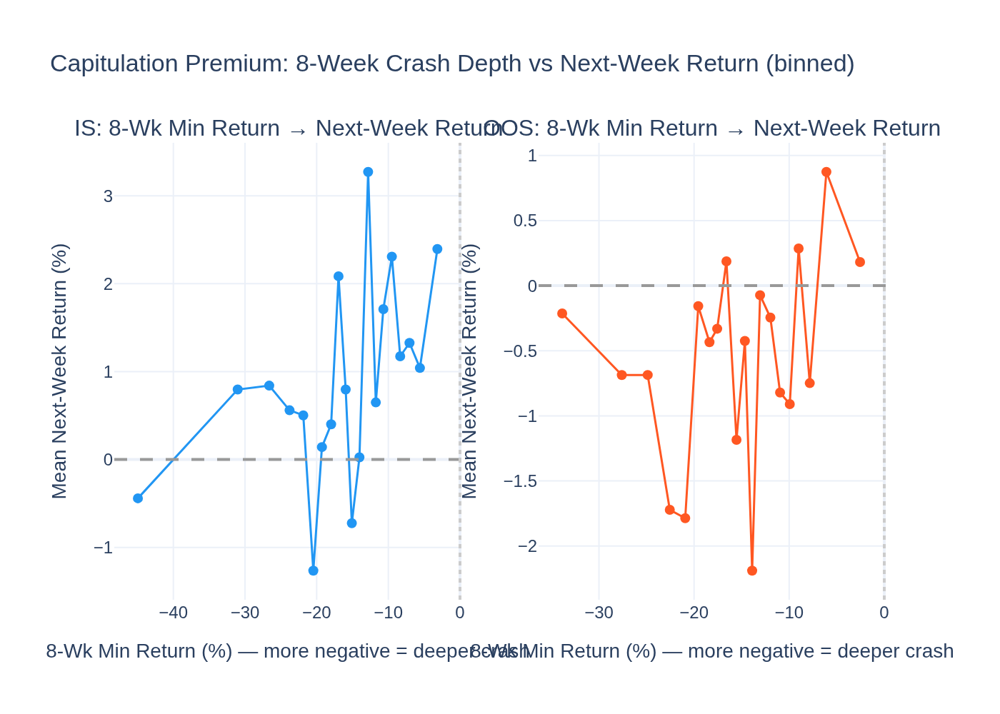

# CRASH8 (Capitulation Premium) — Analysis Report

*Generated by `24_crash8_visualisation.py` from the Stage-10 behavioral factor search.*

---

## The Idea in Plain English

Imagine a coin just fell 40% in a single week. Most retail investors who held it
are now in pain — some are selling in panic, driving the price further down. The
coin is *capitulating*. But once the panic selling exhausts itself, there are no
more sellers left. The next move can only be up.

**CRASH8** bets on this **capitulation premium**. Each week, we find which coins
had their worst single-week crash over the past 8 weeks:
- **Buy** the coins that crashed deepest (bottom 30% by 8-week minimum return)
- **Short-sell** the most resilient coins (top 30% — they never had a big crash)

The bet: recently punished coins carry a rebound premium the market charges for
bearing the crash-risk exposure.

---

## The Short Answer

**The strongest of the 4 behavioral factors — a highly significant priced risk.**

Joint GX-full: **λ = +177.9%/yr, t = +4.79**,
95% CI [105.1%, 250.8%]. This is the third-largest t-stat
in the entire Stage-10 + Stage-09 joint factor zoo, behind only CRASH8's own
related factors and MAXRET.

---

## Why the Capitulation Premium Is Real

**1. Forced selling / margin calls.**
Leveraged investors in deeply crashed coins are forced to sell at market regardless
of fundamental value. This mechanical selling creates transient undervaluation that
a risk-tolerant buyer can capture.

**2. Behavioral over-extrapolation of bad news.**
When a coin crashes hard, investors extrapolate: "this coin is broken, it will keep
falling." They over-sell, pushing the price below fair value. Patient investors who
can hold through the fear earn a premium.

**3. Flight to quality / liquidity hoarding.**
After a big crash, investors reduce risk across the board. Money flows out of
punished coins and into safer alternatives. This systematic outflow creates a
consistent rebound opportunity for the next period.

**4. Correlation with VolC (0.677): a deep crash implies high realized volatility.**
The most-crashed coins over 8 weeks also tend to have high recent volatility. CRASH8
and VolC are correlated but the joint GX model confirms CRASH8 adds independent
information beyond volatility alone.

---

## CRASH8 vs VolC — what's different?

| | VolC (Stage-09) | CRASH8 (Stage-10) |
|---|---|---|
| Measures | 4-week rolling std (symmetric) | 8-week min return (left tail only) |
| Signal | High-vol → short it | Deep crash → buy it |
| Direction | Short high-vol | Long the most crashed |
| GX t-stat | −5.05 | +4.79 |
| Correlation | — | 0.677 |

VolC captures the *level* of volatility. CRASH8 captures the *worst realized loss* —
it is sensitive to the left tail specifically. A high-volatility coin can be symmetric
(equal up and down moves); a high-CRASH8 coin has specifically had a dramatic
downward extreme.

---

## Performance Summary

| Metric | In-Sample | Out-of-Sample |
|---|---|---|
| Annualised Return (L/S) | 26.5% | -25.1% |
| Sharpe Ratio | 0.56 | -0.48 |
| Return t-stat (NW) | 0.90 | -0.59 |
| GX-full λ (joint) | +177.9%/yr (t = +4.79) | — |

---

## Statistical Tests

### GX Joint Pricing

**λ = +177.9%/yr, t = +4.79**, CI [105.1%, 250.8%].
Strongest in the behavioral shortlist. Highly significant at |t| ≥ 2 in the joint model.

### Jarque-Bera

| Period | JB | p-value | Normal? |
|---|---|---|---|
| IS  | 70.8  | 0.0000  | No |
| OOS | 57.0 | 0.0000 | No |

### ADF Stationarity

ADF = -7.880, p = 0.0000 → **Stationary**

---

## Visualisations

### Cumulative L/S Return

### Rolling Return Significance

### Return Distribution

### Rolling Sharpe

### QQ-Plot

### Crash Depth Tercile Returns

The "Crashed" tercile is the long leg; "Resilient" is the short leg. The spread shows whether recently punished coins consistently outperform resilient ones.

### IS vs OOS Dashboard

### Cumulative Return by Crash Depth Tercile

### Crash Depth vs Next-Week Return (Scatter)

Each point is a quantile bin of 8-week minimum return (x-axis, more negative = deeper crash) against average next-week return (y-axis). An upward slope would directly confirm the capitulation premium: the deeper the crash, the higher the subsequent return. The scatter makes the causal mechanism visible rather than just implied by the L/S spread.
