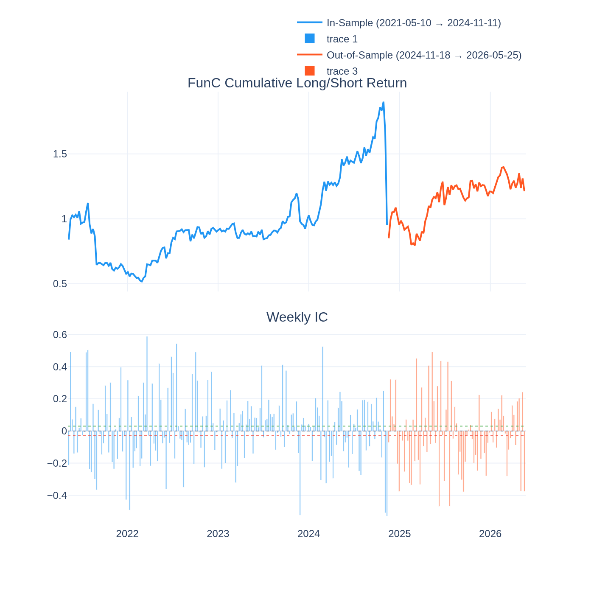
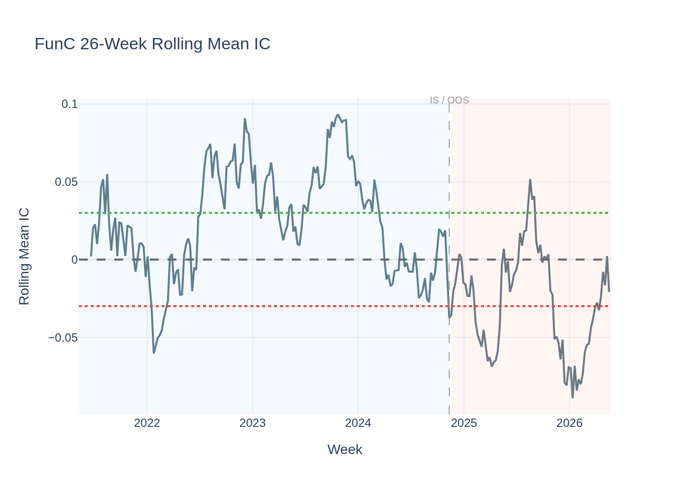
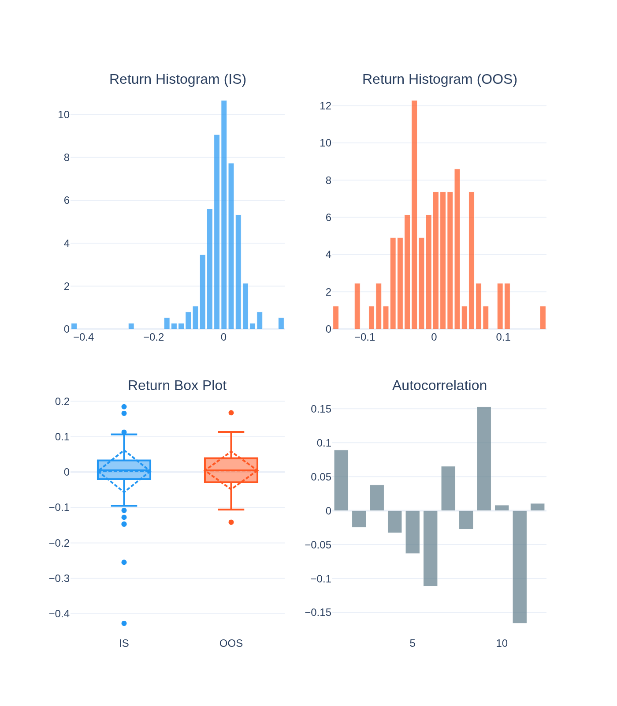
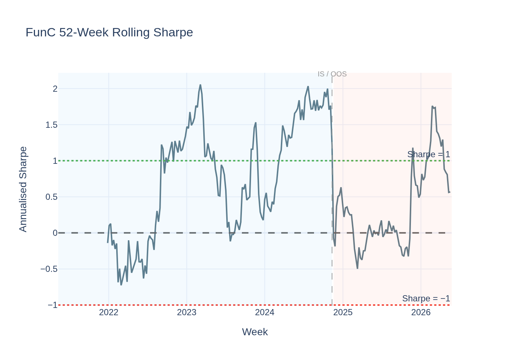
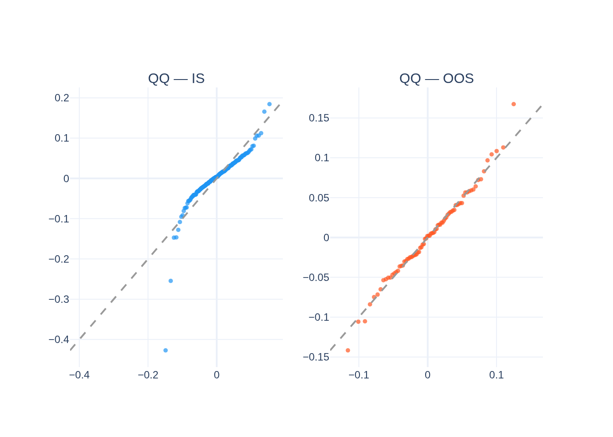
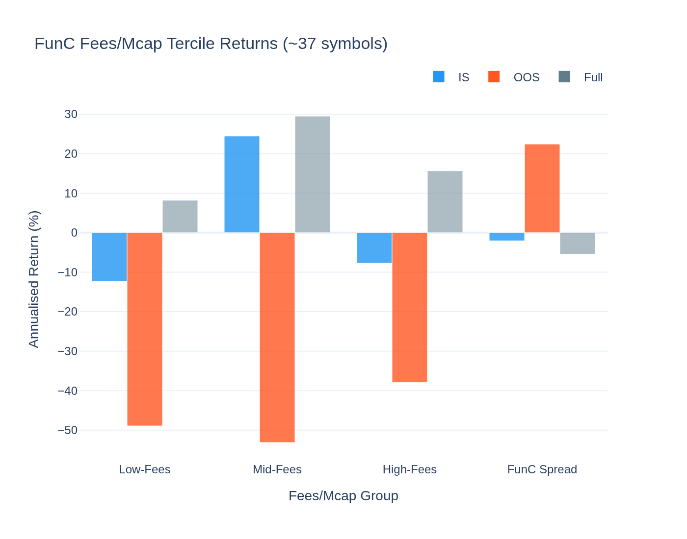
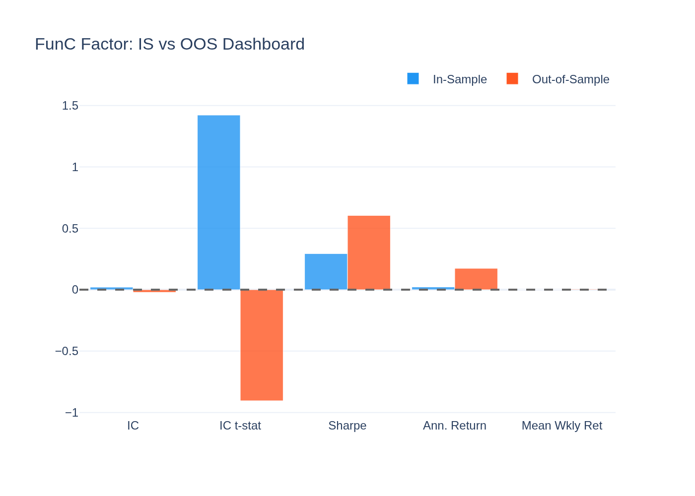
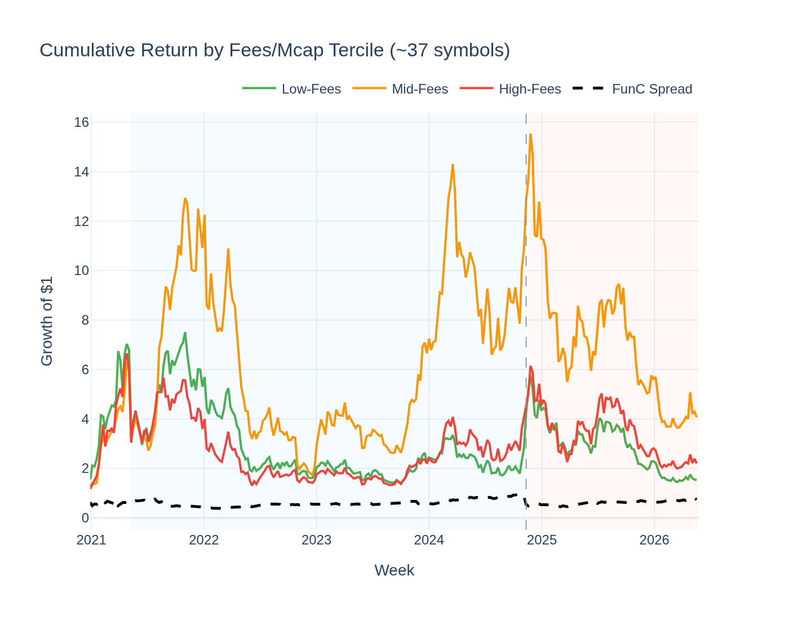
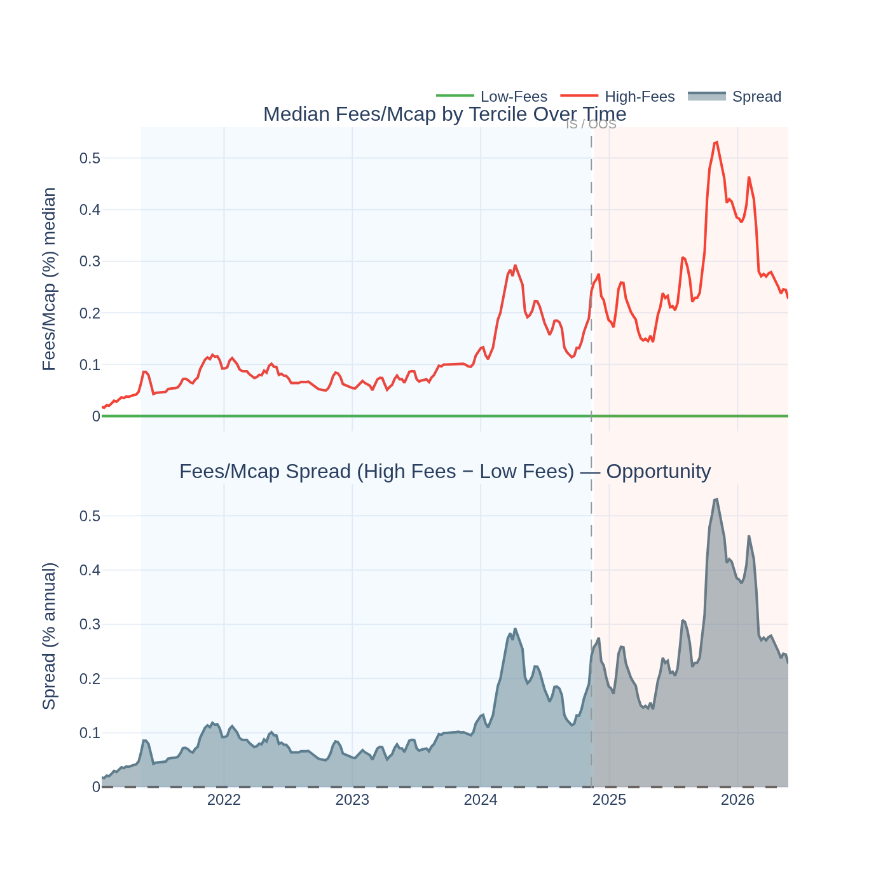

# FunC (Fees/Mcap) Factor — Analysis Report

*Generated by `20_func_visualisation.py` from the Stage-09 5-year panel.*

*Universe note: Only ~37 symbols have fees data (vs ~113 in the full universe).
Results are less stable than price-based factors.*

---

## The Idea in Plain English

In the stock market, a company with a **low P/E ratio** (price divided by earnings) is
considered cheap — you're paying little for each dollar of profit. The same logic
applies to DeFi protocols: a protocol that generates lots of fees relative to its
market capitalisation is essentially "cheap on earnings."

**FunC** (Fundamental Crypto) uses the **fees-to-market-cap ratio** as a value signal:
- **Buy** protocols earning the most fees per dollar of market cap (top 30%)
- **Short** protocols earning the least (bottom 30%)

The idea: the market will eventually recognise that highly profitable protocols are
undervalued and re-rate them upward.

---

## The Short Answer

**Economic-only — compelling theory, inconclusive data.**

The GX pricing model finds λ = **+6.6%/yr, t = +0.40** — directionally
positive (high fees/mcap earns more), but not statistically significant. The
"crypto value" factor exists in theory but cannot be confirmed on the available data.

The main constraints are coverage and data quality: only ~37 symbols have
usable fees data, and protocol fees are often lumpy and seasonal, adding noise that
makes weekly signals unreliable.

---

## The Economic Case (Why It Should Work)

**1. The equity market value premium analogue.**
High earnings yield (E/P) stocks historically outperform low E/P stocks in equities.
If DeFi protocol fees are analogous to corporate earnings, the same mechanism should
apply. The DeFi market would be "inefficient" at pricing in fundamentals.

**2. Fees proxy real usage and economic value.**
A protocol that generates real fees (not incentivised emissions, not wash trading) has
genuine product-market fit. Over time, real usage should be recognised and re-priced.

**3. The competition explicitly rewards fundamental factors.**
The research design rule from the 10-paper review: "Use quality-adjusted Artemis metrics.
Prefer fees/mcap over TVL." FunC is the direct implementation of this rule.

---

## Why It Hasn't Worked Yet

**1. Only ~37 protocols have usable fees data (< 1/3 of the universe).**
The signal is computed over a very thin cross-section. With so few assets per week,
the statistical power to detect a real premium is severely limited.

**2. DeFi fees are lumpy and seasonal.**
Many protocols have fee spikes during high-activity events (airdrops, governance votes,
bull market surges) that don't predict future returns — they just inflate the current
fees/mcap temporarily.

**3. Fee inflation from token emission programmes.**
"Fees" in some protocols include token rewards that are not real economic value. This
contaminates the signal (see Research Design Rule 1: "TVL alone is not alpha; use
quality-adjusted metrics").

**4. The observation window may be too short.**
Value premiums in equity markets took decades to confirm statistically. The 5-year
crypto panel may simply not yet have enough observations to establish significance.

---

## Return Distribution

| Statistic | IS | OOS |
|---|---|---|
| Mean weekly return | 0.242% | 0.450% |
| Std (weekly) | 5.935% | 5.371% |
| Skewness | -2.43 | 0.14 |
| Excess Kurtosis | 16.45 | 0.66 |

---

## Statistical Tests

### Giglio-Xiu Pricing Result

Full GX (K_hidden = 2): **λ = +6.6%/yr, t = +0.40** — not significant.
Directionally positive but underpowered. With a larger universe and longer history,
this might achieve significance. Today it cannot.

### ADF Stationarity Test

- ADF: **-13.668**, p = **0.0000**
- **Stationary**

---

## Visualisations

### Cumulative Return & Weekly IC

### Rolling Mean IC

### Return Distribution

### Rolling Sharpe Ratio

### QQ-Plot vs Normal Distribution

### Fees/Mcap Tercile Returns

### IS vs OOS Dashboard

### Cumulative Return by Fees/Mcap Tercile

### Fees/Mcap Yield Spread Over Time

The top panel shows median fees/mcap for the high-fee and low-fee terciles over time.
The bottom panel shows the spread — when it is wide, there is more cross-sectional
variation in protocol earnings, and the factor has more "information" to work with.
Periods of wide spread are the most important for assessing whether the value premium
is real.
