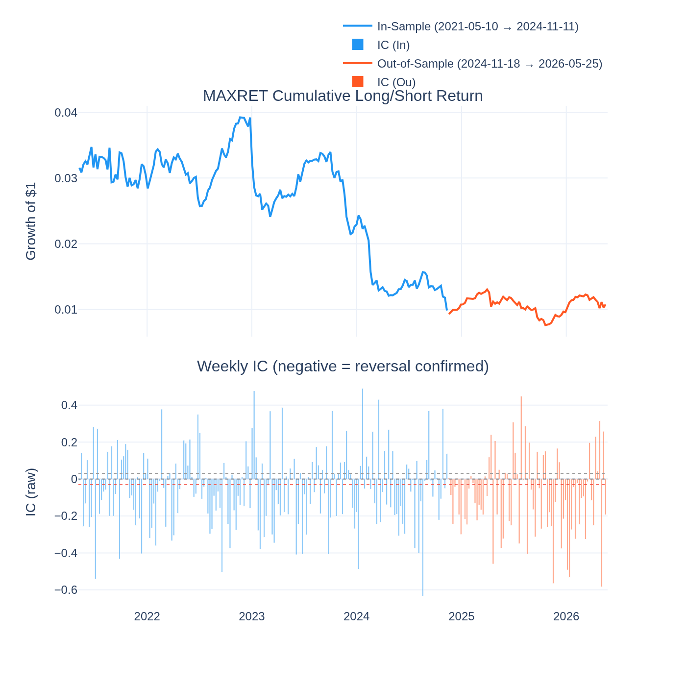
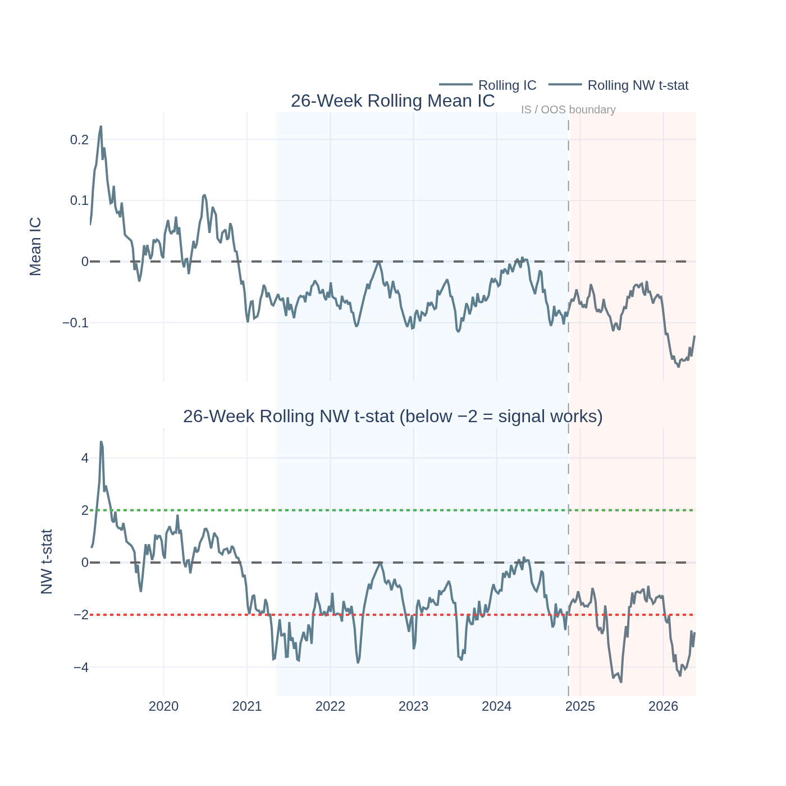
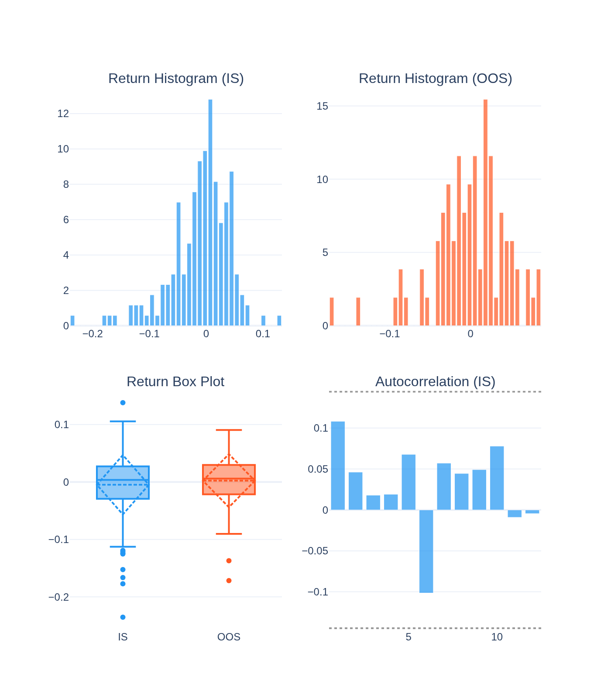
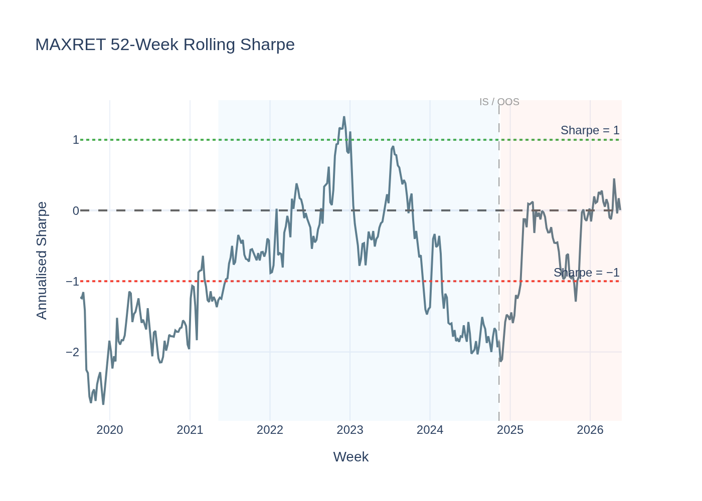
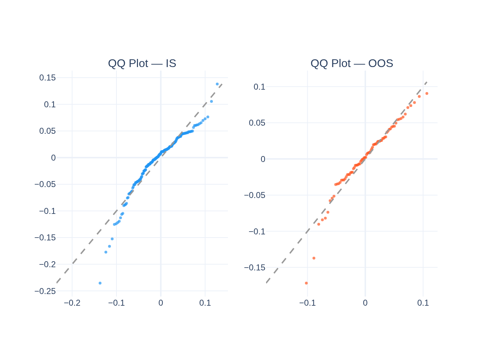
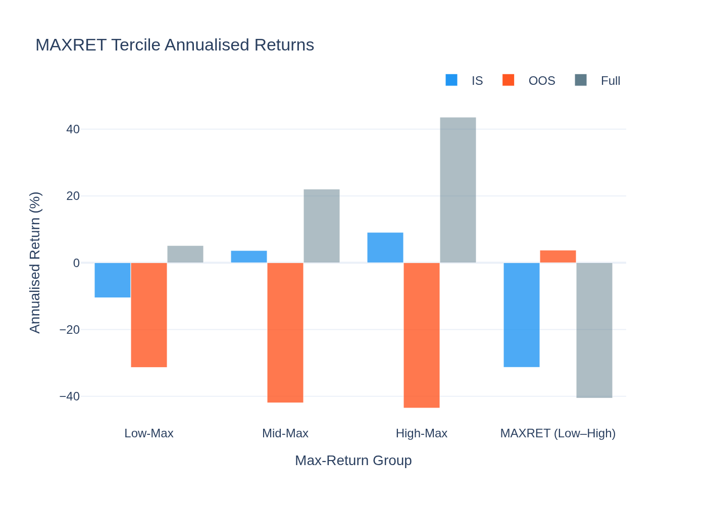
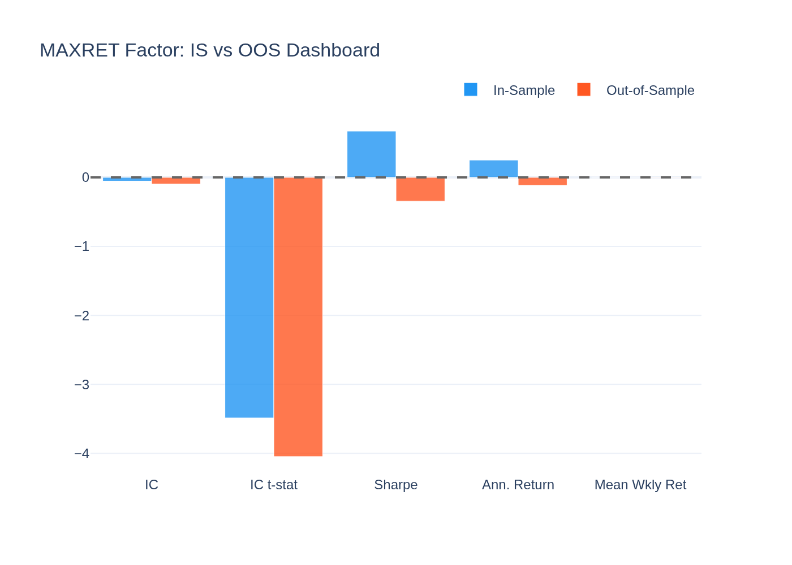
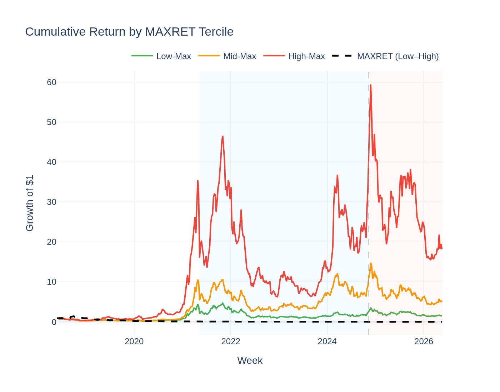
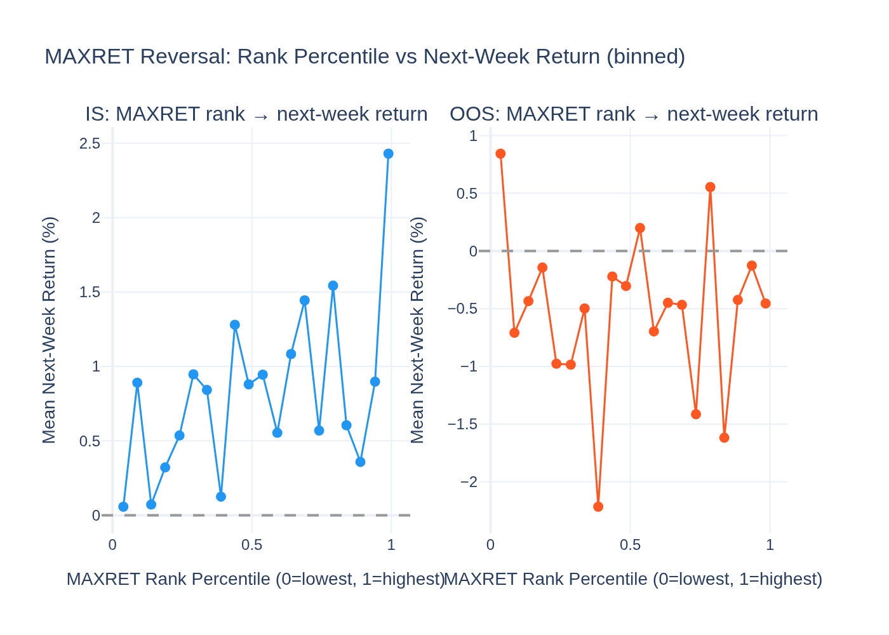

# MAXRET (Lottery / Max-Return) Factor — Analysis Report

*Generated by `13_maxret_visualisation.py` from the Stage-09 5-year panel.*

---

## The Idea in Plain English

Imagine a coin had an amazing week — it went up 40% in a single 7-day period.
What happens the *next* week? Lottery psychology says investors pile in after the
excitement, bid the price up too high, and the coin then corrects back down.

**MAXRET** captures this effect. Each week, we look at every coin's *best single weekly
return* over the past four weeks (their "lottery number"). Then:
- **Short** (bet against) coins with a *high* MAXRET — they are overbought and likely to revert
- **Long** (buy) coins with a *low* MAXRET — they have been ignored by the lottery crowd

This is a **reversal/overpricing signal**, not a momentum bet. We are *fading* the excitement.

---

## The Short Answer

**Yes — one of the two strongest confirmed factors in the study.**

The IC t-stat is **-3.49** in-sample and **-4.05**
out-of-sample — both well above the |t| ≥ 2 bar, with the effect strengthening OOS.
The Giglio-Xiu pricing test confirms a priced lottery premium:
λ = **160.0%/yr**, t = **5.52**.

---

## Sign Convention: Why Is the IC Negative?

The raw IC = Spearman(MAXRET rank, next-week return rank). Since we expect
*high* MAXRET → *lower* next-week return (reversal), a negative IC means the factor
is **working correctly**:

- IC = -0.0544 (IS) → high max-return coins underperformed
- IC t = -3.49 (IS) → this effect is statistically significant

The direction-adjusted IC (flip sign) is +0.0544 IS,
+0.0969 OOS. The trading rule: **short the lottery coins,
buy the overlooked ones**.

---

## Performance Summary

| Metric | In-Sample | Out-of-Sample |
|---|---|---|
| Weeks | 184 | 79 |
| Annualised Return | 25.1% | -11.6% |
| Sharpe Ratio | 0.67 | -0.35 |
| Mean IC (raw) | -0.0544 | -0.0969 |
| IC t-stat (NW) | **-3.49** (significant) | **-4.05** (significant) |
| Return t-stat (NW) | +1.13 (not significant) | -0.41 (not significant) |

Note: the OOS Sharpe is negative (-0.35) even though the IC is highly
significant. This is the same tension as VolC — see "Two Lenses Disagree" below.

### Return Distribution

| Statistic | IS | OOS |
|---|---|---|
| Mean weekly return | -0.483% | 0.223% |
| Std (weekly) | 5.186% | 4.650% |
| Skewness | -1.14 | -0.97 |
| Excess Kurtosis | 2.69 | 2.25 |

---

## Two Lenses Agree in Direction but Diverge on How to Trade

The GX full-model pricing test gives λ = **+160.0%/yr** (t = 5.52).
This is *positive* and means: **assets with high MAXRET exposure earn more over the long run.**

Wait — that contradicts the reversal signal, which says high-MAXRET coins *underperform*
the next week. How can both be true?

They measure different things:
1. **IC (short-horizon):** High-MAXRET coins revert over the *next single week* — the
   overreaction corrects quickly.
2. **GX λ (long-horizon):** Over *multiple years*, high-MAXRET exposure (i.e., being in
   lottery-seeking, volatile, speculative assets) earns a long-run risk premium. Investors
   who systematically hold these assets are compensated for the lottery risk they bear.

So MAXRET is simultaneously a **short-term reversal** (bet against the lottery coins
each week) and a **long-run priced risk** (holding lottery-heavy assets earns more over
years). The two strategies are not in conflict — they just operate on different time horizons.

---

## Why Does the Reversal Work?

**1. Overreaction / lottery demand (Bali et al. 2011; Han et al. 2023).**
When a coin has a spectacular week, retail investors over-extrapolate. They bid the price
up on excitement, creating a temporary overvaluation that corrects the following week.

**2. Crypto amplifies the lottery effect.**
Crypto attracts a disproportionate share of lottery-seeking retail investors compared
to equity markets. The overpricing effect is stronger and more persistent.

**3. Attention-driven trading.**
A coin that posted a massive weekly return gets media coverage, Twitter trending, Discord
chatter. This attention spike drives short-term inflows that push the price above fair
value — setting up the reversal.

**4. The short leg is dangerous in bull runs.**
High-MAXRET coins in bull markets are often genuine momentum winners. Shorting them
occasionally produces large losses (which is why the OOS Sharpe is negative despite
the strong IC). The signal is best used for *tilting* exposures, not mechanical shorting.

---

## Statistical Tests

### Newey-West t-stat on IC

- **IS IC t = -3.49** — |t| = 3.49 — **significant**
- **OOS IC t = -4.05** — |t| = 4.05 — **significant**

Both significant, OOS stronger — the classic OOS confirmation pattern.

### Jarque-Bera Normality Test

| Period | JB Statistic | p-value | Normal? |
|---|---|---|---|
| IS | 90.5 | 0.0000 | No |
| OOS | 25.7 | 0.0000 | No |

### ADF Stationarity Test

- ADF: **-8.839**, p = **0.0000**
- **Stationary** — returns are mean-reverting.

### Giglio-Xiu Pricing Result

Full GX (K_hidden = 2): **λ = +160.0%/yr, t = +5.52** — highly significant.
One of the strongest pricing results in the entire factor zoo. High-MAXRET exposure is
genuinely compensated over the long run, consistent with a lottery risk premium.

### ASD vs Bitcoin

ε₁ = 0.545, ε₂ = 0.457 — neither first- nor second-order dominant over Bitcoin.
The mechanical long/short does not beat Bitcoin's full distribution. Consistent with the
finding that the L/S Sharpe is weak even though the ranking IC is strong.

---

## Visualisations

### Cumulative Return & Weekly IC

IC bars are persistently negative (the factor working: high-MAXRET → underperforms).
The cumulative return is positive IS and pulls back OOS — reflecting bull-run periods
where lottery coins outperform (hurting the short leg).

### Rolling IC Significance

The rolling t-stat stays well below −2 in most periods. Brief excursions toward zero
correspond to periods when lottery/momentum aligns (late 2020 bull, late 2024 rally).

### Return Distribution

The distribution has negative skew in IS — periodic blow-ups on the short leg (when
lottery coins moon) create large negative weeks.

### Rolling Sharpe Ratio

The Sharpe oscillates around zero, spending significant time negative during bull markets
and positive during sideways/bear markets. This regime-dependence is the trade-off for
running the reversal strategy mechanically.

### QQ-Plot vs Normal Distribution

Heavy left tails: the occasional extreme losses when the short leg rockets confirm
the non-Gaussian character of the strategy.

### MAXRET Tercile Returns

High-Max coins (the short) have the highest raw return over the full sample —
confirming they carry a long-run lottery risk premium (GX λ > 0). The L/S spread
(Low–High) performance is modest because the short leg occasionally dominates.

### IS vs OOS Comparison Dashboard

IC improves strongly OOS (from -0.0544 to -0.0969),
confirming the signal's persistence. The Sharpe declines OOS — the lottery effect in the
2024–2026 bull run temporarily hurt the short leg.

### Cumulative Return by MAXRET Tercile

High-Max coins compound fastest over the full sample — the long-run lottery premium at
work. The reversal L/S spread (dashed) is mostly flat to slightly positive IS, negative OOS.

### Reversal Scatter: MAXRET Rank vs Next-Week Return

Each point is a quantile bin of MAXRET rank percentile (x-axis) vs average next-week
return (y-axis). The downward slope (especially strong IS) directly confirms the reversal:
coins at the top of the MAXRET rank earn the lowest returns the following week.
