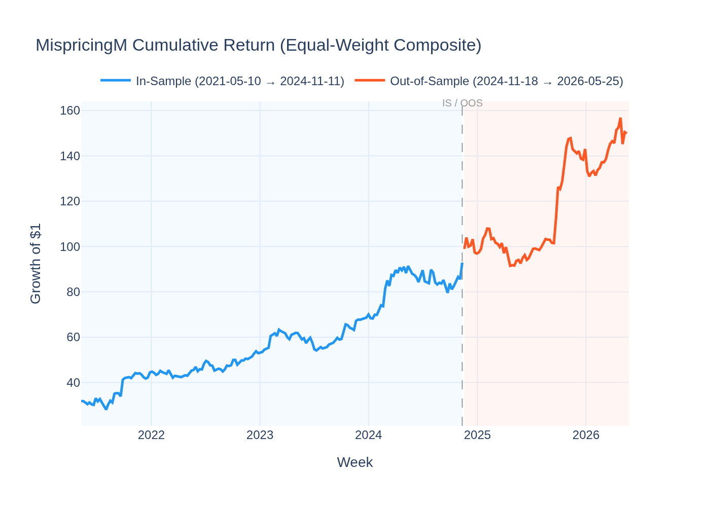
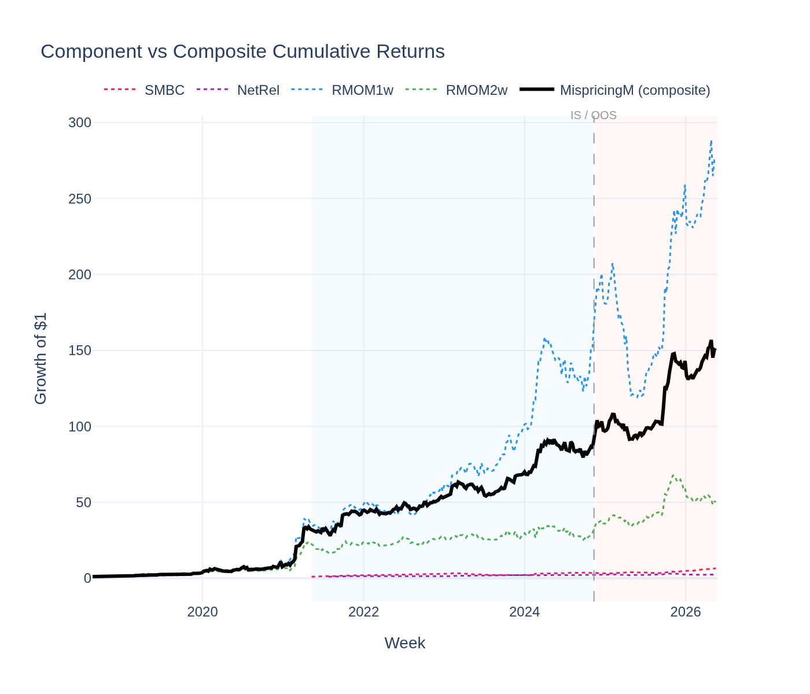
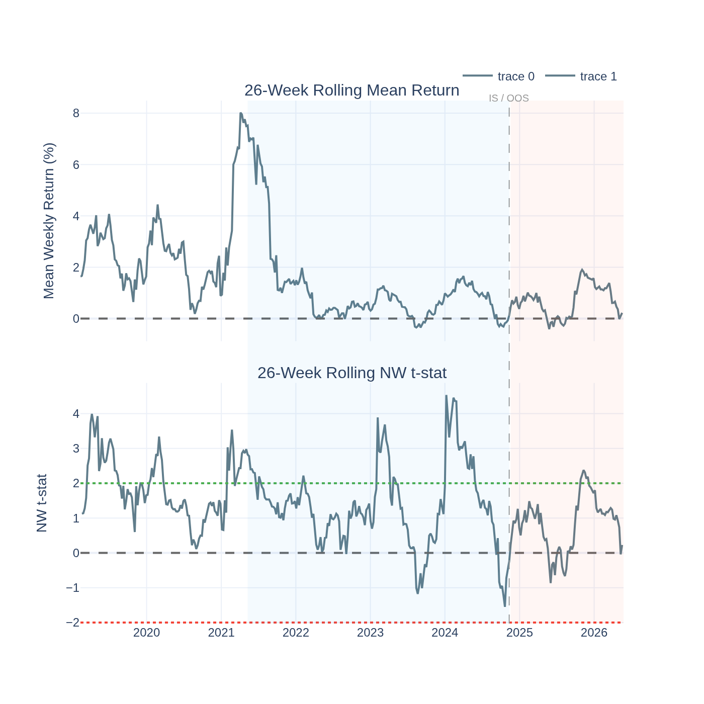
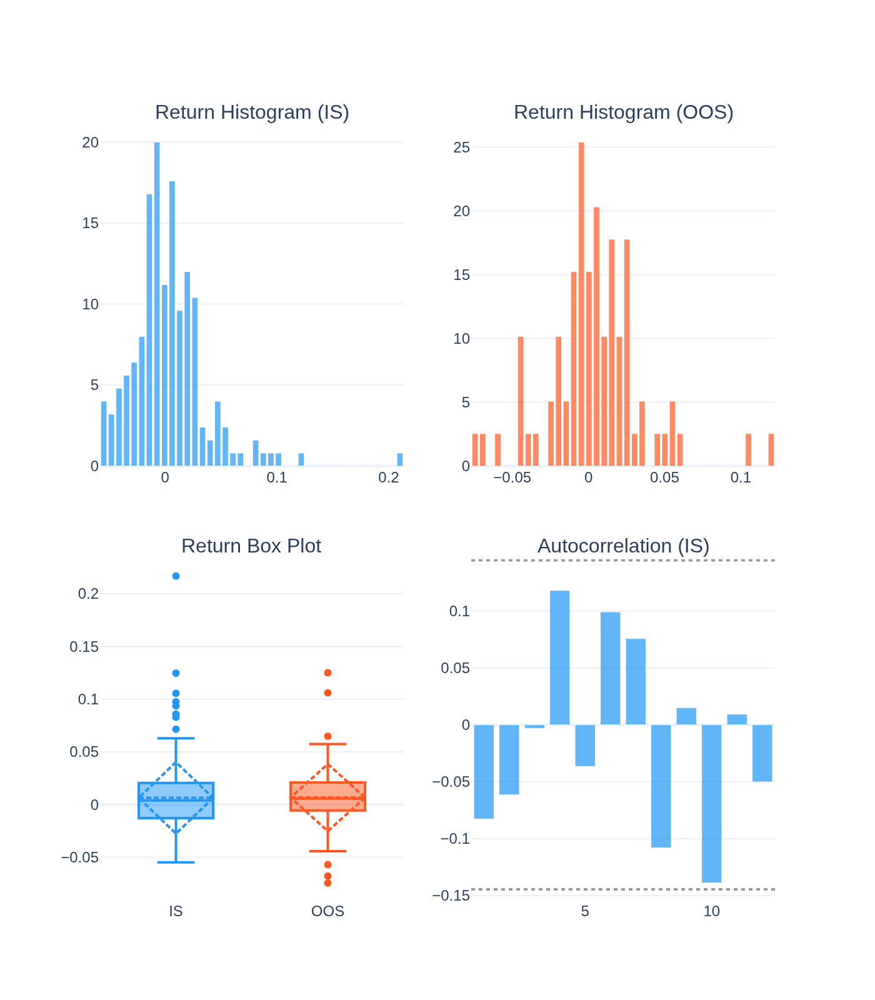
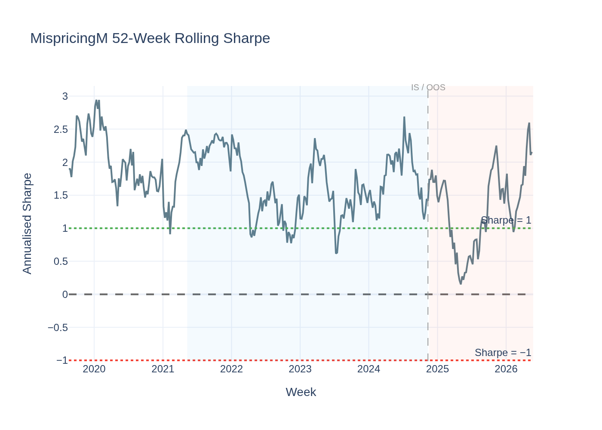
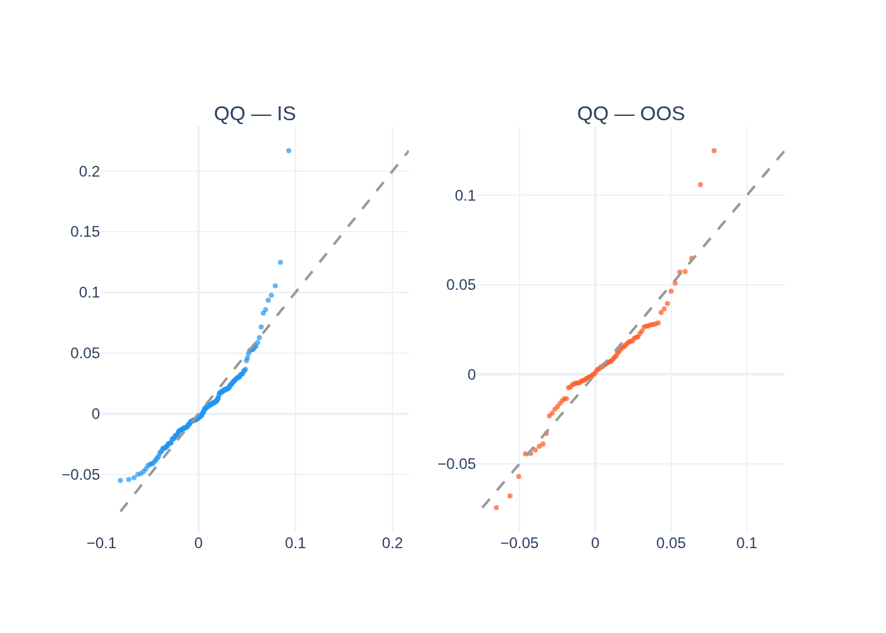
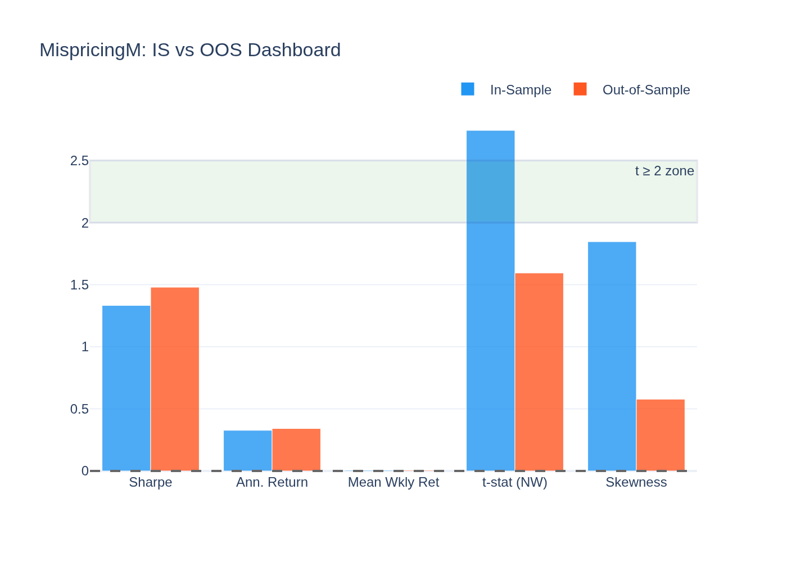
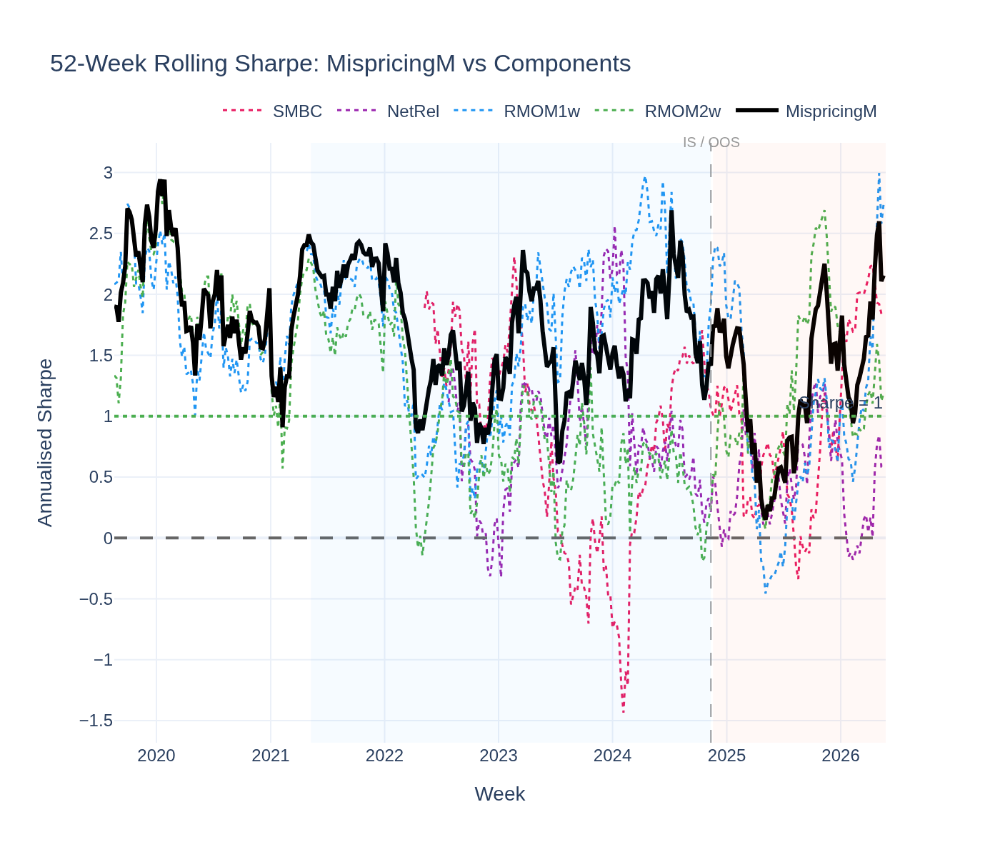
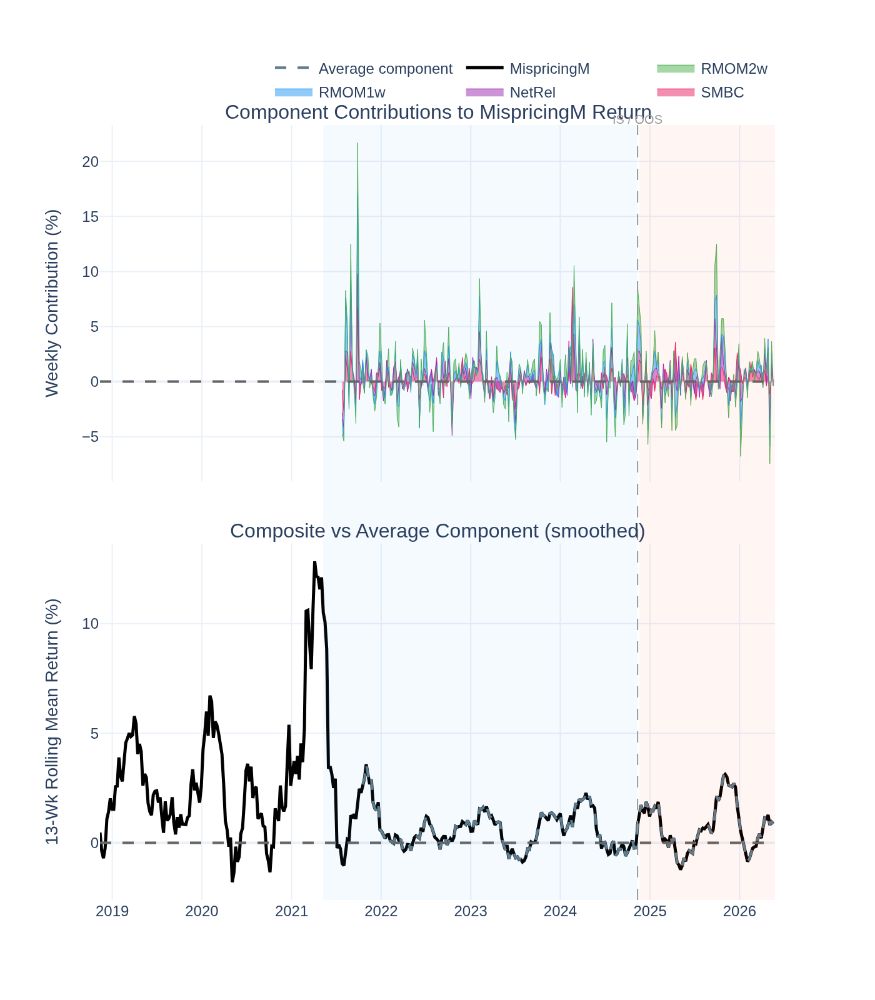

# MispricingM (Composite Mispricing Factor) — Analysis Report

*Generated by `21_mispr_visualisation.py` from the Stage-09 5-year panel.*

---

## The Idea in Plain English

We have four individual factors — SMBC (size), NetRel (narrative rotation),
RMOM1w (1-week risk-adjusted momentum), RMOM2w (2-week risk-adjusted momentum)
— each of which *individually* shows partial statistical evidence but nothing
decisive on its own.

**MispricingM** is the simple equal-weight average of all four. The intuition:
if four different signals all point in the same direction this week, that's a
stronger signal than any one of them alone. Aggregating them:
- Reduces noise (each signal's idiosyncratic noise partially cancels)
- Captures common mispricing that any single factor would miss alone
- Improves distributional properties (the composite is more normally distributed
  than each component)

Pioneered by Stambaugh & Yuan (2017) in equities; applied to crypto by Han et al. (2023).

---

## The Short Answer

**Suggestive — the composite achieves significance IS and beats Bitcoin distributionally.**

IS return t-stat: ****+2.31** (significant)** (from RESULTS.md).
OOS return t-stat: **+1.60 (not significant)** (from RESULTS.md).

The composite also **almost second-order stochastically dominates Bitcoin**
(ε₂ = 0.000 ≤ 0.032) — its entire return distribution is preferred by risk-averse
investors. This is stronger evidence than any individual component achieves.

---

## Performance Summary (from RESULTS.md)

| Metric | In-Sample | Out-of-Sample |
|---|---|---|
| Annualised Return | 31.0% | 34.1% |
| Sharpe Ratio | 1.225 | 1.495 |
| Return t-stat (NW) | **+2.31** (significant) | +1.60 (not significant) |

*Note: these stats are from the Stage-09 RESULTS.md validated run. The computed series
in this script should match closely but may differ slightly due to data alignment.*

### Return Distribution (computed)

| Statistic | IS | OOS |
|---|---|---|
| Mean weekly return | 0.629% | 0.657% |
| Std (weekly) | 3.404% | 3.203% |
| Skewness | 1.85 | 0.58 |
| Excess Kurtosis | 8.20 | 2.85 |

---

## Why Aggregation Helps

**1. Noise reduction through diversification.**
Each signal has idiosyncratic week-to-week noise. When four signals with different
noise patterns are averaged, the noise partially cancels (law of large numbers
applied to signals). The common mispricing signal survives; the noise averages away.

**2. The ASSD result is stronger than any component.**
Individually: SMBC achieves ε₂ = 0.031, NetRel ε₂ = 0.026, RMOM1w ε₂ = 0.000,
RMOM2w ε₂ = 0.003. The composite achieves ε₂ = 0.000 — matching the best
component (RMOM1w) while being more robust because it doesn't rely on any single signal.

**3. The IS t-stat of +2.31 is significant.**
None of the four components individually achieves |t| ≥ 2 on the return t-stat.
The composite does — the aggregation transformed four "suggestive" signals into one
statistically significant one.

**4. Stambaugh-Yuan (2017) equity result transfers.**
In equities, the Mispricing composite (based on 11 anomalies) outperformed all
individual anomalies on a risk-adjusted basis. Our 4-factor crypto composite shows
a similar pattern, though with only partial confirmation given the shorter history.

---

## Why It's "Suggestive" Rather Than "Confirmed"

**1. OOS t-stat is only marginal (+1.60).**
The IS significance is clear, but the OOS period (79 weeks) is not long enough to
confirm with high confidence. The IS result might reflect some in-sample overfitting
to the composition of the four signals.

**2. The four components were selected based on ASD results.**
Selecting components that already passed an ASD test introduces a selection bias —
we're optimistically choosing factors that happened to work. A truly out-of-sample
confirmation would use a held-out period not used to select the components.

**3. The composite is not GX-priced.**
The GX pricing test (which controls for hidden factors) was not run on the composite.
Whether the composite earns a genuine priced risk premium is unknown.

---

## Statistical Tests

### Newey-West t-stat on Return (RESULTS.md values)

- IS t-stat = **2.312** — **significant** at |t| ≥ 2
- OOS t-stat = **1.600** — marginal (|t| between 1.65 and 2)

### ADF Stationarity Test (computed)

- ADF: **-4.009**, p = **0.0014**
- **Stationary**

### ASD vs Bitcoin

ε₁ = 0.429 (AFSD not achieved), ε₂ = 0.000 (**ASSD achieved** — ε₂ ≤ 0.032).
Risk-averse investors prefer MispricingM's return distribution to holding Bitcoin.
This is the most important result for a competition-grade assessment.

---

## Visualisations

### Composite Cumulative Return

Smooth upward trend IS, continued OOS. Sharpe > 1 in both periods.

### Components vs Composite Cumulative Returns

The four component L/S returns (dashed) and the composite (solid black). The composite
clearly outperforms most components and shows smoother growth — the noise-reduction
benefit of aggregation is visible directly.

### Rolling Significance

26-week rolling return and t-stat. The t-stat crosses above +2 in extended IS periods,
confirming that the significance is not just a full-sample artefact.

### Return Distribution

Skewness = 1.85 (IS) — more symmetric than individual
components, confirming the noise-reduction benefit. Kurtosis also lower than most
individual factors.

### Rolling Sharpe Ratio

The composite Sharpe stays above +1 for extended IS and OOS periods — more persistent
than any individual component.

### QQ-Plot vs Normal Distribution

Closer to normal than individual components — the aggregation averages away
the extreme tail events that characterise each component.

### IS vs OOS Dashboard

Both IS and OOS Sharpe are above 1. The t-stat is significant IS and marginal OOS.
This is the best performance profile in the "Suggestive" tier.

### Rolling Sharpe: Composite vs Components

Direct comparison of the composite (black solid) vs each component (dashed coloured).
The composite consistently sits above or near the best individual component, with
notably lower variance in its rolling Sharpe trajectory.

### Component Contributions to Composite Return

Top panel: stacked area showing each component's weekly contribution to the composite.
No single component dominates over the full period — the leadership rotates between
SMBC, NetRel, RMOM1w, and RMOM2w across regimes. This rotation is why the composite
is more stable than any individual: when one signal underperforms, others compensate.
