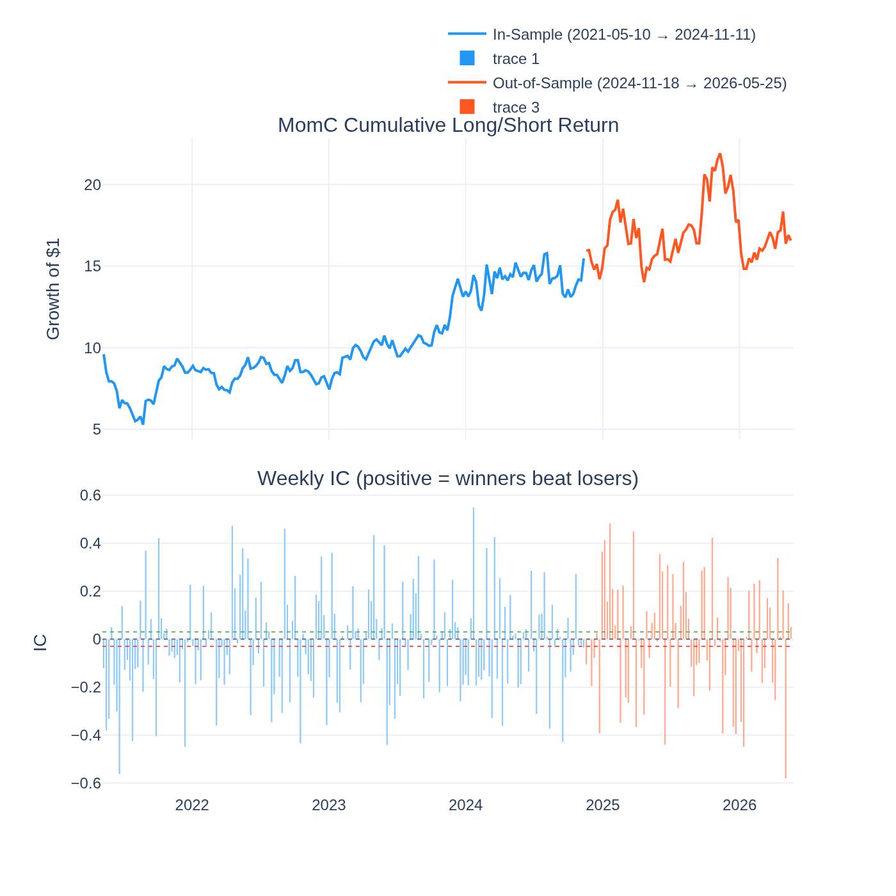
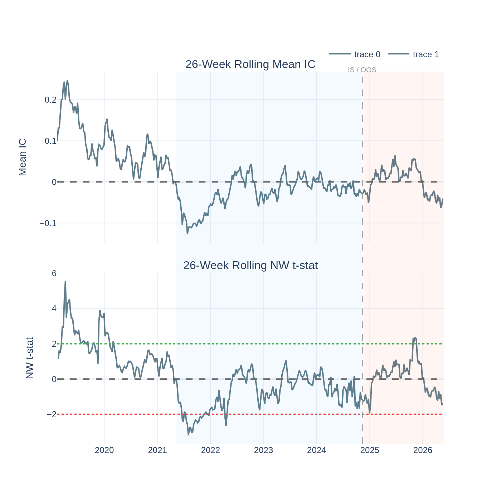
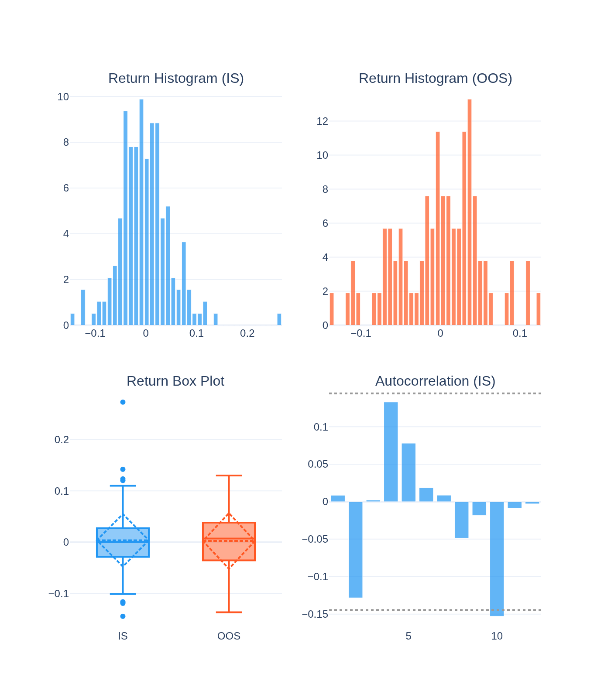
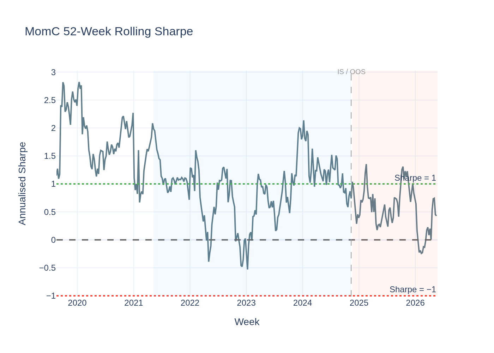
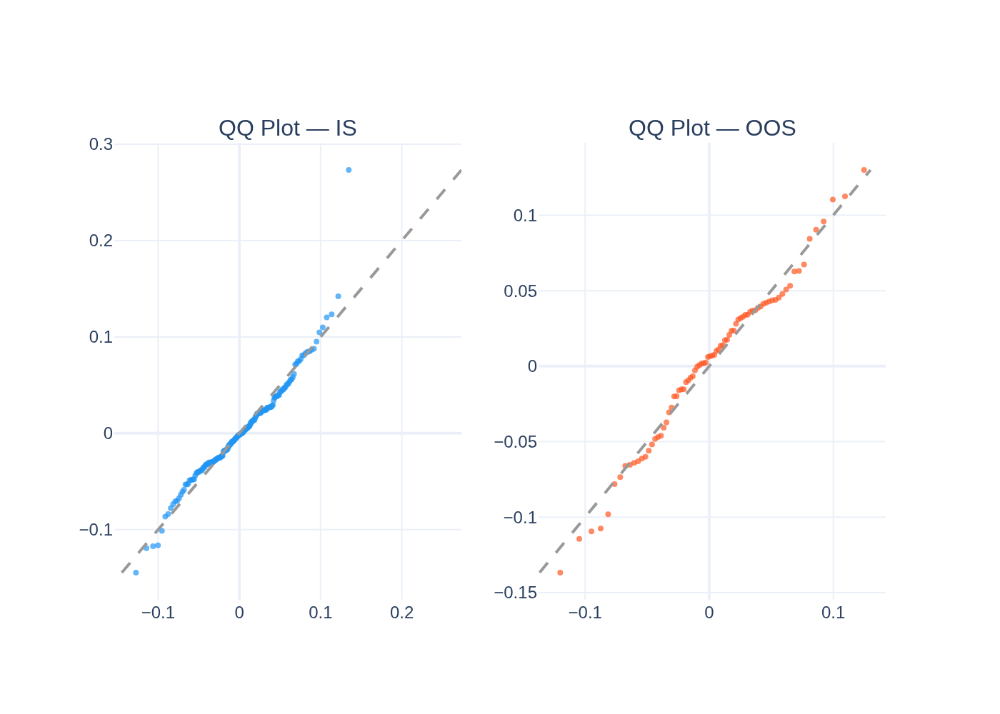
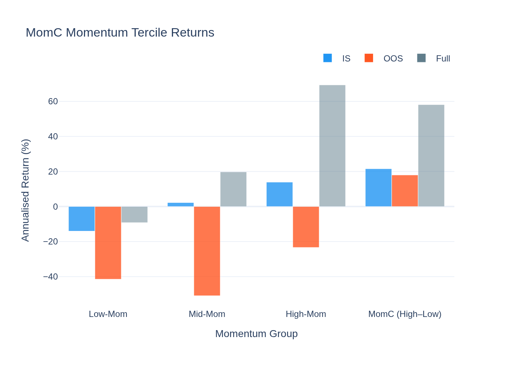
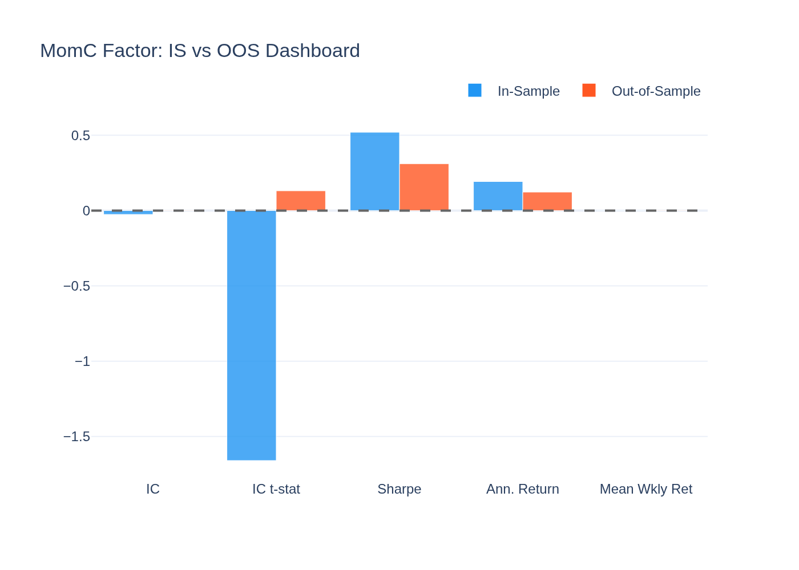
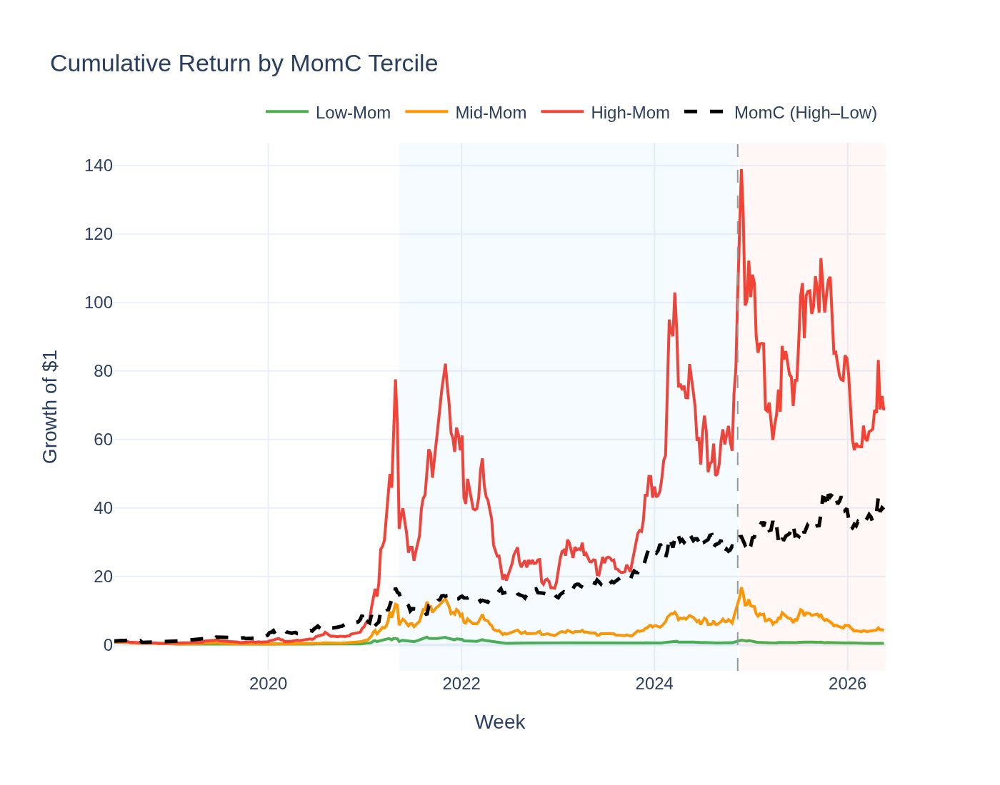
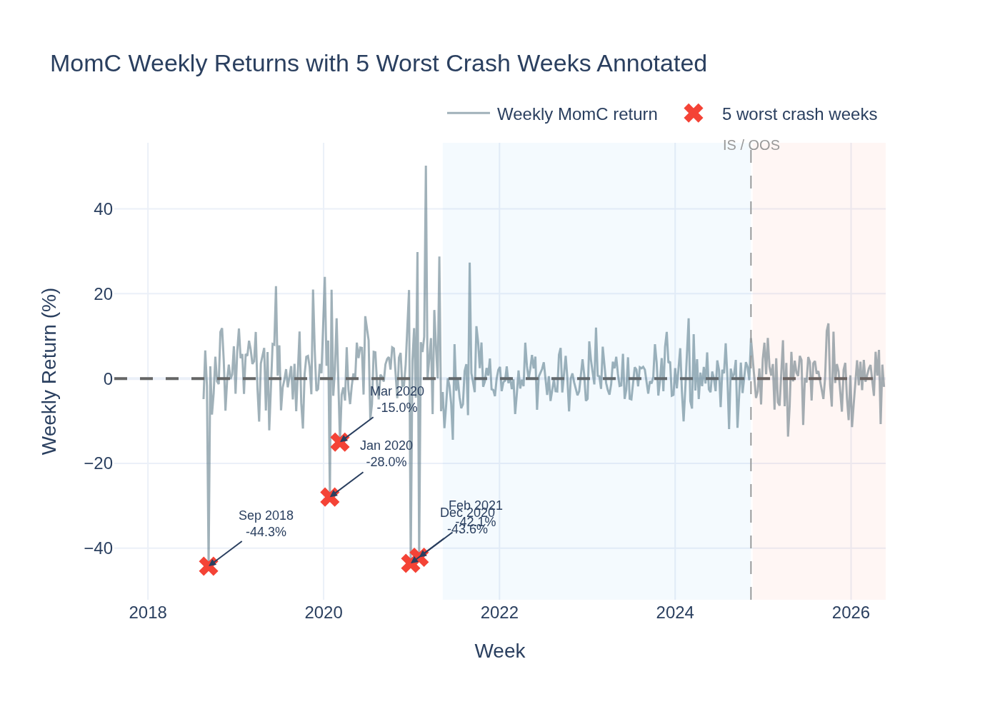

# MomC (4-Week Raw Momentum) Factor — Analysis Report

*Generated by `14_momc_visualisation.py` from the Stage-09 5-year panel.*

---

## The Idea in Plain English

Momentum is one of the most famous findings in financial research: assets that have
been going up tend to keep going up, and assets that have been going down tend to keep
going down. The idea is that investors under-react to good news — they are slow to buy
winners — so the price continues rising even after the news is out.

**MomC** tests this in crypto. Each week:
- **Buy** (go long) coins that gained the most in the past 4 weeks (the top 30% by return)
- **Short-sell** (go short) coins that fell the most (the bottom 30% by return)

---

## The Short Answer

**Not supported — momentum is unreliable and reverses in crypto.**

The IC t-stat is **-1.66** in-sample (slightly negative = winners
*underperformed*, a short-term reversal) and only **0.13** out-of-sample
(basically zero). The GX pricing model finds no priced momentum premium
(λ = -3.3%/yr, t = -0.10).

Momentum fails where it matters most: crypto regimes shift fast, and yesterday's winner
is often tomorrow's mean-reverter.

---

## The IC Sign: A Short-Term Reversal

The IC for MomC is slightly *negative* in-sample (−0.026, t = -1.66).
This means high-momentum coins *underperformed* in the following week — a reversal.

But the effect is small and barely significant (|t| = 1.66 < 2).
Out-of-sample the IC is essentially zero (+0.0034, t = 0.13).
There is no consistent signal in either direction.

Compare to risk-adjusted momentum (RMOM1w): by dividing the return signal by volatility,
RMOM1w avoids many of the large-variance crash weeks that destroy raw momentum. The failure
of MomC versus the partial success of RMOM is itself the key lesson.

---

## Performance Summary

| Metric | In-Sample | Out-of-Sample |
|---|---|---|
| Weeks | 184 | 79 |
| Annualised Return | 19.3% | 12.3% |
| Sharpe Ratio | 0.52 | 0.31 |
| Mean IC | -0.0257 | 0.0034 |
| IC t-stat (NW) | -1.66 (marginal) | +0.13 (not significant) |
| Return t-stat (NW) | +1.02 (not significant) | +0.42 (not significant) |

### Return Distribution

| Statistic | IS | OOS |
|---|---|---|
| Mean weekly return | 0.370% | 0.236% |
| Std (weekly) | 5.139% | 5.464% |
| Skewness | 0.77 | -0.25 |
| Excess Kurtosis | 3.90 | 0.02 |

---

## Why Momentum Fails in Crypto

**1. Regime reversals are fast and brutal.**
Crypto markets don't trend gradually — they moon and crash. A coin up 40% in 4 weeks
is often near a local top. The very signal that makes it a "winner" in the formation
period makes it vulnerable to profit-taking the next week.

**2. Fat tails dominate the return distribution.**
Momentum crashes in equities are well-known (Barroso-Santa Clara 2015). In crypto they
are *worse*: the kurtosis of the IS return series is 3.90 — extreme
weeks (big crashes of the short leg, or winners suddenly reversing) swamp the signal.

**3. The formation window is too short for crypto.**
A 4-week return in crypto reflects noise and luck as much as genuine trend. Longer windows
(8–13 weeks) or vol-normalized signals (RMOM) are more robust.

**4. 2022 bear market crushed momentum.**
Rising-rate environments historically break momentum strategies. Crypto's 2022 collapse
(BTC −65%, many alts −90%) happened simultaneously across all prior winners — the short
leg rocketed (leveraged longs forced to sell), devastating the L/S spread.

**The worst crash weeks:**
- **2018-09-10**: -44.3%
- **2020-12-28**: -43.6%
- **2021-02-01**: -42.1%
- **2020-01-27**: -28.0%
- **2020-03-09**: -15.0%

---

## Statistical Tests

### Newey-West t-stat on IC

- **IS IC t = -1.66** — |t| = 1.66 — borderline/not significant
- **OOS IC t = 0.13** — |t| = 0.13 — not significant

In IS the IC is slightly negative (reversal). OOS it flips to barely positive. Neither
is convincing — the factor has no reliable direction over the 5-year period.

### Jarque-Bera Normality Test

| Period | JB Statistic | p-value | Normal? |
|---|---|---|---|
| IS | 126.4 | 0.0000 | No |
| OOS | 0.8 | 0.6790 | Yes |

### ADF Stationarity Test

- ADF: **-6.647**, p = **0.0000**
- **Stationary**

### Giglio-Xiu Pricing Result

Full GX (K_hidden = 2): **λ = -3.3%/yr, t = -0.10** — not significant.
Raw momentum is not a priced systematic risk in the 5-year crypto panel. This aligns
with the equity literature where momentum premia are highly conditional and crash-prone.

### ASD vs Bitcoin

ε₁ = 0.474, ε₂ = 0.208 — neither first- nor second-order dominant over
Bitcoin. MomC cannot beat Bitcoin's full return distribution. Holding BTC is distribu-
tionally better than running this L/S strategy.

---

## Visualisations

### Cumulative Return & Weekly IC

The cumulative return is positive IS (weak but present) and essentially flat OOS. The
IC bars oscillate with no consistent sign — some weeks are positive (trend), some negative
(reversal), with no dominant direction over 5 years.

### Rolling IC Significance

The rolling t-stat dips below −2 briefly IS (the reversal regime) but crosses zero and
turns faintly positive by OOS. The lack of any stable side of the ±2 boundaries is
the clearest visual evidence that the factor is unreliable.

### Return Distribution

Positive skew (IS skewness = 0.77) — occasional large positive weeks
when trend briefly asserts itself. Moderate kurtosis from crash weeks.

### Rolling Sharpe Ratio

The Sharpe frequently crosses zero in both directions, spending time above +1 in some
periods and below −1 in others. No persistent positive regime.

### QQ-Plot vs Normal Distribution

Fat tails in both directions — both the crash weeks and the momentum-working weeks
deviate from normal, making statistical inference noisy.

### Momentum Tercile Returns

In many sub-periods, the "High-Mom" tercile (the expected long leg) does NOT
outperform the "Low-Mom" tercile. The spread is near zero across the full sample.

### IS vs OOS Comparison Dashboard

IC flips from slightly negative IS to slightly positive OOS — neither significant.
Sharpe drops from IS to OOS, confirming no persistent premium.

### Cumulative Return by Momentum Tercile

All three terciles broadly track each other with no systematic separation between
high-momentum and low-momentum coins over the full 5-year sample.

### MomC Crash Anatomy

The 5 worst single weeks for the MomC L/S strategy are annotated with dates and
magnitudes. These crash weeks tend to cluster around major market turning points —
confirming that momentum fails hardest precisely when it's most needed.
