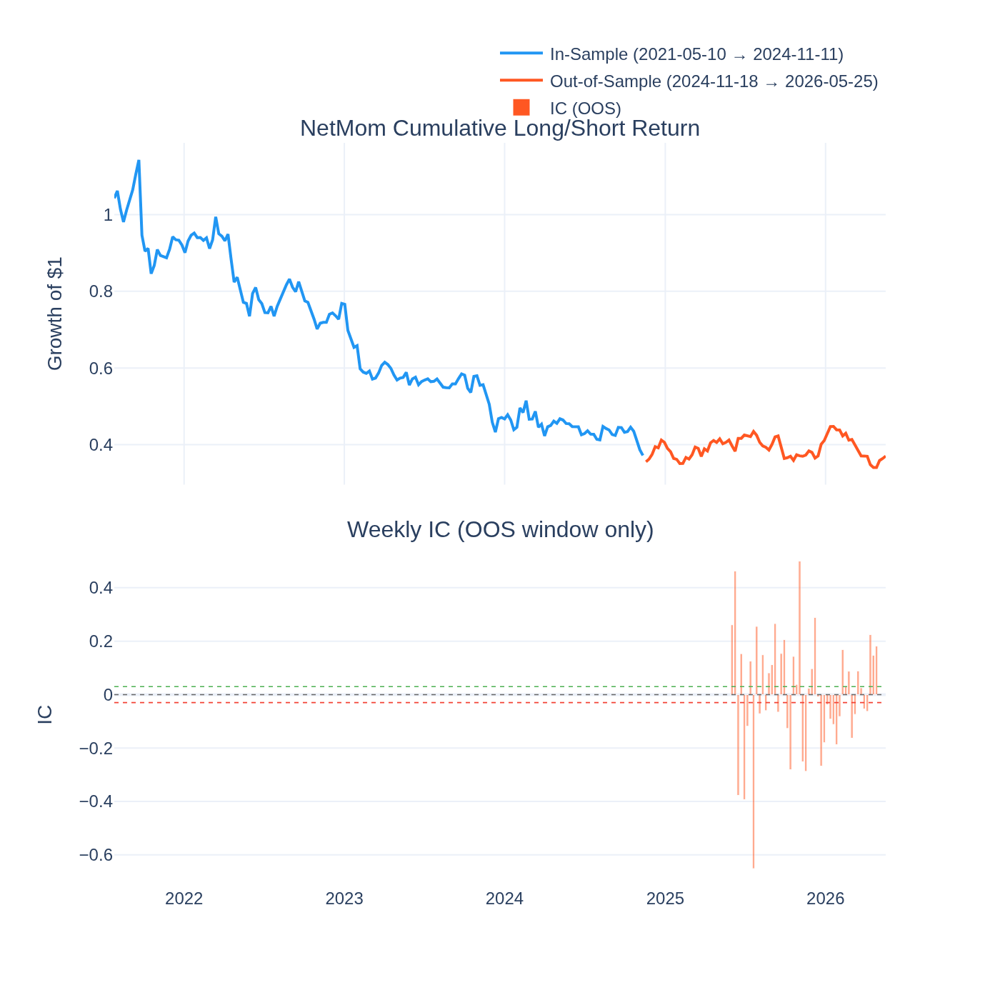
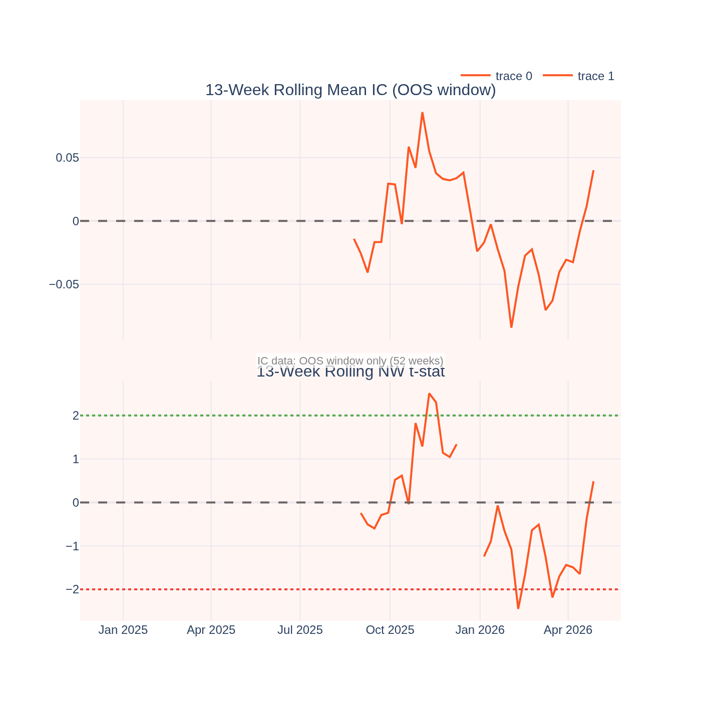
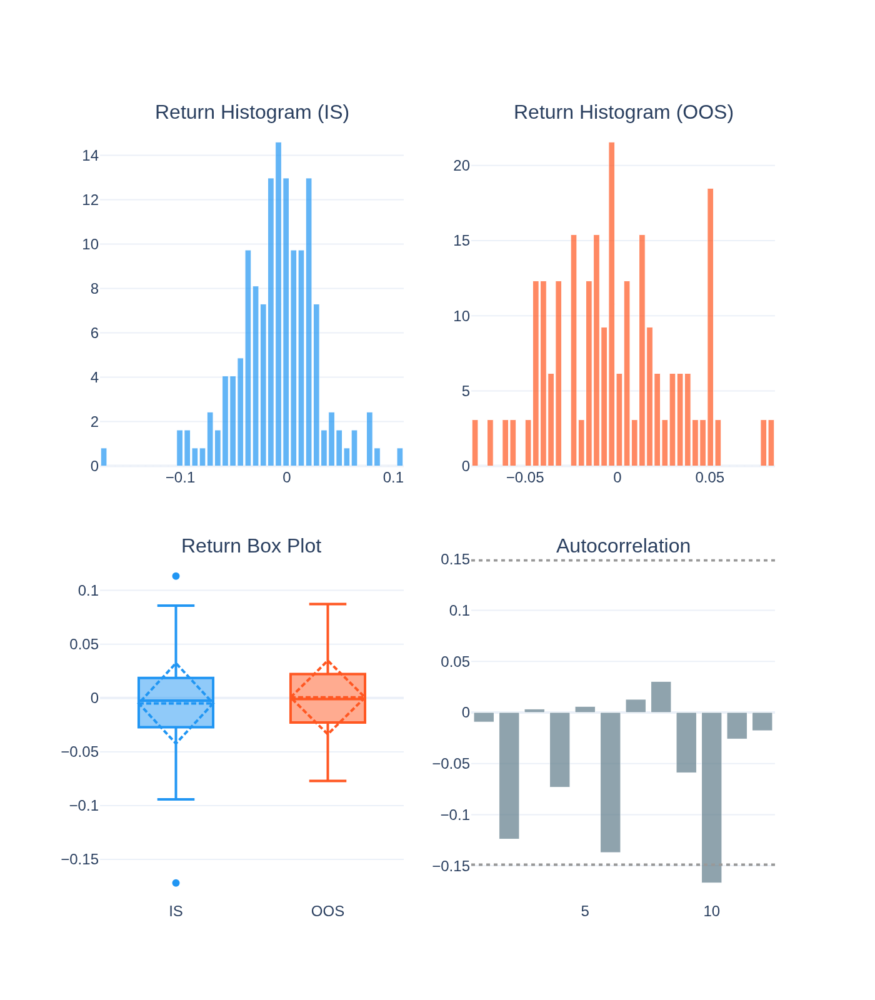
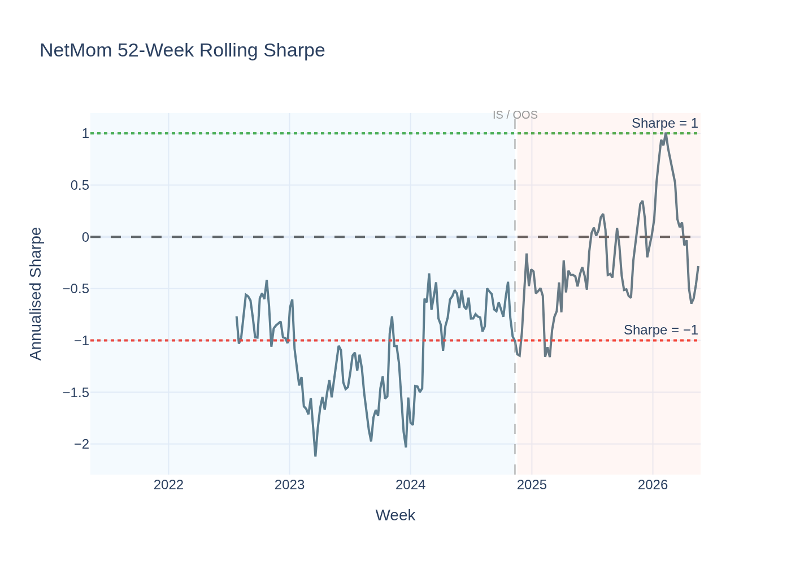
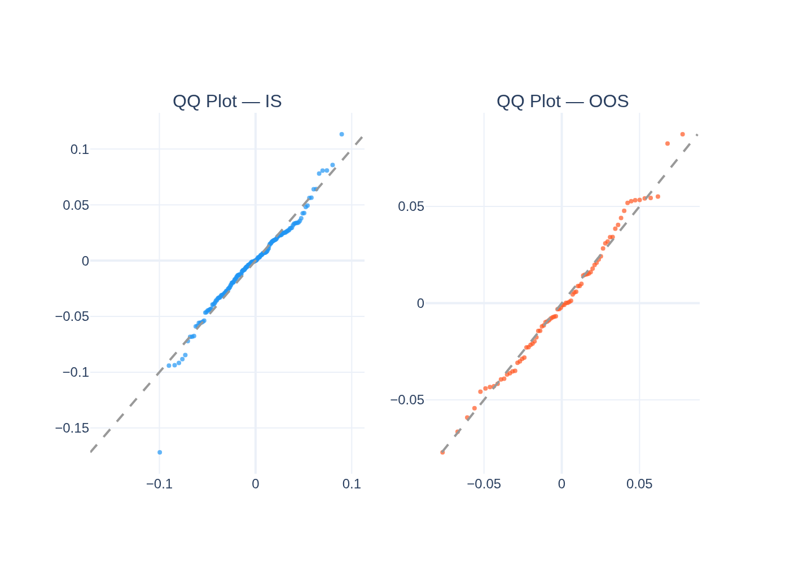
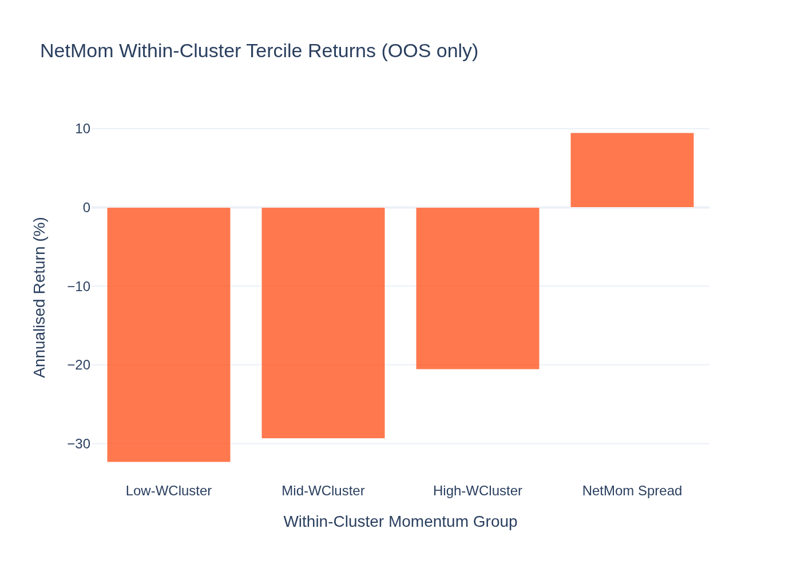
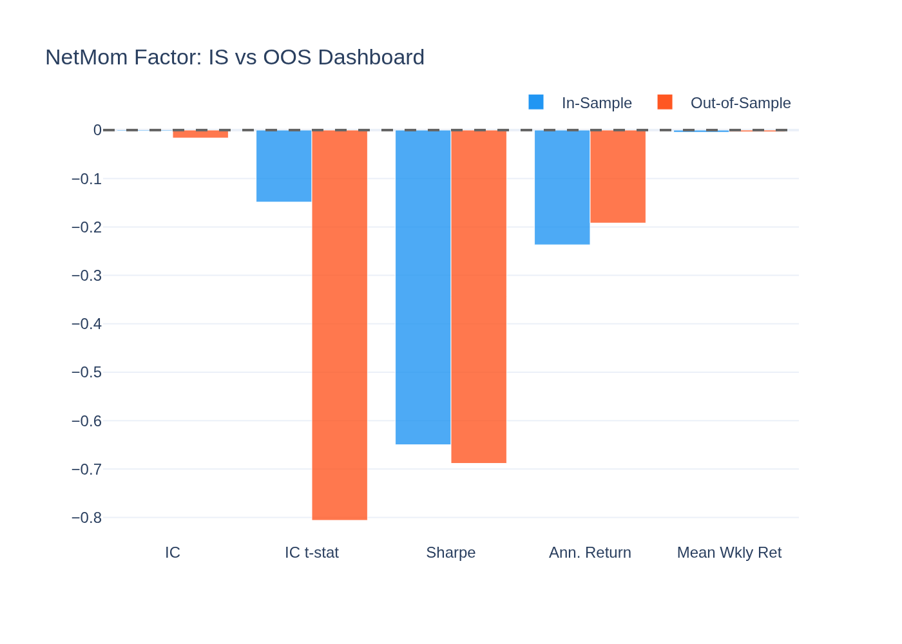
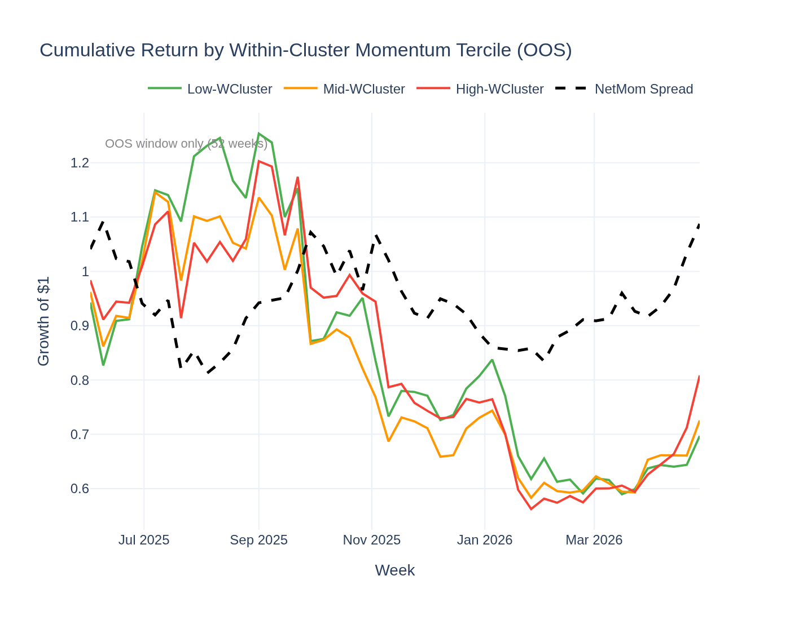
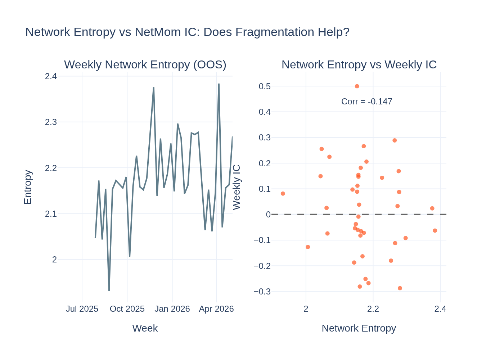

# NetMom (Within-Cluster Momentum) Factor — Analysis Report

*Generated by `18_netmom_visualisation.py` from the Stage-09 5-year panel.*

*Data note: L/S returns cover 5 years (from gx5y_full_factor_zoo). IC charts and
tercile analysis are based on the OOS window (52 weeks) where cluster data is available.*

---

## The Idea in Plain English

When a group of highly correlated coins moves together (a "cluster" — think: all DeFi
tokens, or all Layer-1 chains), some coins within that group will outperform the rest.
**NetMom** bets on those local leaders to keep leading.

Each week, we identify crypto "communities" using network analysis. Within each
community, we rank coins by their recent return *relative to the other coins in their
community*. Then:
- **Buy** the top 30% of coins by within-cluster relative return (the local leaders)
- **Short** the bottom 30% (the local laggards)

The idea is that within a cohesive narrative cluster, local leadership persists
for at least a week — similar to how within a sector in equity markets, relative
momentum can work even when sector-level momentum doesn't.

---

## The Short Answer

**Not supported — the signal is statistically silent.**

The IC t-stat is **-0.15** in-sample and **-0.81**
out-of-sample — both far below the |t| = 2 significance threshold. The GX pricing
test finds no priced premium (λ = 8.6%/yr, t = 0.37). Neither the
ASD test shows Bitcoin-beating performance (ε₁ = 0.852, ε₂ = 0.958).

The theoretical mechanism is sound — within-cluster momentum is documented in equity
markets (Liu-Tsyvinski 2018). It simply doesn't show up empirically in our 5-year
crypto panel.

---

## Performance Summary

| Metric | In-Sample | Out-of-Sample |
|---|---|---|
| Weeks | 184 | 79 |
| Annualised Return | -23.7% | -19.2% |
| Sharpe Ratio | -0.65 | -0.69 |
| Mean IC | -0.0021 | -0.0163 |
| IC t-stat (NW) | -0.15 (not significant) | -0.81 (not significant) |
| Return t-stat (NW) | -1.35 (not significant) | -0.82 (not significant) |

### Return Distribution

| Statistic | IS | OOS |
|---|---|---|
| Mean weekly return | -0.499% | 0.053% |
| Std (weekly) | 3.743% | 3.443% |
| Skewness | -0.41 | 0.22 |
| Excess Kurtosis | 2.32 | -0.26 |

---

## Why the Signal Is Silent

**1. Crypto clusters are too correlated to isolate within-cluster variation.**
Within a Louvain community, all coins already move together strongly by construction
(that's what defines the cluster). The within-cluster variance is dominated by
correlated macro moves, leaving very little idiosyncratic signal to exploit.

**2. The weekly Louvain communities are noisy.**
Community structure changes week to week. A coin assigned to a DeFi cluster this week
may be in a different cluster next week as correlation patterns shift. This instability
means "within-cluster momentum" is not a stable property of any individual coin.

**3. Crypto is retail-driven and correlation spikes override local dynamics.**
When Bitcoin makes a big move, all clusters move together. During these correlation
spike events (which are common in crypto), within-cluster relative signals are swamped.

**4. The equity market analogue may not transfer.**
The Liu-Tsyvinski (2018) momentum result for crypto was demonstrated on a shorter,
different dataset. The 5-year evidence here does not support the transfer of this
equity/shorter-window finding to a longer-horizon crypto test.

---

## Statistical Tests

### Newey-West t-stat on IC

- IS t = -0.15 — not significant
- OOS t = -0.81 — not significant

Both periods show no reliable ranking power.

### Jarque-Bera Normality Test

| Period | JB Statistic | p-value | Normal? |
|---|---|---|---|
| IS | 40.3 | 0.0000 | No |
| OOS | 1.0 | 0.6167 | Yes |

### ADF Stationarity Test

- ADF: **-6.153**, p = **0.0000**
- **Stationary**

### Giglio-Xiu Pricing Result

Full GX (K_hidden = 2): **λ = +8.6%/yr, t = +0.37** — not significant.
Within-cluster momentum is not a priced risk factor in the 5-year panel.

### ASD vs Bitcoin

ε₁ = 0.852, ε₂ = 0.958 — neither ASD criterion met. Bitcoin's return
distribution is clearly better. This is the most complete null result in the factor zoo.

---

## Visualisations

### Cumulative Return & Weekly IC

The cumulative L/S return is mostly flat to slightly negative IS and negative OOS.
IC bars show no consistent positive direction — the signal is genuinely absent.

### Rolling IC Significance (OOS Window)

### Return Distribution

### Rolling Sharpe Ratio

The Sharpe is mostly negative IS and OOS — the factor loses money mechanically.
This is the cleanest example of a "Not supported" outcome in the factor zoo.

### QQ-Plot vs Normal Distribution

### Within-Cluster Tercile Returns (OOS)

OOS-only view. The tercile returns show no meaningful spread between high and
low within-cluster momentum groups.

### IS vs OOS Comparison Dashboard

All metrics are near zero or negative in both periods. A textbook null result.

### Cumulative Return by Within-Cluster Tercile (OOS)

### Network Entropy vs NetMom IC

The left panel shows network entropy over the OOS period — how fragmented the
market is each week. The right panel scatters entropy against the weekly IC.
If the within-cluster signal worked better when the market is more fragmented
(higher entropy), we would see a positive correlation. The correlation provides
a post-hoc explanation for when (if ever) the signal had any power.
