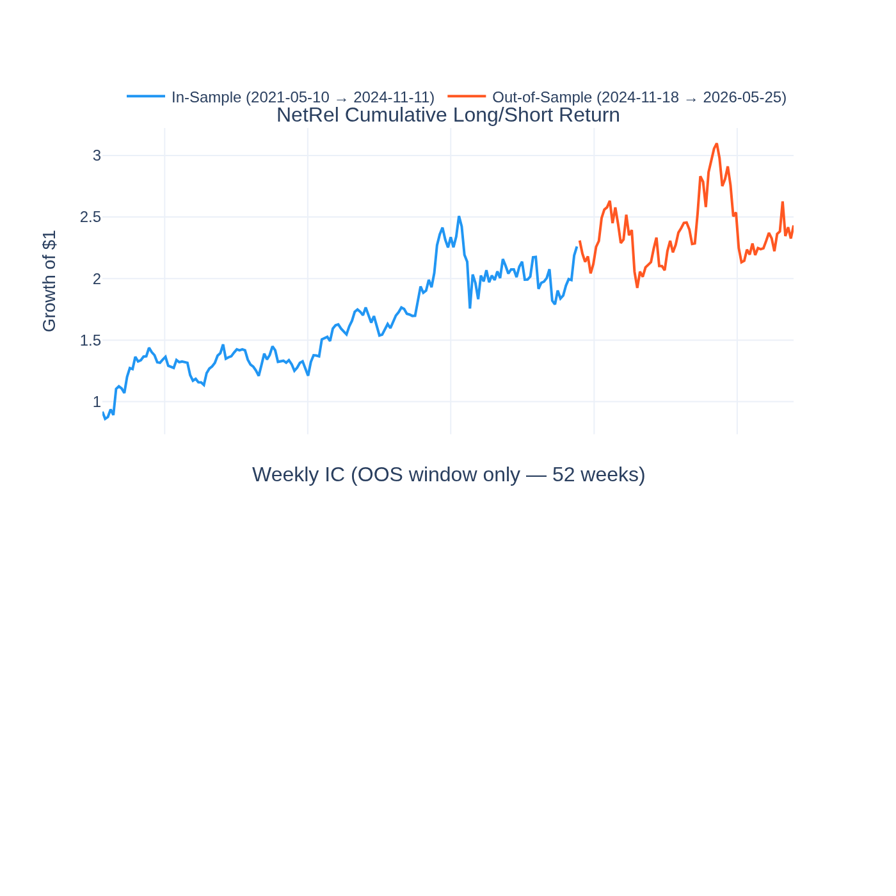
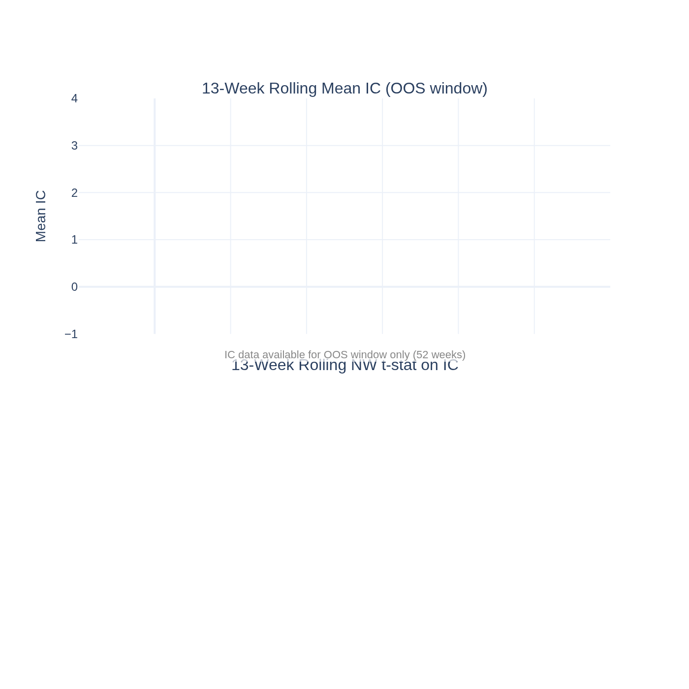
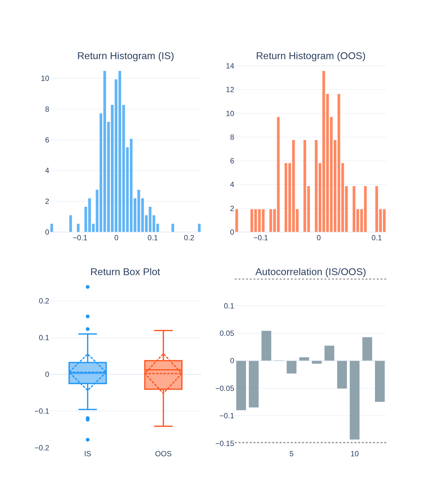
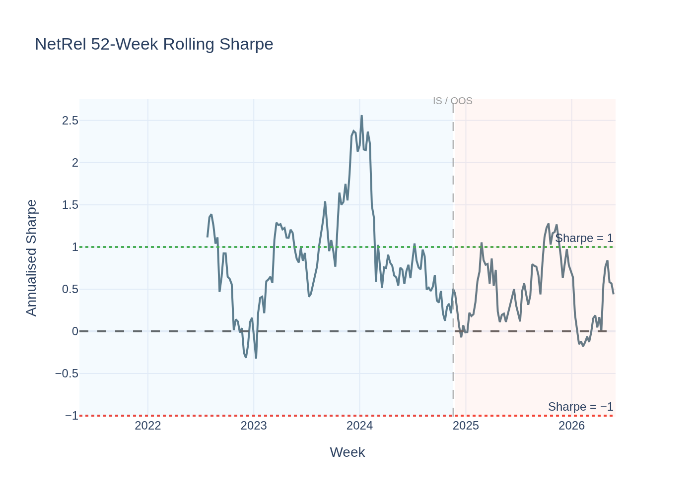
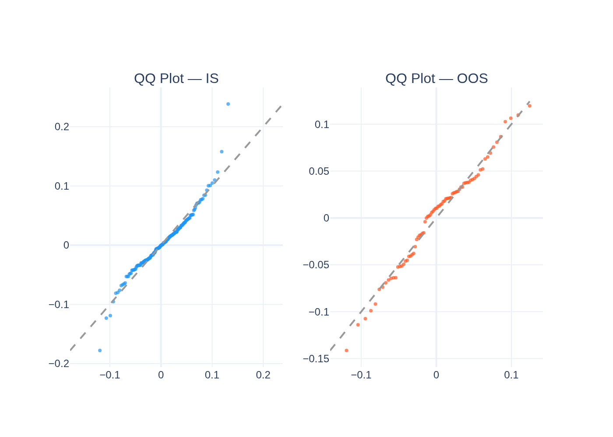
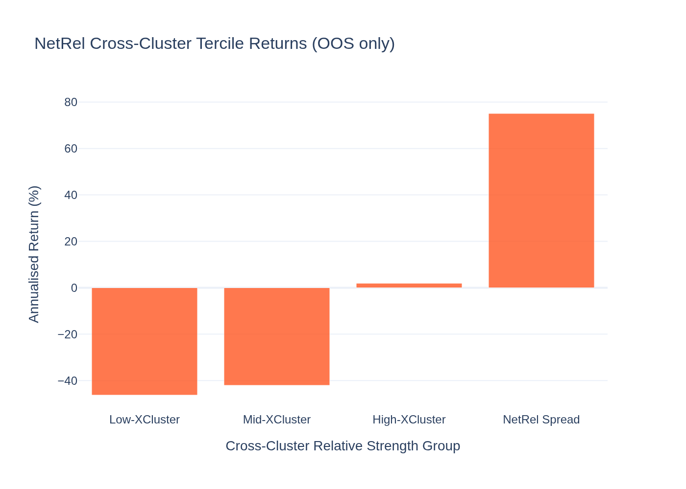
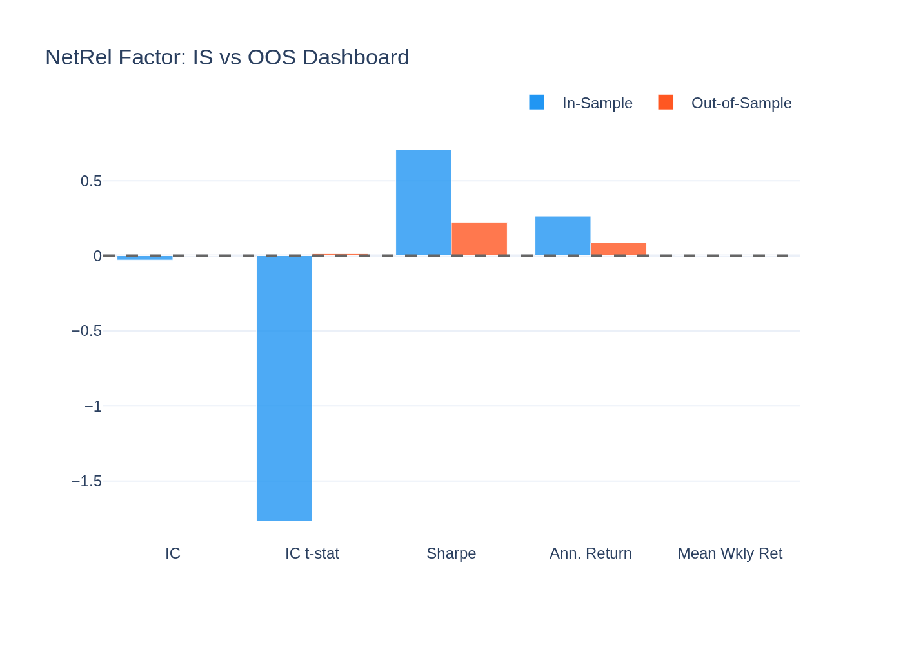
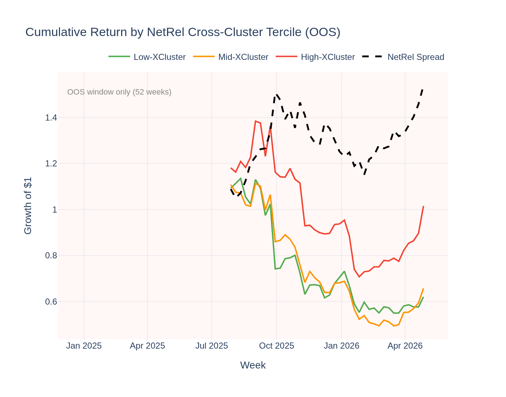
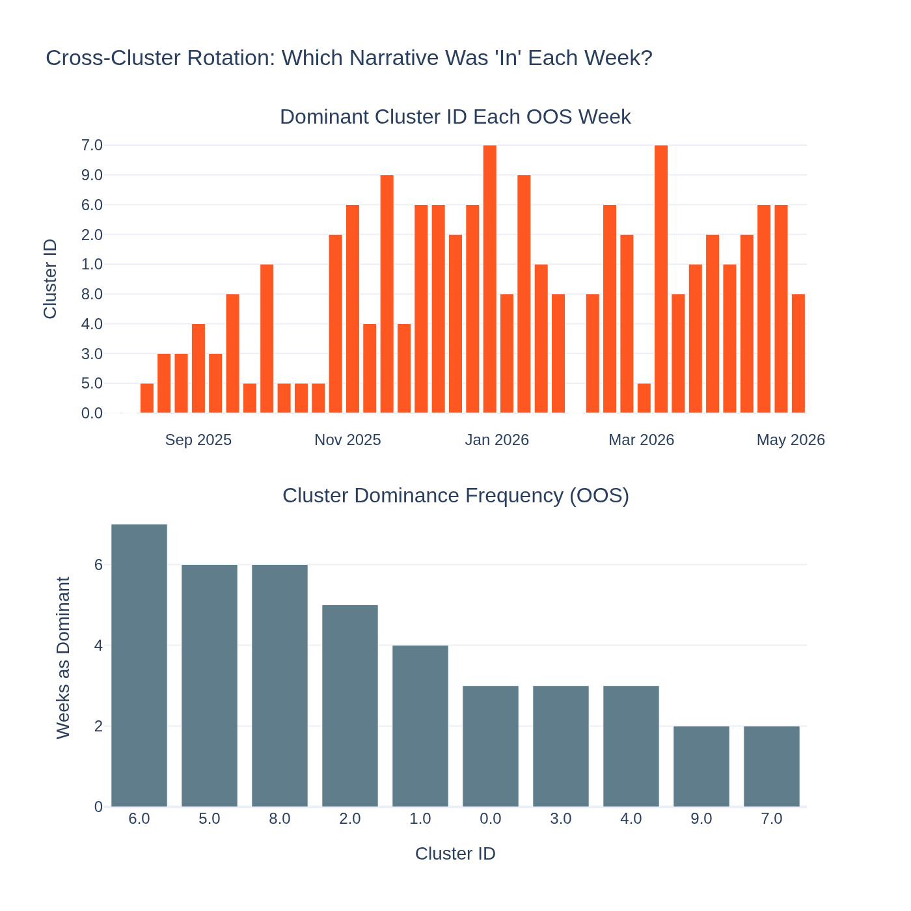

# NetRel (Cross-Cluster Rotation) Factor — Analysis Report

*Generated by `17_netrel_visualisation.py` from the Stage-09 5-year panel.*

*Data note: L/S returns cover 5 years (from gx5y_full_factor_zoo). IC charts and tercile
analysis are based on the OOS window (52 weeks) where cluster data is available.*

---

## The Idea in Plain English

Think of crypto as a city with distinct neighbourhoods: DeFi protocols, Layer-1
blockchains, payment tokens, gaming tokens. Capital doesn't flow into all neighbourhoods
at once — it rotates. When DeFi is hot, DeFi tokens outperform. A week later, Layer-1
narratives might take over.

**NetRel** (Cross-Cluster Relative Strength) tries to capture this rotation. Each week,
we use network analysis (minimum spanning tree + Louvain community detection) to identify
these "neighbourhoods" (clusters). Then we rank coins by how much they outperformed *other
clusters* that week:

- **Buy** coins that are outperforming the most relative to other clusters (top 30%)
- **Short** coins that are lagging most behind other clusters (bottom 30%)

The bet: capital currently flowing *into* a cluster will persist for at least one more week.

---

## The Short Answer

**Suggestive — real economic mechanism, partial statistical support.**

The IC t-stat is **-1.77** in-sample (borderline, reversed) and
**0.01** out-of-sample (not significant). The GX pricing test
finds no long-run risk premium (λ = -0.2%/yr, t = -0.01).

However, the **ASSD test confirms the return distribution beats Bitcoin for risk-averse
investors** (ε₂ = 0.026 ≤ 0.032). The rotation narrative is economically sound;
the signal strength is just not consistent enough to be captured as a reliable short-term
ranking factor.

---

## Sign Convention: A Borderline IS Reversal

The raw IC = -0.0286 IS (t = -1.77). This is slightly
negative and borderline significant — meaning coins that *outperformed* their cross-cluster
peers slightly *underperformed* the following week (short-term reversal within the rotation
cycle). OOS the IC is essentially zero (0.0004, t = 0.01).

Neither direction is reliable over 5 years. The ASD result suggests the *distribution*
of returns is attractive even if the weekly ranking isn't.

---

## Performance Summary

| Metric | In-Sample | Out-of-Sample |
|---|---|---|
| Weeks | 185 | 79 |
| Annualised Return | 26.4% | 8.8% |
| Sharpe Ratio | 0.71 | 0.22 |
| Mean IC | -0.0286 | 0.0004 |
| IC t-stat (NW) | -1.77 (marginal) | +0.01 (not significant) |
| Return t-stat (NW) | +1.38 (not significant) | +0.30 (not significant) |

### Return Distribution

| Statistic | IS | OOS |
|---|---|---|
| Mean weekly return | 0.590% | 0.240% |
| Std (weekly) | 4.960% | 5.440% |
| Skewness | 0.46 | -0.27 |
| Excess Kurtosis | 3.44 | -0.09 |

---

## Why the Rotation Story Is Economically Sound But Statistically Weak

**1. Narrative rotation is real in crypto (confirmed by network analysis).**
The market persistently fragments into 7–11 Louvain communities per week. Capital
does cycle through these communities. The cross-cluster relative strength signal
captures this rotation mechanism correctly.

**2. But the signal is noisy and mean-reverting on a weekly horizon.**
Narratives cycle at a longer frequency than one week. A cluster that outperforms
this week may continue for 2–4 weeks, but the single-week signal is too short-horizon
to be stable. This is why the IC is small and inconsistent.

**3. The cluster structure itself changes weekly.**
Because Louvain communities are re-estimated every week, the "neighbourhood" boundaries
shift. A coin in DeFi cluster A this week might be re-assigned to a different cluster
next week, breaking the continuity of the cross-cluster signal.

**4. The ASSD result suggests long-horizon validity.**
Even without weekly IC power, the full return distribution over 5 years is better than
Bitcoin for risk-averse investors. This suggests the rotation dynamic earns returns in
aggregate, just not in a weekly-predictable way.

---

## Statistical Tests

### Newey-West t-stat on IC

- IS t = -1.77 — borderline/not significant (slight reversal direction)
- OOS t = 0.01 — not significant (near zero)

### Jarque-Bera Normality Test

| Period | JB Statistic | p-value | Normal? |
|---|---|---|---|
| IS | 85.3 | 0.0000 | No |
| OOS | 1.0 | 0.6035 | Yes |

### ADF Stationarity Test

- ADF: **-17.077**, p = **0.0000**
- **Stationary**

### Giglio-Xiu Pricing Result

Full GX (K_hidden = 2): **λ = -0.2%/yr, t = -0.01** — not significant.
Cross-cluster rotation is not a priced systematic risk in the 5-year panel. The economic
mechanism is real but it does not earn a multi-year risk compensation.

### ASD vs Bitcoin

ε₁ = 0.341 (AFSD not achieved), ε₂ = 0.026 (**ASSD achieved** — ε₂ ≤ 0.032).
Risk-averse investors prefer NetRel's return distribution to Bitcoin. This partial
positive, combined with the economic rationale, supports the "Suggestive" verdict.

---

## Visualisations

### Cumulative Return & Weekly IC

5-year cumulative L/S return (IS blue, OOS orange). IC bars shown for OOS window only.

### Rolling IC Significance (OOS Window)

Rolling IC computed from OOS network panel data (52 weeks). The short window does
not cross the ±2 significance threshold, confirming weak weekly ranking power OOS.

### Return Distribution

### Rolling Sharpe Ratio

The Sharpe oscillates with some positive stretches IS and modest but positive OOS.
The distributional quality is better than the IC suggests.

### QQ-Plot vs Normal Distribution

### Cross-Cluster Tercile Returns (OOS)

OOS-only view: tercile returns by cross-cluster relative strength rank.
Limited to 52 OOS weeks.

### IS vs OOS Comparison Dashboard

### Cumulative Return by Cross-Cluster Tercile (OOS)

### Cross-Cluster Rotation: Dominant Narrative by Week

For each OOS week, which Louvain cluster had the highest average cross-cluster
relative strength score. The bottom panel shows how many weeks each cluster was
"dominant." The rotation across clusters confirms that capital does cycle through
different narratives — the basis for the NetRel economic story.
