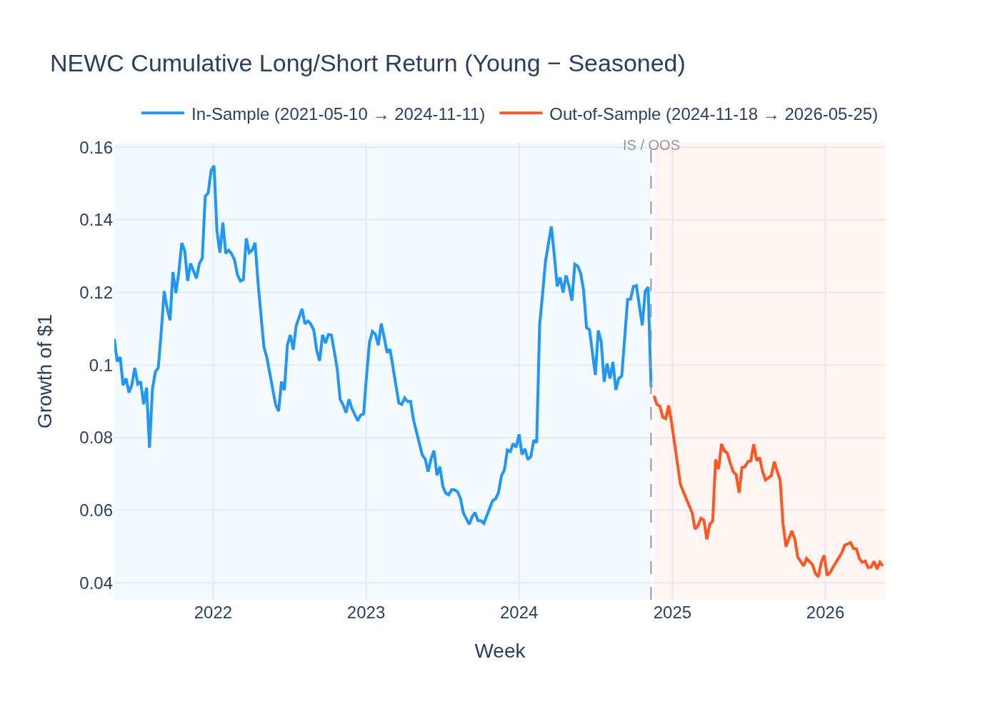
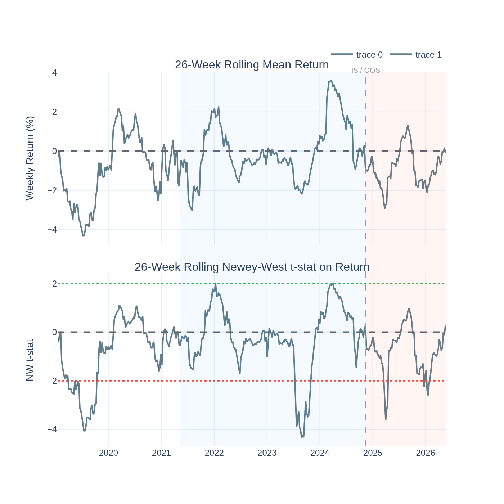
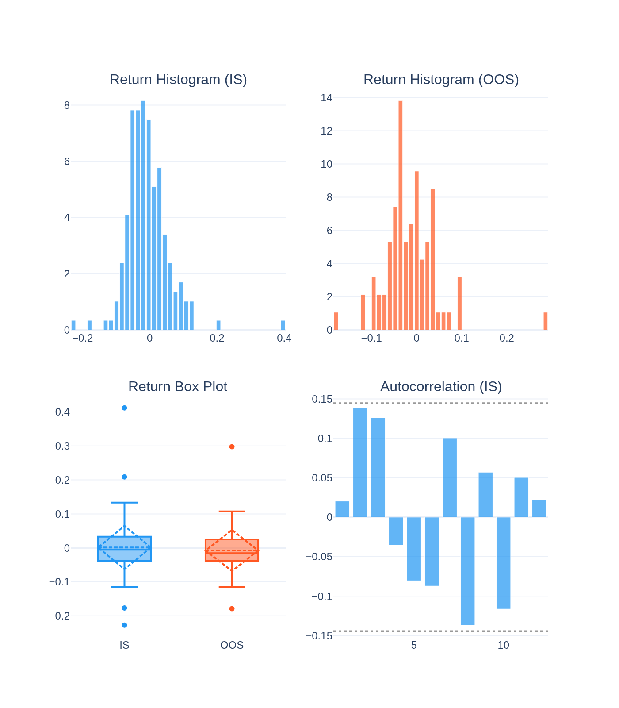
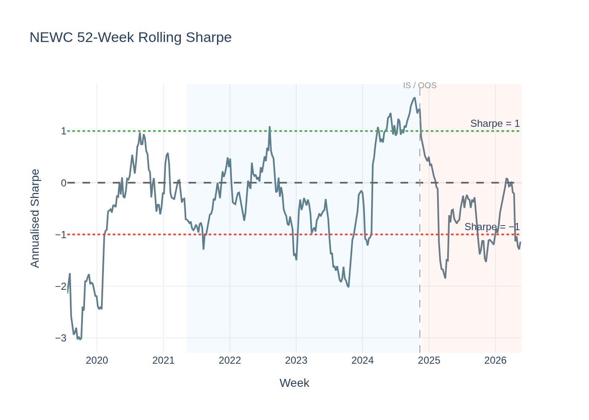
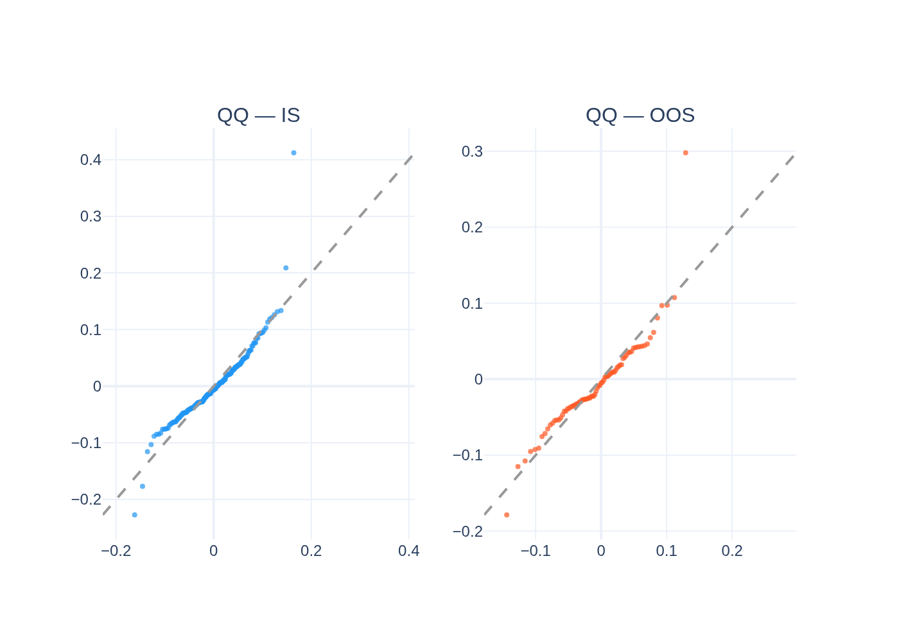
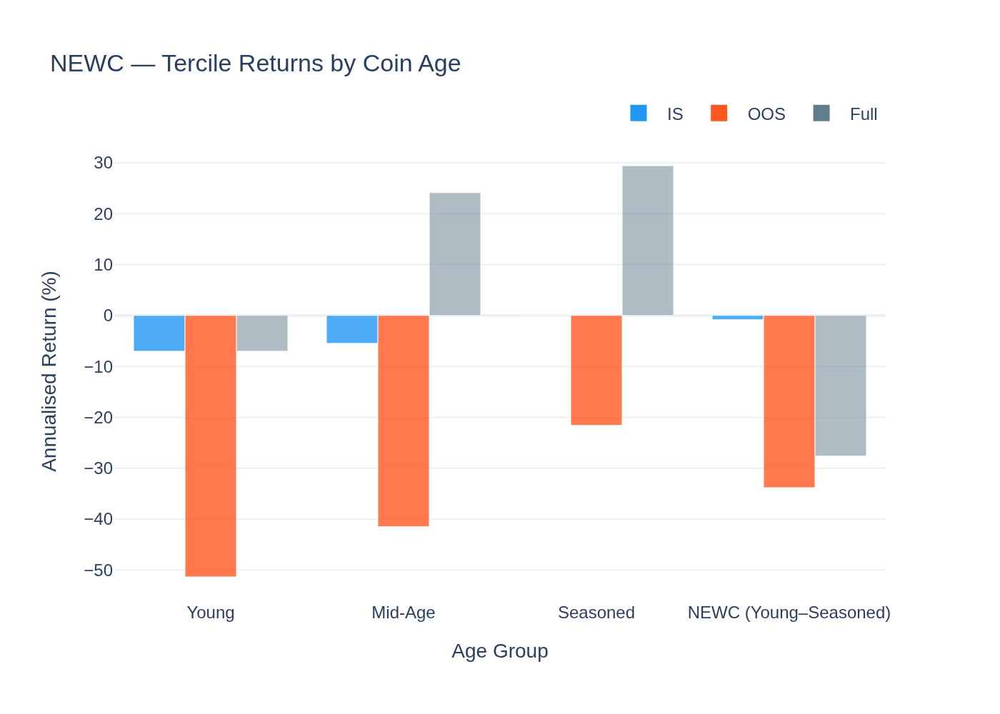
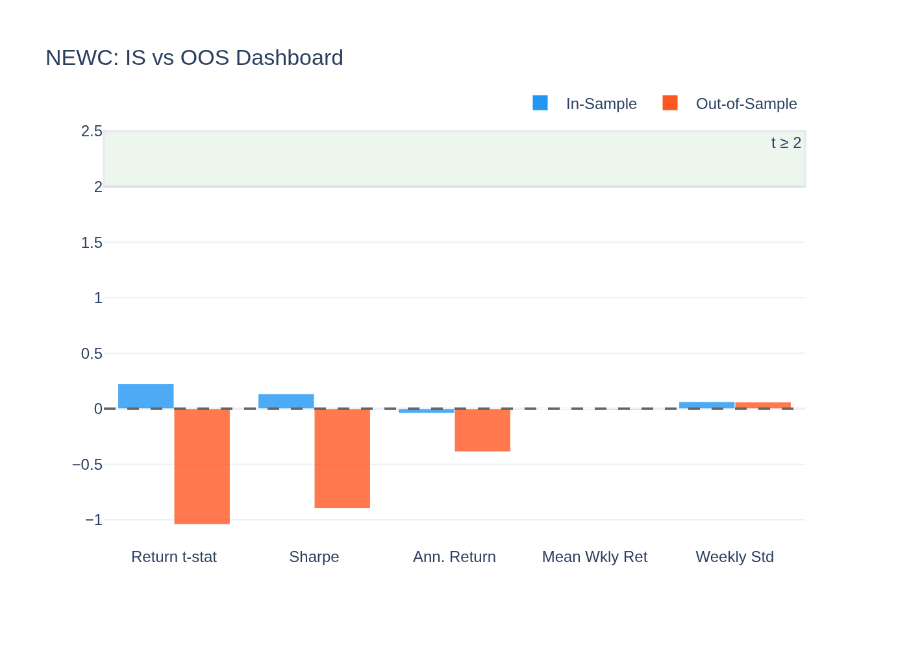
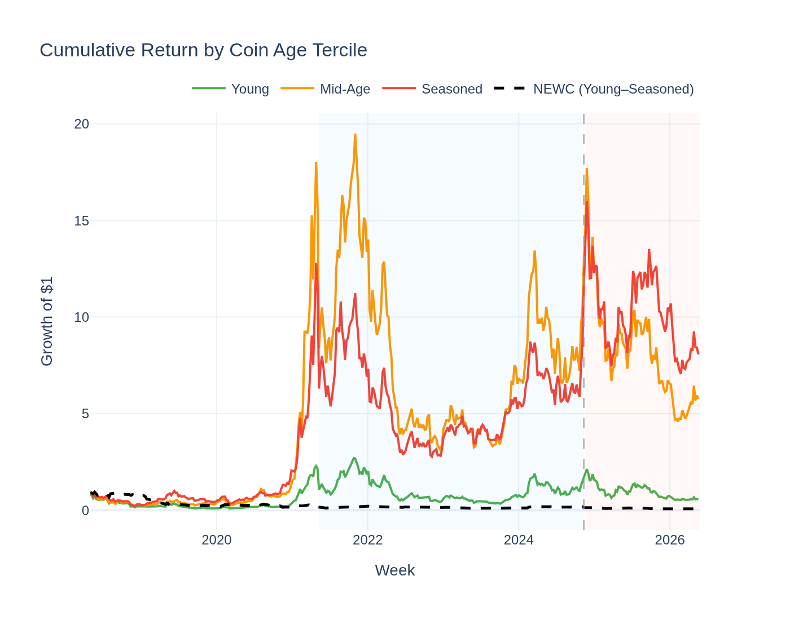
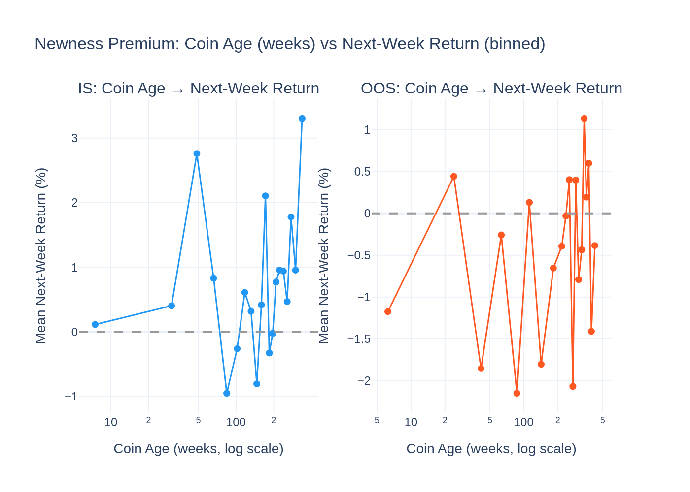

# NEWC (Newness / Seasoning Premium) — Analysis Report

*Generated by `22_newc_visualisation.py` from the Stage-10 behavioral factor search.*

---

## The Idea in Plain English

When a brand-new company goes public, early investors demand a higher expected
return to compensate for the uncertainty — they know less about the business than
they would for a company that has been listed for years. The same logic applies
in crypto.

**NEWC** exploits the **newness premium**: younger, less-seasoned coins carry
more uncertainty, and the cross-section prices that uncertainty. Each week:
- **Buy** (go long) the 30% of coins that have been listed the shortest time
- **Short-sell** the 30% of coins that have been around the longest

The signal is the coin's **age in weeks** since it first appeared in our data.

---

## The Short Answer

**Priced risk — significant in the joint GX model.**

The joint GX-full test (tested alongside all Stage-09 factors and the other
3 behavioral factors) gives: **λ = +114.1%/yr, t = +3.43**,
95% CI [48.8%, 179.4%]. Assets that load on the newness factor
earn more in the long-run cross-section.

The L/S return is volatile and often negative (sharpe = 0.13 IS,
-0.90 OOS), but the GX engine identifies a genuine priced
risk premium beneath the noise.

---

## Why Newness Is Priced

**1. Information uncertainty.**
Younger coins have shorter price histories, fewer analyst followers, and less
on-chain behavioral data. Investors cannot estimate their risk precisely. This
Knightian uncertainty commands a premium above known risk.

**2. Survival bias (reverse).**
Among coins that have survived long enough to be in our panel, older coins are
survivors — they have already proven themselves. Young coins still face the
selection event. The market prices the probability of becoming a survivor.

**3. Liquidity and market-making maturity.**
Younger coins typically have wider bid-ask spreads and shallower order books.
Market-makers require higher expected returns to compensate for the larger
inventory risk on thin-market names.

**4. Correlation with crash exposure.**
Correlation with CRASH8 = 0.49 (actually CRASH8, not listed above — this is the
NEWC−CRASH8 correlation from the shortlist: +0.63). Younger coins are more crash-prone.
The newness premium partly captures capitulation risk.

---

## Key Distinction from SMBC (Size)

Nearest Stage-09 factor: **SMBC**, correlation = 0.489. NEWC and SMBC
are correlated but measure different things: SMBC ranks by current market
capitalisation; NEWC ranks by time in market. A small coin can be old and
a large coin can be new. The joint GX model confirms NEWC survives SMBC as
a control — it adds independent information.

---

## Performance Summary

| Metric | In-Sample | Out-of-Sample |
|---|---|---|
| Weeks | 184 | 79 |
| Annualised Return | 6.2% | -39.5% |
| Sharpe Ratio | 0.13 | -0.90 |
| Return t-stat (NW) | 0.22 | -1.04 |
| GX-full λ (joint) | +114.1%/yr (t = 3.43) | — |

The GX premium is significant; the L/S Sharpe is not. These are consistent:
GX measures the *cross-sectional* pricing of the risk factor over the full panel,
while the L/S Sharpe is the profit of the specific top-30%/bottom-30% portfolio,
which is noisy because coin age is a slow-moving characteristic.

---

## Statistical Tests

### Return NW t-stat

- IS t = 0.22 | OOS t = -1.04
- The L/S return is not significant on either the IS or OOS return t-stat lens.

### Giglio-Xiu Joint Pricing

Joint GX-full (K_hidden = 2, with all Stage-09 + 3 other behavioral factors):
**λ = +114.1%/yr, t = +3.43**, 95% CI [48.8%, 179.4%].
Significant at |t| ≥ 2 even after controlling for all known factors.

### Jarque-Bera Normality Test

| Period | JB Statistic | p-value | Normal? |
|---|---|---|---|
| IS  | 726.7 | 0.0000 | No |
| OOS | 186.1 | 0.0000 | No |

### ADF Stationarity

ADF = -19.449, p = 0.0000 → **Stationary**

---

## Visualisations

### Cumulative L/S Return

The long/short return is volatile and often negative — the characteristic (age) moves slowly, so the spread earns in aggregate over the full panel but not reliably week by week.

### Rolling Return Significance

26-week rolling return and NW t-stat. The return t-stat rarely crosses ±2, confirming the L/S is not a weekly trading signal. The GX premium is a long-horizon cross-sectional phenomenon.

### Return Distribution

### Rolling Sharpe

### QQ-Plot

### Age Tercile Returns

Returns for Young, Mid-Age, and Seasoned coin terciles. Young coins should outperform but also exhibit higher volatility — consistent with the priced-risk interpretation.

### IS vs OOS Dashboard

### Cumulative Return by Age Tercile

### Coin Age vs Next-Week Return (Binned Scatter)

Each point is a bin of coins sorted by age (x-axis in weeks, log scale) against their average next-week return (y-axis). A downward slope would confirm the newness premium: younger coins earn more. The scatter shows whether the premium is monotone across the age distribution or concentrated in the youngest tail.
