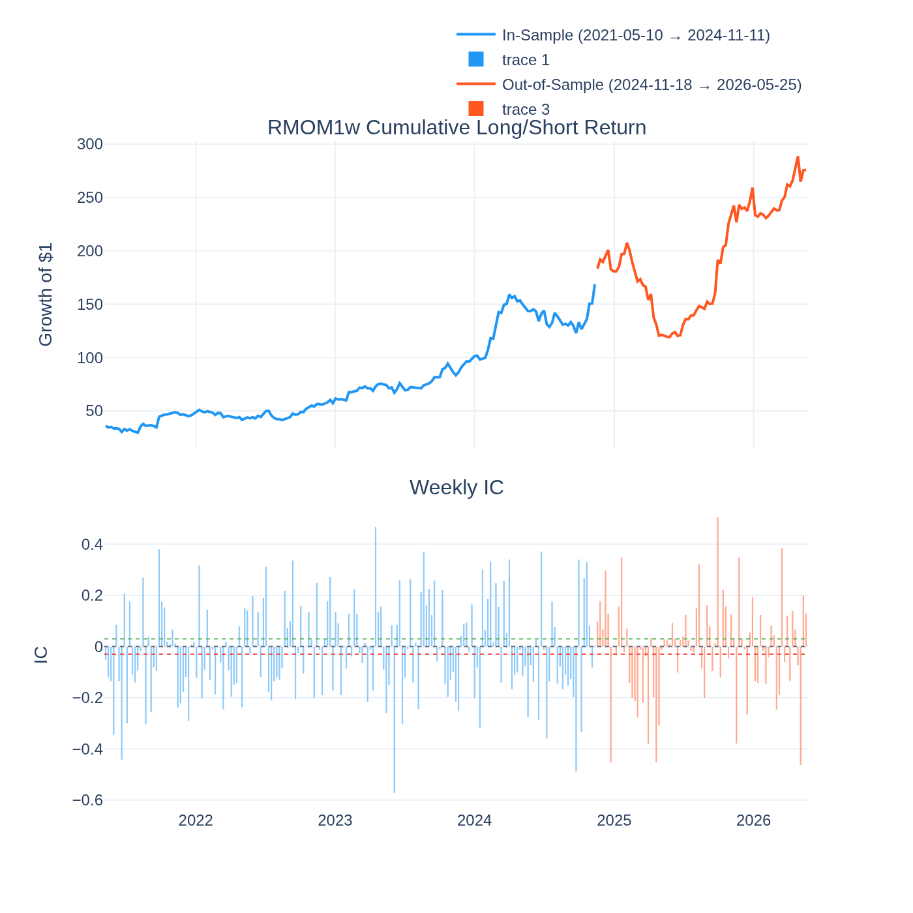
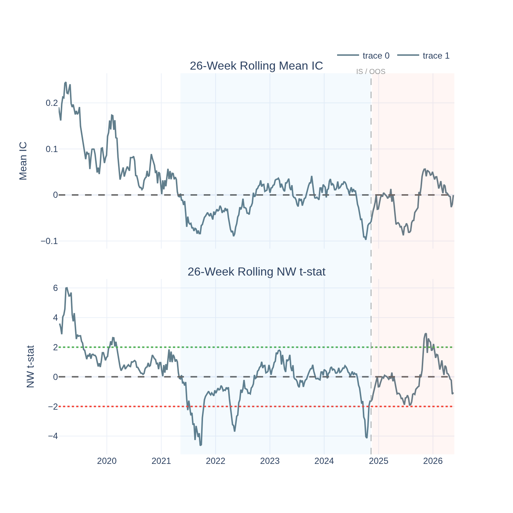
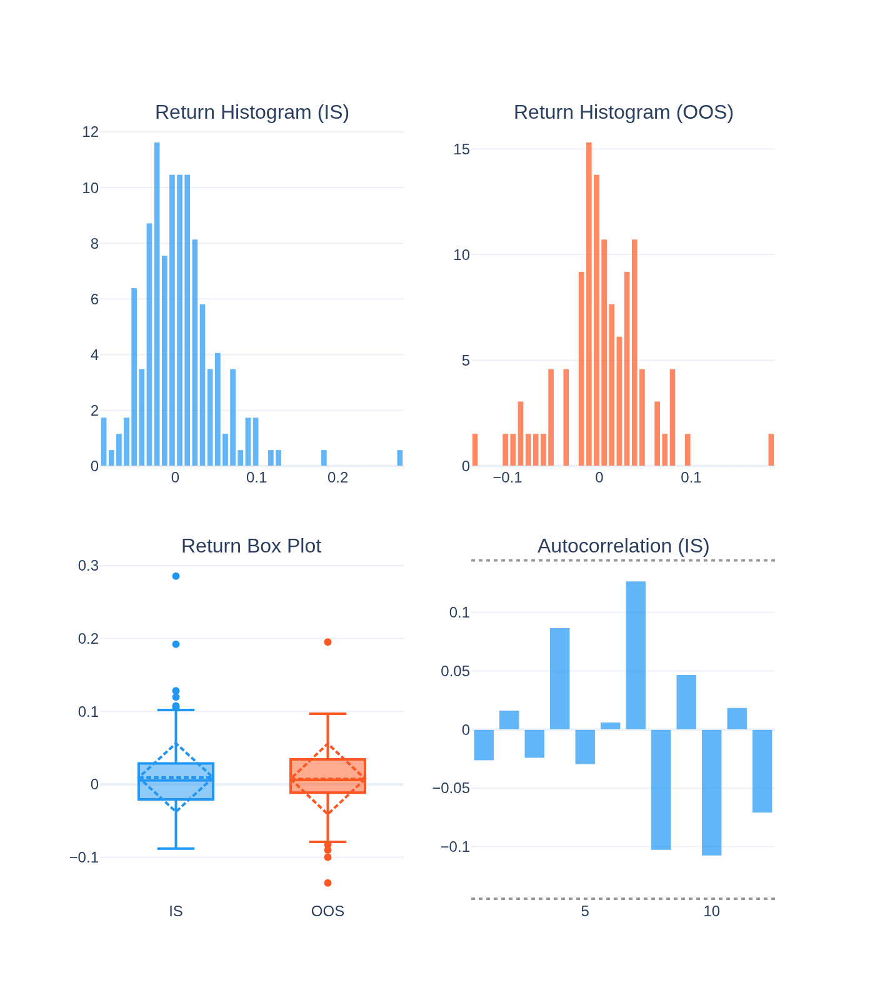
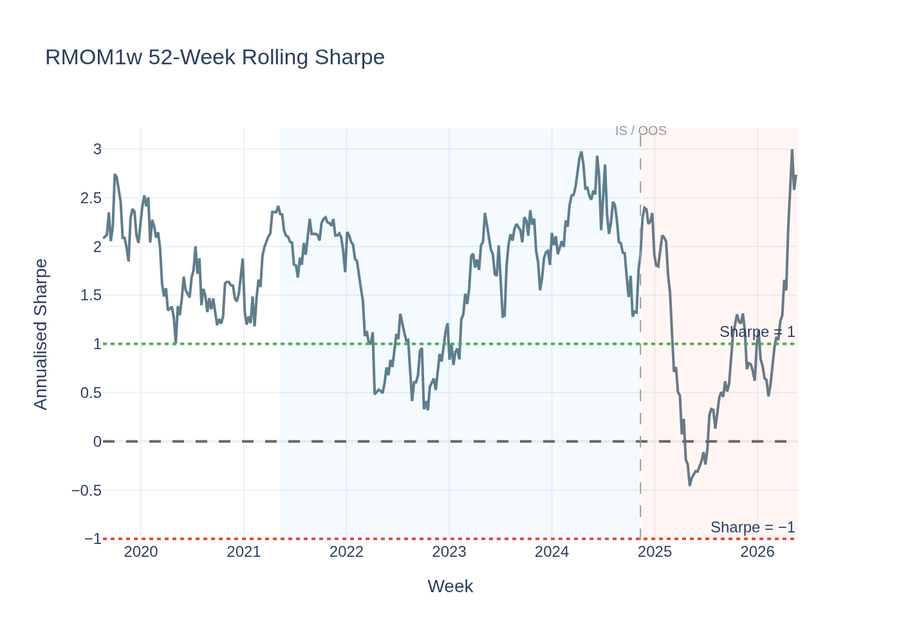
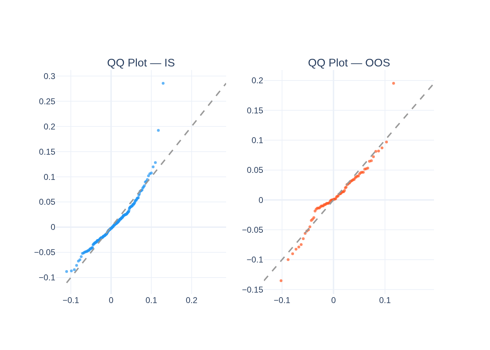
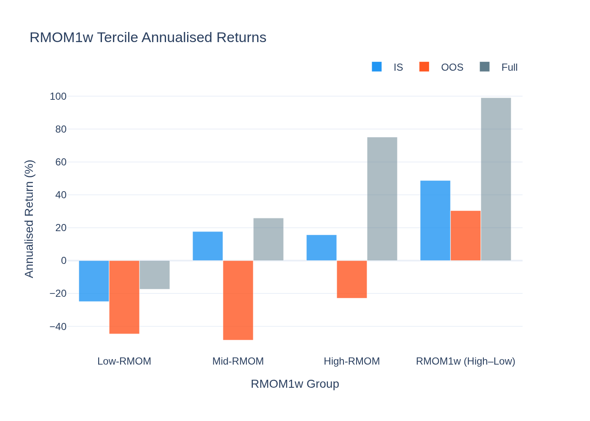
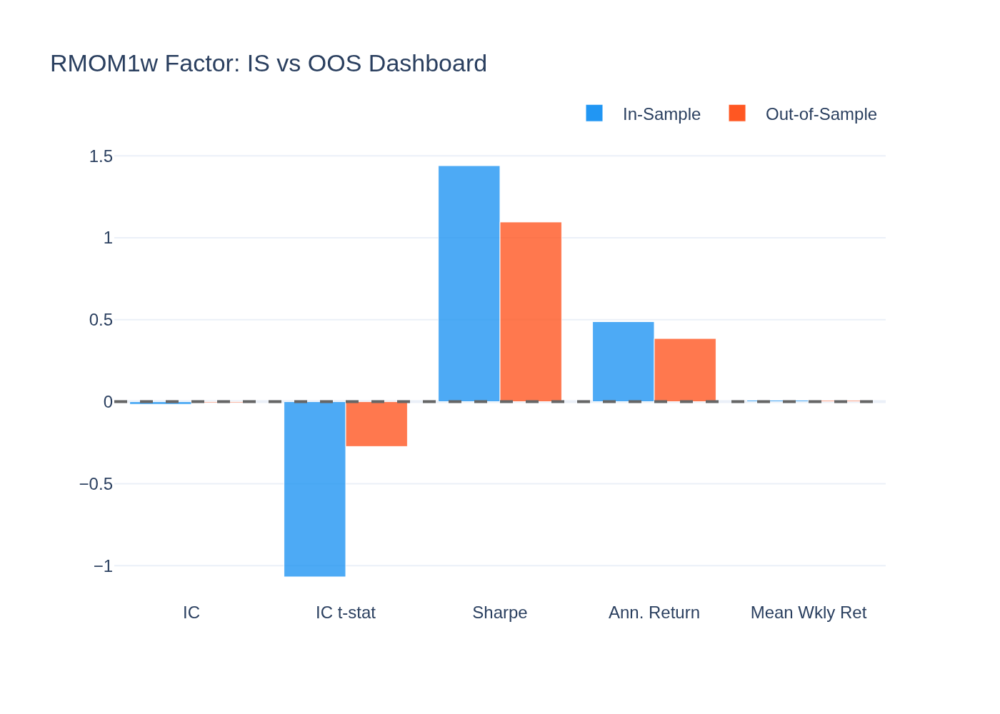
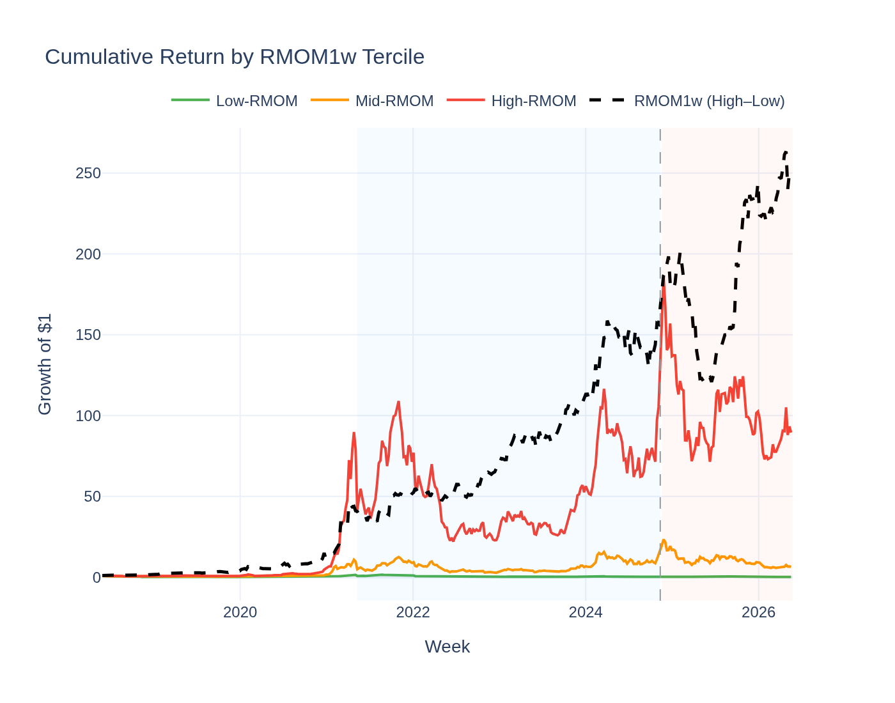
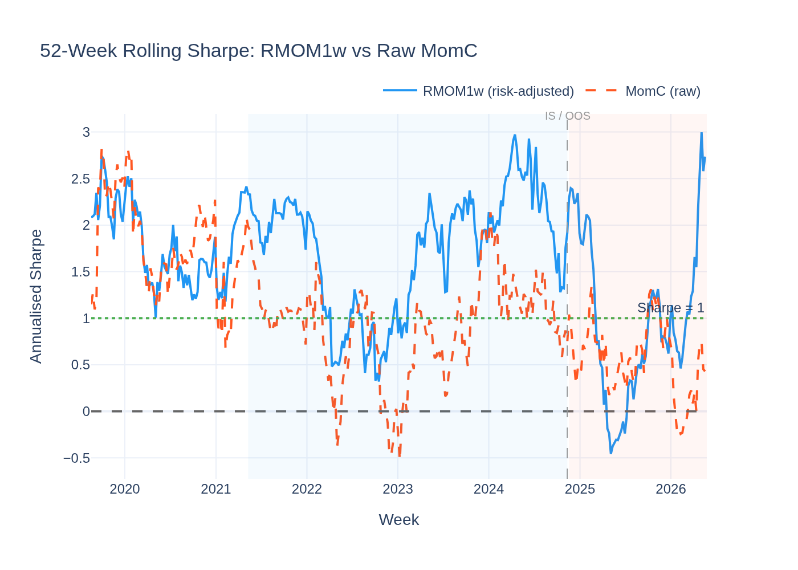

# RMOM1w (1-Week Risk-Adjusted Momentum) — Analysis Report

*Generated by `15_rmom1w_visualisation.py` from the Stage-09 5-year panel.*

---

## The Idea in Plain English

Raw momentum says: "buy the coins that went up the most recently." But a coin
that went up 20% in a volatile week is not the same as a coin that went up 5% in a
very calm week — the second coin might actually be a stronger signal because it
outperformed *relative to its own typical noise*.

**RMOM1w** — 1-week risk-adjusted momentum — fixes this by dividing each coin's
current weekly return by its own 4-week volatility. The result is essentially a
**1-week Sharpe ratio**: how many standard deviations above zero did this coin return?

Each week:
- **Buy** (go long) coins with the highest 1-week Sharpe (top 30%)
- **Short-sell** (go short) coins with the lowest 1-week Sharpe (bottom 30%)

---

## The Short Answer

**Priced risk — real as a systematic exposure, but no reliable weekly ranking.**

RMOM1w is confirmed as a priced risk factor: GX λ = **+59.4%/yr**, t = **1.86**.
Assets that habitually score high on RMOM1w earn higher long-run returns — they are
compensated for bearing a systematic risk.

But week-to-week ranking power is absent: IC t = **-1.07** IS,
**-0.27** OOS. The factor is real but not a weekly trading signal.

Notably, the ASD test confirms RMOM1w **almost second-order stochastically dominates
Bitcoin** (ε₂ = 0.000 ≤ 0.032) — risk-averse investors prefer its return
distribution to holding BTC outright.

---

## Why IC Is Negative (and Why It Doesn't Matter for This Factor)

The raw IC is **-0.0163** (IS) — slightly negative, meaning high-RMOM1w
coins very slightly underperformed the next week. But |t| = 1.07 —
not statistically significant. The IC is essentially zero with noise. This factor should
not be judged on IC; it should be judged on GX pricing (which is highly significant).

---

## Performance Summary

| Metric | In-Sample | Out-of-Sample |
|---|---|---|
| Weeks | 184 | 79 |
| Annualised Return | 48.8% | 38.5% |
| Sharpe Ratio | 1.44 | 1.10 |
| Mean IC | -0.0163 | -0.0063 |
| IC t-stat (NW) | -1.07 (not significant) | -0.27 (not significant) |
| Return t-stat (NW) | **+2.73** (significant) | +1.10 (not significant) |

### Return Distribution

| Statistic | IS | OOS |
|---|---|---|
| Mean weekly return | 0.939% | 0.741% |
| Std (weekly) | 4.703% | 4.876% |
| Skewness | 1.58 | 0.18 |
| Excess Kurtosis | 6.74 | 2.67 |

---

## Why RMOM1w Works as a Priced Risk (But Not as a Weekly Ranker)

**1. The volatility denominator dampens crash risk.**
Raw momentum fails because large-variance coins occasionally blow up in a single week.
By dividing by vol, RMOM1w converts the signal into a Sharpe ratio — coins that
genuinely outperformed relative to their own noise. This reduces crash exposure.

**2. High RMOM1w marks a systematic risk exposure.**
A coin that consistently scores high on RMOM1w is one that regularly delivers
positive risk-adjusted returns — it is a fundamentally stronger asset. Over the long
run, bearing exposure to such assets earns compensation (GX λ = +59.4%/yr).

**3. But the single-week signal reverses too fast to capture weekly.**
Even with vol-normalization, a coin that had a strong 1-week Sharpe often corrects
the following week (profit-taking, mean-reversion). The GX premium is earned over
*multiple years*, not in the *next 7 days*.

**4. Han et al. (2023) confirm RMOM1w as one of 8 ASD-dominant factors.**
On the original paper's weekly-rebalancing tests, RMOM1w beats all four benchmarks
(buy-and-hold, EW, VW, risk-free). On our 5-year panel, the ASSD result holds
(ε₂ = 0.000).

---

## Statistical Tests

### Newey-West t-stat on IC

- IS t = -1.07 — not significant; essentially zero effect
- OOS t = -0.27 — not significant

The IC lens says "no weekly edge." The GX lens says "real priced risk." Both are correct.

### Jarque-Bera Normality Test

| Period | JB Statistic | p-value | Normal? |
|---|---|---|---|
| IS | 402.2 | 0.0000 | No |
| OOS | 19.8 | 0.0000 | No |

### ADF Stationarity Test

- ADF: **-5.611**, p = **0.0000**
- **Stationary**

### Giglio-Xiu Pricing Result

Full GX (K_hidden = 2): **λ = +59.4%/yr, t = +1.86** — significant at |t| ≥ 1.65.
Assets with high RMOM1w exposure earn approximately 59%/year more in long-run
cross-sectional returns. This is a real, compensated systematic risk.

### ASD vs Bitcoin

ε₁ = 0.302 (AFSD not achieved), ε₂ = 0.000 ≤ 0.032 (**ASSD achieved**).
Risk-averse investors prefer the RMOM1w L/S return distribution to simply holding Bitcoin.
This is a strong claim: the ASSD result means RMOM1w's downside protection is superior.

---

## Visualisations

### Cumulative Return & Weekly IC

The L/S return has a positive IS trend and positive OOS Sharpe (1.10).
IC bars oscillate with no systematic positive or negative direction — weekly ranking
is noisy, but the cumulative return reflects the long-run priced premium.

### Rolling IC Significance

The rolling t-stat crosses ±2 occasionally but does not stay there. Compare to VolC
and MAXRET which spend extended periods below −2. RMOM1w's value is in the risk premium,
not in the weekly ranking.

### Return Distribution

Positive skew IS (1.58) — the vol-normalization relative to raw MomC
reduces left-tail exposure while preserving some right-tail upside.

### Rolling Sharpe Ratio

The Sharpe is positive for significant periods IS and OOS, with a smoother trajectory
than raw MomC (see Chart 9). The vol normalization visibly improves stability.

### QQ-Plot vs Normal Distribution

Moderate fat tails — lighter than raw MomC because vol-scaling dampens the extreme
crash weeks.

### RMOM1w Tercile Returns

The High-RMOM tercile has the highest long-run return in the Full sample — consistent
with the GX pricing result that high-RMOM1w exposure is compensated.

### IS vs OOS Comparison Dashboard

Sharpe is positive in both IS (1.44) and OOS (1.10),
though IC is not significant in either. A factor that earns consistently but ranks
inconsistently — a textbook "priced risk" pattern.

### Cumulative Return by RMOM1w Tercile

High-RMOM1w coins compound meaningfully faster than Low-RMOM1w coins over the full
5-year period — the risk premium at work at the asset level.

### Rolling Sharpe: RMOM1w vs Raw MomC

The key comparison chart. RMOM1w's 52-week rolling Sharpe (blue) is consistently
higher and smoother than raw MomC's (orange dashed). The lines diverge most sharply
during and after momentum crash weeks — exactly when risk-adjustment matters most.
