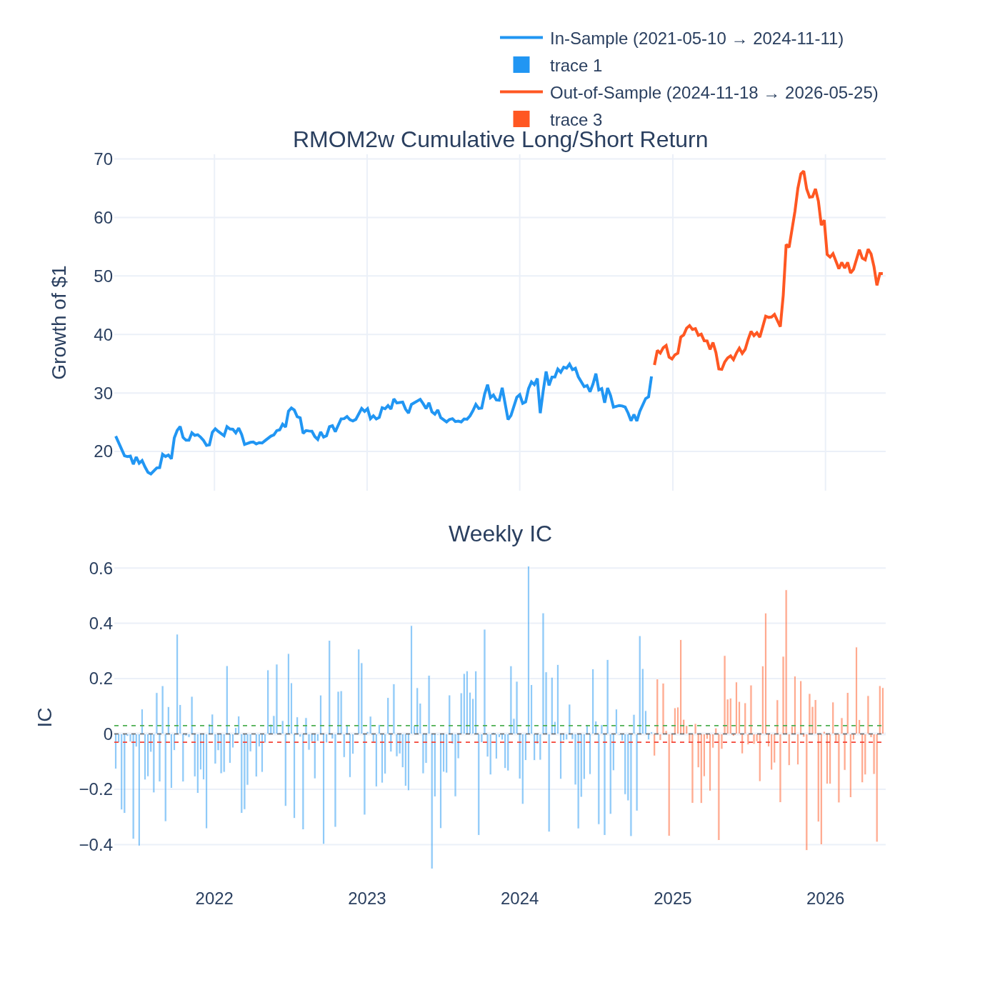
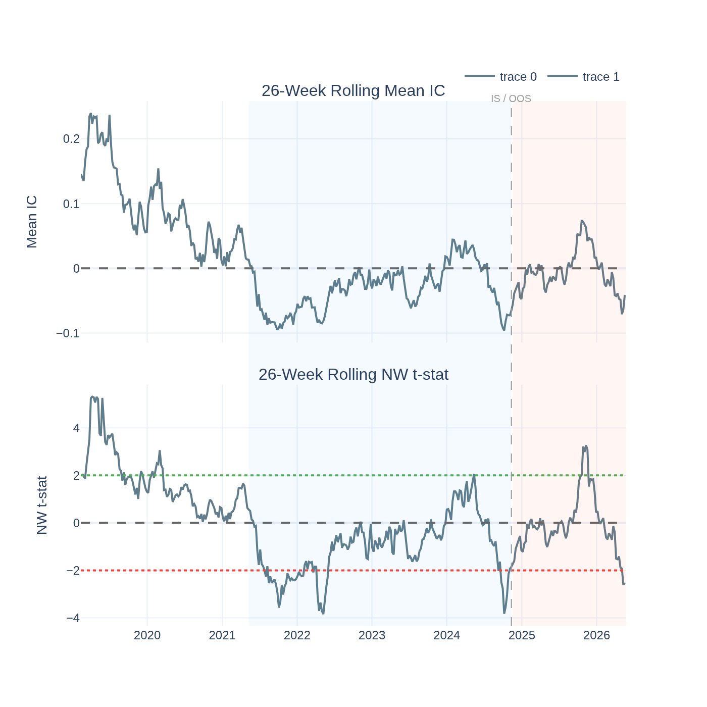
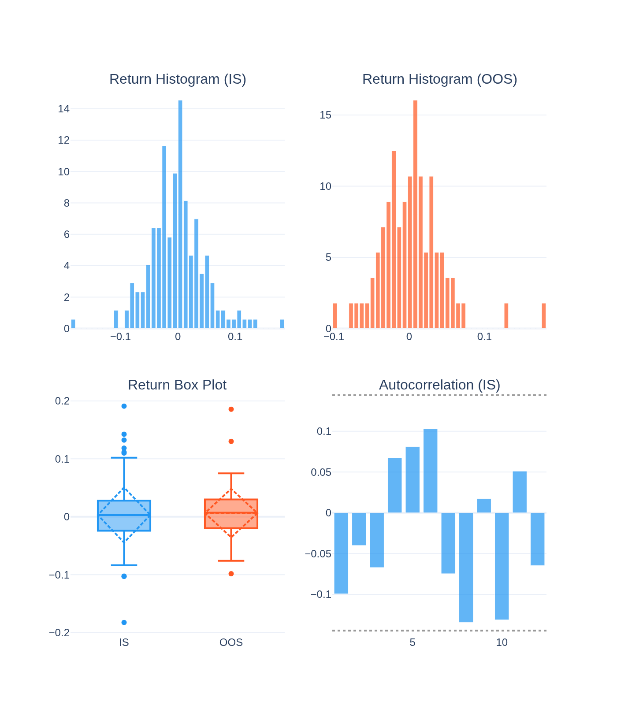
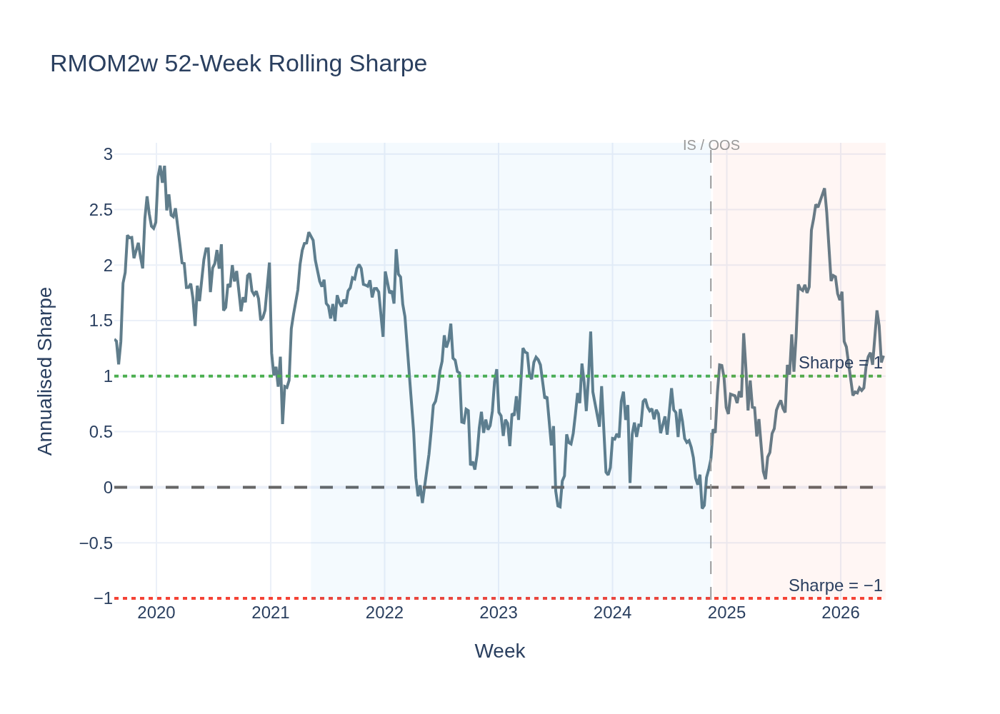
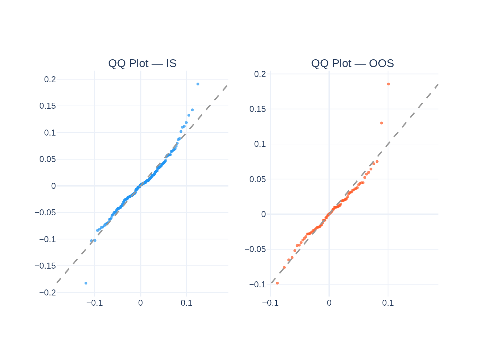
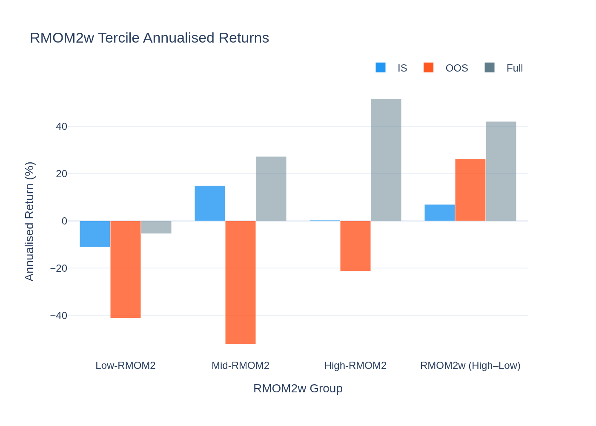
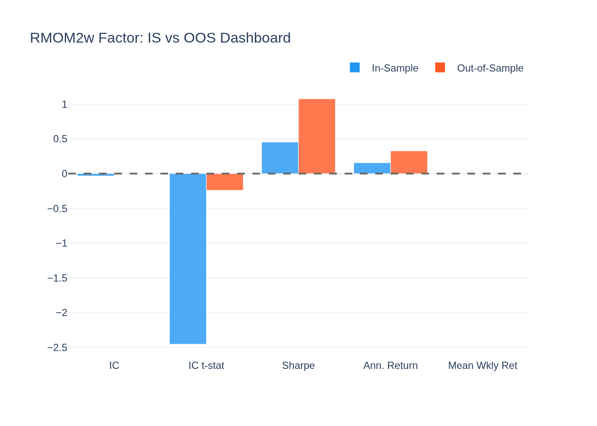
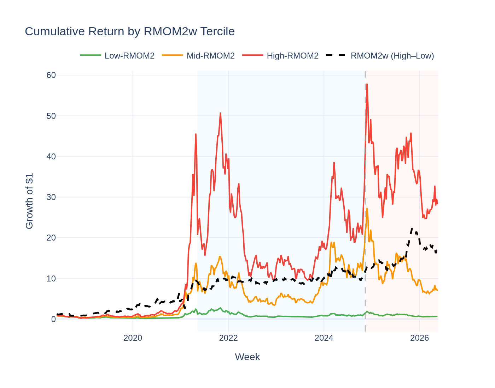
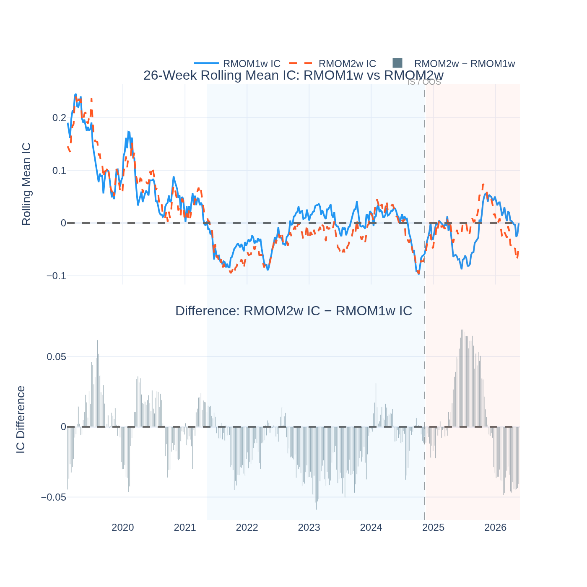

# RMOM2w (2-Week Risk-Adjusted Momentum) — Analysis Report

*Generated by `16_rmom2w_visualisation.py` from the Stage-09 5-year panel.*

---

## The Idea in Plain English

**RMOM2w** is the same idea as RMOM1w but uses a 2-week return window instead of
1 week. Specifically: each coin's 2-week return divided by its 4-week volatility.
This is a 2-week Sharpe ratio — "how well did this coin do over two weeks, adjusted
for how jumpy it normally is?"

The hypothesis is that a slightly longer lookback smooths out single-week noise and
captures more genuine short-term trends before they reverse.

---

## The Short Answer

**Suggestive — partial evidence, but the IC effect reverses rather than confirms the hypothesis.**

In-sample, the IC is **-2.46** — significant, but in the *wrong* direction
(reversal: high-RMOM2w coins underperformed). Out-of-sample, the IC fades to
**-0.24** (near zero). However, the ASSD test confirms the return
distribution beats Bitcoin for risk-averse investors (ε₂ = 0.003).

The story: RMOM2w is a more powerful *reversal* signal IS than RMOM1w, but this
reversal is regime-specific (it fades OOS). The economic rationale for a positive
momentum direction is not supported here.

---

## The IC Sign: Significant Reversal In-Sample

The raw IC = **-0.0339** IS, t = **-2.46** — significant
at |t| > 2, but *negative*. This means:
- We intended to go long high-RMOM2w (top 30% by 2-week Sharpe) and short low
- The actual result: high-RMOM2w coins *underperformed* the following week
- The 2-week risk-adjusted winner *reversed* more strongly than the 1-week winner

Out-of-sample: IC = **-0.0050**, t = **-0.24** — the
reversal essentially disappears. Neither the momentum nor the reversal direction
is reliable OOS.

---

## Performance Summary

| Metric | In-Sample | Out-of-Sample |
|---|---|---|
| Weeks | 184 | 79 |
| Annualised Return | 15.6% | 32.8% |
| Sharpe Ratio | 0.45 | 1.08 |
| Mean IC | -0.0339 | -0.0050 |
| IC t-stat (NW) | **-2.46** (significant) | -0.24 (not significant) |
| Return t-stat (NW) | +0.98 (not significant) | +1.08 (not significant) |

### Return Distribution

| Statistic | IS | OOS |
|---|---|---|
| Mean weekly return | 0.301% | 0.630% |
| Std (weekly) | 4.772% | 4.219% |
| Skewness | 0.29 | 1.00 |
| Excess Kurtosis | 2.16 | 3.95 |

---

## RMOM1w vs RMOM2w: What Changes at the 2-Week Horizon?

| Aspect | RMOM1w | RMOM2w |
|---|---|---|
| IC (IS) | −0.016 (not sig) | −0.034 (significant) |
| IC t (IS) | −1.07 | −2.46 |
| IC (OOS) | −0.006 (not sig) | −0.005 (not sig) |
| Sharpe IS/OOS | 1.44 / 1.10 | 0.45 / 1.08 |
| GX pricing | λ = +59.4%/yr (sig) | λ = +31.3%/yr (not sig) |
| ASSD vs BTC | ε₂ = 0.000 ✓ | ε₂ = 0.003 ✓ |

The 2-week horizon creates a *stronger* IS reversal (|IC t| jumps from 1.07 to 2.46)
but kills the GX pricing significance (drops from t = 1.86 to t = 1.05).

**Interpretation:** The 2-week return window captures more of the overreaction cycle
— a coin that has had a strong 2-week Sharpe is more likely to be overpriced than one
that just had a strong 1-week move. But this reversal is IS-specific: OOS, the
overreaction pattern doesn't persist in the same way.

---

## Why the Effect Is Suggestive but Not Confirmed

**1. The IS t-stat of −2.46 is significant but reversed.**
This would make the tradeable strategy: long low-RMOM2w, short high-RMOM2w (the
*contrarian* direction). The reversal is real IS.

**2. OOS: the reversal fades.**
From the OOS IC near zero (t = -0.24), the overreaction pattern
was not persistent. The 2022–2024 IS period likely saw a specific regime of
sharp trend-and-reversal cycles that didn't continue at the same intensity OOS.

**3. The ASSD result is a partial positive.**
Despite no reliable weekly direction, the full return distribution is better than
Bitcoin for risk-averse investors (ε₂ = 0.003 ≤ 0.032). The statistical
significance of this ASD result provides partial validation even without a clear
directional IC.

---

## Statistical Tests

### Newey-West t-stat on IC

- IS t = -2.46 — |t| = 2.46 — **significant (reversal)**
- OOS t = -0.24 — not significant

IS reversal is significant; OOS fades. Verdict: in-sample only.

### Jarque-Bera Normality Test

| Period | JB Statistic | p-value | Normal? |
|---|---|---|---|
| IS | 35.3 | 0.0000 | No |
| OOS | 56.1 | 0.0000 | No |

### ADF Stationarity Test

- ADF: **-4.535**, p = **0.0002**
- **Stationary**

### Giglio-Xiu Pricing Result

Full GX (K_hidden = 2): **λ = +31.3%/yr, t = +1.05** — not significant (|t| < 1.65).
Unlike RMOM1w which is GX-priced, the 2-week horizon does not earn a statistically
significant long-run risk premium once hidden factors are controlled.

### ASD vs Bitcoin

ε₁ = 0.404 (AFSD not achieved), ε₂ = 0.003 (**ASSD achieved** — ε₂ ≤ 0.032).
Risk-averse investors prefer RMOM2w's return distribution to holding Bitcoin. This partial
positive, combined with the IS IC significance, is why the verdict is "Suggestive" rather
than "Not supported."

---

## Visualisations

### Cumulative Return & Weekly IC

IC bars are consistently negative IS (reversal working) then flatten OOS. The cumulative
L/S return is positive IS (15.6%) — driven by the short-the-winner
IS regime — and positive but modest OOS (32.8%).

### Rolling IC Significance

The rolling t-stat dips clearly below −2 in the IS period, crossing the significance
threshold. It migrates toward zero as the OOS period begins — the regime shift is visible.

### Return Distribution

Positive skew IS (0.29) — the L/S spread occasionally captures
large gains when 2-week winners reverse sharply.

### Rolling Sharpe Ratio

IS Sharpe (0.45) is modest; OOS (1.08) remains
similar. The strategy's OOS persistence in Sharpe (even without IC significance) is the
distributional evidence supporting the "Suggestive" verdict.

### QQ-Plot vs Normal Distribution

### RMOM2w Tercile Returns

### IS vs OOS Comparison Dashboard

The most notable observation: IC t-stat is significant IS (−2.46) but disappears OOS
(−0.24). The Sharpe remains similar. The IC is regime-specific; the return distribution
quality (Sharpe, ASD) is more persistent.

### Cumulative Return by RMOM2w Tercile

### Rolling IC: RMOM1w vs RMOM2w Horizon Comparison

The key chart: rolling IC of RMOM1w (blue) vs RMOM2w (orange dashed) over time.
The 2-week horizon (RMOM2w) shows a more extreme negative IC IS — the reversal is
stronger at 2 weeks. But the difference (bottom panel) confirms both converge toward
zero OOS, showing the regime-specific nature of the reversal effect.
