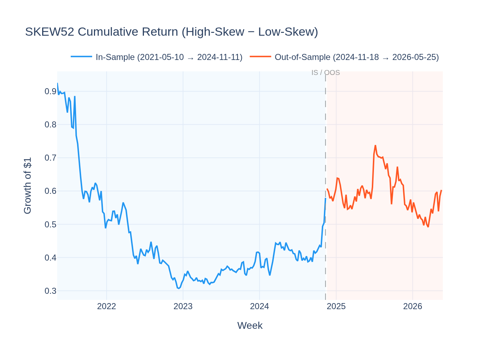
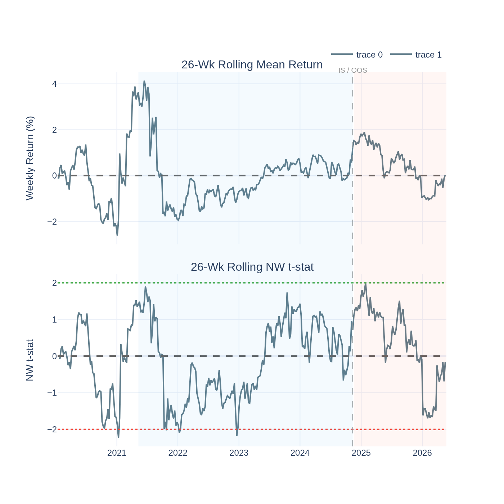
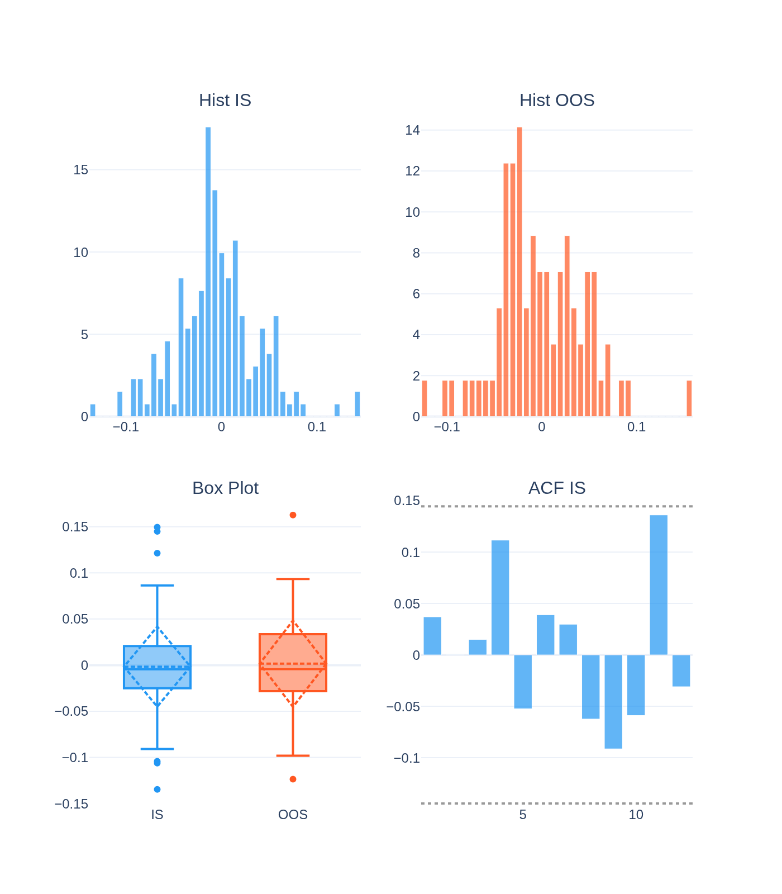
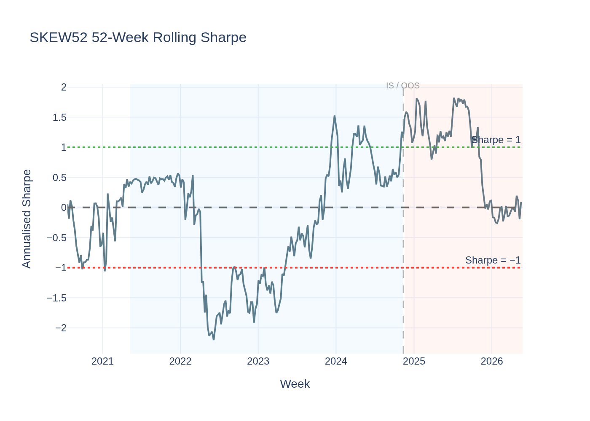
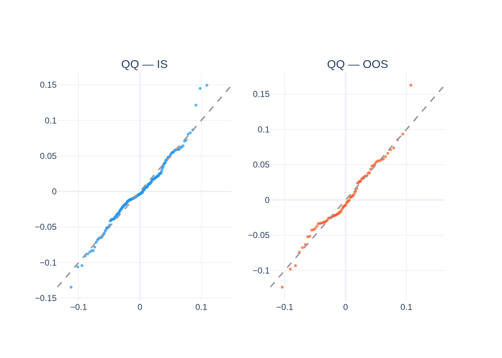
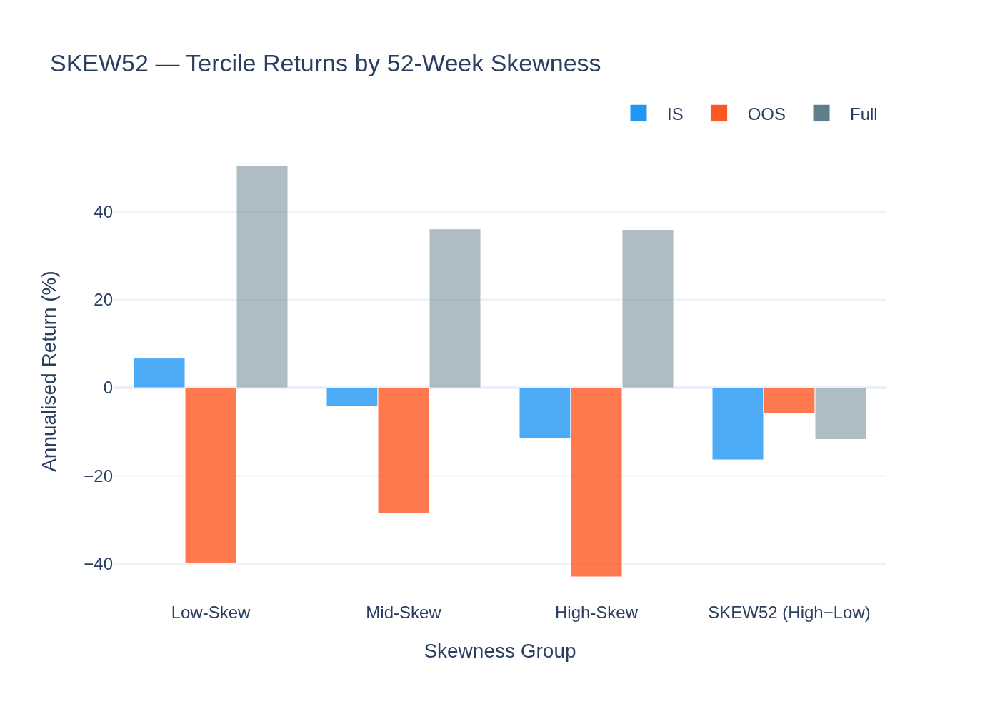
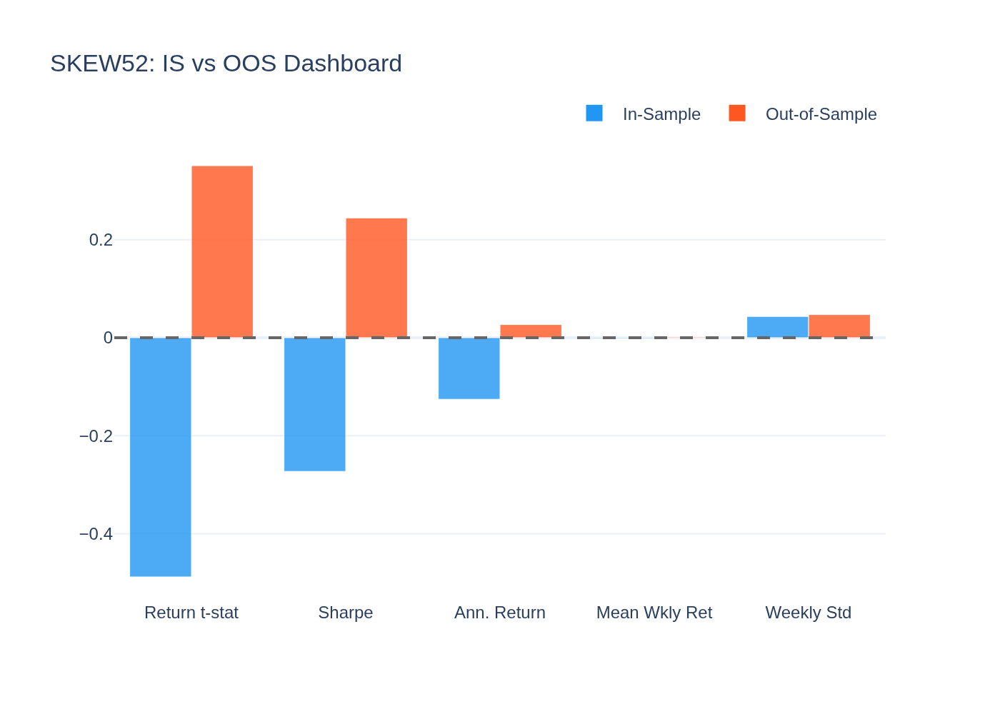
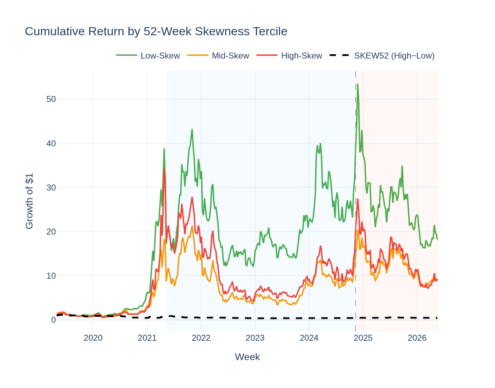
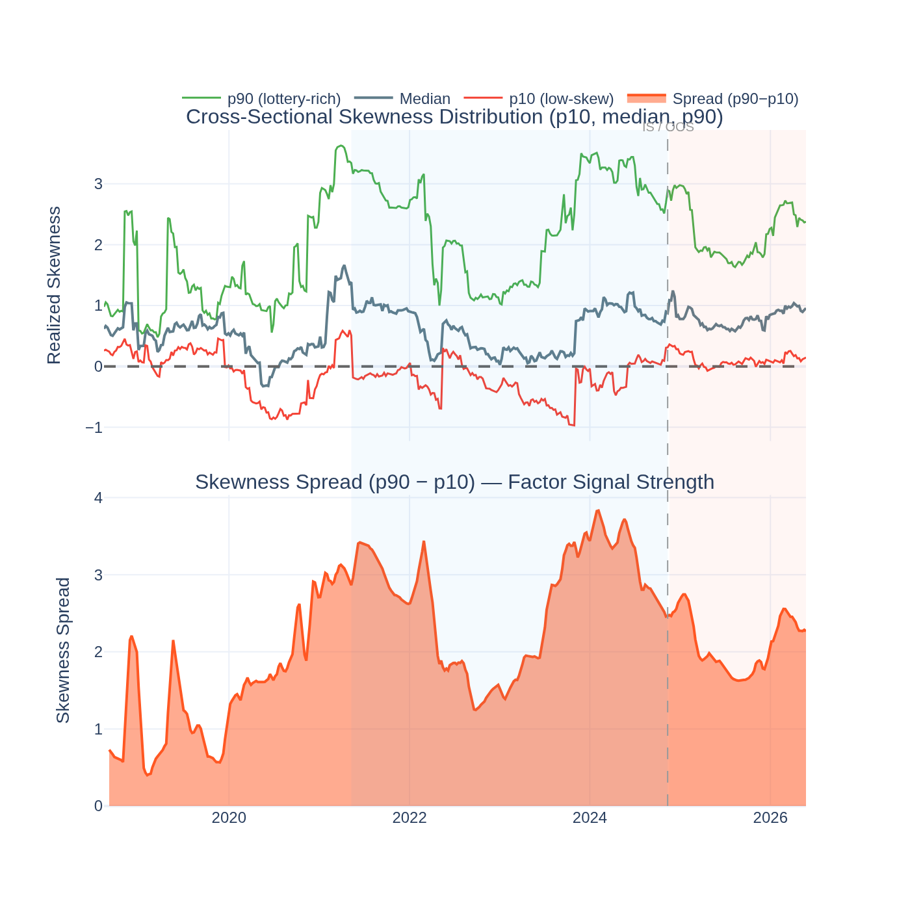

# SKEW52 (Lottery Memory / Right-Tail Salience) — Analysis Report

*Generated by `23_skew52_visualisation.py` from the Stage-10 behavioral factor search.*

---

## The Idea in Plain English

Think of two coins: one that has mostly moved ±2% per week for the past year, and
one that has mostly done the same *but* had three spectacular weeks where it jumped
30%, 45%, and 25%. Both coins have similar average returns, but investors *remember*
the second coin differently — its extreme up-moves are salient in memory.

**SKEW52** captures this. Each week, we compute the trailing 52-week **realized
skewness** of each coin's weekly return history — how asymmetric its return distribution
has been. A high-skew coin is one investors associate with dramatic up-moves:
- **Buy** coins with the highest trailing skewness (strong lottery memory)
- **Short** coins with the lowest trailing skewness (no upside history)

---

## The Short Answer

**Priced risk — investors systematically price lottery memory.**

Joint GX-full result: **λ = +96.9%/yr, t = +3.44**,
95% CI [41.7%, 152.2%]. The cross-section prices the skewness
exposure even after all Stage-09 controls and the other behavioral factors.

The L/S return is noisy: sharpe = -0.27 IS, 0.24 OOS.
But the *systematic* premium is real.

---

## Why Lottery Memory Is Priced

**1. Salience theory (Bordalo-Gennaioli-Shleifer 2012).**
Investors over-weight salient events (extreme positive returns) in their probability
assessments. A coin with dramatic recent up-moves looks "more like" a coin that
will jump again. Demand for such coins is inflated → prices are above fair value →
*but* the systematic risk exposure still earns a risk premium in the cross-section.

**2. Lottery demand and heterogeneous beliefs.**
Some investors specifically seek right-skewed payoffs (lottery buyers). They are
willing to accept a lower expected return for the chance of a big win. The cross-
section prices this demand in the risk-premium sense: exposure to highly skewed
names earns a premium because bears and informed investors are shorting them.

**3. MAXRET vs SKEW52 — horizon distinction.**
MAXRET (Stage-09) captures a *single extreme week* in a 4-week window (short-term
overpricing). SKEW52 captures the *full year of right-tail history* (long-term
lottery memory). They are related but distinct — SKEW52 is slower-moving and
captures more persistent investor sentiment.

**4. Correlation with RC (market) = 0.333.**
High-skew coins tend to be high-beta coins — they outperform in bull markets and
underperform in bear markets. The SKEW52 premium partially reflects market beta.
But the joint GX test controls for RC, confirming an independent skewness channel.

---

## Performance Summary

| Metric | In-Sample | Out-of-Sample |
|---|---|---|
| Annualised Return (L/S) | -8.5% | 8.3% |
| Sharpe Ratio | -0.27 | 0.24 |
| Return t-stat (NW) | -0.49 | 0.35 |
| GX-full λ (joint) | +96.9%/yr (t = 3.44) | — |

---

## Statistical Tests

### GX Joint Pricing Result

**λ = +96.9%/yr, t = +3.44**, CI [41.7%, 152.2%].
Significant at |t| ≥ 2. The skewness factor survives the full joint model.

### Jarque-Bera Normality

| Period | JB | p-value | Normal? |
|---|---|---|---|
| IS  | 12.5  | 0.0019  | No |
| OOS | 3.9 | 0.1432 | Yes |

### ADF Stationarity

ADF = -15.459, p = 0.0000 → **Stationary**

---

## Visualisations

### Cumulative L/S Return

### Rolling Return Significance

### Return Distribution

### Rolling Sharpe

### QQ-Plot

### Skewness Tercile Returns

High-skew coins vs low-skew coins across IS, OOS, and Full sample.

### IS vs OOS Dashboard

### Cumulative Return by Skewness Tercile

### Cross-Sectional Skewness Distribution Over Time

The top panel shows p10, median, and p90 of cross-sectional realized skewness each
week — how much spread exists in "lottery memory" across the universe. The bottom
panel shows the spread (p90 − p10): wide spread means more differentiation in upside
history, giving the SKEW52 factor more signal to work with. Bull market periods
(2021, 2024) create the widest skewness dispersion.
