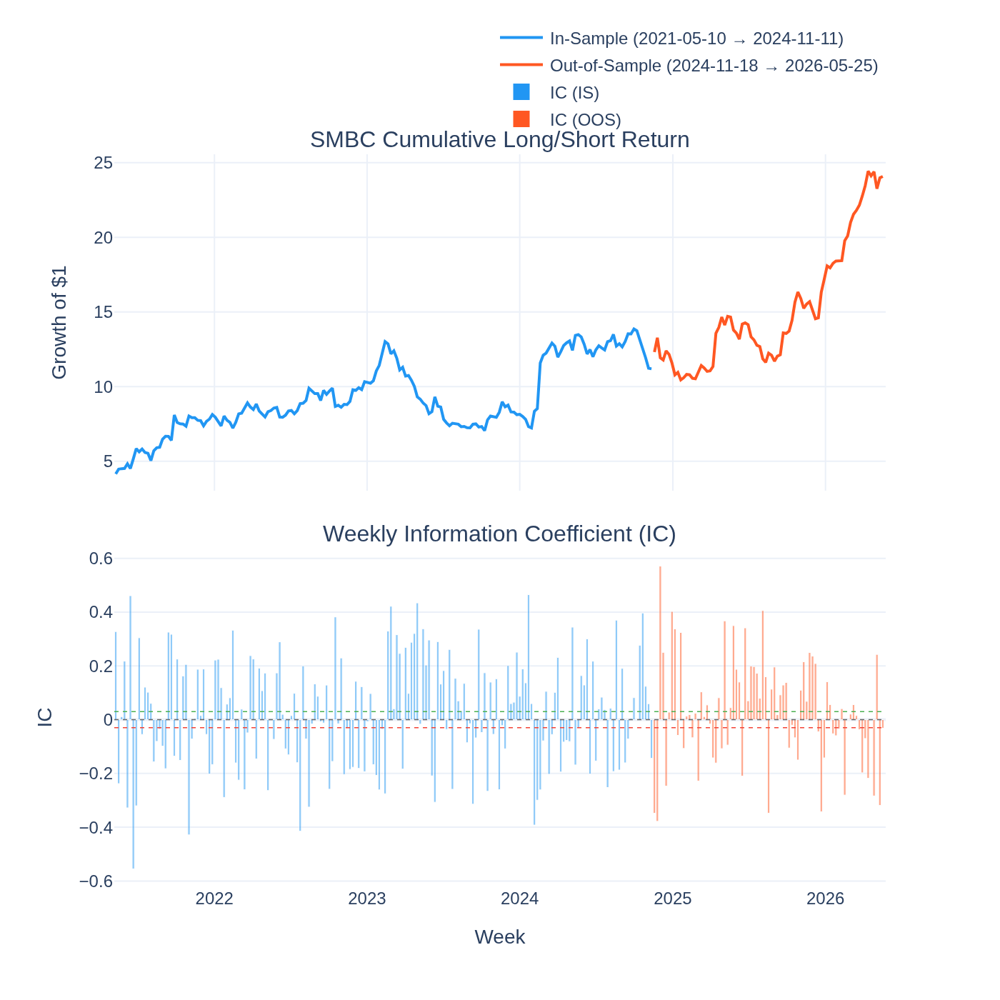
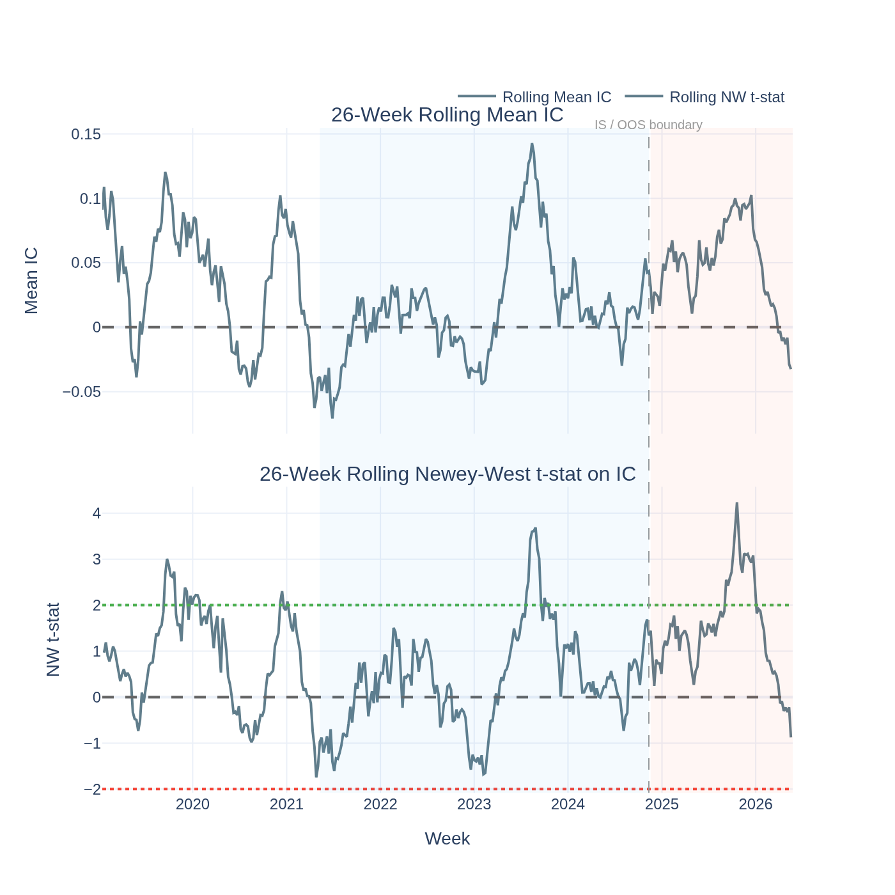
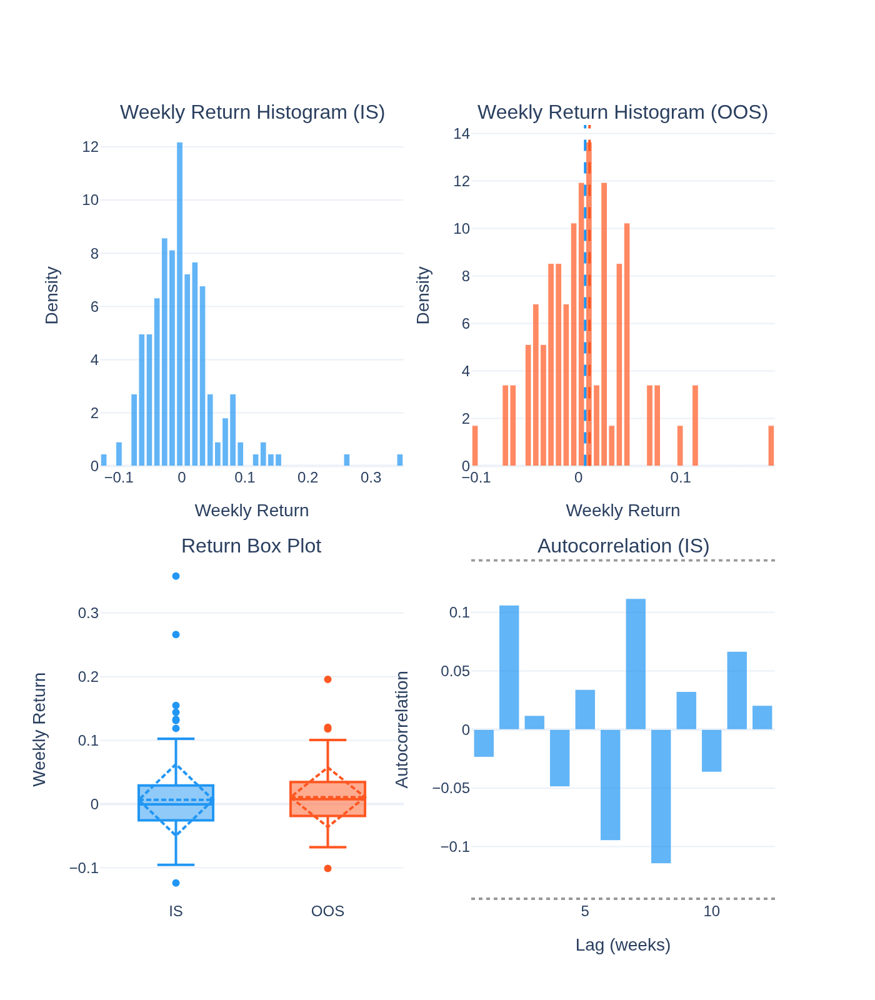
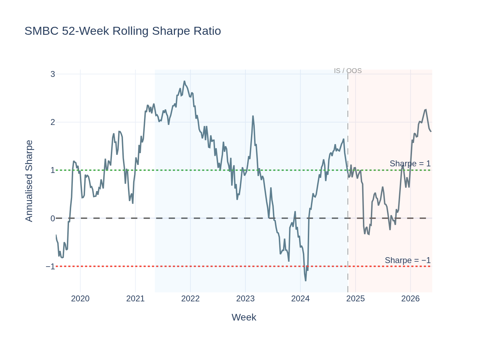
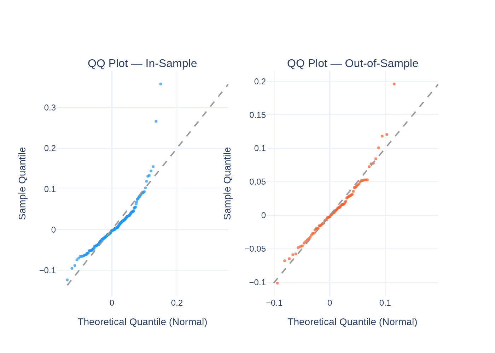
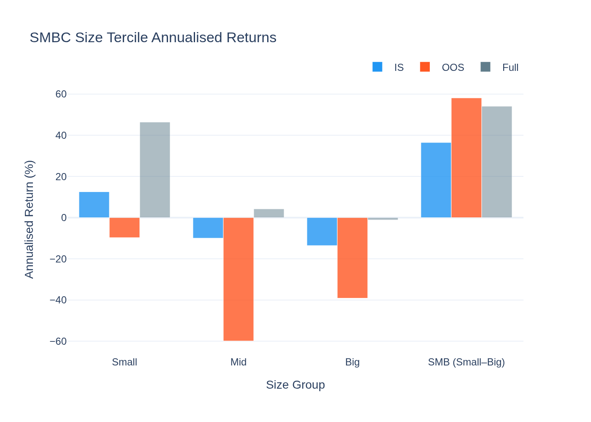
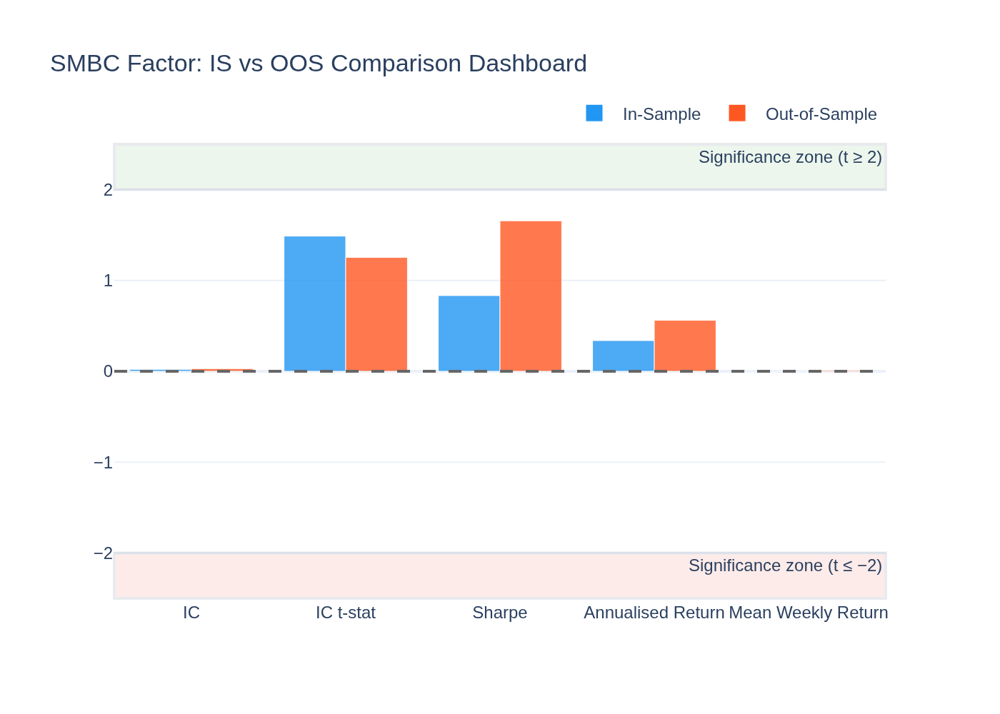
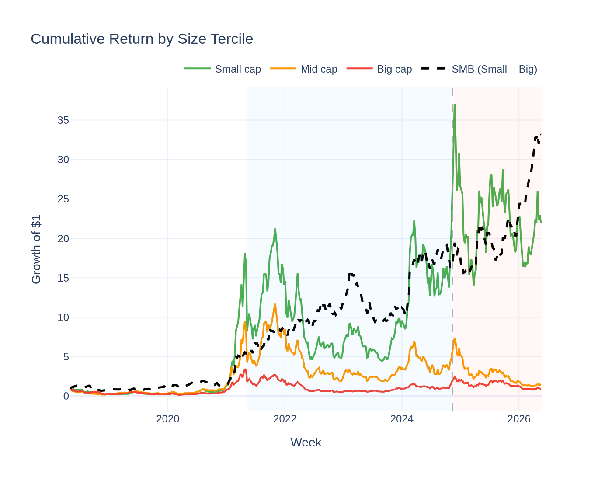

# SMBC (Size) Factor — Analysis Report

*Generated by `10_smbc_visualisation.py` from the Stage-09 5-year panel.*

---

## The Idea in Plain English

Imagine you have 100 crypto coins ranked from smallest to largest by total market value (market cap). The **size factor** bets that small coins will outperform big coins over the following week. Each week you:

- **Buy** (go long) the bottom 30% of coins by market cap — the smallest
- **Short-sell** (go short) the top 30% — the largest

This is called **Small Minus Big Caps (SMBC)**. In stock markets, small companies have historically beaten large ones — this is the famous SMB factor from Fama & French. We're asking: does the same thing happen in crypto?

---

## The Short Answer

**No — not reliably.** Over 5 years (2021–2026), the SMBC strategy made money on average, but the effect was too noisy and inconsistent to be statistically real. The signal exists; it just isn't strong enough to trust.

---

## One Concept Before the Numbers: the IC

The **IC (Information Coefficient)** measures how well the size ranking predicts next-week returns. Think of it as a weekly accuracy score:

| IC value | Meaning |
|---|---|
| +1.0 | The smallest coin always becomes the best performer next week |
| 0.0 | Size rank has zero predictive power (random) |
| −1.0 | The smallest coin always becomes the worst performer |

In practice a good factor has a mean IC around **+0.03 to +0.08**. But a single positive IC value might just be luck. We want to know if it is *reliably* positive across many weeks — that is what the **t-stat** captures. Think of the t-stat as the signal-to-noise ratio:

- **|t| ≥ 2** → the IC is statistically significant (unlikely to be random noise)
- **|t| < 2** → we cannot rule out that the positive IC is a coincidence

---

## Performance Summary

We tested SMBC over 263 weeks, split into:
- **In-Sample (IS)**: 184 weeks — data used to study the factor
- **Out-of-Sample (OOS)**: 79 weeks — data the model never saw (the real test)

| Metric | In-Sample | Out-of-Sample |
|---|---|---|
| Weeks | 184 | 79 |
| Annualised Return | 33.8% | 56.1% |
| Sharpe Ratio | 0.83 | 1.66 |
| Mean IC | 0.0217 | 0.0293 |
| IC t-stat (Newey-West) | +1.49 — **not significant** | +1.25 — **not significant** |
| Return t-stat (Newey-West) | +1.51 — not significant | +1.91 — marginal |

The annualised returns look attractive, but both IC t-stats fall below the |t| = 2 threshold. The factor does not pass the significance bar in either period.

### Return Distribution

| Statistic | IS | OOS |
|---|---|---|
| Mean weekly return | 0.650% | 1.080% |
| Std (weekly) | 5.627% | 4.698% |
| Skewness | 2.10 | 0.88 |
| Excess Kurtosis | 9.82 | 2.48 |
| Min | −12.39% | −10.12% |
| 25th pct | −2.50% | −1.76% |
| Median | −0.04% | 0.75% |
| 75th pct | 2.85% | 3.35% |
| Max | 35.80% | 19.59% |

The high skewness and kurtosis (especially IS) confirm that a handful of extreme weeks — small-cap "moonshots" — drive most of the cumulative return. The median weekly return is essentially zero.

---

## Why Did It Fail?

**1. Crypto "small caps" behave differently from small-cap stocks.**
In equities, small companies are underfollowed and can be undervalued for years. In crypto, the smallest tokens are often highly speculative: huge upside in bull runs, massive losses in bear markets. The return pattern is erratic, not systematic.

**2. Regime dependence.**
The size effect was strong during the 2020–2021 bull market when many small coins rallied explosively. It broke down in 2022–2023. A factor that only works in one regime is not a reliable premium — it is a bull-market artefact.

**3. Fat tails inflate variance without adding reliability.**
A few extreme weeks account for most of the cumulative return. This makes the *average* return positive but keeps the standard deviation high, which is why the t-stat stays low even though the mean IC is positive.

**4. BTC/ETH dominate the large-cap short leg.**
The "big" tercile is heavily concentrated in the two largest assets. Shorting BTC and ETH is shorting the crypto market — the short leg moves with beta more than with the size premium.

---

## Statistical Tests

### Newey-West t-stat on IC (primary test)

The IC is autocorrelated from week to week (if small coins outperform this week, they often continue briefly next week). The **Newey-West** correction adjusts the standard error for this autocorrelation to avoid overstating significance.

- IS IC t-stat = **1.49** — below |t| = 2; **not significant**
- OOS IC t-stat = **1.25** — below |t| = 2; **not significant**

Size ranking does not reliably predict crypto cross-sectional returns in either period.

### Jarque-Bera Normality Test

Tests whether weekly returns are normally distributed. Non-normality matters because t-stats assume normality; fat-tailed returns inflate variance and reduce the measured t-stat.

| Period | JB Statistic | p-value | Normal? |
|---|---|---|---|
| IS | 828.1 | 0.0000 | No |
| OOS | 26.6 | 0.0000 | No |

Both periods decisively reject normality — the heavy right tails (moonshots) are real.

### ADF Stationarity Test

Tests whether the cumulative return series has a unit root (permanent drift). A stationary series (p < 0.05) means returns are mean-reverting, not trending forever.

- ADF statistic: **−17.943** | p-value: **0.0000** → **Stationary**

The SMBC spread does not drift permanently upward or downward — it oscillates, which is consistent with a noisy signal rather than a genuine persistent premium.

---

## Comparison with the 52-Week Study

In the shorter Stage-08 window (52 weeks), SMBC appeared stronger because the sample was dominated by the 2024 recovery rally. Extending to 5 years exposed the regime-fragility: the effect comes and goes, and the long-run average cannot be distinguished from zero.

---

## Visualisations

### Cumulative Return & Weekly IC

Blue = in-sample, orange = out-of-sample. Top panel: growth of $1 in the SMBC long/short strategy. Bottom panel: weekly IC — notice how it oscillates around zero with no persistent positive drift.

### Rolling IC Significance

26-week rolling mean IC (top) and rolling Newey-West t-stat (bottom). The t-stat rarely crosses the |t| = 2 significance lines (green/red dotted), confirming the ranking power is not reliable.

### Return Distribution

Histograms of weekly returns, box plots, and autocorrelation. The distribution is right-skewed (IS skewness = +2.10). Autocorrelation is near zero at all lags — no momentum persistence in the spread.

### Rolling Sharpe Ratio

The 52-week rolling Sharpe oscillates between −2 and +3, spending long stretches below zero. Profitable in some regimes, loss-making in others — a hallmark of statistical noise rather than a genuine premium.

### QQ-Plot vs Normal Distribution

Empirical quantiles rise much faster than the Gaussian line at the extremes in both periods — heavy right tails confirmed. A few extreme upside weeks dominate the return profile.

### Size Tercile Annualised Returns

Annualised returns for Small, Mid, Big, and SMB (Small − Big) portfolios across IS, OOS, and Full sample. Small caps have the highest return but also the highest variance.

### IS vs OOS Comparison Dashboard

Side-by-side summary of all key metrics. Most notable: Sharpe improves from 0.83 (IS) to 1.66 (OOS), but neither IC t-stat crosses the significance threshold.

### Cumulative Return by Size Tercile

Growth of $1 in each tercile plus the SMB spread. The small-cap line is dominated by a few explosive rallies. The SMB spread (dashed black) stays mostly flat — consistent with a premium that does not exist after accounting for noise.
