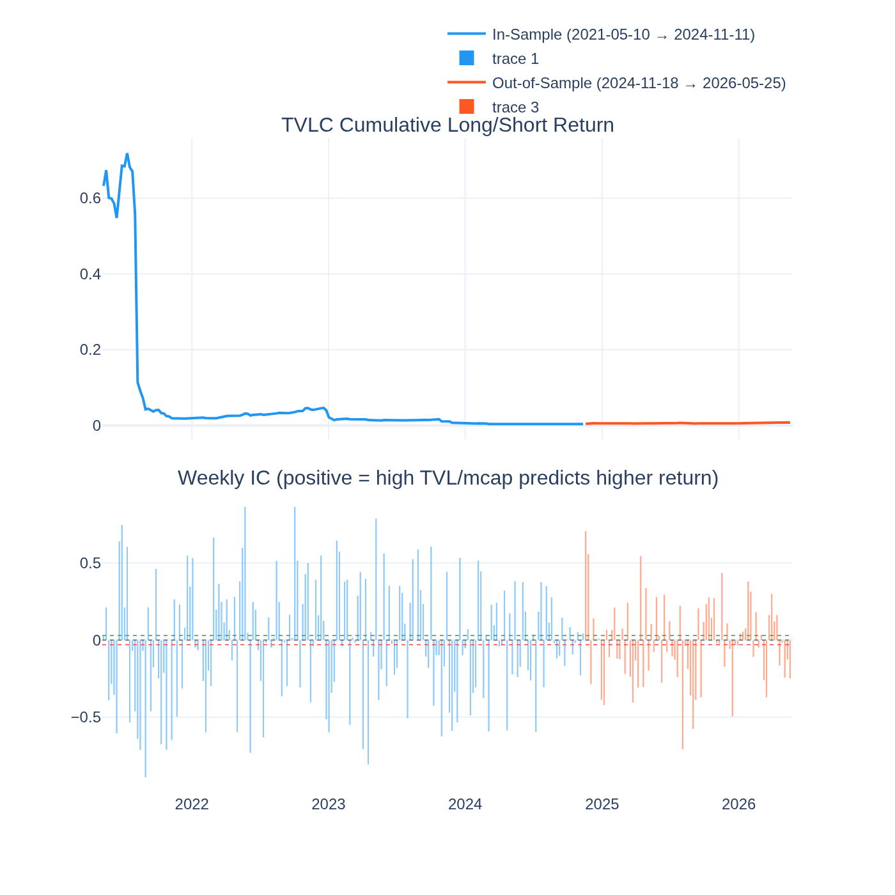
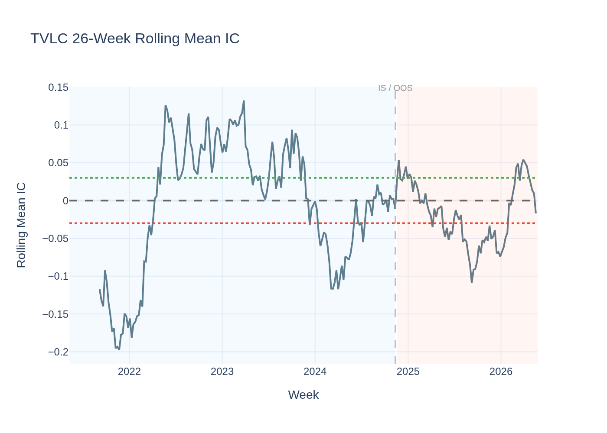
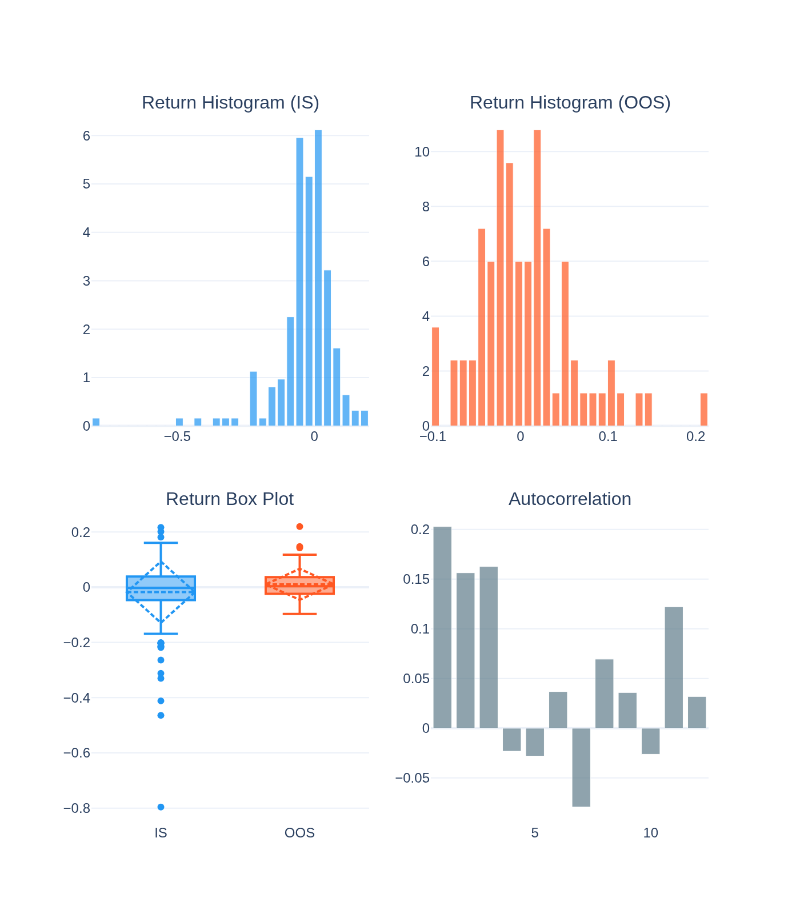
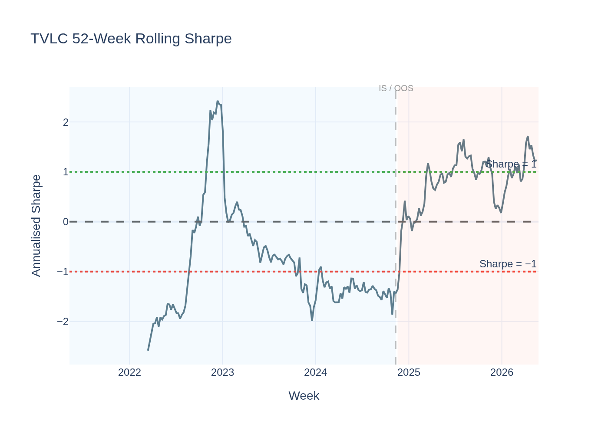
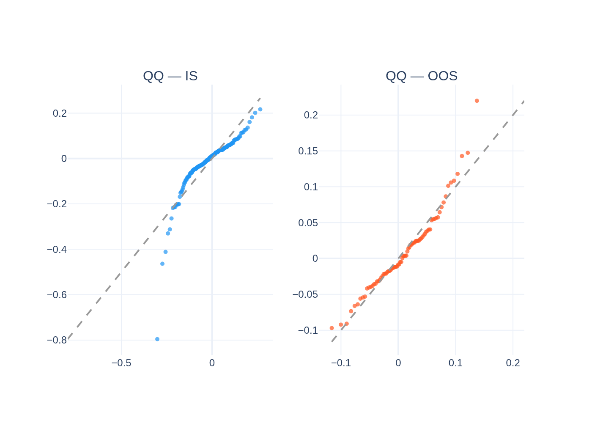
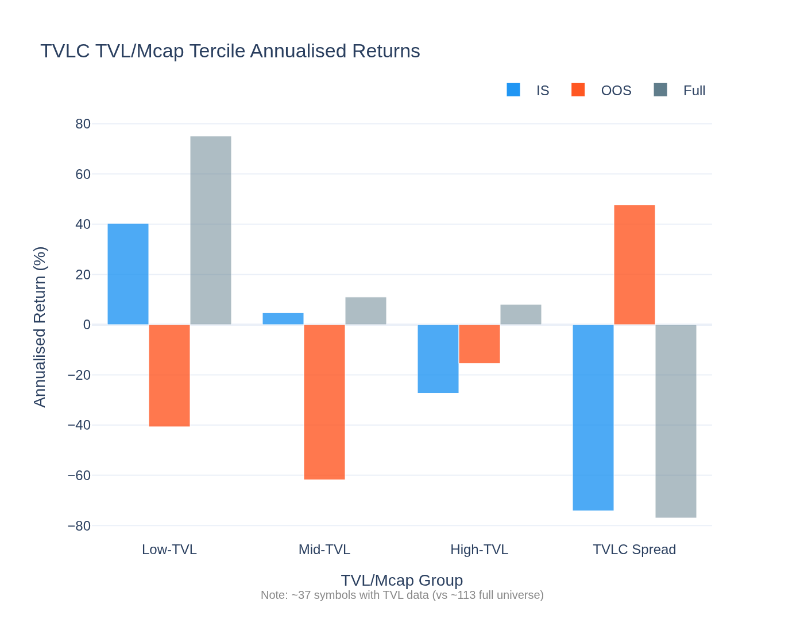
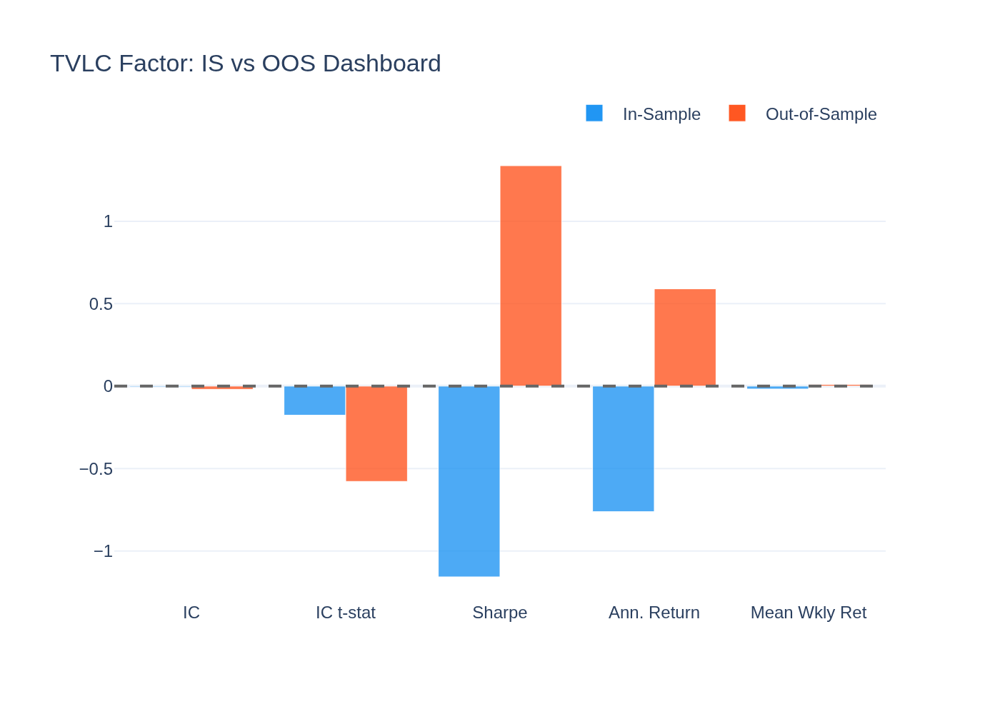
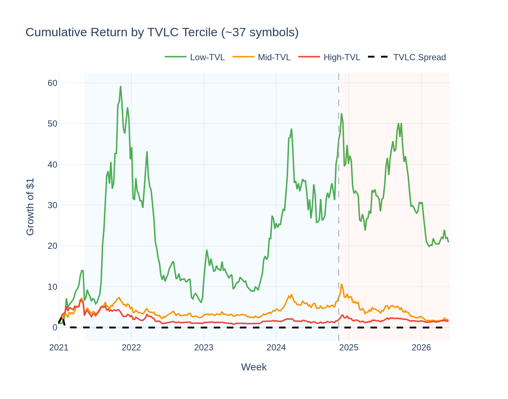
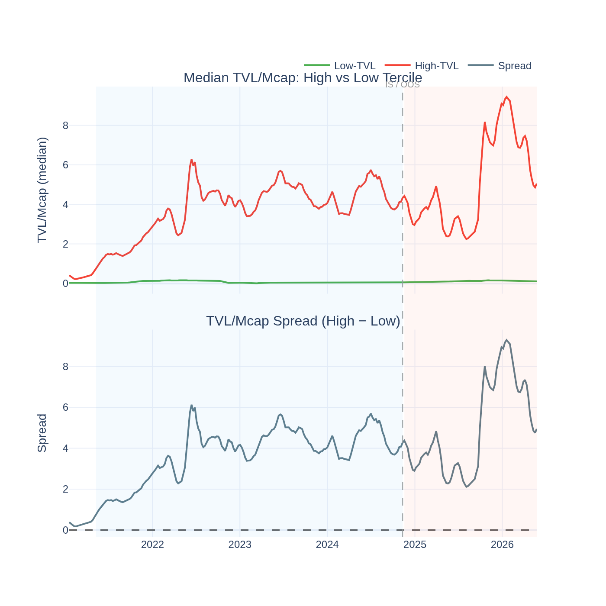

# TVLC (TVL/Mcap) Factor — Analysis Report

*Generated by `19_tvlc_visualisation.py` from the Stage-09 5-year panel.*

*Universe note: Only ~37 symbols have TVL data (vs ~113 in the full universe).
Results are less stable than price-based factors.*

---

## The Idea in Plain English

**TVL** (Total Value Locked) is the total amount of crypto assets deposited into a
DeFi protocol — think of it as the "deposits" in a decentralized bank. **TVL/Mcap**
is the ratio of these deposits to the protocol's market capitalisation.

A high TVL/Mcap ratio means: the protocol is processing a lot of value relative to what
investors are willing to pay for it. A "value investor" might read this as cheap — the
protocol has real usage, but the market hasn't fully priced it in yet.

Each week:
- **Buy** protocols with the highest TVL/Mcap (high usage, potentially undervalued)
- **Short** protocols with the lowest TVL/Mcap (low usage, potentially overvalued)

---

## The Short Answer

**Priced risk — but the premium runs in the wrong direction.**

The Giglio-Xiu model finds λ = **-185.2%/yr**, t = **-4.71** — highly significant,
but *negative*. This means: protocols that load heavily on the TVLC factor (high TVL/mcap)
earn **less** over the long run, not more. High TVL/mcap is a **negative** risk exposure.

This supports the **"TVL Irrelevance" thesis** (Hartmann 2025): TVL is already
fully priced into DeFi valuations. Buying protocols because they have high TVL
doesn't earn a premium — it earns a discount.

---

## Why the Premium Is Negative

**1. TVL chases performance, not the other way around.**
When a protocol does well (price rises), TVL flows in as investors deposit assets to
earn yield. By the time TVL/mcap looks high, the price run-up has already happened.

**2. Yield farming inflates TVL temporarily.**
Many DeFi protocols artificially inflate TVL through liquidity mining incentives. High
TVL from incentivised liquidity is not a genuine signal of product-market fit — it's
a temporary crowding-in that unwinds when incentives stop.

**3. High TVL/mcap marks an overinvested DeFi protocol.**
A protocol with very high TVL relative to its mcap may be a "TVL trap" — users have
locked up funds that are now capital-inefficient, earning low yields while the token
performs poorly due to inflation from reward emissions.

**4. The negative GX premium is one of the strongest in the factor zoo.**
|t| = 4.71 puts TVLC among the top three most statistically significant
factors (alongside VolC and MAXRET). The signal is strong — just pointing the other
direction from what intuition suggests.

---

## Return Distribution

| Statistic | IS | OOS |
|---|---|---|
| Mean weekly return | -1.787% | 1.047% |
| Std (weekly) | 11.136% | 5.648% |
| Skewness | -2.72 | 0.92 |
| Excess Kurtosis | 14.38 | 1.82 |

---

## Statistical Tests

### Giglio-Xiu Pricing Result

Full GX (K_hidden = 2): **λ = -185.2%/yr, t = -4.71** — highly significant.
One of the three strongest GX results in the full factor zoo. Assets with high TVL/mcap
exposure earn significantly less over the long run.

### Newey-West t-stat on IC

IC is not a primary lens for TVLC — it is a fundamental/pricing factor, not a weekly
ranking signal. The IC from the limited ~37 symbol universe is computed and
shown for completeness; it is not a primary test.

### ADF Stationarity Test

- ADF: **-7.230**, p = **0.0000**
- **Stationary**

---

## Visualisations

### Cumulative Return & Weekly IC

### Rolling Mean IC

### Return Distribution

### Rolling Sharpe Ratio

### QQ-Plot vs Normal Distribution

### TVL/Mcap Tercile Returns

Note limited universe (~37 symbols). The High-TVL tercile often underperforms
the Low-TVL tercile — consistent with the negative GX premium.

### IS vs OOS Dashboard

### Cumulative Return by TVL/Mcap Tercile

### TVL/Mcap Spread Over Time

The spread between high and low TVL/mcap tercile medians over time. Periods where
the spread widens represent higher cross-sectional dispersion in DeFi usage. This
context is important: the factor only has information to work with when protocols
genuinely differ in their usage-to-valuation ratios.
