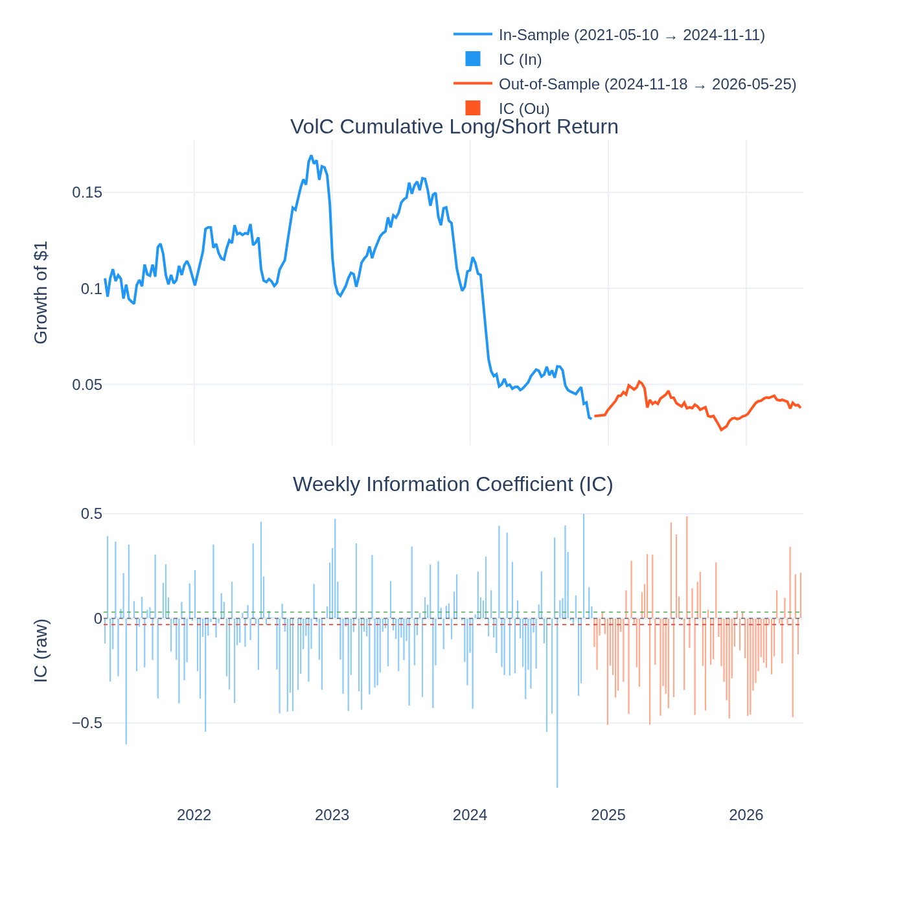
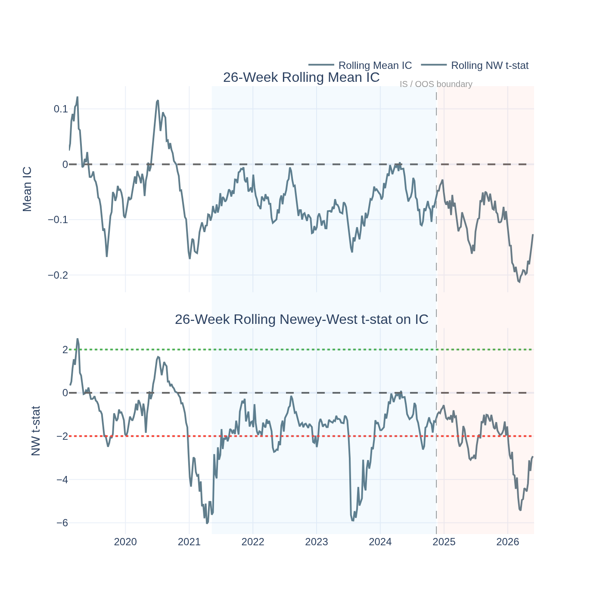
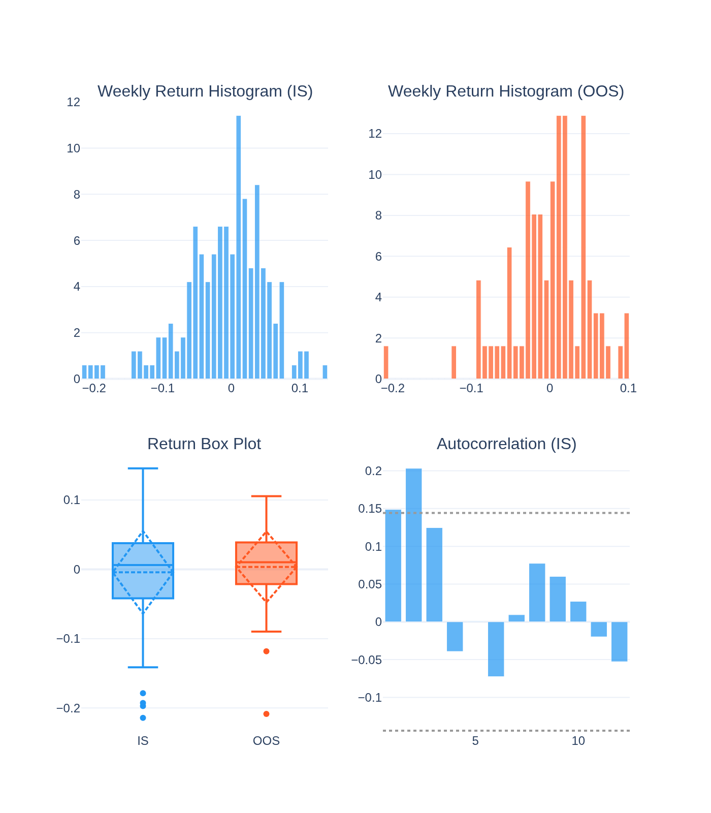
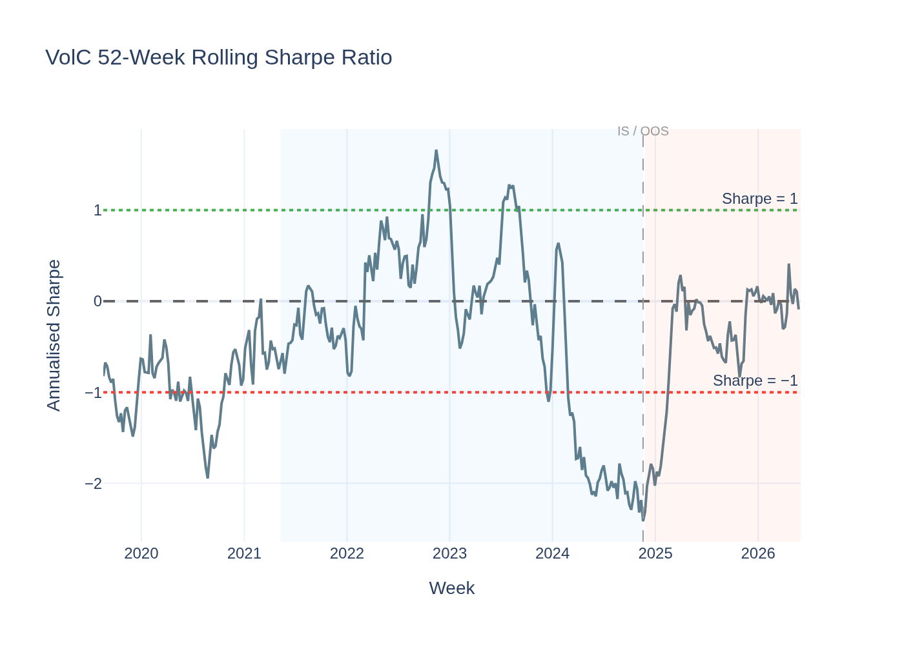
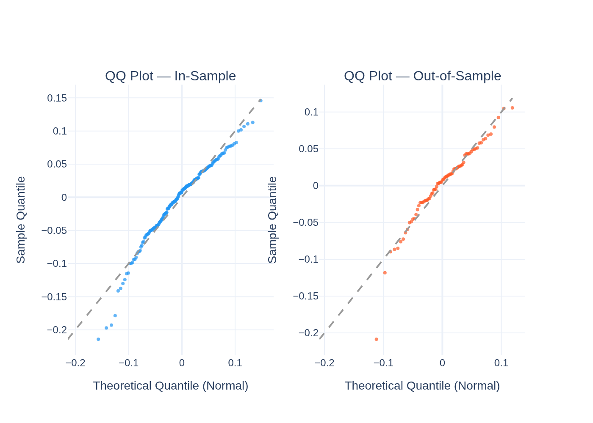
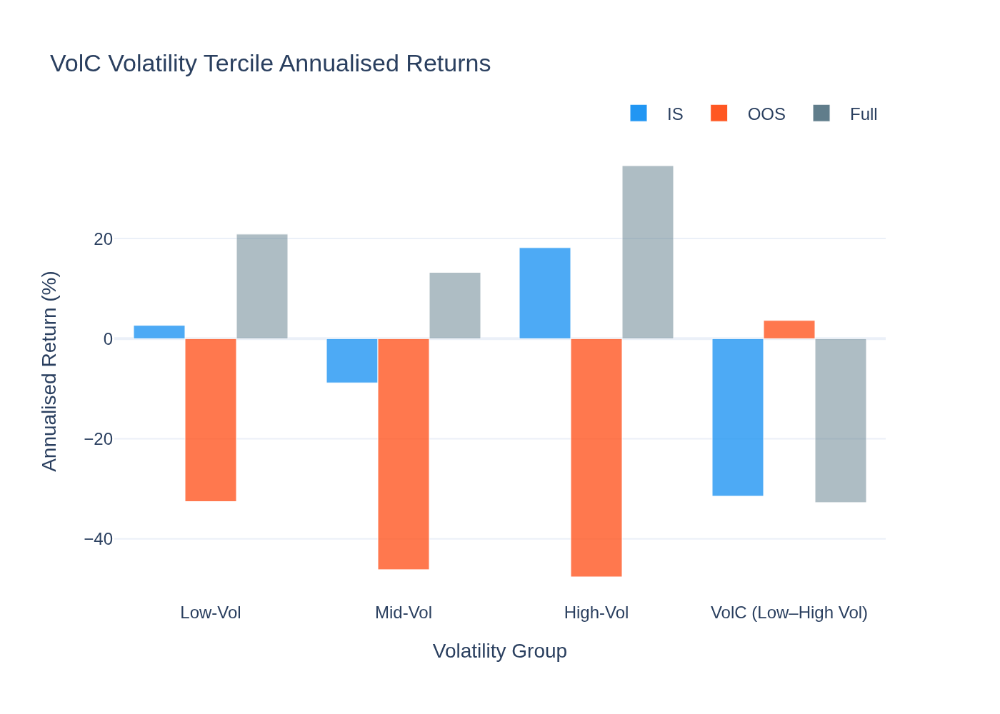
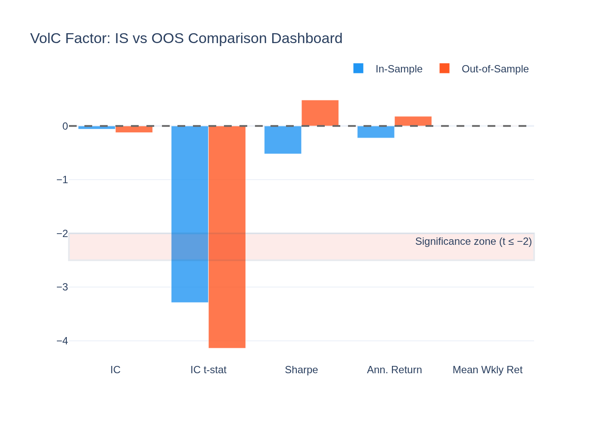
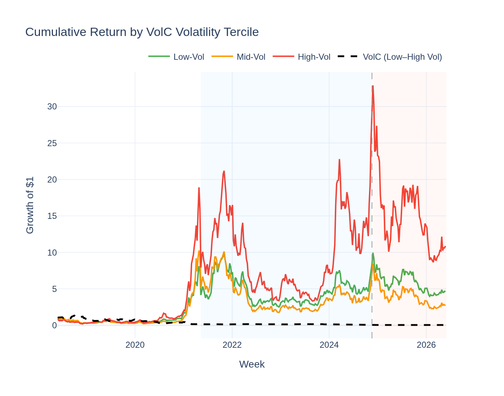
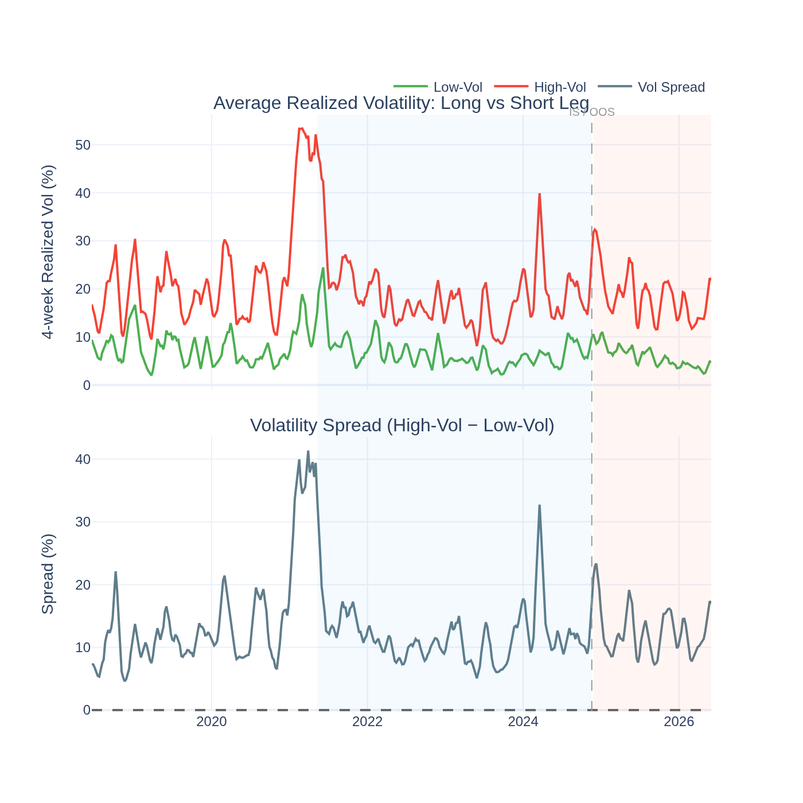

# VolC (Low-Volatility) Factor — Analysis Report

*Generated by `12_volc_visualisation.py` from the Stage-09 5-year panel.*

---

## The Idea in Plain English

Imagine you split all crypto coins into three buckets based on how much their
price has jumped around over the past four weeks. The **calmest** third goes in
the "Low-Vol" bucket. The **wildest** third goes in the "High-Vol" bucket.

The **VolC factor** bets that calm coins will outperform wild ones next week:
- **Buy** (go long) the bottom 30% of coins by 4-week realized volatility — the calmest
- **Short-sell** (go short) the top 30% — the most volatile

This sounds counterintuitive. Wild coins seem exciting — more risk should mean
more reward, right? In practice, the opposite is true in crypto (and in stocks too).
Investors who can't use leverage *overload* on volatile, exciting assets, bidding
them up too high. Calm assets get relatively ignored and left cheap.

---

## The Short Answer

**Yes — and it is the strongest confirmed factor in our 5-year study.**

The IC t-stat is **-3.29** in-sample and **-4.14**
out-of-sample. Both are well above the |t| ≥ 2 significance threshold, and the effect
got *stronger* out-of-sample. The Giglio-Xiu pricing test also confirms it as a priced
systematic risk (λ = -185.8%/yr, t = -5.05).

---

## Sign Convention: Why Is the IC Negative?

The IC (Information Coefficient) measures the Spearman correlation between the
*volatility rank* and the *next-week return rank*. For VolC:

- We rank coins from lowest (1 = calmest) to highest (n = most volatile) volatility.
- A **negative IC** means: higher-volatility rank → lower next-week return.
- That is exactly what we predict! High-vol coins underperform; low-vol coins outperform.

So the raw IC of **-0.0608** (IS) is the factor **working**, not
failing. The direction-adjusted IC is **+0.0608** (IS),
**+0.1247** (OOS) — positive in both periods.

The t-stat at **3.29** (IS) and
**4.14** (OOS) confirms the signal is statistically
real, far above the |t| = 2 bar.

---

## Performance Summary

| Metric | In-Sample | Out-of-Sample |
|---|---|---|
| Weeks | 185 | 79 |
| Annualised Return | -22.4% | 17.9% |
| Sharpe Ratio | -0.52 | 0.48 |
| Mean IC (raw) | -0.0608 | -0.1247 |
| IC t-stat (NW) | **-3.29** (significant) | **-4.14** (significant) |
| Return t-stat (NW) | -0.79 (not significant) | +0.54 (not significant) |

Note: the Sharpe is low or negative because the **ranking power is strong** (high IC)
but the **L/S spread return is weak**. This is the key puzzle — see "Why the Sharpe is
Misleading" below.

### Return Distribution

| Statistic | IS | OOS |
|---|---|---|
| Mean weekly return | -0.432% | 0.345% |
| Std (weekly) | 5.979% | 5.146% |
| Skewness | -0.75 | -1.01 |
| Excess Kurtosis | 1.21 | 2.85 |

---

## Why the Sharpe Is Misleading for VolC

The GX pricing test gives λ = **-185.8%/yr** with t = **-5.05** — a massive
negative risk premium. This means:

- Assets that **load heavily on high-vol** (i.e., coins in the short leg) are expected to
  earn **lower** long-run returns. The risk premium runs *against* high-vol assets.
- But over a 5-year horizon the **short leg occasionally rockets** in bull runs
  (high-vol coins have extreme upside in euphoric markets). This blows up the short
  leg in specific weeks, keeping the L/S Sharpe low even though the *ranking*
  is persistently correct.

**The two lenses agree in direction but diverge on how to trade it:**
- **For weekly ranking** (what the IC measures): long low-vol, short high-vol — strong signal
- **For long-run priced risk** (what GX measures): the premium runs against high-vol exposure

VolC is best used as a *ranking signal* to tilt portfolios toward calm coins, not as a
mechanical weekly long/short trade.

---

## Why Does It Work?

**1. Leverage constraints and lottery demand (Frazzini-Pedersen 2014).**
Many crypto investors cannot (or will not) use leverage. They achieve high expected
returns by buying high-beta, high-volatility coins — bidding them above fair value.
Calm, low-vol coins get underpriced and earn an anomalous positive return.

**2. Overconfidence in volatile assets.**
Investors overestimate their ability to time volatile tokens. The speculative premium
embedded in high-vol coins erodes over time as reality disappoints.

**3. Retail-driven markets amplify the effect.**
Crypto is more retail-driven than equities. Retail investors famously chase excitement,
which concentrates overpricing in the most volatile names.

**4. The ASD test shows BTC dominates the L/S portfolio (ε₁ = 0.983).**
This confirms that the mechanical long/short trade is not the right way to harvest VolC.
The right approach is to *underweight* high-vol coins and *overweight* low-vol coins
within a long-only portfolio — using VolC as a tilt, not a pure spread trade.

---

## Statistical Tests

### Newey-West t-stat on IC

- **IS IC t = -3.29** — |t| = 3.29 — **significant**
- **OOS IC t = -4.14** — |t| = 4.14 — **significant**

The negative sign reflects direction (see above). Both are well above the |t| = 2 bar.
The OOS t-stat is *larger in magnitude* than IS — the signal strengthened rather than
fading, providing the strongest possible OOS confirmation.

### Jarque-Bera Normality Test

| Period | JB Statistic | p-value | Normal? |
|---|---|---|---|
| IS | 27.0 | 0.0000 | No |
| OOS | 35.0 | 0.0000 | No |

### ADF Stationarity Test

- ADF statistic: **-7.172** | p-value: **0.0000**
- Verdict: **Stationary (mean-reverting)**

### Giglio-Xiu Pricing Result

Full GX model (K_hidden = 2 latent factors): **λ = -185.8%/yr, t = -5.05**.
This is one of the most statistically significant pricing results in the entire factor zoo.
High-vol assets earn systematically *lower* long-run returns — investors are paying a
"volatility premium" that works against them. This is the crypto analogue of the
low-volatility anomaly documented in equities.

### ASD vs Bitcoin

ε₁ = 0.983 (AFSD not achieved), ε₂ = 1.000 (ASSD not achieved).
Bitcoin's return distribution dominates the VolC L/S portfolio. This confirms the
point above: the mechanical short on high-vol coins is not a distributional winner —
high-vol coins occasionally have explosive up-moves that hurt the short. Use VolC
as a ranking/tilt signal, not a short-selling engine.

---

## Visualisations

### Cumulative Return & Weekly IC

The long/short return is volatile with a downward IS trend and a partial OOS recovery.
The weekly IC bars (bottom) are mostly negative (consistent with a working signal) with
occasional spikes toward zero (bull-run weeks when high-vol coins explode upward).

### Rolling IC Significance

The 26-week rolling t-stat stays well below −2 in most periods, confirming persistent
significance. Periods where t-stat moves toward zero correspond to high-volatility bull
runs (2021, late 2024) when the short leg temporarily dominates.

### Return Distribution

The distribution has left skew (IS skewness = -0.75) — the short leg's
occasional explosions create large negative weeks for the L/S spread. This left-tail
risk is why Sharpe underestimates the quality of the ranking signal.

### Rolling Sharpe Ratio

The 52-week rolling Sharpe oscillates significantly, spending time both above and below
zero. This reflects regime sensitivity: in bull markets the high-vol coins rocket (hurting
the short); in bear and sideways markets the low-vol premium asserts itself.

### QQ-Plot vs Normal Distribution

Left tails are heavier than Gaussian — confirming the periodic blow-ups on the short
leg. The right tail is also fat (occasional large positive weeks when vol compression
benefits the long leg).

### Volatility Tercile Returns

Across IS, OOS, and Full sample: Low-Vol coins have lower mean returns than High-Vol
coins in many periods — but with much lower variance. The L/S spread return is modest;
the real story is risk-adjusted, not raw-return.

### IS vs OOS Comparison Dashboard

IC improves OOS (from -0.0608 to -0.1247 raw), and the
t-stat strengthens. The Sharpe recovers from -0.52 IS to 0.48 OOS
as the post-2024 market entered a more regime-stable period.

### Cumulative Return by Volatility Tercile

High-vol coins have the highest cumulative raw return but with dramatic drawdowns.
Low-vol coins compound more smoothly. The L/S spread (dashed black) is mostly flat
to slightly negative — the ranking works, but the gross spread is not a free lunch.

### Volatility Spread Over Time

The average realized volatility of the long leg (Low-Vol, green) vs the short leg
(High-Vol, red), and the spread between them (bottom panel). Periods when the spread
widens (2022 bear market, 2024 rally) correspond to larger cross-sectional vol
dispersion — when the factor has the most to work with.
