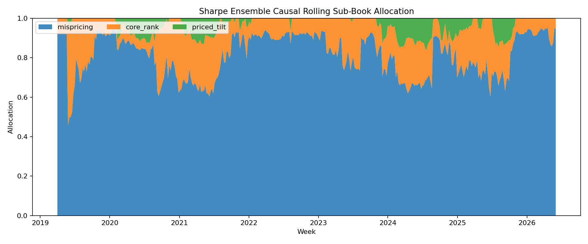

# Factor Ensemble Strategy

Generated by `06_factor_ensemble_strategy/run.py`.

This stage does not force every factor into one score. It builds separate
sub-books for robust weekly rankers, the MispricingM composite, and priced-risk
tilts, then allocates between those books using only prior realized book returns
plus the `engine.py` XGBoost regime probabilities.

Train/test split: weeks before `2024-12-02` are in-sample, and the
final 79 weeks are out-of-sample.

## Sub-Books

| Book | Factors | Purpose |
|---|---|---|
| MispricingM | RMOM1w, RMOM2w, SMBC, NetRel | Distributionally robust cross-sectional mispricing composite |
| Core Rank | VolC, MAXRET | Most reliable weekly rankers from the factor validation |
| Priced Tilt | CRASH8, BETA26, TVLC, SKEW52, NEWC | Small capped sleeve for GX-priced risks, not allowed to dominate |

The rolling allocator uses a 26-week lookback with a 8-week
warm-up. For week `t`, it scores only returns from weeks `< t`, blends that score
with a conservative base allocation, applies a regime confidence tilt, and caps
the priced-risk sleeve.

## Ensemble Modes

| Variant            | mispricing   | core_rank   | priced_tilt   |
|:-------------------|:-------------|:------------|:--------------|
| Sharpe Ensemble    | 81.0%        | 15.2%       | 3.8%          |
| Balanced Ensemble  | 54.9%        | 36.6%       | 8.5%          |
| Defensive Ensemble | 60.6%        | 35.6%       | 3.8%          |

## Full-Window Performance

| Strategy | Sharpe | AnnRet | AnnVol | MaxDD | Hit | Weeks |
|---|---:|---:|---:|---:|---:|---:|
| Sharpe Ensemble | +1.28 | +65.4% | 51.2% | -45.1% | 53% | 375 |
| Balanced Ensemble | +1.19 | +51.6% | 43.6% | -41.3% | 54% | 375 |
| Defensive Ensemble | +1.22 | +55.0% | 45.2% | -42.2% | 53% | 375 |
| mispricing | +1.25 | +77.4% | 62.0% | -46.3% | 54% | 375 |
| core_rank | +0.52 | +18.5% | 35.2% | -49.4% | 49% | 375 |
| priced_tilt | +0.32 | +11.7% | 37.1% | -49.3% | 47% | 375 |
| EW Market | +0.82 | +66.1% | 80.4% | -80.6% | 55% | 374 |
| BTC | +0.92 | +53.9% | 58.9% | -75.2% | 52% | 374 |

## In-Sample Performance

| Strategy | Sharpe | AnnRet | AnnVol | MaxDD | Hit | Weeks |
|---|---:|---:|---:|---:|---:|---:|
| Sharpe Ensemble | +1.42 | +77.9% | 55.0% | -45.1% | 54% | 296 |
| Balanced Ensemble | +1.33 | +63.0% | 47.2% | -41.3% | 55% | 296 |
| Defensive Ensemble | +1.36 | +66.7% | 48.9% | -42.2% | 53% | 296 |
| mispricing | +1.38 | +91.4% | 66.4% | -46.3% | 55% | 296 |
| core_rank | +0.64 | +25.0% | 38.7% | -49.4% | 49% | 296 |
| priced_tilt | +0.49 | +18.8% | 38.4% | -49.3% | 49% | 296 |
| EW Market | +1.14 | +95.0% | 83.5% | -80.6% | 58% | 296 |
| BTC | +1.15 | +72.5% | 63.1% | -75.2% | 54% | 296 |

## Out-of-Sample Performance

| Strategy | Sharpe | AnnRet | AnnVol | MaxDD | Hit | Weeks |
|---|---:|---:|---:|---:|---:|---:|
| Sharpe Ensemble | +0.57 | +18.7% | 33.1% | -19.7% | 49% | 79 |
| Balanced Ensemble | +0.37 | +9.1% | 24.8% | -13.7% | 52% | 79 |
| Defensive Ensemble | +0.43 | +11.2% | 26.1% | -15.1% | 52% | 79 |
| mispricing | +0.60 | +24.8% | 41.4% | -25.9% | 51% | 79 |
| core_rank | -0.37 | -5.9% | 15.9% | -18.8% | 46% | 79 |
| priced_tilt | -0.47 | -14.7% | 31.5% | -32.3% | 39% | 79 |
| EW Market | -0.66 | -43.4% | 65.3% | -65.2% | 45% | 78 |
| BTC | -0.44 | -16.7% | 37.6% | -46.7% | 46% | 78 |

## Baseline & ablation variants (audit Findings 5 & 6)

The headline ensembles depend on two sets of hardcoded priors: the regime tilt in
`regime_tilt()` and the priced-tilt cap. These baselines isolate each choice. All
use the Sharpe Ensemble base allocation; only one knob changes at a time.

OOS (79 weeks) net performance:

| Strategy | Sharpe | AnnRet | AnnVol | MaxDD | Hit | Weeks |
|---|---:|---:|---:|---:|---:|---:|
| SE Priced-Tilt Off | +0.63 | +22.1% | 34.9% | -19.9% | 52% | 79 |
| SE Priced-Tilt 5% cap | +0.59 | +20.2% | 34.0% | -19.6% | 51% | 79 |
| SE No Regime Tilt | +0.52 | +17.0% | 32.5% | -20.9% | 49% | 79 |
| MispricingM Only | +0.60 | +24.8% | 41.4% | -25.9% | 51% | 79 |

- **SE Priced-Tilt Off / 5% cap** (Finding 6): the priced-risk sleeve is OOS-toxic
  on its own (Priced Tilt book OOS Sharpe is negative above). Zeroing or shrinking
  its cap shows how much it drags the ensemble. If "Priced-Tilt Off" beats the
  headline SE, the sleeve should be cut, not just capped.
- **SE No Regime Tilt** (Finding 5): replaces the regime-tilt multipliers with 1.0.
  The gap vs the headline Sharpe Ensemble is the *measured* value added by regime
  conditioning — not an assumed benefit.
- **MispricingM Only**: the mispricing sub-book traded alone. Because the Sharpe
  Ensemble already routes ~80% to MispricingM, this quantifies the single-factor
  dependency the audit flagged.

### Sharpe Ensemble sensitivity grid

OOS Sharpe under regime-tilt on/off x priced-tilt cap. A headline that barely moves
across this grid is robust to the priors; large swings are a fragility flag.

| regime_tilt   |   priced_cap |   oos_sharpe |   oos_ann_return |   oos_max_dd |
|:--------------|-------------:|-------------:|-----------------:|-------------:|
| on            |         0.18 |     0.565309 |         0.186893 |    -0.197332 |
| on            |         0.05 |     0.594638 |         0.202094 |    -0.196195 |
| on            |         0    |     0.633491 |         0.220886 |    -0.199287 |
| off           |         0.18 |     0.524423 |         0.170245 |    -0.208796 |
| off           |         0.05 |     0.596729 |         0.204759 |    -0.202384 |
| off           |         0    |     0.63697  |         0.224955 |    -0.206449 |

## Activation & regime-tilt priors — derivation (audit Finding 5)

The multipliers in `regime_tilt()` are economic priors, not fitted parameters.
They are documented here so they are auditable rather than magic numbers:

| Book | RiskOn lift | RiskOff lift | Rationale |
|---|---|---|---|
| mispricing | `+0.25*p_RiskOn` | `-0.10*p_RiskOff` | Mispricing reversals pay most when risk appetite is returning; trimmed slightly in risk-off when dispersion collapses. |
| core_rank | none | `+0.35*p_RiskOff` | Low-vol / lottery-reversal rankers are defensive — lift them when the market de-risks. |
| priced_tilt | `0.55 + 0.35*p_RiskOn` | (scales down) | Speculative beta/skew/crash premia are risk-on phenomena; the base 0.55 keeps the sleeve small by construction. |

All multipliers are bounded and multiplied by a confidence term
`0.5 + 0.5*max(p_state)`, so an unsure regime call pulls every book toward its base
weight. The sensitivity grid above is the robustness check on these values: the
"No Regime Tilt" column is the all-multipliers-equal-1.0 limit.

## Plots

## Artifacts

- `artifacts/data/*_book_allocations.parquet`
- `artifacts/data/*_weekly_pnl.parquet`
- `artifacts/data/*_weekly_weights.parquet`
- `artifacts/manifests/metrics.json`

## Caveat

This is still a research allocator. The improvement target is OOS robustness:
priced-risk factors are kept small unless their own realized sub-book performance
supports more capital, and the XGBoost regime detector sizes risk rather than
directly flipping every factor signal.
