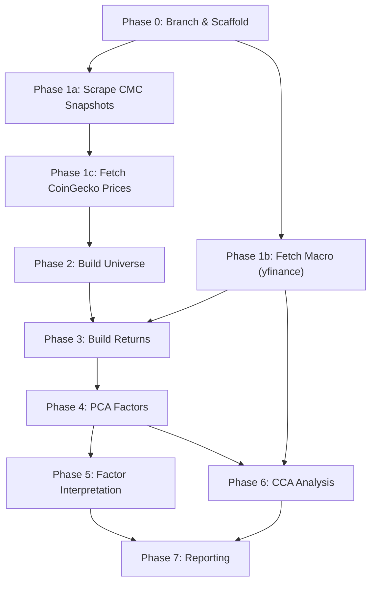

# Dynamic Mid-Cap Crypto Universe: PCA + CCA Roadmap (v2)

## Goal

Build a **weekly point-in-time ranked mid-cap crypto universe** (ranks #21–#70 by market cap), extract latent factors via **PCA on returns**, provide economic intuition using asset metadata, then conduct **CCA** with BTC, SPY, and VIX to identify cross-asset comovements. Timeframe: **Jan 2021 → present** (post-COVID institutional regime).

All work lives on a new git branch `feature/midcap-pca-cca`. Nothing is pushed.

---

## Resolved Design Decisions

| Question | Decision |
|:---------|:---------|
| Universe superset | Top 200 via CoinGecko + CMC historical snapshots as primary ranking source |
| Stablecoin exclusion | Yes — exclude stablecoins, wrapped, bridged before ranking |
| Rank buffer | ±5 hysteresis (exit if rank > 75, enter only if rank ≤ 20) |
| PCA window | 12-week rolling with **EWMA weighting** (halflife ~4 weeks) |
| PCA stabilisation | Eigenvector sign alignment + **Random Matrix Theory denoising** |
| Component selection | **Data-driven**: parallel analysis (compare eigenvalues to random matrix) |
| Calendar alignment | NYSE calendar, **Friday 4:00 PM ET** close for both crypto and TradFi |
| Supply dilution | **Yes** — adjust market cap rankings for circulating supply expansion |
| Portfolio split | **80/20 long/short** — asymmetric to manage crypto short-side tail risk |
| CMC scrape scope | Scrape **all 100 rows** per snapshot — filter to #21–#70 post-export |

---

## Circulating Supply Dilution Handling

> [!IMPORTANT]
> **Problem:** Crypto market cap = `price × circulating_supply`. If a token's supply doubles via unlocks/vesting while price stays flat, its market cap doubles — potentially pushing it into the #21–#70 bracket artificially. Buying such a token means buying dilution, not growth.

**Solution — Two-layer defence:**

1. **Supply-adjusted ranking metric:** Instead of raw `market_cap`, rank by a **dilution-penalised market cap**:
   ```
   adjusted_mcap = market_cap × (1 - supply_growth_rate_4w)
   ```
   Where `supply_growth_rate_4w = (circ_supply_t / circ_supply_{t-4w}) - 1`. Tokens with >10% 4-week supply growth get penalised in ranking. This prevents unlock-cliff tokens from entering the universe.

2. **Supply growth as metadata for PCA interpretation:** Even after adjusting the ranking, track `supply_growth_rate` as an asset characteristic in Phase 5 (factor interpretation). If a PC loads heavily on high-dilution tokens, that's economically meaningful.

**Data source for historical supply:** CoinGecko's `market_chart/range` endpoint returns `market_caps` and `prices` daily. We can derive `implied_circulating_supply = market_cap / price` for each day. This avoids needing the Enterprise-only `/circulating_supply_chart` endpoint.

---

## CMC Historical Snapshots Strategy

> [!NOTE]
> CoinMarketCap offers weekly historical snapshot pages at `coinmarketcap.com/historical/YYYYMMDD/`. These provide exact point-in-time rankings. However, the table data is **JavaScript-rendered** — simple HTTP requests return only navigation HTML. We need **Playwright** to extract the data.

**Approach: Hybrid CMC + CoinGecko**

| Source | Role | Method |
|:-------|:-----|:-------|
| **CMC snapshots** | Primary: weekly top-100 rankings (rank, name, symbol, market cap, price, volume, circulating supply, 7d change) | Playwright scraper |
| **CoinGecko** | Secondary: daily price/market cap time series for all assets that ever appear in CMC rankings | REST API (existing pipeline) |

**Why hybrid:** CMC gives us the authoritative point-in-time rankings (solves survivorship bias perfectly). CoinGecko gives us the granular daily price data needed to compute weekly returns, volatility, and derived features. CMC snapshots are weekly — CoinGecko fills the gaps.

**CMC scrape schedule:** Weekly snapshots from `20210103` to present — approximately **280 snapshots**. CMC pages advance by 7 days (e.g., `20210103`, `20210110`, `20210117`...). Each page shows ~200 coins with rank, name, symbol, market cap, price, volume, circulating supply, and 7d % change.

**Scrape all 100 rows, filter later:** Do NOT restrict the scraper to only pull ranks #21–#70. Scrape the entire top 100 every time. This guarantees that if strategy parameters change later (e.g., expanding to #15–#85), you don't have to re-scrape 5 years of pages.

### CMC Anti-Bot Countermeasures

> [!WARNING]
> CoinMarketCap uses advanced Cloudflare protection. A vanilla Playwright instance will quickly trigger CAPTCHAs or 403 errors when looping through hundreds of pages.

**Three critical technical requirements:**

1. **Stealth mode:** Use `playwright-stealth` package to inject scripts that hide automated browser fingerprints. Additionally, rotate a **random User-Agent string** per session (use `fake-useragent` or a static list).

2. **Auto-scroll for lazy loading:** CMC optimises page performance by only rendering table rows visible on screen. If you scrape immediately after page load, you'll capture only the top 10–20 coins — completely missing the #21–#70 target. Implement a **scroll-to-bottom loop** in Playwright:
   ```python
   # Scroll down incrementally to force lazy-load of all 100 rows
   while True:
       prev_height = await page.evaluate("document.body.scrollHeight")
       await page.evaluate("window.scrollTo(0, document.body.scrollHeight)")
       await page.wait_for_timeout(800)
       new_height = await page.evaluate("document.body.scrollHeight")
       if new_height == prev_height:
           break
   ```

3. **Jittered delays:** Do NOT use a fixed 2–3 second delay — identical intervals are trivially detectable. Use randomised delays:
   ```python
   time.sleep(random.uniform(3, 7))  # Mimics human browsing cadence
   ```

**Clean numeric parsing:** CMC displays values with `$` and `,` formatting. Strip these before converting to float. Values displayed as `"--"` (common for older tokens with unverified circulating supply) should be parsed as `NaN` via `pd.to_numeric(..., errors='coerce')`.

---

## Directory Structure

```
09_midcap_pca_cca/
├── README.md
├── requirements.txt
├── config/
│   ├── settings.yaml              # All tuneable parameters
│   ├── exclusion_list.yaml        # Static stablecoin/wrapped/bridged exclusions
│   └── coingecko_id_overrides.yaml  # Manual CMC symbol → CoinGecko ID mappings
├── src/
│   ├── __init__.py
│   ├── 00_scrape_cmc_snapshots.py # Playwright: scrape CMC weekly rankings
│   ├── 01_fetch_coingecko.py      # CoinGecko: daily price/mcap for all CMC assets
│   ├── 02_fetch_macro.py          # yfinance: SPY, VIX daily
│   ├── 03_build_universe.py       # Rank, filter, apply hysteresis → weekly universe
│   ├── 04_build_returns.py        # Weekly return matrix, cross-sectional z-score
│   ├── 05_pca_factors.py          # Rolling EWMA PCA + RMT denoising
│   ├── 06_factor_interpretation.py # Map PCs to economic characteristics
│   ├── 07_cca_analysis.py         # CCA: crypto PCs × [BTC, SPY, VIX]
│   ├── 08_report.py               # Generate all figures + summary tables
│   └── utils/
│       ├── __init__.py
│       ├── data_io.py             # Read/write parquet, caching
│       ├── missing_data.py        # Pairwise cov, nearest PSD, EM-PCA
│       ├── rmt.py                 # Random Matrix Theory denoising
│       └── calendar.py            # NYSE calendar, Friday 4pm ET alignment
├── data/
│   ├── raw/                       # Immutable snapshots
│   │   ├── cmc_snapshots/         # One JSON per weekly snapshot
│   │   └── coingecko/             # Chunked daily ticks per coin
│   ├── clean/                     # Standardised panels
│   └── features/                  # PCA scores, CCA variates
├── artifacts/
│   ├── manifests/
│   └── figures/
└── notebooks/                     # Optional EDA
```

---

## Proposed Changes

### Phase 0 — Branch & Scaffold

#### [NEW] Git branch `feature/midcap-pca-cca`
- Create from `main`, do not push
- Create full directory structure
- Copy `01_Data_Collection/src/clients.py` into `09_midcap_pca_cca/src/utils/` (or add to `sys.path`)

#### [NEW] `requirements.txt`
```
pandas>=2.0
numpy>=1.24
scipy>=1.10
scikit-learn>=1.3
matplotlib>=3.7
plotly>=5.15
yfinance>=0.2.28
pyarrow>=12.0
pyyaml>=6.0
requests>=2.31
tenacity>=8.2
pandas_market_calendars>=4.3
playwright>=1.40
playwright-stealth>=1.0.6
fake-useragent>=1.4
```

> [!NOTE]
> After installing, run `playwright install chromium` to download the browser binary.

#### [NEW] `config/settings.yaml`
All tuneable parameters in one place — universe bounds, PCA window/halflife, CCA settings, paths.

#### [NEW] `config/exclusion_list.yaml`
Static list of stablecoins (USDT, USDC, DAI, BUSD, UST, FRAX, ...), wrapped tokens (WBTC, WETH, ...), and bridged tokens to exclude from ranking. Maintained manually — safer than relying on retroactive CoinGecko category changes.

---

### Phase 1 — Data Collection (3 parallel scripts)

#### [NEW] `src/00_scrape_cmc_snapshots.py`

**Purpose:** Scrape CoinMarketCap weekly historical snapshot pages to get authoritative point-in-time rankings.

**Logic:**
1. Generate all weekly snapshot dates from `20210103` to present (every Sunday, ~280 dates)
2. For each date, check if `data/raw/cmc_snapshots/{date}.json` already exists (skip if cached)
3. Launch **Playwright** (headless Chromium) with `playwright-stealth` applied and a randomised User-Agent
4. Navigate to `coinmarketcap.com/historical/{date}/`
5. **Auto-scroll** to bottom of page in a loop to force lazy-loading of all 100 table rows (see scroll logic in CMC Strategy section above)
6. Once scrolling stabilises, extract **all rows** from the rendered table: `[rank, name, symbol, market_cap, price, volume_24h, circulating_supply, change_7d]`
7. **Clean numeric values:** strip `$` and `,`, convert `"--"` → `NaN` via `pd.to_numeric(errors='coerce')`
8. Save as JSON per snapshot. Use **jittered delay** (`random.uniform(3, 7)` seconds) between pages
9. After all snapshots are scraped, combine into `data/clean/cmc_rankings_weekly.parquet`
10. Log: total snapshots scraped, rows per snapshot, any dates that failed or had fewer than 80 rows

**Fallback:** If CMC blocks scraping or data is incomplete, fall back to the CoinGecko-superset approach (pull top 200, rank locally). The pipeline should handle both paths gracefully — `03_build_universe.py` should accept either CMC or CoinGecko as ranking source via a config flag.

**Output:** `data/clean/cmc_rankings_weekly.parquet` — columns: `[snapshot_date, rank, name, symbol, market_cap_usd, price_usd, volume_24h_usd, circulating_supply, change_7d_pct]` — **all 100 rows per snapshot** (filter to #21–#70 happens in Phase 2)

#### [NEW] `src/01_fetch_coingecko.py`

**Purpose:** Pull daily price + market cap from CoinGecko for every unique symbol that appears in the CMC rankings.

**Logic:**
1. Load `cmc_rankings_weekly.parquet` → extract unique symbols
2. Map CMC symbols to CoinGecko IDs (use `coins/list` + manual overrides in `config/coingecko_id_overrides.yaml`)
3. For each coin, fetch `market_chart/range` with yearly chunking (reuse logic from `01_Data_Collection/src/pipeline.py` lines 456–548)
4. Cache per-coin-per-chunk JSON files (identical caching pattern as existing pipeline)
5. Combine into `data/clean/coingecko_daily.parquet` — columns: `[date, coingecko_id, symbol, price_usd, market_cap_usd, total_volume_usd]`
6. **Derive** `implied_circulating_supply = market_cap_usd / price_usd` for each row (used for supply dilution check)

**Output:** `data/clean/coingecko_daily.parquet`

#### [NEW] `src/02_fetch_macro.py`

**Purpose:** Pull daily close data for SPY and VIX via `yfinance`.

**Logic:**
1. `yf.download(["SPY", "^VIX"], start="2021-01-01", interval="1d")`
2. BTC: extract from `coingecko_daily.parquet` (already fetched)
3. Combine into `data/clean/macro_daily.parquet` — columns: `[date, asset, close, volume]`

**Output:** `data/clean/macro_daily.parquet`

**Dependencies:** Phase 1a (CoinGecko) for BTC data, but SPY/VIX can run independently.

---

### Phase 2 — Universe Construction

#### [NEW] `src/03_build_universe.py`

**Purpose:** At each weekly rebalance date, apply exclusions, compute dilution-adjusted rankings, apply hysteresis, and select the final #21–#70 universe.

**Logic:**
1. Load `cmc_rankings_weekly.parquet` and `config/exclusion_list.yaml`
2. For each weekly snapshot date `t`:
   a. **Exclude** stablecoins, wrapped, bridged tokens (static exclusion list)
   b. **Re-rank** remaining coins by `market_cap_usd` (after exclusions, ranks shift)
   c. **Compute supply growth:** Using CoinGecko daily data, compute `supply_growth_4w = (implied_supply_t / implied_supply_{t-4w}) - 1`
   d. **Dilution-adjusted market cap:** `adj_mcap = market_cap × max(0, 1 - supply_growth_4w)` (clamp at 0 to handle edge cases)
   e. **Re-rank** by `adj_mcap`
   f. **Apply hysteresis buffer:**
      - Asset was in universe at `t-1` and current rank ≤ 75 → stays
      - Asset was NOT in universe at `t-1` and current rank ≤ 70 → enters
      - Asset was in universe at `t-1` and current rank > 75 → exits
      - New asset entering must have rank ≤ 20 to be excluded (i.e., it's now a large cap)
   g. Record final universe: `[rebalance_date, coingecko_id, symbol, raw_rank, adj_rank, market_cap_usd, adj_mcap, supply_growth_4w, is_entry, is_exit]`

3. Output summary stats per week: `n_assets, n_entries, n_exits, turnover_pct, median_mcap, avg_supply_growth`

**Outputs:**
- `data/clean/universe_weekly.parquet` — per-asset-per-week membership + metadata
- `data/clean/universe_summary.parquet` — per-week aggregate stats

**Dependencies:** Phase 1 outputs

---

### Phase 3 — Return Matrix

#### [NEW] `src/04_build_returns.py`

**Purpose:** Build the weekly return matrix for PCA input.

**Logic:**
1. Load `universe_weekly.parquet` and `coingecko_daily.parquet`
2. **Align to NYSE Friday 4:00 PM ET:**
   - Use `pandas_market_calendars` to get NYSE schedule
   - For each week, the rebalance point is **Friday close** (4:00 PM ET)
   - Crypto price at that moment: use the CoinGecko daily price for that Friday (CoinGecko daily data is 00:00 UTC = approximately the previous day's close, so use the Saturday 00:00 UTC data point as proxy for Friday 4pm ET, or interpolate)
   - If Friday is an NYSE holiday, use Thursday's close
3. Compute **weekly log returns**: `r_t = ln(p_t / p_{t-1})`
4. Build **wide matrix**: rows = rebalance dates (~280), columns = all unique assets that ever appear (~150–200). NaN where asset is not in universe that week.
5. **Cross-sectional z-score** per week: for each row, subtract the mean and divide by std of non-NaN values only
6. Also output raw (un-standardised) returns

**Outputs:**
- `data/features/returns_weekly_raw.parquet`
- `data/features/returns_weekly_zscore.parquet`
- `data/features/asset_metadata_weekly.parquet` — per-asset-per-week: market cap, volume, rank, sector, supply growth

**Dependencies:** Phase 2

---

### Phase 4 — PCA Factor Extraction

#### [NEW] `src/utils/rmt.py`

**Purpose:** Random Matrix Theory covariance denoising (Marchenko–Pastur).

**Logic:**
1. Given a correlation matrix `C` of shape `(N, N)` estimated from `T` observations:
2. Compute the Marchenko–Pastur bounds: `λ± = (1 ± √(N/T))²`
3. Eigendecompose `C`
4. Replace eigenvalues below `λ+` with their average (noise eigenvalues → constant)
5. Reconstruct the denoised correlation matrix
6. This removes estimation noise from short windows, stabilising PCA

#### [NEW] `src/utils/missing_data.py`

**Purpose:** Handle NaN-heavy return matrices for PCA.

**Methods:**
1. **Pairwise covariance:** Compute cov(i,j) using overlapping weeks only. Require ≥ 8 shared weeks. If not PSD → Higham nearest-PSD projection.
2. **KNN imputation** (fallback): `sklearn.impute.KNNImputer(n_neighbors=5)`

#### [NEW] `src/05_pca_factors.py`

**Purpose:** Rolling PCA with EWMA weighting, RMT denoising, sign alignment, and data-driven component selection.

**Logic — for each rebalance date `t` (after 12-week burn-in):**

1. **Window selection:** Extract the trailing 12 weeks of z-scored returns for assets in the universe at time `t`
2. **EWMA weighting:** Apply exponential weights with halflife = 4 weeks to the return observations. Recent weeks get more influence on the covariance matrix:
   ```
   weights = exp(-ln(2) × lag / halflife)  # lag = 0 for most recent week
   weighted_returns = returns × sqrt(weights)  # scale rows before computing cov
   ```
3. **Covariance estimation:** Compute weighted covariance matrix. Handle missing data via pairwise method if needed.
4. **RMT denoising:** Apply Marchenko–Pastur denoising to the correlation matrix (convert cov → corr, denoise, convert back)
5. **Eigendecomposition:** Extract eigenvalues and eigenvectors from the denoised matrix
6. **Component selection via parallel analysis:**
   - Generate 100 random matrices of the same shape (N assets × T weeks) from i.i.d. normal
   - Compute the 95th percentile eigenvalue for each component position
   - Retain real eigenvalues that exceed the 95th percentile random threshold
   - This is data-driven — typically selects 2–5 components for crypto
7. **Sign alignment:** For each eigenvector, compute cosine similarity with previous week's corresponding eigenvector. Flip sign if similarity is negative.
8. **PC scores:** Project the current week's cross-sectional returns onto the retained eigenvectors
9. **Store:** loadings, scores, eigenvalues, explained variance, number of components retained

**Outputs:**
- `data/features/pca_scores.parquet` — `[date, PC1, PC2, ..., PCk]` (k varies per week)
- `data/features/pca_loadings.parquet` — `[date, coingecko_id, symbol, PC1_loading, ..., PCk_loading]`
- `data/features/pca_diagnostics.parquet` — `[date, component, eigenvalue, expl_var_ratio, cumul_var, mp_threshold, retained]`
- `artifacts/manifests/pca_manifest.json`

**Dependencies:** Phase 3 + utils

---

### Phase 5 — Economic Interpretation

#### [NEW] `src/06_factor_interpretation.py`

**Purpose:** Give economic meaning to abstract PCs by correlating loadings with observable characteristics.

**Logic:**
1. Load `pca_loadings.parquet` and `asset_metadata_weekly.parquet`
2. For each PC and each week, compute **Spearman rank correlation** between the PC loading vector and:
   - `log(market_cap)` — size
   - `4-week price momentum` — trend
   - `4-week realised volatility` — risk
   - `volume / market_cap` — turnover
   - `supply_growth_4w` — dilution
   - Sector dummies (L1, DeFi, Meme, L2, Infrastructure, Privacy — from CoinGecko categories or manual tagging)
3. **Time-average** correlations to find stable associations
4. **K-means clustering** on loading profiles (`[PC1_loading, ..., PCk_loading]`) with k=3–5 per week. Track cluster composition over time.
5. **Name representative clusters:** e.g., "DeFi blue chips", "L1 competitors", "Meme/speculative"

**Outputs:**
- `data/features/pc_char_correlations.parquet` — per-PC-per-week-per-characteristic
- `data/features/pc_clusters.parquet` — per-asset-per-week cluster assignment
- Figures: loading heatmaps, characteristic correlation bar charts, cluster evolution Sankey

**Dependencies:** Phase 4

---

### Phase 6 — CCA Analysis

#### [NEW] `src/utils/calendar.py`

**Purpose:** NYSE trading calendar alignment.

**Logic:**
- Use `pandas_market_calendars.get_calendar('NYSE')` to get valid trading days
- Map each week to its Friday close (or Thursday if Friday is a holiday)
- Align crypto PC scores and macro returns to the same weekly dates

#### [NEW] `src/07_cca_analysis.py`

**Purpose:** CCA between crypto PC scores and macro assets.

**Logic:**
1. Load `pca_scores.parquet` and `macro_daily.parquet`
2. Compute **weekly returns** for BTC and SPY (Friday-to-Friday log returns)
3. Compute **weekly VIX change** (Friday close − previous Friday close)
4. Align on NYSE calendar dates
5. Construct:
   - **X** = `[PC1_score, PC2_score, ..., PCk_score]` — crypto factor scores
   - **Y** = `[BTC_return, SPY_return, VIX_change]` — macro variables
6. **Full-sample CCA:** `sklearn.cross_decomposition.CCA(n_components=min(k, 3))`
7. Extract: canonical correlations, canonical weights, canonical loadings, redundancy indices
8. **Statistical significance:** Wilks' Lambda test (F-approximation) + permutation test (1000 shuffles) for each canonical correlation
9. **Rolling CCA:** 52-week expanding window CCA to track stability of canonical relationships over time
10. **Interpretation table:** Map each canonical variate to economic meaning based on weights

**Expected canonical variates:**
- **CV1 → "Risk-On / Risk-Off"**: PC1 (crypto beta) + SPY (+) / VIX (−)
- **CV2 → "Crypto Decoupling"**: PC2 (sector rotation) + BTC, independent of SPY/VIX
- **CV3 → residual/idiosyncratic**: weaker

**Outputs:**
- `data/features/cca_results.parquet`
- `data/features/cca_variates.parquet`
- `data/features/cca_rolling.parquet`
- Figures: CCA biplot, rolling canonical correlations, variate time series
- `artifacts/manifests/cca_manifest.json`

**Dependencies:** Phase 4 + Phase 1 (macro data)

---

### Phase 7 — Reporting

#### [NEW] `src/08_report.py`

**Figures:**
1. Universe composition over time (stacked area by sector)
2. Universe turnover (weekly entry/exit bar chart)
3. Supply growth distribution (do diluted tokens get caught by the filter?)
4. Scree plot with Marchenko–Pastur threshold overlay
5. PC loading heatmaps (representative snapshots)
6. PC scores time series with market regime annotations
7. Characteristic correlation table (which traits load on which PC)
8. Cluster evolution (Sankey/alluvial of cluster membership over time)
9. CCA biplot (canonical weights for X and Y)
10. CCA rolling canonical correlations (stability over time)
11. Canonical variate time series overlaid with macro events (COVID recovery, Luna crash, FTX, ETF approval)

**Dependencies:** All prior phases

---

## Dependency Graph



**Parallelisable:** 1a and 1b can run in parallel. Phases 5 and 6 can run in parallel after Phase 4.

---

## Verification Plan

### Automated Checks

| Check | Expected |
|:------|:---------|
| Universe size per week | 45–55 assets (50 target ± buffer effects) |
| No stablecoins/wrapped in universe | Zero matches against exclusion list |
| Ranks within bounds | All assets rank ≤ 75 (with buffer) |
| No lookahead in rankings | `universe_weekly[t]` uses only data ≤ `t` |
| Z-scored returns | Mean ≈ 0, std ≈ 1 per week (non-NaN values) |
| Explained variance | Sum ≤ 1.0; retained components exceed MP threshold |
| Eigenvector alignment | Cosine similarity with prior week > 0.5 |
| CCA canonical correlations | In [0, 1], descending order |
| Date alignment | X and Y matrices have identical date index |

### Manual Verification

- Spot-check CMC snapshots against Wayback Machine for 3–5 random dates
- Verify known mid-caps (LINK, ATOM, FIL, XMR) appear consistently in universe
- Confirm Luna/FTT correctly exit universe around crash dates (May 2022 / Nov 2022)
- Visual sanity: PC1 should track broad crypto direction; CCA CV1 should move inversely with VIX

---

## Portfolio Construction Note: 80/20 Long/Short Split

> [!IMPORTANT]
> **Asymmetric split rationale:** Unlike the previous NALFP strategy which used 50/50 long/short, this strategy uses an **80% long / 20% short** allocation. The reason is crypto's asymmetric upside volatility — shorting crypto assets carries disproportionate tail risk because any individual token can 5–10× in a short period. An 80/20 split captures the long-side factor exposure while limiting short-side blowup risk.

**How this affects portfolio construction (when/if a strategy is built on top of PCA/CCA):**
- **Long leg (80%):** Top quintile of assets by composite score (from PCA cluster membership + CCA-informed factor tilts)
- **Short leg (20%):** Bottom quintile, with smaller position sizes and tighter stop-losses
- **Net exposure:** ~60% net long (80% − 20%), reflecting a structural long bias appropriate for crypto
- This is a **design parameter** stored in `config/settings.yaml` and easily adjustable

---

## Key Notes for OpenCode

> [!TIP]
> **Reuse existing code.** The `01_Data_Collection/src/clients.py` has working CoinGecko and Binance clients with retry logic. The chunked daily-tick fetching in `pipeline.py` (lines 447–548) handles multi-year pulls with caching. Import or copy these directly.

> [!IMPORTANT]
> **CMC scraping — stealth is mandatory.** Use `playwright-stealth` to hide automation fingerprints. Rotate User-Agent strings with `fake-useragent`. Use jittered delays (`random.uniform(3, 7)` seconds). Implement auto-scroll to force lazy-loading of all 100 rows. Without these, the scraper will be blocked after a few pages.

> [!IMPORTANT]
> **Scrape all 100 rows, filter later.** Do NOT restrict scraping to ranks #21–#70. Scrape the full top-100 table and save everything. The rank filtering happens in `03_build_universe.py`, not in the scraper. This future-proofs the data if strategy parameters change.

> [!IMPORTANT]
> **Cross-sectional standardisation before PCA is mandatory.** Without it, whichever token has highest volatility dominates PC1. Z-score across the ~50 active assets for each week.

> [!IMPORTANT]
> **EWMA covariance, not equal-weight.** For the 12-week window, apply exponential weights (halflife=4 weeks) to the return rows before computing the covariance matrix. This makes PCA more responsive to recent regime shifts.

> [!IMPORTANT]
> **RMT denoising is critical for short windows.** With N≈50 assets and T=12 weeks, the ratio N/T≈4 is very high. Without Marchenko–Pastur denoising, most eigenvalues are pure noise. Denoise the correlation matrix before extracting PCs.

> [!IMPORTANT]
> **Sign-align eigenvectors across time.** After each PCA, for each eigenvector v_t, compute `sign(dot(v_t, v_{t-1}))` and flip if negative. Without this, PC score time series will have meaningless sign flips.

> [!IMPORTANT]
> **CCA input = PC scores, not raw returns.** The shifting universe means raw returns have different columns each week. Compress to 3–5 stable PC score time series first, then feed into CCA against [BTC, SPY, VIX].

> [!WARNING]
> **Supply dilution:** Derive `implied_circulating_supply = market_cap / price` from CoinGecko daily data. Compute 4-week supply growth rate. Penalise high-dilution tokens in the ranking step. This is a critical defence against unlock-cliff artifacts.

> [!WARNING]
> **80/20 long/short split.** Do NOT use a 50/50 dollar-neutral construction. Use 80% long / 20% short to manage the asymmetric upside volatility risk inherent in shorting crypto. This is a deliberate design choice, not an oversight.
