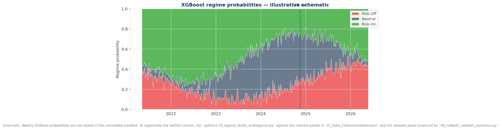

# Stage 14 - XGBoost Regime-Aware Weekly Factor Strategy

Generated by `14_regime_factor_strategy/run.py`.

Evaluation uses the same weekly panel as the factor research. The optimizer uses
the period before `2024-11-25` as in-sample, and the final 79
weeks as out-of-sample. The strategy is weekly rebalanced, long-biased,
nonlinearly score-weighted inside long/short legs, turnover capped, and charged
10 bps per unit one-way turnover. Regime targets use about 90/10
long/short gross in RiskOn, 75/25 in Neutral, and 70/30 with lower total gross
in RiskOff.

## Factor Inputs

The strategy uses the factors listed in `12_factor_viz/RESULTS.md`:

- Confirmed weekly rankers: VolC and MAXRET.
- Priced-risk sleeve: CRASH8, BETA26, TVLC, SKEW52, NEWC.
- Distributional/mispricing sleeve: RMOM1w, RMOM2w, SMBC, NetRel.
- Low-prior legacy sleeve with small optimizer budget: MomC, NetMom, FunC.

Factor signs are set in the economically profitable direction. For example,
VolC is low volatility, MAXRET fades recent spikes, CRASH8 buys the most-crashed
coins, BETA26 buys high-beta coins, NEWC buys younger coins, and TVLC buys low
TVL/mcap because the reported premium is negative for high TVL/mcap exposure.

## XGBoost Regime Detection

Regimes are detected with a supervised 3-class XGBoost classifier. The target
regime is derived from contemporaneous market state using market momentum,
cross-sectional dispersion, and BTC dominance change, while the feature vector is
lagged one week and contains `csd_z, dbtc_z, netent_z, mktmom_z, btcdom_z, mktvol_z`. The classifier is fit
only on weeks before `2024-11-25` and then predicts soft RiskOff,
Neutral, and RiskOn probabilities for both the training and held-out weeks.

XGBoost hard-label counts:

| Regime | Weeks |
|---|---:|
| RiskOff | 115 |
| Neutral | 126 |
| RiskOn | 133 |

Train/test classifier diagnostics:

```json
{
  "test": {
    "accuracy": 0.5822784810126582,
    "macro_f1": 0.5906617664054735,
    "log_loss": 0.8249457030997628,
    "weeks": 79
  },
  "train": {
    "accuracy": 0.7491039426523297,
    "macro_f1": 0.7449777935890811,
    "log_loss": 0.5909437397408308,
    "weeks": 279
  }
}
```



## Optimized Variants

Three variants come from the same compact in-sample grid. I enforce distinct
candidate selections so the report gives three different books rather than one
winner repeated three times:

- **Sharpe Optimized** maximizes in-sample Sharpe.
- **Return Optimized** maximizes in-sample annualized return among the remaining
  candidates, with catastrophic drawdowns filtered out.
- **Balanced** maximizes a percentile blend of Sharpe, annualized return, and
  drawdown control among the remaining candidates.

I also test a separate **Neural Network Optimizer**. It uses the same XGBoost
regime probabilities, trains an in-sample `MLPRegressor` on factor z-scores plus
regime probabilities to predict next-week returns, and then routes those
predictions through the same portfolio construction constraints as the balanced
book.

| Variant | Candidate | Core | Priced | Mispricing | Legacy | IC blend | Top frac | Gross R/N/O |
|---|---|---:|---:|---:|---:|---:|---:|---|
| Sharpe Optimized | mispricing_b | 0.25 | 0.25 | 0.45 | 0.05 | 0.00 | 0.30 | 1.00/0.86/0.60 |
| Return Optimized | priced_a | 0.25 | 0.50 | 0.20 | 0.05 | 0.25 | 0.20 | 1.04/0.90/0.62 |
| Balanced | priced_b | 0.20 | 0.55 | 0.20 | 0.05 | 0.00 | 0.30 | 1.08/0.94/0.65 |
| Neural Network Optimizer | mlp_return_forecaster | 0.20 | 0.55 | 0.20 | 0.05 | 0.00 | 0.30 | 1.08/0.94/0.65 |


## Full-Window Performance

| Strategy | Sharpe | AnnRet | AnnVol | MaxDD | Hit | Weeks |
|---|---:|---:|---:|---:|---:|---:|
| Sharpe Optimized | +1.07 | +61.8% | 57.6% | -61.7% | 52% | 374 |
| Return Optimized | +0.73 | +53.6% | 73.0% | -70.5% | 49% | 374 |
| Balanced | +0.70 | +52.1% | 74.6% | -68.8% | 49% | 374 |
| Neural Network Optimizer | +1.63 | +91.7% | 56.2% | -45.5% | 57% | 374 |
| EW Market | +0.82 | +65.7% | 80.5% | -80.6% | 55% | 373 |
| BTC | +0.92 | +54.4% | 59.0% | -75.2% | 52% | 373 |


## In-Sample Performance

| Strategy | Sharpe | AnnRet | AnnVol | MaxDD | Hit | Weeks |
|---|---:|---:|---:|---:|---:|---:|
| Sharpe Optimized | +1.17 | +71.1% | 60.7% | -61.7% | 54% | 295 |
| Return Optimized | +0.97 | +75.2% | 77.4% | -70.5% | 52% | 295 |
| Balanced | +0.94 | +74.0% | 78.7% | -68.8% | 52% | 295 |
| Neural Network Optimizer | +2.06 | +121.4% | 59.0% | -40.7% | 61% | 295 |
| EW Market | +1.10 | +92.1% | 83.4% | -80.6% | 58% | 295 |
| BTC | +1.14 | +72.1% | 63.2% | -75.2% | 54% | 295 |


## Out-of-Sample Performance

| Strategy | Sharpe | AnnRet | AnnVol | MaxDD | Hit | Weeks |
|---|---:|---:|---:|---:|---:|---:|
| Sharpe Optimized | +0.61 | +26.8% | 44.3% | -24.2% | 47% | 79 |
| Return Optimized | -0.52 | -27.1% | 52.4% | -58.9% | 38% | 79 |
| Balanced | -0.53 | -29.7% | 55.6% | -62.8% | 38% | 79 |
| Neural Network Optimizer | -0.46 | -19.1% | 41.0% | -45.5% | 46% | 79 |
| EW Market | -0.51 | -34.4% | 67.2% | -68.3% | 45% | 78 |
| BTC | -0.33 | -12.3% | 37.7% | -46.7% | 47% | 78 |


## Portfolio Exposure

The strategy now expresses most conviction through longs. Shorts are smaller,
capped at 6.5% per name before turnover smoothing, and
mainly act as a hedge sleeve that grows in RiskOff while total gross falls.

| Variant                  | Avg Long   | Avg Short   | Avg Gross   | Avg Net   | Long Share   | Max Short Name   |
|:-------------------------|:-----------|:------------|:------------|:----------|:-------------|:-----------------|
| Sharpe Optimized         | 64.5%      | 16.7%       | 81.2%       | 47.8%     | 78.7%        | 6.5%             |
| Return Optimized         | 67.7%      | 17.9%       | 85.5%       | 49.8%     | 78.4%        | 6.5%             |
| Balanced                 | 70.6%      | 18.7%       | 89.3%       | 51.9%     | 78.3%        | 6.5%             |
| Neural Network Optimizer | 68.4%      | 16.5%       | 84.8%       | 51.9%     | 80.0%        | 6.5%             |

Average exposure by hard XGBoost regime:

| Variant                  | Regime   |   Weeks | Avg Gross   | Avg Long   | Avg Short   | Long Share   |
|:-------------------------|:---------|--------:|:------------|:-----------|:------------|:-------------|
| Sharpe Optimized         | RiskOff  |     115 | 68.1%       | 49.9%      | 18.2%       | 73.1%        |
| Sharpe Optimized         | Neutral  |     126 | 80.7%       | 61.9%      | 18.8%       | 76.6%        |
| Sharpe Optimized         | RiskOn   |     133 | 92.9%       | 79.5%      | 13.4%       | 85.5%        |
| Return Optimized         | RiskOff  |     115 | 71.4%       | 52.0%      | 19.5%       | 72.6%        |
| Return Optimized         | Neutral  |     126 | 85.2%       | 65.0%      | 20.2%       | 76.2%        |
| Return Optimized         | RiskOn   |     133 | 98.0%       | 83.7%      | 14.3%       | 85.4%        |
| Balanced                 | RiskOff  |     115 | 74.9%       | 54.4%      | 20.5%       | 72.5%        |
| Balanced                 | Neutral  |     126 | 89.1%       | 67.9%      | 21.2%       | 76.1%        |
| Balanced                 | RiskOn   |     133 | 102.0%      | 87.2%      | 14.8%       | 85.4%        |
| Neural Network Optimizer | RiskOff  |     115 | 72.3%       | 53.7%      | 18.7%       | 74.2%        |
| Neural Network Optimizer | Neutral  |     126 | 84.3%       | 65.8%      | 18.5%       | 78.1%        |
| Neural Network Optimizer | RiskOn   |     133 | 96.2%       | 83.5%      | 12.6%       | 86.8%        |

## Plots


Interactive weekly coin-weight bubble animation:
[`artifacts/figures/weekly_weight_bubbles.html`](artifacts/figures/weekly_weight_bubbles.html)

## Average Factor Weights

The table below is the average weekly composite factor weight after regime
activation and IC blending for the three grid-selected modes. It is not
portfolio asset weight, and the neural-network optimizer is omitted because it
learns asset-level return predictions rather than explicit factor sleeve weights.

| Variant          |   VolC |   MAXRET |   CRASH8 |   BETA26 |   TVLC |   SKEW52 |   NEWC |   RMOM1w |   RMOM2w |   SMBC |   NetRel |   MomC |   NetMom |   FunC |
|:-----------------|-------:|---------:|---------:|---------:|-------:|---------:|-------:|---------:|---------:|-------:|---------:|-------:|---------:|-------:|
| Sharpe Optimized |  0.144 |    0.146 |    0.063 |    0.044 |  0.056 |    0.046 |  0.04  |    0.12  |    0.12  |  0.092 |    0.109 |  0.005 |    0.005 |  0.011 |
| Return Optimized |  0.136 |    0.137 |    0.132 |    0.094 |  0.119 |    0.097 |  0.085 |    0.049 |    0.049 |  0.038 |    0.044 |  0.005 |    0.004 |  0.01  |
| Balanced         |  0.104 |    0.106 |    0.15  |    0.105 |  0.134 |    0.109 |  0.096 |    0.048 |    0.048 |  0.037 |    0.044 |  0.005 |    0.004 |  0.01  |

### Sharpe Optimized Factor Weights


### Return Optimized Factor Weights


### Balanced Factor Weights


## Top In-Sample Grid Candidates

| candidate    |   is_sharpe | is_ann_return   | is_max_dd   |   oos_sharpe | oos_ann_return   | oos_max_dd   |
|:-------------|------------:|:----------------|:------------|-------------:|:-----------------|:-------------|
| mispricing_b |        1.17 | +71.1%          | -61.7%      |         0.61 | +26.8%           | -24.2%       |
| mispricing_a |        1.1  | +61.8%          | -63.3%      |         0.44 | +17.3%           | -22.7%       |
| priced_a     |        0.97 | +75.2%          | -70.5%      |        -0.52 | -27.1%           | -58.9%       |
| priced_b     |        0.94 | +74.0%          | -68.8%      |        -0.53 | -29.7%           | -62.8%       |
| balanced_b   |        0.93 | +53.9%          | -69.5%      |         0.01 | +0.4%            | -38.0%       |
| return_a     |        0.9  | +73.8%          | -68.6%      |        -0.59 | -35.6%           | -65.4%       |
| return_b     |        0.89 | +71.0%          | -69.7%      |        -0.63 | -37.7%           | -66.1%       |
| core_alpha_b |        0.89 | +42.8%          | -59.9%      |        -0.22 | -6.3%            | -35.8%       |

## Artifacts

- `artifacts/data/factor_panel.parquet`
- `artifacts/data/regime_panel.parquet`
- `artifacts/data/factor_ic_timeseries.parquet`
- `artifacts/data/selected_parameters.csv`
- `artifacts/data/average_factor_weights.csv`
- `artifacts/data/neural_network_signals.parquet`
- `sharpe_optimized_weekly_weights.parquet`
- `return_optimized_weekly_weights.parquet`
- `balanced_weekly_weights.parquet`
- `neural_network_optimizer_weekly_weights.parquet`
- `artifacts/figures/weekly_weight_bubbles.html`
- `artifacts/manifests/metrics.json`

## Caveats

This is a first usable implementation, not a production allocator. The supervised
regime labels are heuristic market-state labels, transaction costs are simplified,
and the grid search is deliberately small to avoid overfitting. The results should
be read as a strategy research prototype that turns the validated factors into a
machine-learning regime-aware weekly portfolio.
