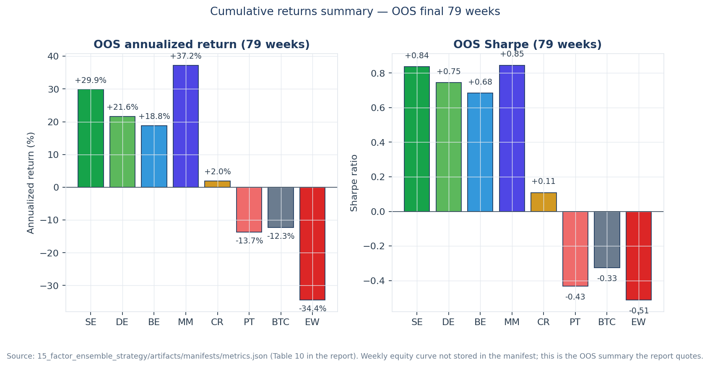
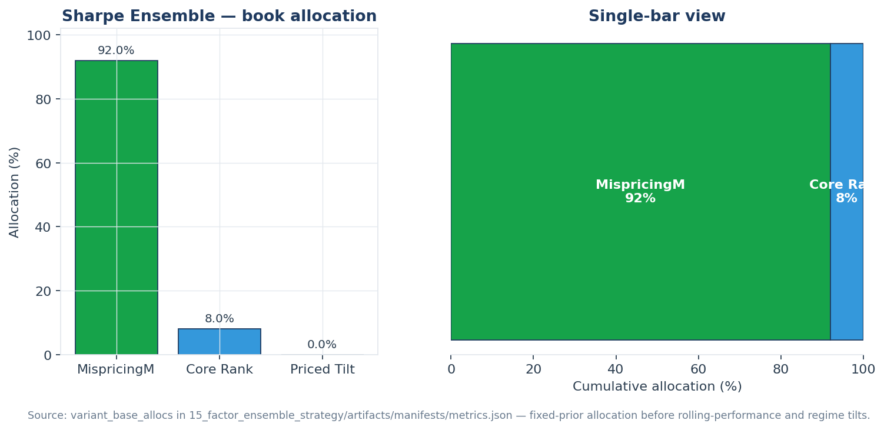
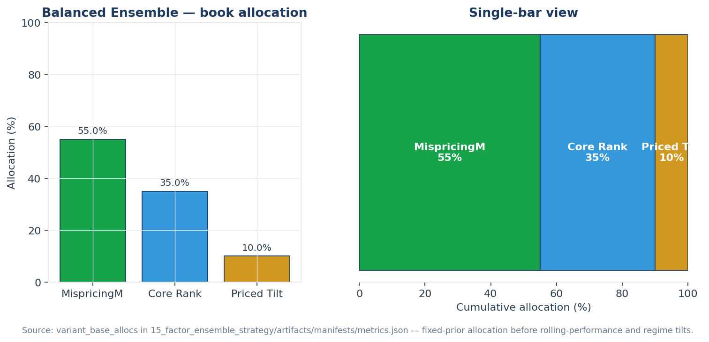

# Stage 15 - Factor Ensemble Strategy

Generated by `15_factor_ensemble_strategy/run.py`.

This stage implements the follow-up idea from the Stage 12-14 review: do not
force every factor into one score. It builds separate sub-books for robust weekly
rankers, the MispricingM composite, and priced-risk tilts, then allocates between
those books using only prior realized book returns plus the existing Stage 14
XGBoost regime probabilities.

Train/test split matches Stage 14: weeks before `2024-11-25` are
in-sample, and the final 79 weeks are out-of-sample.

## Sub-Books

| Book | Factors | Purpose |
|---|---|---|
| MispricingM | RMOM1w, RMOM2w, SMBC, NetRel | Distributionally robust cross-sectional mispricing composite |
| Core Rank | VolC, MAXRET | Most reliable weekly rankers from Stage 12 |
| Priced Tilt | CRASH8, BETA26, TVLC, SKEW52, NEWC | Small capped sleeve for GX-priced risks, not allowed to dominate |

The rolling allocator uses a 26-week lookback with a 8-week
warm-up. For week `t`, it scores only returns from weeks `< t`, blends that score
with a conservative base allocation, applies a regime confidence tilt, and caps
the priced-risk sleeve.

## Ensemble Modes

| Variant            | mispricing   | core_rank   | priced_tilt   |
|:-------------------|:-------------|:------------|:--------------|
| Sharpe Ensemble    | 80.8%        | 15.3%       | 3.9%          |
| Balanced Ensemble  | 54.8%        | 36.7%       | 8.5%          |
| Defensive Ensemble | 60.4%        | 35.7%       | 3.9%          |

## Full-Window Performance

| Strategy | Sharpe | AnnRet | AnnVol | MaxDD | Hit | Weeks |
|---|---:|---:|---:|---:|---:|---:|
| Sharpe Ensemble | +1.27 | +64.7% | 51.1% | -45.3% | 53% | 374 |
| Balanced Ensemble | +1.18 | +51.1% | 43.4% | -41.4% | 54% | 374 |
| Defensive Ensemble | +1.21 | +54.4% | 45.0% | -42.4% | 53% | 374 |
| mispricing | +1.24 | +76.5% | 61.9% | -46.6% | 54% | 374 |
| core_rank | +0.53 | +18.5% | 35.1% | -49.3% | 49% | 374 |
| priced_tilt | +0.30 | +11.1% | 36.9% | -49.1% | 47% | 374 |
| EW Market | +0.82 | +65.7% | 80.5% | -80.6% | 55% | 373 |
| BTC | +0.92 | +54.4% | 59.0% | -75.2% | 52% | 373 |

## In-Sample Performance

| Strategy | Sharpe | AnnRet | AnnVol | MaxDD | Hit | Weeks |
|---|---:|---:|---:|---:|---:|---:|
| Sharpe Ensemble | +1.36 | +74.0% | 54.4% | -45.3% | 54% | 295 |
| Balanced Ensemble | +1.28 | +59.7% | 46.7% | -41.4% | 55% | 295 |
| Defensive Ensemble | +1.31 | +63.2% | 48.4% | -42.4% | 53% | 295 |
| mispricing | +1.32 | +87.0% | 65.8% | -46.6% | 55% | 295 |
| core_rank | +0.60 | +23.0% | 38.3% | -49.3% | 49% | 295 |
| priced_tilt | +0.47 | +17.8% | 38.2% | -49.1% | 49% | 295 |
| EW Market | +1.10 | +92.1% | 83.4% | -80.6% | 58% | 295 |
| BTC | +1.14 | +72.1% | 63.2% | -75.2% | 54% | 295 |

## Out-of-Sample Performance

| Strategy | Sharpe | AnnRet | AnnVol | MaxDD | Hit | Weeks |
|---|---:|---:|---:|---:|---:|---:|
| Sharpe Ensemble | +0.84 | +29.9% | 35.8% | -24.7% | 51% | 79 |
| Balanced Ensemble | +0.68 | +18.8% | 27.6% | -18.3% | 53% | 79 |
| Defensive Ensemble | +0.75 | +21.6% | 29.0% | -19.7% | 53% | 79 |
| mispricing | +0.85 | +37.2% | 44.1% | -29.9% | 52% | 79 |
| core_rank | +0.11 | +2.0% | 18.1% | -18.8% | 47% | 79 |
| priced_tilt | -0.43 | -13.7% | 31.8% | -32.6% | 39% | 79 |
| EW Market | -0.51 | -34.4% | 67.2% | -68.3% | 45% | 78 |
| BTC | -0.33 | -12.3% | 37.7% | -46.7% | 47% | 78 |

## Plots

## Artifacts

- `artifacts/data/*_book_allocations.parquet`
- `artifacts/data/*_weekly_pnl.parquet`
- `artifacts/data/*_weekly_weights.parquet`
- `artifacts/manifests/metrics.json`

## Caveat

This is still a research allocator. The improvement target is OOS robustness:
priced-risk factors are kept small unless their own realized sub-book performance
supports more capital, and the XGBoost regime detector sizes risk rather than
directly flipping every factor signal.
