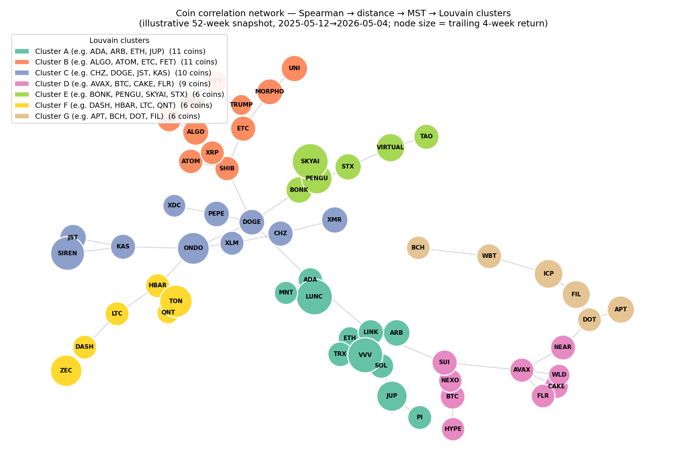
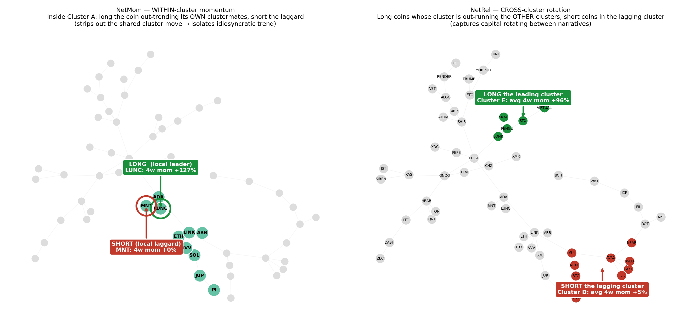

# Combined Factor Analysis — A Plain-Language Walkthrough

*Audience: an undergrad who has seen "buy low, sell high" but not factor models.
This document merges the two technical result files — `09_nalfp_add/RESULTS.md`
(the base factor zoo) and `10_behavioral_gx/RESULTS.md` (the behavioral search) —
into one story: **what each factor is, how good it is, how we filter the keepers,
and how we combine them.***

---

## 0. The 60-second picture

We are trying to find **rules for trading crypto that reliably make money** — not
by luck, but for an understandable economic reason. In finance these rules are
called **factors**.

A factor is a recipe like *"every week, buy the calmest coins and short the
wildest ones."* If that recipe earns a positive return again and again, we say
there is a **factor premium** — the market is paying you for doing that trade.

Our job has three parts, and this document follows them in order:

1. **Define** each factor and the *economic reason* it might work (Section 2).
2. **Measure** each factor with three independent statistical tests and put every
   number in **one master table** (Section 3 & 4).
3. **Filter** down to the factors that are actually real (Section 5), then
   **combine** the survivors into a strategy and explain *why* combining helps
   (Section 6).

We test everything on **two separate time periods** so we can't fool ourselves:

| Window | Dates | Length | Purpose |
|---|---|---|---|
| **In-sample (IS)** | 2021-05-10 → 2024-11-11 | 184 weeks | Where we are allowed to look and fit. |
| **Out-of-sample (OOS)** | 2024-11-18 → 2026-05-25 | 80 weeks | The "exam." The factor never saw this data. |

A factor that looks great in-sample but falls apart out-of-sample was probably
luck. That split is the single most important honesty check in the whole project.

---

## 1. How a factor is actually built (the long/short portfolio)

Almost every factor here is a **long/short (L/S) portfolio**. The mechanic is
always the same:

1. Pick a *characteristic* you can measure for every coin each week (size,
   volatility, age, recent crash, …).
2. **Rank** all coins by that characteristic.
3. **Go long** (buy) the top ~30% and **go short** (sell) the bottom ~30%.
4. Hold one week, then re-rank and rebalance.

The return of that portfolio each week *is* the factor's return series. Because
you are long *and* short, you are roughly **market-neutral**: if all of crypto
crashes 20%, your longs and shorts both fall and you are mostly protected. What's
left is the *pure* effect of the characteristic you sorted on. That is exactly
what we want to price.

> **One subtlety — read the sign carefully.** A "low-volatility" factor goes
> *long the bottom* of the volatility ranking. So a *negative* correlation
> between volatility and return is the factor **working**, not failing. Wherever
> a raw number looks "backwards," it's usually this. The tables below report a
> **direction-adjusted** version where *positive = the bet ranked coins
> correctly*.

---

## 2. What each factor IS — the economics

Factors fall into five families. For each, the question is *"why would this pay?"*

### 2A. Classic risk/anomaly factors (the textbook crew)

| Factor | The trade | Why it might pay (economics) |
|---|---|---|
| **RC** | Hold the whole crypto market (value-weighted) | The "equity premium" of crypto — pure compensation for bearing systematic crypto risk. **Not alpha**; every long-only holder already earns it. We include it so other factors are measured *net of* market beta. |
| **SMBC — Size** | Long small coins, short big coins | Small caps are illiquid, less covered, riskier → should pay extra (the crypto version of Fama-French SMB). Can invert in "flight to quality" when money piles into BTC/ETH. |
| **MomC — Momentum** | Long 4-week winners, short losers | Investors under-react to news, so recent winners keep winning (Jegadeesh-Titman). But raw momentum *crashes* violently at trend reversals. |
| **VolC — Low-volatility** | Long calm coins, short wild coins | Leverage-constrained and lottery-loving investors *overpay* for exciting high-vol names, leaving calm coins cheap (Frazzini-Pedersen "betting against beta"). |

### 2B. Risk-adjusted momentum (Han et al. 2023)

These divide a trend by its own recent volatility — i.e. a short-horizon Sharpe
ratio. Scaling by risk strips out the noise that makes raw momentum crash.

| Factor | The trade |
|---|---|
| **RMOM1w** | 1-week return ÷ 4-week vol (a 1-week Sharpe) |
| **RMOM2w** | 2-week return ÷ 4-week vol |
| **RMOM4w** | 4-week Sharpe (large *and* consistent trend) |
| **MAXRET** | Highest single weekly return in the last 4 weeks — a **lottery** signal. Coins with an extreme up-week attract lottery demand and get over-priced, so the *correct* bet is to **short** the lottery (reversal). |

### 2C. Fundamentals (is the protocol actually used / earning?)

| Factor | The trade | Why |
|---|---|---|
| **FunC** | Long high fees/mcap, short low | Crypto "value": protocols throwing off real cash should be cheap (the E/P analogue). Only ~half the universe earns fees → structurally under-powered. |
| **TVLC** | Long high TVL/mcap, short low | DeFi engagement per dollar of market cap. Bull view: usage-backed value. Bear view ("TVL irrelevance"): already in prices. Sign is genuinely ambiguous a priori. |

### 2D. Network / structure directions (context, not bets)

These don't say *what to buy*; they describe *how the market moves in blocs*.
They are risk **directions**, used for diversification and as controls. This
family needs more unpacking, because the words "network," "SPC," and "CCA" each
hide a specific construction. Here is each one from scratch.

#### What is a "network" of coins, and how is it built?

A **network** (or *graph*) is just a set of dots connected by lines. Here each
**dot is a coin** and a **line means "these two coins move together."** We don't
draw the lines by hand — we *measure* them from returns. The recipe, run on a
rolling **12-week** window so the network updates as the market changes, is:

1. **Correlate every pair of coins.** Take the last 12 weeks of returns and
   compute the **Spearman (rank) correlation** between every pair. Spearman (not
   ordinary Pearson) is used because crypto has wild outliers, and rank
   correlation isn't thrown off by one giant week.
2. **Turn correlation into distance.** Two coins that move together should be
   *close*; two that don't should be *far*. We convert with
   `distance = √(2 × (1 − correlation))` — correlation +1 → distance 0 (right on
   top of each other), correlation 0 → distance √2 (far apart).
3. **Keep only the strongest skeleton (MST).** A full graph connects everything to
   everything (noisy). A **Minimum Spanning Tree (MST)** keeps only the smallest
   set of links needed to connect every coin once — it strips the network down to
   its essential backbone of strongest relationships.
4. **Find the communities (Louvain).** The **Louvain algorithm** scans that
   skeleton and groups coins into **clusters** — tight knots where coins are far
   more connected to each other than to outsiders. These clusters typically come
   out looking like real crypto *narratives*: an L1 cluster, a DeFi cluster, a
   payments cluster, etc. We never tell it those names; it finds them from price
   behavior alone.

Once we have clusters, two factors fall out naturally:

- **NetMom — within-cluster momentum.** *Inside* each cluster, compare each coin's
  4-week momentum to its clustermates' average. Back the local leader, short the
  local laggard. Because everyone in the cluster shares the same narrative beta,
  this **strips out the cluster's common move** and isolates the coin's *own*
  idiosyncratic trend (Liu-Tsyvinski 2018).
- **NetRel — cross-cluster rotation.** Compare each coin's momentum to the average
  of *all the other clusters*. This catches **narrative rotation**: when money
  flows out of, say, payments and into AI coins, the AI cluster is pulling ahead
  of the rest, and NetRel backs that rotation.

#### Seeing it — the actual network

Here is a real network built with exactly this pipeline (Spearman → distance → MST
→ Louvain) on a 52-week slice of this project's own data. Each dot is a coin, each
line is a strong correlation kept by the MST, and each colour is a Louvain cluster.
Notice how the algorithm pulls coins into a handful of distinct knots purely from
how they co-move:



*Clusters are labelled neutrally (A, B, C…) on purpose: over a short window the
data-driven groups won't line up perfectly with tidy human narratives like "all
the L1s," so we don't pretend they do. The point is that **structure exists** — the
market really does move in blocs.*

Now the two factors become literally visible. **NetMom** works *inside one colour*;
**NetRel** works *between colours*:



- **Left (NetMom):** zoom into a single cluster (here Cluster A). Everyone in it
  shares the same "narrative beta," so we ignore the shared move and just ask *which
  coin is out-trending its own clustermates?* — go long that local leader, short the
  local laggard. The bet is purely on **idiosyncratic** trend within the bloc.
- **Right (NetRel):** step back and compare *whole clusters*. When one bloc's
  average momentum pulls ahead of the others (green), money is rotating **into** that
  narrative; the lagging bloc (red) is rotating out. NetRel goes long the leading
  cluster's coins and short the lagging cluster's — a bet on **narrative rotation**,
  not on any single coin.

*(Both pictures are produced by `figures/make_network_viz.py`, re-runnable any time.
The numbers shown, e.g. "4w mom +127%", are the trailing 4-week returns at the
snapshot's last week, used only to pick the illustrative long/short legs.)*

#### What is SPC (Sparse PCA)?

Start with ordinary **PCA (Principal Component Analysis)**. PCA looks at how all
coins move and finds the handful of *underlying directions* that explain most of
the wiggling. The 1st component is almost always "the whole market goes up and
down together"; later ones capture finer patterns. The problem: ordinary PCA
loads a little bit on *every* coin, so a component is a blur of 40 names you can't
interpret.

**Sparse PCA** adds a penalty (`alpha`) that forces most of those loadings to
**exactly zero**. So each component ends up loading on only a *handful* of coins —
which means you can actually **read it and name it**. We extract **4** of them
(SPC1–SPC4); the script literally prints the top loaders so we can label them:

- **SPC1 — DeFi-majors / "everything together"** (BTC, ETH, UNI, AAVE): the
  dominant axis where the whole market co-moves.
- **SPC2 — Payment / old-guard** (XRP, XLM, ADA, ALGO, HBAR).
- **SPC3 — Alt-L1** (SOL, AVAX, NEAR, ATOM, FET).
- **SPC4 — Legacy / privacy + exchange** (ZEC, DASH, LTC, BNB, CAKE).

A coin's return that week can be reconstructed from how much it moves *with* each
of these blocs. They are **risk directions** — they tell you the dimensions along
which the market wobbles, which is exactly what you need for diversification and
as controls, but they are *not* "buy this" signals.

#### What is CCA (Canonical Correlation Analysis)?

CCA answers a specific question: **how much of crypto is just traditional macro in
disguise?** We have two baskets of return series:

- **Side X:** the crypto coins.
- **Side Y:** a macro basket — **BTC, S&P 500 (SPX), the dollar index (DXY),
  10-year Treasury yield (UST10Y), and the VIX** (the equity "fear gauge").

CCA finds the linear combination of the crypto side and the linear combination of
the macro side that are **most correlated** with each other — the strongest
crypto↔macro bridge. Then it finds the next strongest bridge that's independent of
the first, and so on. Those crypto-side combinations are **CCA1, CCA2, CCA3** —
"the slices of crypto that march in step with rates / the dollar / equity risk
appetite."

Why bother? Because if a chunk of a coin's movement is *just* the S&P or the
dollar talking, that's not crypto alpha — it's macro beta you could get elsewhere.
CCA measures that macro-spanned share and lets us price our real factors **net of**
it. Like SPC, CCA1–3 are **structure/controls**, not standalone bets.

#### What does "used as a control / priced *net of beta*" actually mean?

This phrase trips everyone up, so here it is from scratch.

**"Beta" = how much a coin rides a common direction.** Any coin's weekly return
splits into two parts: (1) a *common* part — it moved because the whole market, or
the dollar, or the alt-L1 bloc moved — and (2) its *own* idiosyncratic part, left
over after you subtract the common stuff. The SPC blocs and CCA macro directions
*are* those common directions. A coin's "beta" to SPC3, say, is just how strongly
it rides the alt-L1 bloc.

**Why that wrecks a naive factor test.** Suppose we test whether **SMBC**
(small-minus-big) earns a real *size* premium. Small coins also tend to be
high-alt-L1-beta coins. So if the alt-L1 bloc (SPC3) happened to rip during our
sample, SMBC would *look* profitable — but the profit was really "alt-L1 went up,"
**not** "small beats big." Without a control we'd credit the wrong thing.

**"Pricing net of beta" = holding the common directions constant.** In the
GX/Fama-MacBeth pricing regression we put **RC + the SPC blocs + the CCA macro
directions in alongside** the factor we care about. The regression then asks:
*holding a coin's market, macro, and SPC-bloc exposure constant, does extra
exposure to **size** still earn extra return?* The premium (λ) it reports is what
survives **after** subtracting everything those common betas already explain — that
"after subtracting" is what *net of beta* means. SPC/CCA earn their keep purely by
**soaking up common variation so it can't leak into and inflate the real factors**.
They are control variables, exactly like in any regression — never traded.

**The analogy.** You're testing whether a **fertilizer** raises crop yield, but you
also record each field's **sunlight and rainfall** — not because you sell sunlight,
but because a fertilizer used on the sunniest fields would look great for the wrong
reason. Hold sunlight and rainfall constant and you isolate the fertilizer's *own*
effect.

- Fertilizer = the factor you care about (SMBC, MAXRET, …)
- Sunlight & rainfall = SPC blocs & CCA macro directions (the controls)
- "Net of beta" = the fertilizer's effect *after* holding sunlight/rainfall constant

(GX goes one step further — it also digs *hidden* common directions out of the
leftover residuals and controls for those too, in case there's an important
"sunlight" nobody thought to measure. That's the "hidden-factor-robust" part of the
GX lens in Section 3.)

### 2E. Behavioral factors (Stage 10 — the new search)

Stage 10 searched 182 candidate signals for *new* behavioral effects, then kept
four that are (a) economically interpretable, (b) not just a renamed VolC/MAXRET,
and (c) survive a brutal multiple-testing correction (see Section 5).

| Factor | The trade | The investor behavior it captures |
|---|---|---|
| **NEWC** | Long young coins, short seasoned coins | **Newness/seasoning premium** — investors demand compensation for holding less-proven names. |
| **SKEW52** | Long high 52-week skew, short low | **Lottery memory** — investors remember past right-tail jumps and overpay for names with salient upside histories. |
| **CRASH8** | Long recently-crashed coins, short resilient ones | **Capitulation premium** — freshly punished coins carry a priced rebound/crash-risk exposure. |
| **BETA26** | Long high 26-week beta, short low | **Speculative risk-on demand** — high-beta coins are what investors reach for when they want amplified market exposure. |

---

## 3. The three lenses — how we judge a factor statistically

No single test is enough, because each answers a *different* question. A factor
can be real on one axis and silent on the others. We use three:

### Lens 1 — IC (Information Coefficient): *does it rank coins correctly week-to-week?*
The IC is the correlation each week between the signal and next week's return.
- |IC| ≈ 0.03–0.05 is a normal, useful signal.
- We attach a **t-stat** (Newey-West, lags=4, to handle serial correlation).
  **|t| ≥ 2 ⇒ very unlikely to be luck.**
- A factor is **IC-robust** only if it is significant **IS *and* still holds OOS**.

### Lens 2 — ASD (Almost Stochastic Dominance vs Bitcoin): *does its whole return distribution beat just holding BTC?*
Crypto returns are wildly non-normal (fat tails, skew), so a **Sharpe ratio lies**
— it assumes a bell curve. ASD makes no such assumption (Han et al. 2023). It asks
whether the factor's *entire distribution* dominates Bitcoin's.
- **ε₁ ≤ 5.9%** → *almost first-order* dominance (AFSD): **most** investors prefer it to BTC.
- **ε₂ ≤ 3.2%** → *almost second-order* dominance (ASSD): all **risk-averse** investors prefer it to BTC.
- Smaller ε = better. (And we check the reverse: does BTC dominate the factor?)

### Lens 3 — GX pricing (Giglio-Xiu 2021): *is it a compensated source of systematic risk?*
This is the deepest test. It asks: across the full 5-year cross-section, do coins
that load heavily on this factor *systematically* earn more (or less)? The premium
is **λ (lambda)**, annualised.
- The killer feature: GX-full uses **Bai-Ng to extract hidden latent factors** from
  the residuals and re-prices on observed + hidden factors. This removes
  contamination from *unobserved* systematic forces — so a factor that survives
  here isn't just a proxy for something we forgot to include.
- **|t_gx| ≥ 1.65 ⇒ priced.** (The Stage-10 *discovery* bar was stricter, |t| ≥ 2.0.)

> **Why three?** IC catches a tradable weekly *signal*. ASD catches a distribution
> a real investor would *prefer*. GX catches a priced *risk*. The factors we trust
> most are the ones that light up on **more than one** lens — agreement across
> independent tests is far harder to fake than one lucky number.

---

## 4. The master table — every factor, every lens, one place

This is the heart of the document: all 23 priced factors plus the composite, with
each lens side by side. The **Grade** column is the final synthesized verdict
(scale defined below the table).

**Reading the columns**
- *IC IS t / IC OOS t* — ranking-power t-stats (direction-raw; "—" = price/structure
  factor not judged on weekly rank).
- *ASSD?* — ✓ if ε₂ ≤ 3.2% (risk-averse investors prefer it to BTC).
- *GX t* — Giglio-Xiu full-model t-stat (|t| ≥ 1.65 = priced).

| # | Factor | Family | Economic one-liner | IC IS t | IC OOS t | ASSD? | GX λ/yr | GX t | **Grade** |
|---|---|---|---|---:|---:|:---:|---:|---:|---|
| 1 | **VolC** | Anomaly | Low-vol beats high-vol | −3.32 | −4.31 | ✗ | −185.8% | **−5.05** | **Confirmed** |
| 2 | **MAXRET** | Lottery | Short the lottery (max-return) | −3.49 | −4.05 | ✗ | +160.0% | **+5.52** | **Confirmed** |
| 3 | ★ **CRASH8** | Behavioral | Capitulation rebound | — | — | — | +177.9% | **+4.79** | **Behavioral-confirmed** |
| 4 | ★ **BETA26** | Behavioral | Speculative risk-on demand | — | — | — | +122.8% | **+4.60** | **Behavioral-confirmed** |
| 5 | **TVLC** | Fundamental | DeFi engagement (TVL/mcap) | — | — | — | −185.2% | **−4.71** | Priced risk |
| 6 | **RC** | Market | The crypto market premium | — | — | — | +217.2% | **+3.92** | Priced risk |
| 7 | ★ **SKEW52** | Behavioral | Lottery memory (skew) | — | — | — | +96.9% | **+3.44** | **Behavioral-confirmed** |
| 8 | ★ **NEWC** | Behavioral | Newness / seasoning | — | — | — | +114.1% | **+3.43** | **Behavioral-confirmed** |
| 9 | **RMOM1w** | Risk-adj mom | 1-week Sharpe momentum | −1.07 | −0.27 | ✓ | +59.4% | **+1.86** | Priced risk |
| 10 | **SMBC** | Anomaly | Size (small minus big) | +1.49 | +1.25 | ✓ | +9.6% | +0.36 | Suggestive |
| 11 | **NetRel** | Structure | Cross-cluster rotation | −1.72 | −0.10 | ✓ | −0.2% | −0.01 | Suggestive |
| 12 | **RMOM2w** | Risk-adj mom | 2-week Sharpe momentum | −2.46 | −0.24 | ✓ | +31.3% | +1.05 | Suggestive |
| 13 | **MispricingM** | Composite | Equal-weight ASSD-dominant blend | — | — | ✓ | — | — | Suggestive |
| 14 | **FunC** | Fundamental | Fees/mcap "value" | — | — | — | +6.6% | +0.40 | Economic-only |
| 15 | **RMOM4w** | Risk-adj mom | 4-week Sharpe momentum | −2.61 | −0.86 | ✗ | +36.6% | +1.24 | Not supported |
| 16 | **MomC** | Anomaly | Raw 4-week momentum | −1.66 | +0.13 | ✗ | −3.3% | −0.10 | Not supported |
| 17 | **NetMom** | Structure | Within-cluster momentum | −0.15 | −0.81 | ✗ | +8.6% | +0.37 | Not supported |
| 18 | **SPC3** | Structure | Alt-L1 bloc direction | — | — | ✗ | −221.4% | **−3.88** | Structure |
| 19 | **SPC1** | Structure | DeFi-majors bloc direction | — | — | ✗ | +57.6% | +1.08 | Structure |
| 20 | **SPC2** | Structure | Payment/old-guard direction | — | — | ✗ | −56.0% | −1.47 | Structure |
| 21 | **SPC4** | Structure | Legacy/exchange direction | — | — | ✗ | +93.5% | +1.42 | Structure |
| 22 | **CCA1** | Structure | Macro-spanned direction 1 | — | — | — | −55.0% | −0.58 | Structure |
| 23 | **CCA2** | Structure | Macro-spanned direction 2 | — | — | — | +6.6% | +0.58 | Structure |
| 24 | **CCA3** | Structure | Macro-spanned direction 3 | — | — | — | +14.9% | +0.58 | Structure |

★ = behavioral factor from the Stage-10 joint run (K_hidden = 2, all 23 factors
priced simultaneously). Base factors use the Stage-09 full-sample GX-full run.

**The grading scale** (deliberately *not* pass/fail — a 264-week panel can't hit
|t| ≥ 2 everywhere, and a factor can be real on one axis while silent on others):

| Grade | Meaning |
|---|---|
| **Confirmed** | Strong on multiple independent lenses — the defensible core. |
| **Behavioral-confirmed** | New behavioral factor; strongly priced (GX) and survives Bonferroni multiple-testing. |
| **Priced risk** | Compensated systematic exposure, but no week-to-week trading edge. |
| **Suggestive** | Economic story intact + partial/semi-significant evidence. |
| **Economic-only** | Sound rationale, but this data can't confirm it. |
| **Structure** | A risk *direction* (how the market moves), not an alpha bet. |
| **Not supported** | Fails its own prediction on this sample. |

> **A genuinely important nuance for VolC and MAXRET.** Their two lenses
> *disagree in sign*: VolC ranks coins strongly (low-vol wins week-to-week) yet
> its long/short **distribution is dominated by Bitcoin**, and its multi-year
> *priced* premium runs negative. MAXRET's weekly signal says "short the lottery,"
> but its long-run priced premium is positive. The lesson: **the short-term
> ranking edge and the long-run risk premium are not the same trade.** We rank on
> the weekly signal but respect that the multi-year L/S premium can point the
> other way. This is why we don't just trade a single factor mechanically.

---

## 5. How we filter — a *router*, not a trash can

**This is the section most people get wrong, so read the next paragraph twice.**

The grade is **not** a single pass/fail gate that keeps a few factors and throws
the rest away. It is a **router**: each lens a factor passes tells us *what kind of
real it is*, and that determines **which job it gets** in the strategy — not
whether it gets a job at all. A factor can fail the IC lens, pass the ASD lens, and
still be traded — just in a different role. The only factors genuinely *thrown out*
are the ones that pass **no** lens ("Not supported") and the pure risk
**directions** we keep only as pricing controls ("Structure"). Everything else is
**assigned**, not discarded.

This is exactly why **NetRel looks like it "disappears" at the IC step and then
reappears in the strategy** (Section 6). NetRel fails the IC lens (Filter 2) but
*passes the ASD lens* (Filter 3). The IC failure doesn't delete it — it just means
NetRel isn't a *weekly ranker*; it's a *distribution* edge, so it gets routed to the
distribution-edge book (`mispricing`), not the weekly-ranker book (`core_rank`).
Nothing contradictory is happening; the two sections are describing two different
*stages* of the same router.

With that framing, here is what each lens decides:

**Filter 1 — Economic story required (entry gate).** Every candidate must have a
*reason* to work before we even test it. No data-dredged signal without a mechanism
gets in. This is the only true gate; the rest are *sorters*.

**Filter 2 — Out-of-sample survival (the IC lens) → routes to `core_rank`.** A
factor is "IC-robust" only if significant **both** IS and OOS. This is brutal: MomC,
RMOM2w, RMOM4w, and NetRel looked significant *in-sample only* and then faded or
flipped, so they are **not** weekly rankers. Survivors — **VolC** and **MAXRET** —
become the weekly-ranking core. *Failing here is not elimination; it just rules a
factor out of the ranker book.*

**Filter 3 — Distribution test (the ASD lens) → routes to `mispricing`.** Does it
beat *holding Bitcoin* for a risk-averse investor? Factors that clear ASSD
(ε₂ ≤ 3.2%): **SMBC, NetRel, RMOM1w, RMOM2w** — exactly the four that will form the
`mispricing` book (and the Stage-09 `MispricingM` composite). This is a *different*
set from the IC survivors: these factors are real along the *distribution*
dimension rather than the weekly-ranking one, which is precisely why they get a
different job.

**Filter 4 — Priced-risk test (the GX lens).** After extracting hidden factors,
is it still compensated? This is where the behavioral four shine: CRASH8, BETA26,
SKEW52, NEWC all clear |t| ≥ 1.65 *even with the full 23-factor zoo controlled
for* — proving they bring **new** pricing power, not a relabeling of VolC/MAXRET.

**Filter 5 — Multiple-testing correction (Stage 10's crucial guardrail).** Stage 10
tested **182** specifications. At a |t| ≥ 2 bar, ~5% (about 9) would clear it *by
pure luck*. So raw hit counts mean nothing on their own. We apply:
- **Bonferroni** (family-wise error 5%) → bar rises to |t| > **3.64**; 52 survive.
- **Benjamini-Hochberg** (false-discovery rate 5%) → 96 survive.

The four headline behavioral factors don't just scrape through BH — they clear
the much harsher **Bonferroni** bar:

| Factor | search t_gx | raw p | BH q-value | Bonferroni pass |
|---|---:|---:|---:|---|
| NEWC | +4.19 | 2.74e-05 | 1.39e-04 | ✓ |
| SKEW52 | +4.66 | 3.19e-06 | 2.07e-05 | ✓ |
| CRASH8 | +4.08 | 4.56e-05 | 2.07e-04 | ✓ |
| BETA26 | +3.93 | 8.51e-05 | 3.48e-04 | ✓ |

**Where every factor is routed (the output of the router):**

| Destination | Factors | Why they share a job |
|---|---|---|
| **`core_rank` book** | VolC, MAXRET | IC-robust weekly rankers (Confirmed). |
| **`mispricing` book** | RMOM1w, RMOM2w, SMBC, NetRel | ASSD-dominant — beat BTC's *distribution* (Suggestive). |
| **`priced_tilt` book** | CRASH8, BETA26, SKEW52, NEWC, TVLC | Priced systematic exposures (behavioral-confirmed + DeFi premium). |
| **Pricing controls only — not traded** | RC, SPC1–4, CCA1–3 | Risk *directions*; used to price the others net of market/macro/structure beta. |
| **Dropped** | MomC, NetMom, RMOM4w, FunC | Pass no lens on this sample (Not supported / Economic-only). |

Note that **RC is *not* traded** even though it is strongly priced — it is the
market itself, so trading it would just be levered long crypto, not alpha. It earns
its place as the *control* that lets every other factor be measured net of market
beta. This is the second place the naive "high t-stat ⇒ put it in the portfolio"
reading breaks down.

### The whole filter → route → combine process as one tree

```
                        ┌────────────────────────────────────┐
                        │   ALL FACTOR CANDIDATES (24+)        │
                        │   6 base · Han'23 · fundamentals ·   │
                        │   network · SPC · CCA · 182 mined    │
                        └──────────────────┬─────────────────┘
                                           │
                        ╔══════════════════▼═════════════════╗
                        ║  GATE 1 — has an economic story?    ║   the ONLY hard gate
                        ╚══════════════════╤═════════════════╝
                              yes ─────────┤───── no ──►  never tested
                                           │
                        ┌──────────────────▼─────────────────┐
                        │  TEST ON 3 INDEPENDENT LENSES        │
                        │  (frozen IS / OOS split, no peeking) │
                        └───────┬───────────┬───────────┬─────┘
                                │           │           │
              LENS 1: IC        │   LENS 2: ASD          │  LENS 3: GX
              weekly rank,      │   beats BTC's          │  priced risk,
              robust IS & OOS?  │   distribution(ε₂≤3.2%)│  |t_gx| ≥ 1.65?
                                │           │           │
                  ┌────────────▼┐   ┌──────▼──────┐   ┌─▼────────────────┐
   ROUTE ───►     │ core_rank   │   │ mispricing  │   │ priced_tilt      │
   (by which      │ (defensive) │   │ (workhorse) │   │ (offensive)      │
    lens passed)  ├─────────────┤   ├─────────────┤   ├──────────────────┤
                  │ VolC   0.55 │   │ RMOM1w 0.25 │   │ TVLC    0.25     │
                  │ MAXRET 0.45 │   │ RMOM2w 0.25 │   │ CRASH8★ 0.20     │
                  └─────────────┘   │ SMBC   0.25 │   │ BETA26★ 0.20     │
                                    │ NetRel 0.25 │   │ SKEW52★ 0.20     │
                                    │ = MispricingM│  │ NEWC★   0.15     │
                                    └─────────────┘   └──────────────────┘
                                           │
          ┌────────────────────────────────┼────────────────────────────────┐
          ▼                                                                   ▼
  ┌───────────────────────────┐                              ┌──────────────────────────┐
  │ PRICING CONTROLS (not      │                              │ DROPPED (passes no lens)  │
  │ traded): RC, SPC1–4,       │                              │ MomC, NetMom, RMOM4w,     │
  │ CCA1–3 — used to price the │                              │ FunC                      │
  │ others net of beta         │                              └──────────────────────────┘
  └───────────────────────────┘
                                           │
                        ┌──────────────────▼─────────────────┐
                        │  ALLOCATE ACROSS THE 3 BOOKS         │   (causal, weekly)
                        │  1. base weights (55/35/10)          │
                        │  2. ×  26-week rolling Sharpe×(1+DD)  │
                        │  3. ×  XGBoost regime tilt            │
                        │  4. cap priced_tilt ≤ 18%             │
                        └──────────────────┬─────────────────┘
                                           ▼
                        ┌────────────────────────────────────┐
                        │   FINAL REGIME-ADAPTIVE PORTFOLIO    │
                        └────────────────────────────────────┘

  ★ = behavioral factor mined in Stage 10 (survives Bonferroni + BH correction)
```

Read the tree top-to-bottom as the life of a factor: it must first earn an
economic story, then it is *tested* three ways, then **routed by which test it
passed** into one of three trading books (or set aside as a control, or dropped),
and finally the books are **blended adaptively** week by week. The horizontal split
into three lenses is the whole point — a factor doesn't need to pass all three, it
just needs to pass *one* to earn a specific job.

---

## 6. How we combine — three sub-books, not one blend

### The key design choice: don't blend everything into one score

The tempting thing is to mash all the good factors into a single composite score
and trade that. Stage 15 deliberately does **not** do this. Instead it builds
**three separate sub-books**, where each book groups factors **that are real in the
same way** (i.e. that came out of the same exit of the router in Section 5):

| Sub-book | Members (and within-book weights) | What unifies them | When this book works |
|---|---|---|---|
| **`core_rank`** | VolC 0.55, MAXRET 0.45 | IC-robust weekly rankers (Confirmed). | **Defensive** — strongest in risk-*off*; low-vol and lottery-fade are flight-to-safety trades. |
| **`mispricing`** | RMOM1w, RMOM2w, SMBC, NetRel (0.25 each) | ASSD-dominant distribution edges (Suggestive). *This is the `MispricingM` composite.* | **Workhorse middle** — the everyday alpha sleeve; trimmed a little in risk-off. |
| **`priced_tilt`** | TVLC 0.25, CRASH8 0.20, BETA26 0.20, SKEW52 0.20, NEWC 0.15 | Priced systematic exposures (behavioral + DeFi). | **Offensive** — strongest in risk-*on*; capitulation, high-beta and newness pay when investors reach for risk. |

Why structure it this way instead of one big blend? Three concrete reasons:

1. **Factors of the same *kind* share a regime.** Weekly rankers shine when the
   market is defensive; priced/behavioral tilts shine when it's greedy. If you mash
   them into one score you can't lean toward the sleeve that suits *today's* market
   — but with separate books you can (see the allocation rule below). One monolithic
   score throws that control away.
2. **Within a book, equal-ish weighting diversifies common noise.** The four
   `mispricing` sleeves are individually only "Suggestive," but they share a common
   mispricing signal (Stambaugh-Yuan 2017; Han et al. 2023); averaging them keeps
   that signal and cancels their idiosyncratic noise. The behavioral sleeves in
   `priced_tilt` are deliberately **low-correlation** (matrix below), so the same
   free-lunch diversification applies there too.
3. **Different books need different risk budgets.** A defensive ranker book can run
   more gross exposure in a downturn; an offensive tilt book must be cut hard in a
   downturn. Separate books let each carry its *own* regime-dependent gross
   (the `gross_risk_on / neutral / risk_off` settings per book), which a single
   blend cannot express.

### Why the `mispricing` book = the Stage-09 `MispricingM` composite

These are the **same four factors** (SMBC, NetRel, RMOM1w, RMOM2w). MispricingM was
the Stage-09 *research prototype* — the equal-weight average of the sleeves that
almost-stochastically dominate Bitcoin. Individually only "Suggestive," the blend
itself becomes ASSD-dominant (ε₂ = 0.000) and posts a respectable Sharpe in both
windows:

| Window | Ann. Return | Sharpe | t-stat |
|---|---:|---:|---:|
| IS | +31.0% | +1.23 | +2.31 |
| OOS | +34.1% | +1.50 | +1.60 |

Stage 15 simply *promotes* that prototype to a live sub-book. **So when NetRel
"reappears," it isn't being smuggled back in — it was routed here by the ASD lens
in Section 5, and this book is the trading home of that route.**

> **Honesty flag we keep visible:** the *selection* of which factors enter the
> `mispricing` book uses full-sample ASD, which technically peeks at OOS. We don't
> hide this — Stage 09 re-reports ε₂ split into IS / Full / OOS so the reader can
> see the dominance was largely already present in-sample.

### Why the `priced_tilt` book is low-correlation by design

The four behavioral factors were chosen to be mutually near-uncorrelated, so
bundling them genuinely diversifies:

| | NEWC | SKEW52 | CRASH8 | BETA26 |
|---|---|---|---|---|
| **NEWC** | +1.00 | +0.03 | +0.63 | +0.10 |
| **SKEW52** | +0.03 | +1.00 | +0.20 | +0.09 |
| **CRASH8** | +0.63 | +0.20 | +1.00 | +0.17 |
| **BETA26** | +0.10 | +0.09 | +0.17 | +1.00 |

Most pairs are near-zero. The one real correlation (NEWC ↔ CRASH8 = +0.63) is
economically sensible — *young coins are more crash-prone* — and the two still
survive *jointly* in the GX model, so it isn't one trade wearing two hats. TVLC
rides along in this book as the priced DeFi-engagement premium.

### How we allocate *across* the three books (the part that makes it adaptive)

We don't fix the book weights forever. Each week the allocation is set by a
**causal** rule (it only ever uses *past* data, so there's no look-ahead):

1. **Start from a base allocation.** The "Balanced" variant starts at
   `mispricing 55% / core_rank 35% / priced_tilt 10%`. (Two other variants exist —
   "Sharpe" 92/8/0 leans hard on the workhorse; "Defensive" 65/35/0 drops the
   offensive sleeve entirely.)
2. **Re-weight toward what's been working.** Look back **26 weeks** at each book's
   realized performance and score it by `max(Sharpe, 0) × (1 + drawdown)` — books
   that delivered *and* didn't draw down get more; books that bled get less.
3. **Tilt by regime.** An XGBoost regime model outputs probabilities of
   Risk-On / Neutral / Risk-Off. We nudge the weights with those: `mispricing` up in
   risk-on, `core_rank` up in risk-off (its defensive home), `priced_tilt` up in
   risk-on and cut toward zero in risk-off.
4. **Cap the offensive sleeve.** `priced_tilt` is hard-capped at **18%** of the
   book allocation — it is the newest, mined-from-182-candidates sleeve, so we never
   let it dominate the portfolio even if its recent run looks hot.

### The whole pipeline in one breath

**Define** each factor with an economic reason → **test** it on three independent
lenses (IC, ASD, GX) over a frozen OOS split → **route** it by *which* lens it
passes into one of three sub-books (or to controls / the cutting-room floor) →
**diversify** within each book by equal-ish weighting low-correlation sleeves →
**allocate** across books with a causal, regime-aware, drawdown-penalized rule that
caps the riskiest sleeve. The result is not "the single best factor" but a
**regime-adaptive committee of economically distinct, individually-validated
edges** — which is exactly what survives out-of-sample better than any one signal.

---

## Appendix — the honest caveats (don't skip these)

- **Short OOS window.** 80 weeks catches a factor that *collapses*, but can't
  certify a small edge with high confidence. OOS t-stats are naturally weaker.
- **Reconstructed market cap before ~2025** (price × supply, drift-clamped) adds
  measurement error to anything size-related.
- **Three fundamental factors** (FunC, TVLC, SupC) have limited deep history.
- **MAXRET is a weekly proxy** for Han et al.'s *daily* lottery measure — same
  concept, coarser granularity.
- **Stage 10 is exploratory mining.** The 56% raw hit rate is *not* a discovery
  claim; only the Bonferroni/BH survivors are treated as real, and the four
  headliners were specifically chosen to clear that bar.
